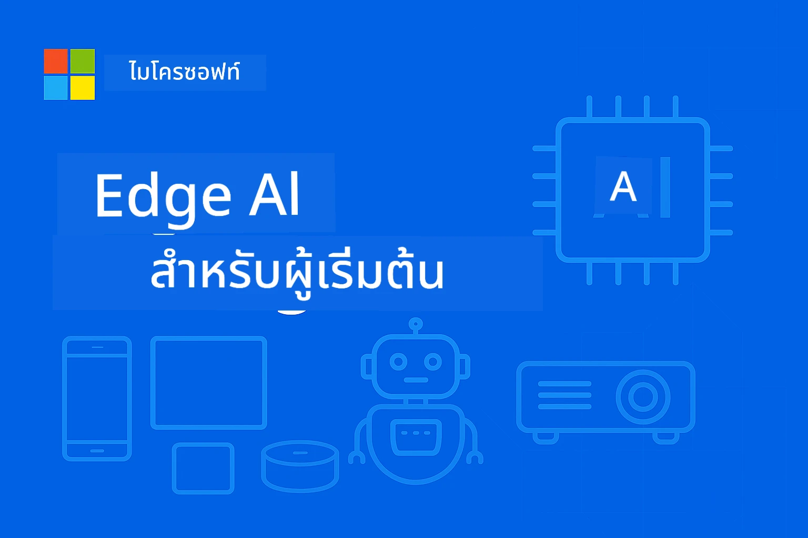

# EdgeAI สำหรับผู้เริ่มต้น




[](https://GitHub.com/microsoft/edgeai-for-beginners/graphs/contributors)
[](https://GitHub.com/microsoft/edgeai-for-beginners/issues)
[](https://GitHub.com/microsoft/edgeai-for-beginners/pulls)
[](http://makeapullrequest.com)

[](https://GitHub.com/microsoft/edgeai-for-beginners/watchers)
[](https://GitHub.com/microsoft/edgeai-for-beginners/fork)
[](https://GitHub.com/microsoft/edgeai-for-beginners/stargazers)


[](https://discord.gg/nTYy5BXMWG)

ทำตามขั้นตอนเหล่านี้เพื่อเริ่มใช้งานทรัพยากรเหล่านี้:

1. **โคลนที่เก็บ**: คลิกที่ [](https://GitHub.com/microsoft/edgeai-for-beginners/fork)
2. **โคลนที่เก็บลงมา**:   `git clone https://github.com/microsoft/edgeai-for-beginners.git`
3. [**เข้าร่วม Azure AI Foundry Discord และพบปะผู้เชี่ยวชาญและนักพัฒนาร่วมกัน**](https://discord.com/invite/ByRwuEEgH4)


### 🌐 การสนับสนุนหลายภาษา

#### สนับสนุนผ่าน GitHub Action (อัตโนมัติ & อัปเดตเสมอ)

<!-- CO-OP TRANSLATOR LANGUAGES TABLE START -->
[อาหรับ](../ar/README.md) | [เบงกาลี](../bn/README.md) | [บัลแกเรีย](../bg/README.md) | [พม่า (เมียนมาร์)](../my/README.md) | [จีน (ตัวย่อ)](../zh-CN/README.md) | [จีน (ตัวเต็ม, ฮ่องกง)](../zh-HK/README.md) | [จีน (ตัวเต็ม, มาเก๊า)](../zh-MO/README.md) | [จีน (ตัวเต็ม, ไต้หวัน)](../zh-TW/README.md) | [โครเอเชีย](../hr/README.md) | [เช็ก](../cs/README.md) | [เดนมาร์ก](../da/README.md) | [ดัตช์](../nl/README.md) | [เอสโตเนีย](../et/README.md) | [ฟินแลนด์](../fi/README.md) | [ฝรั่งเศส](../fr/README.md) | [เยอรมัน](../de/README.md) | [กรีก](../el/README.md) | [ฮิบรู](../he/README.md) | [ฮินดี](../hi/README.md) | [ฮังการี](../hu/README.md) | [อินโดนีเซีย](../id/README.md) | [อิตาลี](../it/README.md) | [ญี่ปุ่น](../ja/README.md) | [กันนาดา](../kn/README.md) | [เขมร](../km/README.md) | [เกาหลี](../ko/README.md) | [ลิทัวเนีย](../lt/README.md) | [มาเลย์](../ms/README.md) | [มาลายาลัม](../ml/README.md) | [มราฐี](../mr/README.md) | [เนปาล](../ne/README.md) | [ไนจีเรีย พิดจิน](../pcm/README.md) | [นอร์เวย์](../no/README.md) | [เปอร์เซีย (ฟาร์ซี)](../fa/README.md) | [โปแลนด์](../pl/README.md) | [โปรตุเกส (บราซิล)](../pt-BR/README.md) | [โปรตุเกส (โปรตุเกส)](../pt-PT/README.md) | [ปัญจาบ (กูรมุกี)](../pa/README.md) | [โรมาเนีย](../ro/README.md) | [รัสเซีย](../ru/README.md) | [เซอร์เบีย (คิริลลิก)](../sr/README.md) | [สโลวัก](../sk/README.md) | [สโลวีเนีย](../sl/README.md) | [สเปน](../es/README.md) | [สวาฮิลี](../sw/README.md) | [สวีเดน](../sv/README.md) | [ตากาล็อก (ฟิลิปปินส์)](../tl/README.md) | [ทมิฬ](../ta/README.md) | [เทลูกู](../te/README.md) | [ไทย](./README.md) | [ตุรกี](../tr/README.md) | [ยูเครน](../uk/README.md) | [อูรดู](../ur/README.md) | [เวียดนาม](../vi/README.md)

> **ต้องการโคลนแบบท้องถิ่น?**
>
> ที่เก็บนี้มีการแปลมากกว่า 50 ภาษา ซึ่งจะเพิ่มขนาดดาวน์โหลดมาก เพื่อโคลนโดยไม่รวมการแปล ใช้ sparse checkout:
>
> **Bash / macOS / Linux:**
> ```bash
> git clone --filter=blob:none --sparse https://github.com/microsoft/edgeai-for-beginners.git
> cd edgeai-for-beginners
> git sparse-checkout set --no-cone '/*' '!translations' '!translated_images'
> ```
>
> **CMD (Windows):**
> ```cmd
> git clone --filter=blob:none --sparse https://github.com/microsoft/edgeai-for-beginners.git
> cd edgeai-for-beginners
> git sparse-checkout set --no-cone "/*" "!translations" "!translated_images"
> ```
>
> วิธีนี้จะให้ทุกอย่างที่คุณต้องการเพื่อทำคอร์สให้เสร็จอย่างรวดเร็วขึ้นมาก
<!-- CO-OP TRANSLATOR LANGUAGES TABLE END -->

**ถ้าคุณต้องการภาษาแปลเพิ่มเติมที่สนับสนุน รายการอยู่ที่ [นี่](https://github.com/Azure/co-op-translator/blob/main/getting_started/supported-languages.md)**
## บทนำ

ยินดีต้อนรับสู่ **EdgeAI สำหรับผู้เริ่มต้น** – การเดินทางที่ครอบคลุมสู่โลกที่เปลี่ยนแปลงได้ของปัญญาประดิษฐ์แบบ Edge คอร์สนี้จะเชื่อมช่องว่างระหว่างความสามารถ AI ที่ทรงพลังกับการใช้งานจริงในโลกแห่งความจริงบนอุปกรณ์ขอบ ช่วยให้คุณใช้ศักยภาพของ AI โดยตรงที่จุดกำเนิดข้อมูลและที่ต้องการการตัดสินใจ

### สิ่งที่คุณจะเชี่ยวชาญ

คอร์สนี้จะพาคุณจากแนวคิดพื้นฐานไปจนถึงการใช้งานที่พร้อมผลิต ครอบคลุม:
- **โมเดลภาษาเล็ก (SLMs)** ที่ปรับแต่งสำหรับการใช้งานบน edge
- **การปรับแต่งตามฮาร์ดแวร์** บนแพลตฟอร์มที่หลากหลาย
- **การทำนายผลแบบเรียลไทม์** ที่รักษาความเป็นส่วนตัว
- **กลยุทธ์การใช้งานในผลิตภัณฑ์** สำหรับแอปพลิเคชันองค์กร

### เหตุผลที่ EdgeAI สำคัญ

Edge AI คือการเปลี่ยนแปลงที่ตอบโจทย์ความท้าทายสำคัญของยุคสมัย:
- **ความเป็นส่วนตัวและความปลอดภัย**: ประมวลผลข้อมูลที่ละเอียดอ่อนไปยังท้องถิ่นโดยไม่ต้องเปิดเผยข้อมูลบนคลาวด์
- **ประสิทธิภาพแบบเรียลไทม์**: ขจัดความหน่วงเครือข่ายสำหรับแอปพลิเคชันที่ต้องใช้เวลาตอบสนองอย่างรวดเร็ว
- **ประหยัดค่าใช้จ่าย**: ลดแบนด์วิดท์และค่าใช้จ่ายด้านคลาวด์
- **การทำงานที่ยืดหยุ่น**: คงการทำงานในช่วงที่เครือข่ายขัดข้อง
- **การปฏิบัติตามกฎระเบียบ**: รองรับข้อกำหนดด้านอธิปไตยข้อมูล

### Edge AI

Edge AI หมายถึงการรันอัลกอริทึม AI และโมเดลภาษาแบบท้องถิ่นบนฮาร์ดแวร์ ใกล้กับแหล่งที่ข้อมูลสร้างขึ้น โดยไม่ต้องพึ่งพาทรัพยากรคลาวด์สำหรับการทำนายผล ช่วยลดความหน่วง ปรับปรุงความเป็นส่วนตัว และเปิดโอกาสให้การตัดสินใจแบบทันที

### หลักการสำคัญ:
- **การทำนายบนอุปกรณ์**: โมเดล AI รันบนอุปกรณ์ขอบ (โทรศัพท์, เราเตอร์, ไมโครคอนโทรลเลอร์, คอมพิวเตอร์อุตสาหกรรม)
- **ทำงานแบบออฟไลน์**: สามารถใช้งานได้โดยไม่ต้องเชื่อมต่ออินเทอร์เน็ตตลอดเวลา
- **ความหน่วงต่ำ**: ตอบสนองทันทีเหมาะสำหรับระบบเรียลไทม์
- **อธิปไตยของข้อมูล**: เก็บข้อมูลละเอียดอ่อนไว้ในท้องถิ่น เพิ่มความปลอดภัยและการปฏิบัติตามกฎ

### โมเดลภาษาเล็ก (SLMs)

โมเดล SLM เช่น Phi-4, Mistral-7B และ Gemma คือเวอร์ชันที่ปรับแต่งของ LLMs ขนาดใหญ่ — ได้รับการฝึกหรือกลั่นมาเพื่อ:
- **ลดการใช้หน่วยความจำ**: ใช้งานอย่างมีประสิทธิภาพในหน่วยความจำของอุปกรณ์ edge ที่จำกัด
- **ความต้องการคำนวณต่ำกว่า**: ปรับแต่งให้เหมาะกับประสิทธิภาพ CPU และ GPU บนอุปกรณ์ edge
- **เริ่มต้นได้รวดเร็วขึ้น**: เริ่มทำงานอย่างรวดเร็วเพื่อตอบสนองแอปพลิเคชัน

โมเดลเหล่านี้เปิดศักยภาพ NLP ที่ทรงพลังภายใต้ข้อจำกัด:
- **ระบบฝังตัว**: อุปกรณ์ IoT และควบคุมอุตสาหกรรม
- **อุปกรณ์มือถือ**: สมาร์ทโฟนและแท็บเล็ตที่ทำงานออฟไลน์ได้
- **อุปกรณ์ IoT**: เซ็นเซอร์และอุปกรณ์อัจฉริยะที่มีทรัพยากรจำกัด
- **เซิร์ฟเวอร์ขอบ**: หน่วยประมวลผลท้องถิ่นที่มีทรัพยากร GPU จำกัด
- **คอมพิวเตอร์ส่วนบุคคล**: การใช้งานบนเดสก์ท็อปและแล็ปท็อป

## โมดูลคอร์สและการนำทาง

| โมดูล | หัวข้อ | พื้นที่โฟกัส | เนื้อหาหลัก | ระดับ | ระยะเวลา |
|--------|-------|------------|-------------|--------|----------|
| [📖 00 ](./introduction.md) | [แนะนำ EdgeAI](./introduction.md) | พื้นฐาน & บริบท | ภาพรวม EdgeAI • แอปพลิเคชันอุตสาหกรรม • แนะนำ SLM • วัตถุประสงค์การเรียนรู้ | ผู้เริ่มต้น | 1-2 ชม. |
| [📚 01](../../Module01) | [พื้นฐาน EdgeAI](./Module01/README.md) | การเปรียบเทียบคลาวด์กับ Edge AI | พื้นฐาน EdgeAI • กรณีศึกษาจริง • คู่มือการใช้งาน • การใช้งานบนขอบ | ผู้เริ่มต้น | 3-4 ชม. |
| [🧠 02](../../Module02) | [ฐานรากโมเดล SLM](./Module02/README.md) | ครอบครัวโมเดล & สถาปัตยกรรม | ครอบครัว Phi • ครอบครัว Qwen • ครอบครัว Gemma • BitNET • μModel • Phi-Silica | ผู้เริ่มต้น | 4-5 ชม. |
| [🚀 03](../../Module03) | [การใช้งาน SLM จริง](./Module03/README.md) | การใช้งานท้องถิ่น & คลาวด์ | การเรียนรู้ขั้นสูง • สภาพแวดล้อมท้องถิ่น • การใช้งานคลาวด์ | ระดับกลาง | 4-5 ชม. |
| [⚙️ 04](../../Module04) | [ชุดเครื่องมือเพิ่มประสิทธิภาพโมเดล](./Module04/README.md) | การปรับแต่งข้ามแพลตฟอร์ม | แนะนำ • Llama.cpp • Microsoft Olive • OpenVINO • Apple MLX • การสังเคราะห์การทำงาน | ระดับกลาง | 5-6 ชม. |
| [🔧 05](../../Module05) | [SLMOps การผลิต](./Module05/README.md) | การดำเนินงานผลิต | แนะนำ SLMOps • การกลั่นโมเดล • การปรับแต่งละเอียด • การใช้งานในผลิตภัณฑ์ | ขั้นสูง | 5-6 ชม. |
| [🤖 06](../../Module06) | [เอเจนต์ AI & การเรียกใช้ฟังก์ชัน](./Module06/README.md) | กรอบงานเอเจนต์ & MCP | แนะนำเอเจนต์ • การเรียกใช้ฟังก์ชัน • โปรโตคอลบริบทโมเดล | ขั้นสูง | 4-5 ชม. |
| [💻 07](../../Module07) | [การใช้งานบนแพลตฟอร์ม](./Module07/README.md) | ตัวอย่างข้ามแพลตฟอร์ม | เครื่องมือ AI • Foundry ท้องถิ่น • การพัฒนา Windows | ขั้นสูง | 3-4 ชม. |
| [🏭 08](../../Module08) | [ชุดเครื่องมือ Foundry Local](./Module08/README.md) | ตัวอย่างพร้อมใช้งาน | แอปพลิเคชันตัวอย่าง (ดูรายละเอียดด้านล่าง) | ผู้เชี่ยวชาญ | 8-10 ชม. |

### 🏭 **โมดูล 08: แอปพลิเคชันตัวอย่าง**

- [01: เริ่มต้นอย่างรวดเร็วด้วย REST Chat](./Module08/samples/01/README.md)
- [02: การรวม OpenAI SDK](./Module08/samples/02/README.md)
- [03: การค้นหาโมเดล & การวัดประสิทธิภาพ](./Module08/samples/03/README.md)
- [04: แอปพลิเคชัน Chainlit RAG](./Module08/samples/04/README.md)
- [05: การประสานงานตัวแทนหลายตัว](./Module08/samples/05/README.md)
- [06: Models-as-Tools Router](./Module08/samples/06/README.md)
- [07: ลูกค้า API โดยตรง](./Module08/samples/07/README.md)
- [08: แอปแชท Windows 11](./Module08/samples/08/README.md)
- [09: ระบบตัวแทนหลายขั้นสูง](./Module08/samples/09/README.md)
- [10: เฟรมเวิร์กเครื่องมือ Foundry](./Module08/samples/10/README.md)

### 🎓 **เวิร์กช็อป: เส้นทางการเรียนรู้ลงมือทำ**

วัสดุเวิร์กช็อปแบบลงมือทำครบถ้วนพร้อมการใช้งานจริง:

- **[คู่มือเวิร์กช็อป](./Workshop/Readme.md)** - วัตถุประสงค์การเรียนรู้ ผลลัพธ์ และการนำทางทรัพยากรทั้งหมด
- **ตัวอย่าง Python** (6 ชุด) - อัปเดตด้วยแนวปฏิบัติที่ดีที่สุด การจัดการข้อผิดพลาด และเอกสารครบถ้วน
- **โน้ตบุ๊ก Jupyter** (8 เล่มโต้ตอบได้) - บทเรียนทีละขั้นตอนพร้อมเกณฑ์วัดและติดตามประสิทธิภาพ
- **คู่มือแต่ละเซสชัน** - ไฟล์ Markdown ละเอียดสำหรับแต่ละเซสชันเวิร์กช็อป
- **เครื่องมือยืนยัน** - สคริปต์ตรวจสอบคุณภาพโค้ดและรันทดสอบแบบ smoke test

**สิ่งที่คุณจะสร้าง:**
- แอปแชท AI ท้องถิ่นที่รองรับการสตรีม
- ท่อ RAG พร้อมการประเมินคุณภาพ (RAGAS)
- เครื่องมือเปรียบเทียบและวัดประสิทธิภาพโมเดลหลายตัว
- ระบบประสานงานตัวแทนหลายตัว
- การจัดเส้นทางโมเดลอัจฉริยะโดยเลือกตามงาน

### 🎙️ **เวิร์กช็อปสำหรับ Agentic: Hands-On - สตูดิโอพอดแคสต์ AI**
สร้างสายการผลิตพอดแคสต์ที่ขับเคลื่อนด้วย AI ตั้งแต่เริ่มต้น! เวิร์กช็อปเชิงลึกนี้สอนคุณให้สร้างระบบมัลติเอเย่นต์ครบวงจรที่เปลี่ยนไอเดียให้กลายเป็นตอนพอดแคสต์มืออาชีพ

**[🎬 เริ่มเวิร์กช็อป The AI Podcast Studio](./WorkshopForAgentic/README.md)**

**ภารกิจของคุณ**: เปิดตัว "Future Bytes" — พอดแคสต์เทคโนโลยีที่ขับเคลื่อนโดยเอเย่นต์ AI ที่คุณสร้างเอง ไม่มีการพึ่งพาคลาวด์ ไม่มีค่าใช้จ่าย API — ทุกอย่างทำงานได้ในเครื่องของคุณเอง

**จุดเด่นของเวิร์กช็อปนี้:**
- **🤖 การประสานงานมัลติเอเย่นต์จริงๆ** - สร้างเอเย่นต์ AI เฉพาะทางที่วิจัย เขียน และผลิตเสียง
- **🎯 สายการผลิตครบวงจร** - ตั้งแต่การเลือกหัวข้อจนถึงผลลัพธ์เสียงพอดแคสต์สุดท้าย
- **💻 ติดตั้งใช้งานได้ 100% ในเครื่อง** - ใช้งาน Ollama และโมเดลในเครื่อง (Qwen-3-8B) เพื่อความเป็นส่วนตัวและการควบคุมเต็มที่
- **🎤 การแปลงข้อความเป็นเสียงพูด** - เปลี่ยนสคริปต์เป็นบทสนทนาหลายเสียงที่ฟังเป็นธรรมชาติ
- **✋ กระบวนการที่มีมนุษย์ร่วมตรวจสอบ** - ประตูอนุมัติช่วยรับประกันคุณภาพพร้อมรักษาระบบอัตโนมัติ

**การเรียนรู้แบ่งเป็น 3 ตอน:**

| ตอน | เน้น | ทักษะสำคัญ | ระยะเวลา |
|-----|-------|------------|----------|
| **[ตอน 1: รู้จักผู้ช่วย AI ของคุณ](./WorkshopForAgentic/md/01.BuildAIAgentWithSLM.md)** | สร้างเอเย่นต์ AI ตัวแรกของคุณ | การผสานเครื่องมือ • การค้นหาบนเว็บ • การแก้ปัญหา • การใช้เหตุผลแบบเอเย่นต์ | 2-3 ชม. |
| **[ตอน 2: รวบรวมทีมผลิตของคุณ](./WorkshopForAgentic/md/02.AIAgentOrchestrationAndWorkflows.md)** | ประสานงานเอเย่นต์หลายตัว | การประสานงานทีม • กระบวนการอนุมัติ • อินเทอร์เฟซ DevUI • การกำกับดูแลโดยมนุษย์ | 3-4 ชม. |
| **[ตอน 3: สร้างพอดแคสต์ให้มีชีวิต](./WorkshopForAgentic/md/03.Multi-SpeakerPodcastGenerationWithVibeVoice.md)** | สร้างเสียงพอดแคสต์ | แปลงข้อความเป็นเสียง • การสังเคราะห์หลายเสียง • เสียงยาวรูปแบบฟอร์ม • ระบบอัตโนมัติเต็มรูปแบบ | 2-3 ชม. |

**เทคโนโลยีที่ใช้:**
- **Microsoft Agent Framework** - การประสานและประสานงานเอเย่นต์หลายตัว
- **Ollama** - รันไทม์โมเดล AI ในเครื่อง (ไม่ต้องคลาวด์)
- **Qwen-3-8B** - โมเดลภาษารหัสเปิดที่ปรับแต่งสำหรับงานเอเย่นต์
- **API แปลงข้อความเป็นเสียงพูด** - การสังเคราะห์เสียงธรรมชาติสำหรับการสร้างพอดแคสต์

**รองรับฮาร์ดแวร์:**
- ✅ **โหมด CPU** - ใช้งานได้กับคอมพิวเตอร์ทันสมัยทุกเครื่อง (แนะนำแรม 8GB ขึ้นไป)
- 🚀 **เร่งความเร็ว GPU** - การคาดการณ์ที่เร็วขึ้นอย่างมากด้วย GPU ของ NVIDIA/AMD
- ⚡ **รองรับ NPU** - เร่งหน่วยประมวลผลประสาทเทอร์เจนเนอเรชันถัดไป

**เหมาะสำหรับ:**
- นักพัฒนาที่เรียนรู้ระบบ AI มัลติเอเย่นต์
- บุคคลที่สนใจในระบบอัตโนมัติและเวิร์กโฟลว์ AI
- ผู้สร้างเนื้อหาที่ต้องการสำรวจการผลิตด้วย AI ช่วย
- นักศึกษาที่ศึกษาแนวทางการประสานงาน AI เชิงปฏิบัติ

**เริ่มสร้างกันเลย**: [🎙️ The AI Podcast Studio Workshop →](./WorkshopForAgentic/README.md)

### 📊 **สรุปเส้นทางการเรียนรู้**
- **ระยะเวลารวม**: 36-45 ชั่วโมง
- **เส้นทางผู้เริ่มต้น**: โมดูล 01-02 (7-9 ชั่วโมง)  
- **เส้นทางระดับกลาง**: โมดูล 03-04 (9-11 ชั่วโมง)
- **เส้นทางระดับสูง**: โมดูล 05-07 (12-15 ชั่วโมง)
- **เส้นทางผู้เชี่ยวชาญ**: โมดูล 08 (8-10 ชั่วโมง)

## สิ่งที่คุณจะสร้าง

### 🎯 ทักษะแกนหลัก
- **สถาปัตยกรรม Edge AI**: ออกแบบระบบ AI ที่เน้นใช้งานในเครื่องก่อนและผสานคลาวด์
- **การปรับแต่งโมเดล**: การประมาณค่าคุณภาพและบีบอัดโมเดลสำหรับการติดตั้งที่ปลายทาง (เพิ่มความเร็ว 85% ลดขนาด 75%)
- **การติดตั้งหลายแพลตฟอร์ม**: Windows, มือถือ, ระบบฝังตัว และระบบไฮบริดคลาวด์-เอดจ์
- **ปฏิบัติการผลิต**: การตรวจสอบ, ขยายระบบ, และรักษา Edge AI ในสภาพแวดล้อมจริง

### 🏗️ โครงการปฏิบัติ
- **แอปแชทท้องถิ่น Foundry**: แอปพลิเคชัน Windows 11 เนทีฟ พร้อมสลับโมเดล
- **ระบบมัลติเอเย่นต์**: ผู้ประสานงานกับเอเย่นต์ผู้เชี่ยวชาญสำหรับเวิร์กโฟลว์ซับซ้อน  
- **แอป RAG**: การประมวลผลเอกสารในเครื่องพร้อมการค้นหาเวกเตอร์
- **ตัวเลือกโมเดลอัจฉริยะ**: การเลือกโมเดลตามการวิเคราะห์งานอย่างชาญฉลาด
- **เฟรมเวิร์ก API**: ไคลเอนต์พร้อมสำหรับการใช้งานจริงที่รองรับการสตรีมและตรวจสอบสุขภาพระบบ
- **เครื่องมือข้ามแพลตฟอร์ม**: รูปแบบบูรณาการ LangChain/Semantic Kernel

### 🏢 การประยุกต์ใช้ในอุตสาหกรรม
**การผลิต** • **สุขภาพ** • **ยานยนต์อัตโนมัติ** • **เมืองอัจฉริยะ** • **แอปมือถือ**

## เริ่มต้นอย่างรวดเร็ว

**เส้นทางการเรียนรู้แนะนำ** (20-30 ชั่วโมงรวม):

0. **📖 บทนำ** ([Introduction.md](./introduction.md)): พื้นฐาน EdgeAI + บริบทอุตสาหกรรม + กรอบการเรียนรู้
1. **📚 พื้นฐาน** (โมดูล 01-02): แนวคิด EdgeAI + ครอบครัวโมเดล SLM
2. **⚙️ การปรับแต่ง** (โมดูล 03-04): การติดตั้ง + เฟรมเวิร์กการประมาณค่า  
3. **🚀 การผลิต** (โมดูล 05-06): SLMOps + เอเย่นต์ AI + การเรียกฟังก์ชัน
4. **💻 การใช้งานจริง** (โมดูล 07-08): ตัวอย่างแพลตฟอร์ม + ชุดเครื่องมือ Foundry Local

แต่ละโมดูลประกอบด้วยทฤษฎี, แบบฝึกหัดลงมือทำ, และตัวอย่างโค้ดพร้อมใช้งานจริง

## ผลกระทบต่ออาชีพ

**บทบาททางเทคนิค**: สถาปนิกโซลูชัน EdgeAI • วิศวกร ML (Edge) • นักพัฒนา IoT AI • นักพัฒนา AI บนมือถือ

**ภาคอุตสาหกรรม**: การผลิต 4.0 • เทคโนโลยีสุขภาพ • ระบบอัตโนมัติ • FinTech • อิเล็กทรอนิกส์สำหรับผู้บริโภค

**โครงการพอร์ตโฟลิโอ**: ระบบมัลติเอเย่นต์ • แอป RAG สำหรับผลิต • การติดตั้งข้ามแพลตฟอร์ม • การปรับแต่งประสิทธิภาพ

## โครงสร้างที่เก็บข้อมูล

```
edgeai-for-beginners/
├── 📖 introduction.md  # Foundation: EdgeAI Overview & Learning Framework
├── 📚 Module01-04/     # Fundamentals → SLMs → Deployment → Optimization  
├── 🔧 Module05-06/     # SLMOps → AI Agents → Function Calling
├── 💻 Module07/        # Platform Samples (VS Code, Windows, Jetson, Mobile)
├── 🏭 Module08/        # Foundry Local Toolkit + 10 Comprehensive Samples
│   ├── samples/01-06/  # Foundation: REST, SDK, RAG, Agents, Routing
│   └── samples/07-10/  # Advanced: API Client, Windows App, Enterprise Agents, Tools
├── 🌐 translations/    # Multi-language support (8+ languages)
└── 📋 STUDY_GUIDE.md   # Structured learning paths & time allocation
```

## ไฮไลท์ของหลักสูตร

✅ **การเรียนรู้อย่างก้าวหน้า**: ทฤษฎี → ปฏิบัติ → การติดตั้งใช้งานจริง  
✅ **กรณีศึกษาจริง**: Microsoft, Japan Airlines, การใช้งานในองค์กร  
✅ **ตัวอย่างลงมือทำ**: กว่า 50 ตัวอย่าง, 10 เดโม Foundry Local ครบชุด  
✅ **เน้นประสิทธิภาพ**: เพิ่มความเร็ว 85% ลดขนาด 75%  
✅ **หลายแพลตฟอร์ม**: Windows, มือถือ, ฝังตัว, ไฮบริดคลาวด์-เอดจ์  
✅ **พร้อมใช้งานจริง**: ระบบตรวจสอบ, ขยายระบบ, ความปลอดภัย, กรอบการปฏิบัติตาม

📖 **[คู่มือการศึกษา](STUDY_GUIDE.md)**: เส้นทางการเรียนรู้ 20 ชั่วโมงโครงสร้างพร้อมคำแนะนำการจัดสรรเวลาและเครื่องมือประเมินตนเอง

---

**EdgeAI คืออนาคตของการติดตั้ง AI**: เน้นการใช้งานในเครื่อง, รักษาความเป็นส่วนตัว, และมีประสิทธิภาพ เชี่ยวชาญทักษะเหล่านี้เพื่อสร้างแอปอัจฉริยะยุคใหม่

## หลักสูตรอื่นๆ

ทีมงานของเรามีหลักสูตรอื่นๆ ให้เลือกเรียน! ตรวจสอบได้ที่:

<!-- CO-OP TRANSLATOR OTHER COURSES START -->
### LangChain
[](https://aka.ms/langchain4j-for-beginners)
[](https://aka.ms/langchainjs-for-beginners?WT.mc_id=m365-94501-dwahlin)
[](https://github.com/microsoft/langchain-for-beginners?WT.mc_id=m365-94501-dwahlin)
---

### Azure / Edge / MCP / Agents
[](https://github.com/microsoft/AZD-for-beginners?WT.mc_id=academic-105485-koreyst)
[](https://github.com/microsoft/edgeai-for-beginners?WT.mc_id=academic-105485-koreyst)
[](https://github.com/microsoft/mcp-for-beginners?WT.mc_id=academic-105485-koreyst)
[](https://github.com/microsoft/ai-agents-for-beginners?WT.mc_id=academic-105485-koreyst)

---
 
### Generative AI Series
[](https://github.com/microsoft/generative-ai-for-beginners?WT.mc_id=academic-105485-koreyst)
[-9333EA?style=for-the-badge&labelColor=E5E7EB&color=9333EA)](https://github.com/microsoft/Generative-AI-for-beginners-dotnet?WT.mc_id=academic-105485-koreyst)
[-C084FC?style=for-the-badge&labelColor=E5E7EB&color=C084FC)](https://github.com/microsoft/generative-ai-for-beginners-java?WT.mc_id=academic-105485-koreyst)
[-E879F9?style=for-the-badge&labelColor=E5E7EB&color=E879F9)](https://github.com/microsoft/generative-ai-with-javascript?WT.mc_id=academic-105485-koreyst)

---
 
### Core Learning
[](https://aka.ms/ml-beginners?WT.mc_id=academic-105485-koreyst)
[](https://aka.ms/datascience-beginners?WT.mc_id=academic-105485-koreyst)
[](https://aka.ms/ai-beginners?WT.mc_id=academic-105485-koreyst)
[](https://github.com/microsoft/Security-101?WT.mc_id=academic-96948-sayoung)
[](https://aka.ms/webdev-beginners?WT.mc_id=academic-105485-koreyst)
[](https://aka.ms/iot-beginners?WT.mc_id=academic-105485-koreyst)
[](https://github.com/microsoft/xr-development-for-beginners?WT.mc_id=academic-105485-koreyst)

---
 
### Copilot Series
[](https://aka.ms/GitHubCopilotAI?WT.mc_id=academic-105485-koreyst)
[](https://github.com/microsoft/mastering-github-copilot-for-dotnet-csharp-developers?WT.mc_id=academic-105485-koreyst)
[](https://github.com/microsoft/CopilotAdventures?WT.mc_id=academic-105485-koreyst)
<!-- CO-OP TRANSLATOR OTHER COURSES END -->

## ขอความช่วยเหลือ

ถ้าคุณติดขัดหรือมีคำถามใด ๆ เกี่ยวกับการสร้างแอป AI เข้าร่วมได้ที่:

[](https://discord.gg/nTYy5BXMWG)

ถ้าคุณมีข้อเสนอแนะเกี่ยวกับผลิตภัณฑ์หรือพบข้อผิดพลาดในระหว่างการพัฒนา เยี่ยมชมได้ที่:

[](https://aka.ms/foundry/forum)

---

<!-- CO-OP TRANSLATOR DISCLAIMER START -->
**ข้อจำกัดความรับผิดชอบ**:  
เอกสารนี้ได้รับการแปลโดยใช้บริการแปลด้วย AI [Co-op Translator](https://github.com/Azure/co-op-translator) แม้ว่าเราจะพยายามให้เกิดความถูกต้องสูงสุด แต่กรุณาทราบว่าการแปลอัตโนมัติอาจมีข้อผิดพลาดหรือความไม่ถูกต้อง เอกสารต้นฉบับในภาษาดั้งเดิมควรถูกพิจารณาว่าเป็นแหล่งข้อมูลที่เป็นทางการ สำหรับข้อมูลสำคัญแนะนำให้ใช้บริการแปลโดยมนุษย์มืออาชีพ เราจะไม่รับผิดชอบต่อความเข้าใจผิดหรือการตีความผิดที่เกิดจากการใช้การแปลนี้
<!-- CO-OP TRANSLATOR DISCLAIMER END -->