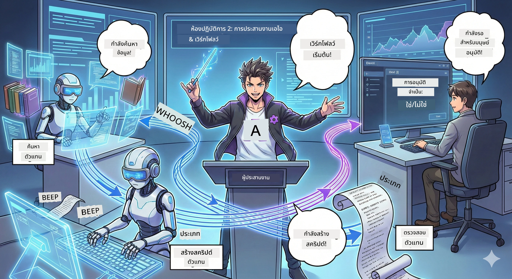

# Act 2: รวมทีมผลิตพอดแคสต์ของคุณ 🎬



## เรื่องราวทวีความเข้มข้น

Alex (ผู้ช่วย AI ของคุณจาก Act 1) น่าทึ่งมาก แต่ตัวแทนคนเดียวไม่สามารถดูแลสตูดิโอพอดแคสต์ได้ทั้งหมด คุณต้องการ *ทีม*:
- 🔍 **Research Agent**: ค้นหาข้อมูลใหม่ ๆ จากอินเทอร์เน็ต
- ✍️ **Script Agent**: แปลงงานวิจัยเป็นบทสนทนาที่น่าสนใจ
- 👤 **คุณ (บรรณาธิการ)**: อนุมัติบทหรือส่งกลับไปแก้ไข

ยินดีต้อนรับสู่ **AI Agent Orchestration** — ที่ซึ่งคุณเป็นผู้กำกับทีม AI ของคุณเอง คิดว่าคล้าย Avengers แต่สำหรับการผลิตพอดแคสต์

## Agent Orchestration คืออะไร? (เวอร์ชันง่าย)

ลองนึกว่าคุณกำลังบริหารร้านอาหาร คุณไม่ได้ทำทุกอย่างเองใช่ไหม? คุณมี:
- 🍳 เชฟที่ทำอาหาร
- 👨‍🍳 ซูเชฟที่เตรียมวัตถุดิบ
- 👩‍🍳 พนักงานเสิร์ฟที่ส่งอาหาร

Agent orchestration ก็คือแนวคิดเดียวกัน แต่กับ AI ตัวแทนแต่ละตัวมีความเชี่ยวชาญ และคุณประสานงานพวกเขาเพื่อบรรลุเป้าหมายใหญ่ ไม่มีตัวแทนใดรับภาระหนักเกินไป และงานเสร็จเร็วขึ้น

### อุปมาแบบวงดนตรี 🎸

ตัวแทน AI ของคุณเหมือนวงดนตรี:
- **นักร้องนำ**: ตัวแทนหลักที่จัดการงานติดต่อกับลูกค้า
- **มือกลอง**: รักษาจังหวะ ดูแลการประมวลผลแบ็กกราวด์  
- **มือเบส**: สนับสนุนทุกคน ดึงข้อมูล
- **คุณ (ผู้จัดการวง)**: ประสานทุกอย่าง!

ถ้าไม่มีการประสานงาน? ก็แค่เสียงรบกวน แต่ถ้ามี orchestration? เพลงไพเราะ

### ทำไมเรื่องนี้ถึงสำคัญ

ถ้า AI ตัวเดียวพยายามทำทุกอย่าง = อาการหมดไฟ ตัวแทนที่มีความเชี่ยวชาญร่วมกัน = ปลดล็อกประสิทธิภาพ! 🚀

**พูดตรง ๆ**: จำได้ไหมตอนที่ต้องค้นคว้า เขียน และแก้ไขพอดแคสต์คนเดียว? มันเหนื่อยมาก กับ orchestration ตัวแทนแต่ละตัวทำสิ่งที่ถนัด คุณเพียงตัดสินใจขั้นสุดท้าย

**ตัวอย่างจริง**: บอทฝ่ายบริการลูกค้าที่รู้ว่าเมื่อไหร่ควรจัดการใบแจ้งหนี้ หรือปัญหาทางเทคนิค หรือเมื่อไหร่ต้องส่งต่อให้คนดูแล นั่นแหละคือ orchestration!

## ตัวแทน AI กับเวิร์กโฟลว์: ต่างกันยังไง?

ลองคิดแบบนี้:

### 🤖 AI Agent = นักดนตรีแจ๊ส
- **ตัดสินใจได้ทันที** ตามสิ่งที่ได้ยิน
- **ด้นสด** แก้ปัญหาด้วยเครื่องมือของตัวเอง
- **คิด** ด้วยสมอง LLM
- **ปรับตัว** กับสิ่งที่คุณโยนเข้ามา

### 🎵 Workflow = วงออเคสตร้าเล่นเพลงคลาสสิก  
- **ทำตามโน้ตเพลง** (ขั้นตอนที่กำหนดไว้ล่วงหน้า)
- **เส้นทางการทำงานที่คาดเดาได้**
- **ประสานงาน** ตัวแทนหลายคน คน และระบบต่าง ๆ
- **มีโครงสร้าง** เหมือนสูตรอาหาร

**ความมหัศจรรย์**: Workflow *ประสาน* ตัวแทน! คุณสร้างเวิร์กโฟลว์ที่บอกตัวแทนว่าต้องเล่นบทของตนเมื่อไร ดีที่สุดของทั้งสองโลก 🎭

## สามวิธีจัดการทีม AI ของคุณ

### 1. 🎯 แบบรวมศูนย์ (คุณคือหัวหน้า)

ตัวแทนหลักตัวเดียวสั่งการทุกอย่าง คิดเหมือนคุณเป็นผู้จัดการทีม — คุณตัดสินใจว่าใครทำอะไร และเมื่อไร

**ข้อดี**:
- ✅ การนำที่ชัดเจน (ไม่มีความสับสน)
- ✅ การตัดสินใจที่สม่ำเสมอ
- ✅ ง่ายต่อการดีบัก

**ใช้กับ**:
- การกำหนดเส้นทางบริการลูกค้า ("นี่คือใบแจ้งหนี้หรือฝ่ายเทคนิค?")
- เวิร์กโฟลว์อนุมัติเนื้อหา ("บทนี้ผ่านไหม?")
- การผลิตพอดแคสต์ (อย่างที่เรากำลังสร้าง!)

### 2. 🤝 แบบกระจายศูนย์ (ตัวแทนจัดการตัวเอง)

ตัวแทนคุยกันโดยตรงและแก้ไขปัญหาร่วมกัน เหมือนการแชทกลุ่มที่ทุกคนประสานงานกัน

**ข้อดี**:
- ✅ สามารถขยายตัวได้ง่าย (เพิ่มตัวแทนได้ตลอดเวลา)
- ✅ ไม่มีจุดล้มเหลวเดียว
- ✅ ตัวแทนร่วมมือกันตามธรรมชาติ

**ใช้กับ**:
- ทีมวิจัย (แต่ละตัวแทนสำรวจแหล่งข้อมูลต่างกัน)
- การระดมความคิด
- การแก้ปัญหาแบบกระจาย

### 3. 🔀 แบบผสมผสาน (ดีที่สุดของทั้งสองโลก)

คุณตั้งทิศทางใหญ่ แต่ตัวแทนมีอิสระในการจัดการงานตัวเอง เหมือน CEO ที่ไว้วางใจทีม

**เหมาะกับ**: โครงการซับซ้อนที่ต้องการทั้งการควบคุมและความยืดหยุ่น

## Microsoft Agent Framework: ชุดเครื่องมือ Orchestration ของคุณ 🧰

ถึงเวลาสร้าง! นี่คือสิ่งที่คุณจะใช้:

### บล็อกส่วนประกอบ

#### 1. 🧱 Executors (คนงานของคุณ)
- **คืออะไร**: หน่วยประมวลผลแต่ละตัว — อาจเป็นตัวแทนหรือโลจิกที่ปรับแต่งเอง
- **ทำอะไร**: รับข้อมูลเข้า ทำงาน ผลลัพธ์ออก
- **คิดในแง่นี้ได้ว่า**: สถานีในสายการผลิต

#### 2. ➡️ Edges (การเชื่อมต่อ)
- **คืออะไร**: เส้นทางระหว่าง executor
- **ทำอะไร**: ควบคุมการไหลของข้อความ ("หลัง A ไป B")
- **คิดในแง่นี้ได้ว่า**: ลูกศรในแผนภูมิไหล

#### 3. 🗺️ Workflows (แผนหลัก)
- **คืออะไร**: กราฟสมบูรณ์ของ executor + edge
- **ทำอะไร**: กำหนดกระบวนการทั้งหมดตั้งแต่ต้นจนจบ
- **คิดในแง่นี้ได้ว่า**: แผนผังสายการผลิตของคุณ

### ฟีเจอร์เจ๋ง ๆ ที่คุณจะชอบ

**🛡️ ความปลอดภัยของประเภทข้อมูล**: ข้อความระหว่างตัวแทนถูกตรวจสอบประเภทข้อมูล ไม่มี "โอ๊ะ พิมพ์ผิด" แบบไม่คาดคิด

**🔀 การกำหนดเส้นทางที่ยืดหยุ่น**: 
- เงื่อนไข if-then ("ถ้าอนุมัติ ให้เผยแพร่; ถ้าไม่ ให้เขียนใหม่")
- การประมวลผลพร้อมกัน (ตัวแทนหลายตัวทำงานพร้อมกัน)
- เส้นทางไดนามิก (เวิร์กโฟลว์ปรับตามผลลัพธ์)

**🔌 การผสานรวมภายนอก**:
- เชื่อมต่อกับ API
- เพิ่มจุดตรวจสอบคน (คุณอนุมัติก่อนเผยแพร่)
- สร้างโฟลว์คำขอ/ตอบกลับ

**💾 การบันทึกสถานะ**: บันทึกความคืบหน้า! ถ้าเกิดล้มเหลว ให้กลับมาทำต่อจากที่ค้างไว้

**🤝 การประสานงานตัวแทนหลายตัว**:
- รันตัวแทนทีละตัว (A → B → C)
- รันพร้อมกัน (A + B + C พร้อมกัน)
- ส่งต่อระหว่างตัวแทน
- ประมวลผลร่วมกัน

## แนวปฏิบัติที่ดีที่สุด (เคล็ดลับมือโปร) 🎯

### 1. เก็บให้เป็นโมดูล
ตัวแทนแต่ละตัวควรทำงานเดียวได้ดีมาก อย่าทำ "ซูเปอร์เอเจนต์" ที่พยายามทำทุกอย่าง — คุณจะเสียใจตอนดีบัก

### 2. วางแผนรับมือความล้มเหลว
ตัวแทนทำผิดพลาดได้ เครือข่ายล่มได้ สร้างการจัดการข้อผิดพลาดและแผนสำรองไว้ ตัวของคุณในอนาคตจะขอบคุณ

### 3. ตรวจสอบทุกอย่าง
ติดตามสิ่งที่ตัวแทนทำ ใช้ DevUI (เราจะพูดถึง!) เพื่อดูเวิร์กโฟลว์ทำงาน

### 4. ปรับขนาดข้อความให้เหมาะสม
อย่าส่งไฟล์ใหญ่ระหว่างตัวแทน ให้ข้อความเล็กและได้ประสิทธิภาพเพื่อความรวดเร็ว

### 5. เลือกแบบแผนที่ถูกต้อง
ต้องการควบคุม? ใช้แบบรวมศูนย์ ต้องการขยาย? ใช้แบบกระจายศูนย์ ตัดสินใจไม่ได้? ใช้แบบผสมผสาน!

## DevUI: เครื่องมือดีบักเวิร์กโฟลว์ของคุณ 🔍

### DevUI คืออะไร?

DevUI เหมือนสนามเด็กเล่นสำหรับทดสอบตัวแทนและเวิร์กโฟลว์ เป็นเว็บอินเทอร์เฟสที่คุณสามารถ:
- 👀 ดูเวิร์กโฟลว์ทำงาน
- 💬 แชทกับตัวแทนโดยตรง
- 🔍 ดีบักเมื่อเกิดปัญหา
- 📊 ดูแถบติดตามและตัวชี้วัดประสิทธิภาพ

> **สำคัญ**: DevUI ใช้แค่ตอนพัฒนาเท่านั้น! อย่าใช้ในโปรดักชัน คิดว่าเป็นสภาพแวดล้อมทดสอบในเครื่องคุณ

### จุดเด่นที่ทำให้น่ารัก

- **🖥️ เว็บ UI แบบโต้ตอบ**: คลิก พิมพ์ ทดสอบ — ไม่ต้องใช้คอมมานด์ไลน์
- **📁 พร้อมลาก-วาง**: อัปโหลดไฟล์ ทดสอบด้วยข้อมูลต่าง ๆ
- **📂 ค้นหาอัตโนมัติ**: ชี้ไปยังโฟลเดอร์ ตัว UI จะเจอตัวแทนทั้งหมดเอง
- **📋 โหมดไม่ต้องตั้งค่า**: ลงทะเบียนตัวแทนในโค้ด ไม่ต้องสร้างโฟลเดอร์
- **🔌 เข้ากันได้กับ OpenAI**: ใช้ร่วมกับ OpenAI SDK (เข้ากันดีสุด ๆ!)
- **👁️ แถบติดตามในตัว**: ดูว่าตัวแทนทำอะไรบ้าง

### วิธีการป้อนข้อมูล

DevUI ฉลาดมากกับอินพุต:

- **ทดสอบตัวแทน?** คุณจะได้กล่องข้อความกับปุ่มอัปโหลดไฟล์
- **ทดสอบเวิร์กโฟลว์?** UI สร้างฟิลด์อินพุตอัตโนมัติตามที่เวิร์กโฟลว์คาดหวัง

เหมือนเวทมนตร์ แต่เป็นโค้ดที่ดีมาก ✨

## ภารกิจของคุณ: สร้างสตูดิโอพอดแคสต์ 🎬

### ภารกิจ 1: สร้างตัวแทนเดียวด้วย DevUI

📂 [01.AgentDevUI](../../../../WorkshopForAgentic/code/02.Workflow/01.AgentDevUI)

**ความท้าทาย**: ก่อนจะสร้างทีมเต็ม สร้างและทดสอบ DevUI กับตัวแทนเดียว: ผู้เชี่ยวชาญค้นหาเว็บ

**สิ่งที่คุณจะสร้าง**:
ตัวแทนวิจัยที่สามารถค้นหาหัวข้อพอดแคสต์จากอินเทอร์เน็ต คุณจะทดสอบผ่านเว็บอินเทอร์เฟสของ DevUI ที่ `http://localhost:8090`

**ทักษะที่จะได้เรียนรู้**:
- 🚀 การเปิดตัวตัวแทนใน DevUI
- 🔍 การทดสอบการตอบสนองตัวแทนแบบเรียลไทม์
- 🛠️ สร้างเครื่องมือกำหนดเอง (ค้นหาเว็บ)
- 📊 เปิดใช้งานแถบติดตามเพื่อตรวจสอบปัญหา
- 🖥️ ใช้เว็บ UI แบบโต้ตอบ

**โค้ด**:
- `agent.py`: ตัว SearchAgent ของคุณที่มีพลังค้นหาเว็บ
- ใช้ OllamaChatClient เชื่อมกับ Qwen
- ใช้ฟังก์ชันเครื่องมือ `web_search()`
- เริ่มด้วยการเรียก `serve()` — เปิด DevUI อัตโนมัติ

**เป้าหมายสำเร็จ**: ถามตัวแทนว่ามีอะไรมาแรงใน AI แล้วดูมันค้นหาเว็บ! 🎉

### ภารกิจ 2: สร้างเวิร์กโฟลว์หลายตัวแทน

📂 [02.WorkflowDevUI](../../../../WorkshopForAgentic/code/02.Workflow/02.WorkflowDevUI)

**ความท้าทาย**: สนุกจริงจัง! สร้างเวิร์กโฟลว์ผลิตพอดแคสต์เต็มรูปแบบโดยมี:
1. 🔍 **Search Agent** → วิจัยหัวข้อ
2. ✍️ **Script Agent** → เขียนบทสนทนาระหว่างผู้ดำเนินรายการสองคน (เป็นภาษาจีน!)
3. 👤 **Review Executor** → ให้คุณอนุมัติหรือปฏิเสธ
4. 🔄 **วนลูปกลับ** → ถ้าปฏิเสธ ให้เขียนใหม่ตามความคิดเห็นของคุณ

**ทักษะที่จะได้เรียนรู้**:
- 🧱 สร้างตัวแทนเฉพาะทางสำหรับงานต่าง ๆ
- 🔗 เชื่อมตัวแทนด้วย WorkflowBuilder
- 🔀 สร้างลูปอนุมัติ (คนในวงจร!)
- 🚦 การกำหนดเส้นทางตามเงื่อนไข (อนุมัติกับปฏิเสธ)
- 🔧 สร้าง executor เองสำหรับโลจิกธุรกิจ

**เวิร์กโฟลว์**:
```
SearchAgent → ScriptAgent → ReviewExecutor
                             ↑          ↓ (if rejected)
                             ←─────────
```

**โค้ด**:
- `search_agent/agent.py`: ผู้เชี่ยวชาญค้นคว้าของคุณ
- `generate_script_agent/agent.py`: นักเขียนบทของคุณ (เขียนเป็นภาษาจีน!)
- `workflow/workflow.py`: เวทมนตร์ orchestration อยู่ที่นี่
- `main.py`: เริ่มทุกอย่างใน DevUI

**เป้าหมายสำเร็จ**: ใส่หัวข้อ ทบทบบท ปฏิเสธหนึ่งครั้งเพื่อทดสอบลูป แล้วอนุมัติ! 🎉

### ภารกิจ 3: สร้างแอปพลิเคชันคอนโซล

📂 [03.Application](../../../../WorkshopForAgentic/code/02.Workflow/03.Application)

**ความท้าทาย**: นำเวิร์กโฟลว์จาก DevUI มาทำเป็นแอปรันเทอร์มินัลสวย ๆ มีผลลัพธ์สีสัน ลูกเล่นวงล้อโหลด และบันทึกไฟล์ พร้อมสำหรับผลิตจริง!

**ทักษะที่จะได้เรียนรู้**:
- ⚡ รันเวิร์กโฟลว์แบบเขียนโปรแกรม (ไม่ใช้ DevUI)
- 📡 สถาปัตยกรรมขับเคลื่อนเหตุการณ์พร้อมสตรีมมิ่ง
- 🎨 สร้าง UI สวยสำหรับเทอร์มินัล (สี วงล้อ โหลดบาร์)
- 💾 บันทึกบทสุดท้ายลงไฟล์
- 🔄 จัดการเวิร์กโฟลว์แบบแอสิงโครนัสด้วย asyncio ของ Python

**ทำอะไรได้บ้าง**:
1. ถามคุณเกี่ยวกับหัวข้อพอดแคสต์
2. แสดงความคืบหน้าแบบเรียลไทม์ ("Search Agent กำลังทำงาน…")
3. แสดงบทที่สร้างด้วยสีสัน
4. ขออนุมัติจากคุณ
5. บันทึกบทที่อนุมัติเป็น `podcast.txt`

**โค้ด**:
- `podcast_app.py`: แอปหลักที่จัดการเหตุการณ์
- `workflow.py`: ใช้เวิร์กโฟลว์จากภารกิจ 2 ซ้ำ
- จัดการเหตุการณ์: `AgentRunUpdateEvent`, `RequestInfoEvent`, `WorkflowOutputEvent`
- ใช้สี ANSI สำหรับจัดแต่งเทอร์มินัล

**เป้าหมายสำเร็จ**: รันแอป สร้างบทพอดแคสต์ และดูผลบันทึก! คุณสร้างเครื่องมือจริง ๆ แล้ว 🚀

## สิ่งที่คุณเชี่ยวชาญหลังจบท้าย 🏆

หลัง Act 2 คุณทำได้:

- ✅ ประสานงานตัวแทน AI หลายตัวเหมือนหัวหน้า
- ✅ สร้างเวิร์กโฟลว์ที่มีทั้งลำดับขั้นตอนและตรรกะเงื่อนไข
- ✅ เพิ่มจุดตรวจสอบอนุมัติจากคนจริง
- ✅ ใช้ DevUI ทดสอบและดีบักเวิร์กโฟลว์
- ✅ สร้างแอปรันเทอร์มินัลพร้อมใช้จริง
- ✅ จัดการข้อผิดพลาดอย่างมีประสิทธิภาพในระบบซับซ้อน
- ✅ เลือกแบบแผน orchestration ที่เหมาะกับทุกโปรเจกต์

## เมื่อเกิดปัญหา 🔧

### "เวิร์กโฟลว์ซับซ้อนเกินไป!"
**วิธีแก้**: แบ่งเป็นเวิร์กโฟลว์ย่อย ๆ เวิร์กโฟลว์แต่ละอันควรทำงานหนึ่งอย่างให้ออกมาดี เชื่อมต่อกันตามต้องการ

### "ฉันติดตามไม่รู้เรื่องว่าเกิดอะไรขึ้น!"
**วิธีแก้**: ใช้ระบบบันทึกสถานะของเวิร์กโฟลว์ เปิดแถบติดตามใน DevUI ดูทุกขั้นตอน

### "ข้อผิดพลาดตัวแทนตัวเดียวทำพังหมด!"
**วิธีแก้**: เพิ่มขอบเขตข้อผิดพลาด แต่ละตัวแทนรับผิดชอบจัดการความผิดพลาดตัวเองและมีแผนสำรอง

### "ช้ามากกกก"
**วิธีแก้**: ตัวแทนไหนทำงานพร้อมกันได้บ้าง? เวิร์กโฟลว์แบบเรียงลำดับง่ายแต่ช้า มองหาโอกาสทำขนาน!

## แหล่งข้อมูลที่เป็นประโยชน์ 🔗

- [Workflow Docs](https://learn.microsoft.com/en-us/agent-framework/user-guide/workflows/overview) — คู่มือทางการของ Microsoft
- [Orchestration Patterns](https://www.ibm.com/think/topics/ai-agent-orchestration) — ความเห็นของ IBM
- [Agent Framework GitHub](https://github.com/microsoft/agent-framework) — ดูโค้ดต้นฉบับ
- [ตัวอย่างโค้ด](https://github.com/microsoft/agent-framework/tree/main/python/samples) — ขโมยรูปแบบจากที่นี่

---

**พร้อมสำหรับตอนจบหรือยัง?** คุณมีสคริปต์ของคุณแล้ว ตอนนี้เรามาทำให้มันกลายเป็นเสียงจริงกัน! → [บทที่ 3: นำพ็อดคาสต์ของคุณมามีชีวิต](03.Multi-SpeakerPodcastGenerationWithVibeVoice.md) 🎤

---

**ติดขัด? สับสน? ตื่นเต้น?** แชร์ในแชทเวิร์กช็อปกัน! พวกเรากำลังเรียนรู้ไปด้วยกัน 🚀

---

<!-- CO-OP TRANSLATOR DISCLAIMER START -->
**การปฏิเสธความรับผิดชอบ**:
เอกสารนี้ได้รับการแปลโดยใช้บริการแปลภาษาอัตโนมัติ [Co-op Translator](https://github.com/Azure/co-op-translator) แม้เราจะพยายามให้ความถูกต้องสูงสุด โปรดทราบว่าการแปลอัตโนมัติอาจมีข้อผิดพลาดหรือความคลาดเคลื่อน เอกสารต้นฉบับในภาษาดั้งเดิมควรถือเป็นแหล่งข้อมูลที่เป็นทางการ สำหรับข้อมูลสำคัญ แนะนำให้ใช้การแปลโดยนักแปลมืออาชีพ เราไม่รับผิดชอบต่อความเข้าใจผิดหรือการตีความผิดใด ๆ ที่เกิดขึ้นจากการใช้การแปลนี้
<!-- CO-OP TRANSLATOR DISCLAIMER END -->