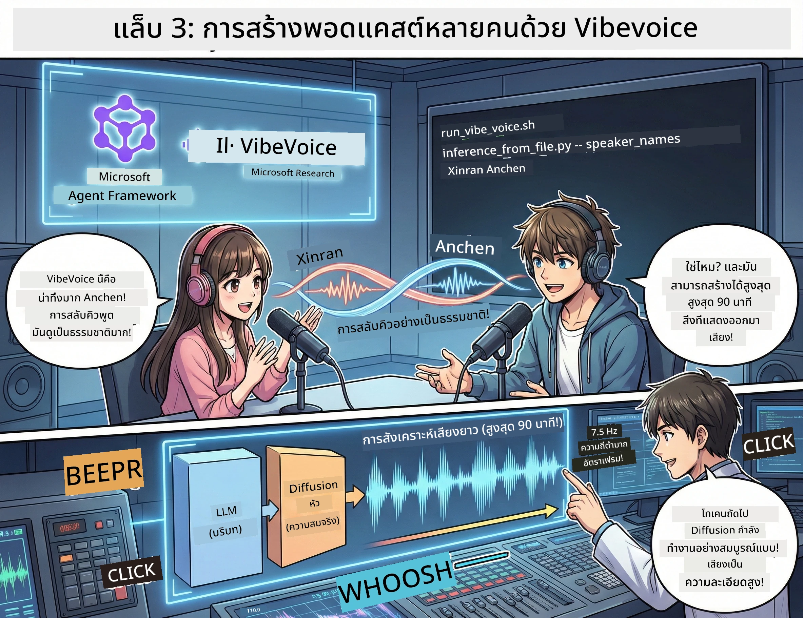

# Act 3: สร้างพอดแคสต์ของคุณให้มีชีวิต 🎤



## ตอนจบสุดยิ่งใหญ่

คุณได้ค้นคว้าหัวข้อแล้ว คุณได้เขียนสคริปต์แล้ว ตอนนี้ถึงเวลาที่จะใส่กิมมิกเด็ดๆ: เปลี่ยนข้อความของคุณให้กลายเป็นเสียงพอดแคสต์จริงด้วยเสียงที่เหมือนจริง!

แนะนำ **VibeVoice** — เวทมนตร์ TTS (text-to-speech) โอเพ่นซอร์สจาก Microsoft Research ที่สร้าง:
- 🎭 บทสนทนาที่ฟังเป็นธรรมชาติ
- 👥 ผู้พูดหลายคน (สูงสุดถึง 4 คน!)
- ⏱️ เสียงยาวต่อเนื่อง (สูงสุด 90 นาที!)
- 🎵 การนำเสนอที่แสดงอารมณ์ (ไม่ใช่เสียงหุ่นยนต์!)

นี่คือเทคโนโลยีเบื้องหลังพอดแคสต์สังเคราะห์ มาสร้างของคุณกันเถอะ!

## VibeVoice คืออะไร? (ของเจ๋งๆ)

VibeVoice คือของขวัญจาก Microsoft Research สร้างมาเพื่อเสียงพูดสไตล์พอดแคสต์โดยเฉพาะ

### ทำไมมันเจ๋ง 🔥

* **⏱️ การพูดยาวต่อเนื่อง**: สร้างเสียงพูดได้นานถึง 90 นาทีแบบต่อเนื่อง (เท่ากับตอนพอดแคสต์เต็ม!)
* **👥 เวทมนตร์ผู้พูดหลายคน**: มีเสียงแตกต่างกันสูงสุด 4 คน โดยมีบุคลิกคงที่
* **⚡ ประสิทธิภาพสูงมาก**: ใช้อัตราเฟรมต่ำสุดที่ 7.5 Hz เพื่อประหยัดพลังการประมวลผล
* **🧠 เสียงอัจฉริยะ**: ผสมผสาน LLM (เข้าใจบริบท) กับโมเดล diffusion (สร้างเสียงเหมือนจริง)
* **🎭 ลื่นไหลเป็นธรรมชาติ**: จัดการการสลับพูด การหยุดพัก และจังหวะบทสนทนาแบบอัตโนมัติ

**สรุป**: VibeVoice ไม่ใช่แค่อ่านข้อความของคุณ — แต่มัน *แสดง* เหมือนคนพูดจริงๆ

---

## ก่อนที่คุณจะเริ่ม 🚀

**สิ่งที่คุณต้องใช้**:

* 🐍 **Python 3.10+** (คุณมีจาก Act 1 & 2 แล้ว)
* 🚀 **uv** (ตัวจัดการแพ็คเกจ Python ที่รวดเร็ว — เราจะติดตั้ง)
* 📝 **สคริปต์ของคุณ**: ไฟล์ `podcast.txt` จาก Act 2 (อยู่ใน `../03.Application/`)

**เคล็ดลับ**: ขั้นตอนนี้ต้องการการเชื่อมต่ออินเทอร์เน็ตที่ดีเพื่อดาวน์โหลดโมเดลที่ผ่านการฝึกแล้ว หยิบกาแฟมาเลย! ☕

---

## เริ่มกันเลย! วิธีง่าย 🎬

เราทำให้มันง่ายมาก สคริปต์แบบ shell เดียวทำทุกอย่างให้

### ขั้นตอน

1. **ทำให้มันรันได้**:
```bash
chmod +x run_vibe_voice.sh
```

2. **รันมัน**:
```bash
./run_vibe_voice.sh
```

3. **รอเวทมนตร์เกิดขึ้น** (อาจใช้เวลาสักครู่ตอนรันครั้งแรก)

### เกิดอะไรขึ้นเบื้องหลัง 🎭

สคริปต์เปรียบเสมือนวิศวกรเสียงอัตโนมัติของคุณ:

1. **📥 ดาวน์โหลด VibeVoice**: โคลน repo อย่างเป็นทางการจาก GitHub
2. **📦 ติดตั้ง dependencies**: ใช้ `uv pip` เพื่อติดตั้งแพ็คเกจไวอย่างรวดเร็ว
3. **🎬 สร้างเสียง**: รันสคริปต์ inference พร้อม:
   * `--model_path`: โมเดล VibeVoice-7B ที่ผ่านการฝึกแล้ว
   * `--txt_path`: สคริปต์ `podcast.txt` ของคุณ
   * `--speaker_names`: กำหนดเสียงพูด (ค่าตั้งต้น Xinran & Anchen)

**ผลลัพธ์**: สคริปต์ของคุณจะกลายเป็นตอนพอดแคสต์จริง! 🎉

---

## ภารกิจของคุณ 🎯

มาทำให้มันน่าสนใจกัน:

### งานที่ 1: สร้างเนื้อหา
แก้ไขไฟล์ `../03.Application/podcast.txt` ด้วยบทสนทนาระหว่างคนสองคน ให้อยู่ในหัวข้อเทคโนโลยี งานอดิเรก หรืออะไรก็ได้! ขอให้เป็นบทสนทนา

**ตัวอย่างรูปแบบ**:
```
Speaker 1: Hey! Did you hear about the new AI model?
Speaker 2: No way! Tell me more!
Speaker 1: It's called...
```

### งานที่ 2: สร้างเสียง
รันสคริปต์ และดูเวทมนตร์ทำงาน ครั้งแรกจะใช้เวลานานเพราะดาวน์โหลดโมเดล

### งานที่ 3: ฟัง & วิเคราะห์
- ฟังดูเป็นธรรมชาติหรือเปล่า?
- เสียงผู้พูดต่างกันชัดเจนไหม?
- การสลับพูดลื่นไหลหรือไม่?
- มีจังหวะหุ่นยนต์ไหม?

### งานที่ 4: ทดลอง (สำหรับคนกล้า)
แก้ไข `run_vibe_voice.sh` และเปลี่ยน `--speaker_names` เพื่อทดลองเสียงแบบต่างๆ VibeVoice มีเสียงผู้พูดที่ผ่านการฝึกไว้หลายแบบ!

**ความท้าทายแถม**: ลองบทสนทนา 3 คน! 🎆

---

## ศึกษาเพิ่มเติม 📚

* **🏠 หน้าโครงการ**: [VibeVoice Official Site](https://microsoft.github.io/VibeVoice/)
* **🤗 โมเดลที่ฝึกแล้ว**: [Hugging Face - VibeVoice-7B](https://huggingface.co/vibevoice/VibeVoice-7B)
* **📖 งานวิจัย**: เจาะลึกเทคโนโลยี (ถ้าคุณสนใจ)

> **⚠️ เตือนใจ AI ที่รับผิดชอบ**: VibeVoice มีพลัง ใช้งานอย่างมีจริยธรรม! อย่าสร้างดีปเฟค หรือเนื้อหาหลอกลวง สร้างสิ่งเจ๋งๆ ที่ช่วยผู้คน 🙏

---

## 🏆 ยินดีด้วย! คุณทำได้แล้ว!

คุณได้ทำครบทุกขั้นตอน:
1. ✅ **Act 1**: สร้างเอเย่นต์ AI ด้วยเครื่องมือเฉพาะ
2. ✅ **Act 2**: ประสานงานหลายเอเย่นต์
3. ✅ **Act 3**: สร้างเสียงพอดแคสต์จริง

**สิ่งที่คุณมีตอนนี้**:
- ผู้ช่วยวิจัย AI ที่ใช้งานได้จริง
- ระบบทำพอดแคสต์อย่างครบวงจร
- ไฟล์เสียงพอดแคสต์ที่คุณสามารถแชร์ได้

### ต่อไปคืออะไร? 🚀

**ปล่อยพอดแคสต์ของคุณ!**
- อัปโหลดลงแพลตฟอร์มพอดแคสต์
- แชร์ในโซเชียลมีเดีย
- ปรับปรุงและพัฒนา

**สร้างต่อไป!**
- ลองหัวข้อใหม่ๆ
- ทดลองกับผู้พูดหลายคน
- ใส่เพลงพื้นหลัง
- สร้างส่วนติดต่อเว็บ
- อัตโนมัติทุกขั้นตอน

**แชร์ผลงานของคุณ!**
แท็กเรา! แสดงให้โลกเห็นสิ่งที่คุณสร้าง การปฏิวัติพอดแคสต์ AI เริ่มต้นที่คุณ 🎙️

---

**มีคำถาม? ไอเดีย? เรื่องราวความสำเร็จ?** ฝากไว้ในแชทเวิร์กช็อปได้เลย!

**ยินดีต้อนรับสู่อนาคตของการสร้างสรรค์เนื้อหา.** 🌟

---

<!-- CO-OP TRANSLATOR DISCLAIMER START -->
**ข้อจำกัดความรับผิดชอบ**:  
เอกสารฉบับนี้ได้รับการแปลโดยใช้บริการแปลภาษาด้วยปัญญาประดิษฐ์ [Co-op Translator](https://github.com/Azure/co-op-translator) แม้ว่าเราจะพยายามรักษาความถูกต้องให้มากที่สุด แต่โปรดเข้าใจว่าการแปลอัตโนมัติอาจมีข้อผิดพลาดหรือความไม่ถูกต้อง เอกสารต้นฉบับในภาษาต้นฉบับควรถือเป็นแหล่งข้อมูลที่เชื่อถือได้ สำหรับข้อมูลที่สำคัญควรใช้บริการแปลโดยผู้เชี่ยวชาญเป็นการแนะนำ เราไม่รับผิดชอบต่อความเข้าใจผิดหรือการตีความผิดใดๆ ที่เกิดขึ้นจากการใช้การแปลนี้
<!-- CO-OP TRANSLATOR DISCLAIMER END -->