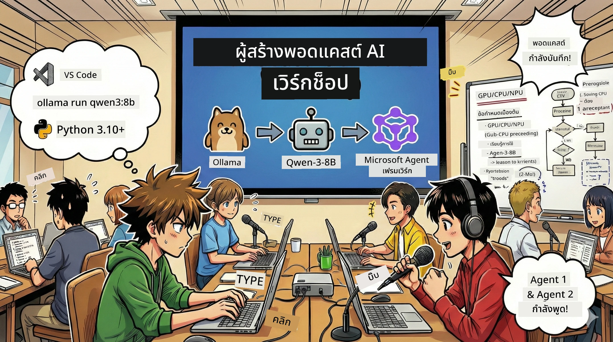

# 🎙️ เวิร์กช็อปสตูดิโอพอดแคสต์ AI



## ภารกิจของคุณ

ยินดีต้อนรับสู่ **สตูดิโอพอดแคสต์ AI**! คุณกำลังจะเปิดตัวพอดแคสต์เทคโนโลยีของตัวเองชื่อ "อนาคตไบต์" — แต่มีจุดพลิกผัน: คุณจะสร้างทีมผลิตที่ขับเคลื่อนโดย AI เพื่อช่วยคุณสร้างมัน ไม่ต้องวิจัย สคริปต์ หรือแก้ไขเสียงอย่างไม่มีที่สิ้นสุดอีกต่อไป แต่คุณจะกลายเป็นผู้ผลิตพอดแคสต์ที่มีพลัง AI ผ่านการเขียนโปรแกรม

## พื้นหลังเรื่องราว

ลองจินตนาการ: คุณและเพื่อนอยากเริ่มพอดแคสต์เกี่ยวกับเทรนด์เทคโนโลยีเจ๋งๆ แต่ทุกคนยุ่งกับการเรียน การทำงาน หรือชีวิตประจำวัน แล้วถ้าคุณสามารถสร้างทีมเอเย่นต์ AI ที่ทำงานหนักให้แทนได้ล่ะ? เอเย่นต์หนึ่งทำการวิจัยหัวข้อ อีกตัวเขียนสคริปต์ที่น่าดึงดูด อีกตัวแปลงข้อความเป็นบทสนทนาที่เป็นธรรมชาติ ฟังดูเหมือนนิยายวิทยาศาสตร์? มาทำให้มันเป็นจริงกัน

## สิ่งที่คุณจะได้เรียนรู้

เมื่อเวิร์กช็อปนี้จบ คุณจะรู้วิธี:
- 🤖 ติดตั้งโมเดล AI ในเครื่องของคุณเอง (ไม่มีค่าบริการ API, ไม่ต้องพึ่งคลาวด์!)
- 🔧 สร้างเอเย่นต์ AI มืออาชีพที่ทำงานร่วมกันได้จริง
- 🎬 สร้างกระบวนการผลิตพอดแคสต์ครบวงจรตั้งแต่ไอเดียจนถึงเสียง

## การเดินทางของคุณ: สามบท

เหมือนกับเรื่องราวดี ๆ ใด ๆ เรามีสามบท แต่ละบทจะค่อย ๆ สร้างสตูดิโอพอดแคสต์ AI ของคุณ:

| บท | ภารกิจของคุณ | เกิดอะไรขึ้น | ทักษะที่ปลดล็อก |
|---------|-----------|--------------|----------------|
| **บทที่หนึ่ง** | [ทำความรู้จักผู้ช่วย AI ของคุณ](01.BuildAIAgentWithSLM.md) | คุณจะค้นพบวิธีสร้างเอเย่นต์ AI ที่แชท, ค้นหาเว็บ หรือแก้ปัญหาได้ คิดว่าเป็นนักศึกษาฝึกงานวิจัยที่ไม่เคยหลับ | 🎯 สร้างเอเย่นต์ตัวแรกของคุณ<br>🛠️ มอบพลังพิเศษให้มัน (เครื่องมือ!)<br>🧠 สอนให้คิด<br>🌐 เชื่อมต่ออินเทอร์เน็ต |
| **บทที่สอง** | [สร้างทีมผลิตของคุณ](02.AIAgentOrchestrationAndWorkflows.md) | สนุกขึ้น! คุณจะประสานงานเอเย่นต์ AI หลายตัวทำงานร่วมกันเหมือนทีมพอดแคสต์จริง ตัวหนึ่งวิจัย อีกตัวเขียน คุณอนุมัติ — ทีมงานทำฝันเป็นจริง | 🎭 ประสานงานหลายเอเย่นต์<br>🔄 สร้างเวิร์กโฟลว์อนุมัติ<br>🖥️ ทดสอบด้วยอินเทอร์เฟซ DevUI<br>✋ รักษาการควบคุมของมนุษย์ |
| **บทที่สาม** | [ทำให้พอดแคสต์ของคุณมีชีวิตชีวา](03.Multi-SpeakerPodcastGenerationWithVibeVoice.md) | ตอนจบ! แปลงสคริปต์ข้อความของคุณเป็นเสียงพอดแคสต์จริงด้วยเสียงที่สมจริงและบทสนทนาเป็นธรรมชาติ พร้อมเผยแพร่พอดแคสต์ “อนาคตไบต์” ของคุณ! | 🎤 เวทมนตร์แปลงข้อความเป็นเสียง<br>👥 เสียงผู้พูดหลายคน<br>⏱️ เสียงฟอร์แมตยาว<br>🚀 อัตโนมัติเต็มรูปแบบ |

แต่ละบทจะปลดล็อกความสามารถใหม่ ถ้าคุณกล้าก็ข้ามดูได้ แต่เราแนะนำให้เรียนตามลำดับ!

## ความต้องการของสภาพแวดล้อม

เวิร์กช็อปนี้รองรับฮาร์ดแวร์หลายแบบ:
- **CPU**: เหมาะสำหรับการทดสอบและใช้งานขนาดเล็ก
- **GPU**: แนะนำสำหรับการใช้งานจริง เพิ่มความเร็วการประมวลผลอย่างมาก
- **NPU**: รองรับการเร่งด้วยหน่วยประมวลผลประสาทรุ่นถัดไป

## สิ่งที่คุณต้องมี

### ซอฟต์แวร์ ✅
- **Python 3.10+** (ภาษาการเขียนโปรแกรมของคุณ)
- **Ollama** (รันโมเดล AI บนเครื่องของคุณ)
- **VS Code** (เครื่องมือแก้ไขโค้ดของคุณ)
- **ส่วนขยาย Python** (ทำให้ VS Code ฉลาดขึ้น)
- **Git** (สำหรับดึงโค้ด)

### ตรวจสอบฮาร์ดแวร์ 💻
- **ฉันรันได้ไหม?**: แรม 8GB, พื้นที่ว่าง 10GB (ใช้ได้แต่ช้าเล็กน้อย)
- **การตั้งค่าที่แนะนำ**: แรม 16GB+ พร้อม GPU ดี ๆ (รันได้ลื่นไหล!)
- **มี NPU ไหม?**: ดีมาก! ปลดล็อกประสิทธิภาพยุคหน้า 🚀

## สร้างสตูดิโอของคุณ 🎬

### ขั้นตอนที่ 1: อัปเกรด Python

ตรวจสอบว่าคุณมี Python 3.10 หรือใหม่กว่า:

```bash
python --version
# ควรแสดง Python 3.10.x หรือเวอร์ชันที่สูงกว่า
```

ไม่มี Python? ดาวน์โหลดได้ที่ [python.org](https://python.org) — ฟรี!

### ขั้นตอนที่ 2: รับ Ollama (เครื่องรันโมเดล AI ของคุณ)

ไปที่ [ollama.ai](https://ollama.ai) เพื่อดาวน์โหลด Ollama ที่เหมาะกับระบบปฏิบัติการของคุณ คิดว่าเป็นเครื่องยนต์ที่รันโมเดล AI ในเครื่อง

ตรวจสอบว่าพร้อมใช้งาน:

```bash
ollama --version
```

### ขั้นตอนที่ 3: ดาวน์โหลดสมอง AI ของคุณ 🧠

ถึงเวลาดาวน์โหลดโมเดล Qwen-3-8B แล้ว (เหมือนจ้างผู้ช่วย AI ตัวแรกของคุณ):

```bash
ollama pull qwen3:8b
```

*อาจใช้เวลาสักครู่ ช่วงเวลาที่เหมาะกับกาแฟ! ☕*

### ขั้นตอนที่ 4: ติดตั้ง VS Code

ถ้ายังไม่มี ดาวน์โหลด [Visual Studio Code](https://code.visualstudio.com/) นี้คือเครื่องมือแก้ไขโค้ดยอดเยี่ยมที่สุด (ท้าพิสูจน์ 😄)

### ขั้นตอนที่ 5: ส่วนขยาย Python

ใน VS Code:
1. กด `Ctrl+Shift+X` (บน Mac คือ `Cmd+Shift+X`)
2. ค้นหา "Python"
3. ติดตั้งส่วนขยาย Python อย่างเป็นทางการจาก Microsoft

### ขั้นตอนที่ 6: เสร็จสมบูรณ์! 🎉

จริง ๆ แล้วคุณพร้อมแล้ว มาสร้างเวทมนตร์ AI กันเถอะ!

### ขั้นตอนที่ 7: ติดตั้ง Microsoft Agent Framework และแพ็กเกจที่เกี่ยวข้อง 📦

ติดตั้ง dependencies ทั้งหมดที่เวิร์กช็อปต้องการ:

```bash
pip install -r ./Installations/requirements.txt -U
```

*จะติดตั้ง Microsoft Agent Framework และแพ็กเกจจำเป็นทั้งหมด ดื่มกาแฟรอสักครู่ — การติดตั้งครั้งแรกอาจใช้เวลาหน่อย! ☕*

## คำแนะนำสำหรับเวิร์กช็อป

โครงสร้างโปรเจกต์ รายละเอียดการตั้งค่า และวิธีใช้งานจะแจ้งให้ทราบทีละขั้นตอนระหว่างเวิร์กช็อป

## การแก้ไขปัญหา (เมื่อเกิดข้อผิดพลาด) 🔧

### "เฮ้ โมเดลดาวน์โหลดช้ามาก!"
**วิธีแก้:** ใช้ VPN หรือกำหนดแหล่งกระจกของ Ollama บางครั้งเครือข่ายก็ไม่เสถียร

### "คอมเครื่องฉันจะค้าง! แรมไม่พอ!"
**วิธีแก้:** เปลี่ยนไปใช้โมเดลขนาดเล็กกว่าหรือปรับ `num_ctx` ให้ใช้แรมน้อยลง คิดว่ามันเหมือนให้ AI ลดน้ำหนัก

### "ใช้ GPU ให้มันเร็วขึ้นได้ไหม?"
**วิธีแก้:** Ollama จะตรวจจับ GPU ให้เอง! แค่แน่ใจว่าไดรเวอร์ GPU ของคุณเป็นเวอร์ชันล่าสุด เพิ่มความเร็วฟรี! 🏎️

## แหล่งข้อมูลเพิ่มเติม (สำหรับคนที่อยากรู้อีก) 📚

- [เอกสาร Ollama](https://github.com/ollama/ollama) — เรียนรู้เพิ่มเติมเกี่ยวกับโมเดล AI ในเครื่อง
- [Microsoft Agent Framework](https://microsoft.github.io/autogen/) — เพิ่มเติมเกี่ยวกับการสร้างทีมเอเย่นต์ AI
- [ข้อมูลโมเดล Qwen](https://qwenlm.github.io/) — รู้จักสมองผู้ช่วย AI ของคุณ

## ใบอนุญาต

ใบอนุญาต MIT — สร้างสิ่งเจ๋ง ๆ แชร์ และทำให้โลกดีขึ้น! 🌍

## ต้องการมีส่วนร่วม?

พบบั๊ก? มีไอเดีย? ส่ง Issue หรือ PR มาได้! เราชอบบรรยากาศชุมชน ✨

---

<!-- CO-OP TRANSLATOR DISCLAIMER START -->
**ข้อจำกัดความรับผิดชอบ**:  
เอกสารนี้ได้รับการแปลโดยใช้บริการแปลภาษาอัตโนมัติ [Co-op Translator](https://github.com/Azure/co-op-translator) แม้เราจะพยายามเพื่อความถูกต้อง โปรดทราบว่าการแปลโดยอัตโนมัติอาจมีข้อผิดพลาดหรือความไม่ถูกต้องได้ เอกสารต้นฉบับในภาษาต้นทางถือเป็นแหล่งข้อมูลที่เชื่อถือได้ สำหรับข้อมูลที่สำคัญ ขอแนะนำให้ใช้บริการแปลโดยผู้เชี่ยวชาญที่เป็นมนุษย์ เราจะไม่รับผิดชอบต่อความเข้าใจผิดหรือการตีความที่ผิดพลาดใดๆ ที่เกิดจากการใช้การแปลนี้
<!-- CO-OP TRANSLATOR DISCLAIMER END -->