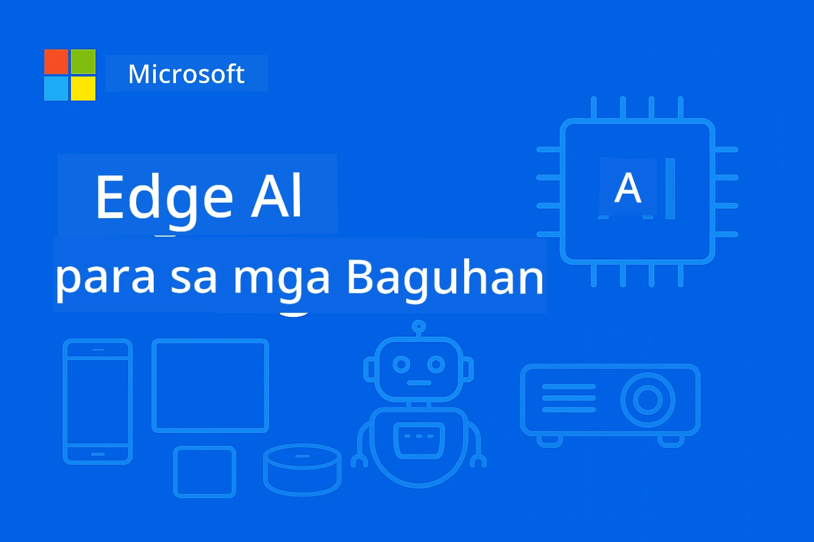

# EdgeAI para sa Mga Nagsisimula 




[](https://GitHub.com/microsoft/edgeai-for-beginners/graphs/contributors)
[](https://GitHub.com/microsoft/edgeai-for-beginners/issues)
[](https://GitHub.com/microsoft/edgeai-for-beginners/pulls)
[](http://makeapullrequest.com)

[](https://GitHub.com/microsoft/edgeai-for-beginners/watchers)
[](https://GitHub.com/microsoft/edgeai-for-beginners/fork)
[](https://GitHub.com/microsoft/edgeai-for-beginners/stargazers)


[](https://discord.gg/nTYy5BXMWG)

Sundin ang mga hakbang na ito upang makapagsimula gamit ang mga mapagkukunang ito:

1. **I-fork ang Repository**: I-click ang [](https://GitHub.com/microsoft/edgeai-for-beginners/fork)
2. **I-clone ang Repository**:   `git clone https://github.com/microsoft/edgeai-for-beginners.git`
3. [**Sumali sa Azure AI Foundry Discord at makipagkita sa mga eksperto at kapwa developer**](https://discord.com/invite/ByRwuEEgH4)


### 🌐 Suporta sa Maramihang Wika

#### Sinusuportahan sa pamamagitan ng GitHub Action (Awtomatiko at Palaging Napapanahon)

<!-- CO-OP TRANSLATOR LANGUAGES TABLE START -->
[Arabic](../ar/README.md) | [Bengali](../bn/README.md) | [Bulgarian](../bg/README.md) | [Burmese (Myanmar)](../my/README.md) | [Chinese (Simplified)](../zh-CN/README.md) | [Chinese (Traditional, Hong Kong)](../zh-HK/README.md) | [Chinese (Traditional, Macau)](../zh-MO/README.md) | [Chinese (Traditional, Taiwan)](../zh-TW/README.md) | [Croatian](../hr/README.md) | [Czech](../cs/README.md) | [Danish](../da/README.md) | [Dutch](../nl/README.md) | [Estonian](../et/README.md) | [Finnish](../fi/README.md) | [French](../fr/README.md) | [German](../de/README.md) | [Greek](../el/README.md) | [Hebrew](../he/README.md) | [Hindi](../hi/README.md) | [Hungarian](../hu/README.md) | [Indonesian](../id/README.md) | [Italian](../it/README.md) | [Japanese](../ja/README.md) | [Kannada](../kn/README.md) | [Korean](../ko/README.md) | [Lithuanian](../lt/README.md) | [Malay](../ms/README.md) | [Malayalam](../ml/README.md) | [Marathi](../mr/README.md) | [Nepali](../ne/README.md) | [Nigerian Pidgin](../pcm/README.md) | [Norwegian](../no/README.md) | [Persian (Farsi)](../fa/README.md) | [Polish](../pl/README.md) | [Portuguese (Brazil)](../pt-BR/README.md) | [Portuguese (Portugal)](../pt-PT/README.md) | [Punjabi (Gurmukhi)](../pa/README.md) | [Romanian](../ro/README.md) | [Russian](../ru/README.md) | [Serbian (Cyrillic)](../sr/README.md) | [Slovak](../sk/README.md) | [Slovenian](../sl/README.md) | [Spanish](../es/README.md) | [Swahili](../sw/README.md) | [Swedish](../sv/README.md) | [Tagalog (Filipino)](./README.md) | [Tamil](../ta/README.md) | [Telugu](../te/README.md) | [Thai](../th/README.md) | [Turkish](../tr/README.md) | [Ukrainian](../uk/README.md) | [Urdu](../ur/README.md) | [Vietnamese](../vi/README.md)

> **Mas gusto mo bang I-clone nang Lokal?**

> Kasama sa repositoryong ito ang higit sa 50 wika na mga pagsasalin na malaki ang dagdag ng laki sa pag-download. Para mag-clone nang walang mga pagsasalin, gamitin ang sparse checkout:
> ```bash
> git clone --filter=blob:none --sparse https://github.com/microsoft/edgeai-for-beginners.git
> cd edgeai-for-beginners
> git sparse-checkout set --no-cone '/*' '!translations' '!translated_images'
> ```
> Bibigyan ka nito ng lahat ng kailangan mo para makumpleto ang kurso nang mas mabilis ang pag-download.
<!-- CO-OP TRANSLATOR LANGUAGES TABLE END -->

**Kung nais mong suportahan ang karagdagang mga wika ng pagsasalin ay nakalista [dito](https://github.com/Azure/co-op-translator/blob/main/getting_started/supported-languages.md)**
## Panimula

Maligayang pagdating sa **EdgeAI para sa Mga Nagsisimula** – ang iyong komprehensibong paglalakbay papunta sa makabagong mundo ng Edge Artificial Intelligence. Pinagtutugma ng kursong ito ang makapangyarihang kakayahan ng AI at ang praktikal na aplikasyon nito sa mga edge device, na nagbibigay kapangyarihan sa iyo na samantalahin ang potensyal ng AI mismo kung saan ginagawa ang data at kailangang gumawa ng mga desisyon.

### Ano ang Mapag-aaralan Mo

Dadalhin ka ng kurso mula sa mga pangunahing konsepto hanggang sa mga implementasyong handa para sa produksyon, na saklaw ang:
- **Maliliit na Language Models (SLMs)** na ini-optimize para sa deployment sa edge
- **Hardware-aware optimization** sa iba't ibang platform
- **Real-time inference** na may kakayahang mapanatili ang privacy
- **Mga estratehiya sa deployment para sa produksyon** para sa mga aplikasyon ng enterprise

### Bakit Mahalaga ang EdgeAI

Ang Edge AI ay kumakatawan sa isang paradigm shift na tumutugon sa mahahalagang hamon sa modernong panahon:
- **Privacy at Seguridad**: Iproseso ang sensitibong data nang lokal nang hindi ibinubunyag sa cloud
- **Real-time Performance**: Alisin ang latency ng network para sa mga aplikasyon na kritikal ang oras
- **Cost Efficiency**: Bawasan ang bandwidth at gastos sa cloud computing
- **Resilient Operations**: Panatilihin ang functionality kapag nawawala ang network
- **Regulatory Compliance**: Matugunan ang mga kinakailangan sa data sovereignty

### Edge AI

Ang Edge AI ay tumutukoy sa pagpapatakbo ng AI algorithms at language models nang lokal sa hardware, malapit sa pinanggagalingan ng data nang hindi umaasa sa cloud resources para sa inference. Binabawasan nito ang latency, pinapabuti ang privacy, at nagbibigay-daan sa makinang gumawa ng mga desisyon sa real-time.

### Pangunahing Prinsipyo:
- **On-device inference**: Tumakbo ang mga AI model sa mga edge device (mga telepono, router, microcontroller, industrial PC)
- **Kakayahang offline**: Gumagamit kahit walang tuloy-tuloy na internet connectivity
- **Mababang latency**: Agarang tugon na angkop para sa mga real-time system
- **Data sovereignty**: Pinananatili ang sensitibong data sa lokal upang mapabuti ang seguridad at pagsunod

### Maliliit na Language Models (SLMs)

Ang mga SLM tulad ng Phi-4, Mistral-7B, at Gemma ay mga optimized na bersyon ng mas malalaking LLM—na tinuruan o dine-distill para sa:
- **Pinababang memory footprint**: Epektibo ang paggamit ng limitadong memorya ng edge device
- **Mas mababang compute demand**: Na-optimize para sa CPU at edge GPU performance
- **Mas mabilis na pag-startup**: Mabilis mag-initialize para sa mga responsibong aplikasyon

Nabubuksan nila ang makapangyarihang kakayahan ng NLP habang natutugunan ang mga limitasyon ng:
- **Embedded systems**: Mga IoT device at mga industrial controller
- **Mobile devices**: Smartphones at tablets na may kakayahang offline
- **IoT Devices**: Mga sensor at smart device na may limitadong resources
- **Edge servers**: Lokal na processing units na may limitadong GPU resources
- **Personal Computers**: Mga scenario ng desktop at laptop deployment

## Mga Module ng Kurso at Navigasyon

| Module | Paksa | Pokus na Lugar | Pangunahing Nilalaman | Antas | Tagal |
|--------|-------|----------------|----------------------|--------|----------|
| [📖 00 ](./introduction.md) | [Panimula sa EdgeAI](./introduction.md) | Pundasyon at Konteksto | Pangkalahatang Tanaw sa EdgeAI • Mga Aplikasyon sa Industriya • Panimula sa SLM • Mga Layunin sa Pag-aaral | Nagsisimula | 1-2 oras |
| [📚 01](../../Module01) | [Mga Pangunahing Kaalaman sa EdgeAI](./Module01/README.md) | Paghahambing ng Cloud at Edge AI | Mga Pangunahing Kaalaman sa EdgeAI • Mga Kaso sa Tunay na Mundo • Gabay sa Implementasyon • Deployment sa Edge | Nagsisimula | 3-4 oras |
| [🧠 02](../../Module02) | [Mga Pundasyon ng SLM Model](./Module02/README.md) | Pamilya ng Model at Arkitektura | Phi Family • Qwen Family • Gemma Family • BitNET • μModel • Phi-Silica | Nagsisimula | 4-5 oras |
| [🚀 03](../../Module03) | [Pagsasanay sa Deployment ng SLM](./Module03/README.md) | Lokal at cloud deployment | Advanced na Pagkatuto • Lokal na Kapaligiran • Cloud Deployment | Gitna | 4-5 oras |
| [⚙️ 04](../../Module04) | [Toolkit para sa Model Optimization](./Module04/README.md) | Cross-platform optimization | Panimula • Llama.cpp • Microsoft Olive • OpenVINO • Apple MLX • Synthesis ng Workflow | Gitna | 5-6 oras |
| [🔧 05](../../Module05) | [Produksyon ng SLMOps](./Module05/README.md) | Mga operasyon sa produksyon | Panimula sa SLMOps • Model Distillation • Fine-tuning • Deployment para sa Produksyon | Mas advanced | 5-6 oras |
| [🤖 06](../../Module06) | [AI Agents at Function Calling](./Module06/README.md) | Mga framework ng agent at MCP | Panimula sa Agent • Function Calling • Model Context Protocol | Mas advanced | 4-5 oras |
| [💻 07](../../Module07) | [Implementasyon ng Platform](./Module07/README.md) | Mga halimbawa sa cross-platform | AI Toolkit • Foundry Local • Windows Development | Mas advanced | 3-4 oras |
| [🏭 08](../../Module08) | [Foundry Local Toolkit](./Module08/README.md) | Mga halimbawa na handa na para sa produksyon | Mga sample aplikasyon (tingnan ang mga detalye sa ibaba) | Eksperto | 8-10 oras |

### 🏭 **Module 08: Mga Sample na Aplikasyon**

- [01: REST Chat Quickstart](./Module08/samples/01/README.md)
- [02: OpenAI SDK Integration](./Module08/samples/02/README.md)
- [03: Model Discovery & Benchmarking](./Module08/samples/03/README.md)
- [04: Chainlit RAG Application](./Module08/samples/04/README.md)
- [05: Multi-Agent Orchestration](./Module08/samples/05/README.md)
- [06: Models-as-Tools Router](./Module08/samples/06/README.md)
- [07: Direct API Client](./Module08/samples/07/README.md)
- [08: Windows 11 Chat App](./Module08/samples/08/README.md)
- [09: Advanced Multi-Agent System](./Module08/samples/09/README.md)
- [10: Foundry Tools Framework](./Module08/samples/10/README.md)

### 🎓 **Workshop: Hands-On Learning Path**

Komprehensibong hands-on workshop materials na may mga implementasyong handa sa produksyon:

- **[Workshop Guide](./Workshop/Readme.md)** - Kumpletong mga layunin ng pag-aaral, resulta, at navigasyon ng mga mapagkukunan
- **Python Samples** (6 na sesyon) - Na-update gamit ang pinakamahusay na mga kasanayan, paghawak ng error, at komprehensibong dokumentasyon
- **Jupyter Notebooks** (8 interaktibo) - Step-by-step na mga tutorial na may mga benchmark at pag-monitor ng performance
- **Session Guides** - Detalyadong markdown na gabay para sa bawat sesyon ng workshop
- **Validation Tools** - Mga script upang beripikahin ang kalidad ng code at magpatakbo ng mga smoke test

**Ano ang Bubuuin Mo:**
- Lokal na AI chat applications na may streaming support
- RAG pipelines na may quality evaluation (RAGAS)
- Multi-model benchmarking at mga tool para sa paghahambing
- Mga sistema ng multi-agent orchestration
- Matalinong model routing gamit ang task-based selection

### 🎙️ **Workshop Para sa Agentic: Hands-On - The AI Podcast Studio**

Buuin ang AI-powered podcast production pipeline mula sa simula! Itinuturo ng workshop na ito ang paggawa ng isang kumpletong multi-agent system na nagbabago ng mga ideya sa mga propesyonal na episode ng podcast.
**[🎬 Simulan ang AI Podcast Studio Workshop](./WorkshopForAgentic/README.md)**

**Ang Iyong Misyon**: Ilunsad ang "Future Bytes" — isang tech podcast na pinapatakbo nang buo ng mga AI agent na ikaw mismo ang gagawa. Walang pagdepende sa cloud, walang bayad sa API — lahat ay tumatakbo nang lokal sa iyong makina.

**Ano ang Nagpapakaiba Dito:**
- **🤖 Totoong Multi-Agent Orchestration** - Gumawa ng mga espesyal na AI agent na nagsasaliksik, sumusulat, at gumagawa ng audio
- **🎯 Kumpletong Production Pipeline** - Mula sa pagpili ng paksa hanggang sa huling podcast audio output
- **💻 100% Lokal na Deployment** - Gumagamit ng Ollama at lokal na mga modelo (Qwen-3-8B) para sa buong privacy at kontrol
- **🎤 Text-to-Speech Integration** - I-transform ang mga script sa natural na tunog ng mga multi-speaker na pag-uusap
- **✋ Human-in-the-Loop Workflows** - Approval gates na nagsisiguro ng kalidad habang pinananatili ang awtomasyon

**Tatlong Yugto na Learning Journey:**

| Yugto | Pokus | Pangunahing Kasanayan | Tagal |
|-----|-------|------------|----------|
| **[Yugto 1: Kilalanin ang Iyong mga AI Assistant](./WorkshopForAgentic/md/01.BuildAIAgentWithSLM.md)** | Gumawa ng iyong unang AI agent | Tool integration • Web search • Paglutas ng problema • Agentic reasoning | 2-3 oras |
| **[Yugto 2: Tipunin ang Iyong Production Team](./WorkshopForAgentic/md/02.AIAgentOrchestrationAndWorkflows.md)** | I-orchestrate ang maraming agent | Team coordination • Approval workflows • DevUI interface • Human oversight | 3-4 oras |
| **[Yugto 3: Buhayin ang Iyong Podcast](./WorkshopForAgentic/md/03.Multi-SpeakerPodcastGenerationWithVibeVoice.md)** | Gumawa ng podcast audio | Text-to-speech • Multi-speaker synthesis • Long-form audio • Buong awtomasyon | 2-3 oras |

**Mga Teknolohiyang Ginamit:**
- **Microsoft Agent Framework** - Multi-agent orchestration at coordination
- **Ollama** - Lokal na AI model runtime (walang cloud na kailangan)
- **Qwen-3-8B** - Open-source na language model na optimized para sa mga agentic na gawain
- **Text-to-Speech APIs** - Natural na synthesis ng boses para sa paggawa ng podcast

**Suporta sa Hardware:**
- ✅ **CPU Mode** - Gumagana sa anumang modernong kompyuter (inirerekomendang 8GB+ RAM)
- 🚀 **GPU Acceleration** - Mas mabilis na inference gamit ang NVIDIA/AMD GPUs
- ⚡ **NPU Support** - Bagong henerasyon ng neural processing unit acceleration

**Perpekto Para Sa:**
- Mga developer na nag-aaral ng multi-agent AI systems
- Sinumang interesado sa AI automation at workflows
- Mga content creator na nag-eexplore ng AI-assisted production
- Mga estudyante na nag-aaral ng praktikal na AI orchestration patterns

**Simulan ang Paggawa**: [🎙️ The AI Podcast Studio Workshop →](./WorkshopForAgentic/README.md)

### 📊 **Buod ng Learning Path**
- **Kabuuang Tagal**: 36-45 na oras
- **Para sa Baguhan**: Modules 01-02 (7-9 na oras)  
- **Intermediate Path**: Modules 03-04 (9-11 na oras)
- **Advanced Path**: Modules 05-07 (12-15 na oras)
- **Expert Path**: Module 08 (8-10 na oras)

## Ano ang Iyong Gagawin

### 🎯 Pangunahing Kasanayan
- **Edge AI Architecture**: Disenyo ng mga lokal-na-una AI system na may cloud integration
- **Model Optimization**: I-quantize at i-compress ang mga modelo para sa edge deployment (85% bilis ng pagtaas, 75% bawas sa laki)
- **Multi-Platform Deployment**: Windows, mobile, embedded, at cloud-edge hybrid systems
- **Production Operations**: Pagmamanman, pag-scale, at pagpapanatili ng edge AI sa production

### 🏗️ Praktikal na Mga Proyekto
- **Foundry Local Chat Apps**: Native na Windows 11 na app na may model switching
- **Multi-Agent Systems**: Coordinator na may specialist agents para sa komplikadong workflows  
- **RAG Applications**: Lokal na pagproseso ng dokumento na may vector search
- **Model Routers**: Matalinong pagpili sa pagitan ng mga modelo batay sa pagsusuri ng gawain
- **API Frameworks**: Production-ready clients na may streaming at health monitoring
- **Cross-Platform Tools**: LangChain/Semantic Kernel integration patterns

### 🏢 Mga Aplikasyon sa Industriya
**Manufacturing** • **Healthcare** • **Autonomous Vehicles** • **Smart Cities** • **Mobile Apps**

## Mabilis na Simula

**Inirerekomendang Learning Path** (20-30 na oras kabuuan):

0. **📖 Panimula** ([Introduction.md](./introduction.md)): EdgeAI foundation + konteksto sa industriya + learning framework
1. **📚 Pundasyon** (Modules 01-02): Mga konsepto ng EdgeAI + mga pamilya ng SLM model
2. **⚙️ Optimization** (Modules 03-04): Deployment + mga quantization framework  
3. **🚀 Produksyon** (Modules 05-06): SLMOps + AI agents + function calling
4. **💻 Implementasyon** (Modules 07-08): Mga sample ng platform + Foundry Local toolkit

Ang bawat module ay may kasamang teorya, praktikal na mga pagsasanay, at production-ready na mga code sample.

## Epekto sa Karera

**Teknikal na Mga Papel**: EdgeAI Solutions Architect • ML Engineer (Edge) • IoT AI Developer • Mobile AI Developer

**Mga Sektor ng Industriya**: Manufacturing 4.0 • Healthcare Tech • Autonomous Systems • FinTech • Consumer Electronics

**Mga Proyekto sa Portfolio**: Multi-agent systems • Production RAG apps • Cross-platform deployment • Performance optimization

## Istraktura ng Repository

```
edgeai-for-beginners/
├── 📖 introduction.md  # Foundation: EdgeAI Overview & Learning Framework
├── 📚 Module01-04/     # Fundamentals → SLMs → Deployment → Optimization  
├── 🔧 Module05-06/     # SLMOps → AI Agents → Function Calling
├── 💻 Module07/        # Platform Samples (VS Code, Windows, Jetson, Mobile)
├── 🏭 Module08/        # Foundry Local Toolkit + 10 Comprehensive Samples
│   ├── samples/01-06/  # Foundation: REST, SDK, RAG, Agents, Routing
│   └── samples/07-10/  # Advanced: API Client, Windows App, Enterprise Agents, Tools
├── 🌐 translations/    # Multi-language support (8+ languages)
└── 📋 STUDY_GUIDE.md   # Structured learning paths & time allocation
```

## Mga Tampok ng Kurso

✅ **Progressive Learning**: Teorya → Praktika → Production deployment  
✅ **Totoong Case Studies**: Microsoft, Japan Airlines, mga enterprise implementation  
✅ **Hands-on Samples**: 50+ na halimbawa, 10 kompleto na Foundry Local na demo  
✅ **Performance Focus**: 85% na pagpapabuti sa bilis, 75% na bawas sa laki  
✅ **Multi-Platform**: Windows, mobile, embedded, cloud-edge hybrid  
✅ **Production Ready**: Monitoring, scaling, seguridad, compliance frameworks

📖 **[Available ang Study Guide](STUDY_GUIDE.md)**: Estrakturadong 20-oras na learning path na may gabay sa alokasyon ng oras at mga tool para sa self-assessment.

---

**Ang EdgeAI ay kumakatawan sa hinaharap ng deployment ng AI**: lokal-na-una, nagpapanatili ng privacy, at epektibo. Masterin ang mga kasanayang ito para gumawa ng susunod na henerasyon ng matatalinong aplikasyon.

## Ibang Kurso

Gumagawa din ang aming koponan ng iba pang mga kurso! Tingnan ang:

<!-- CO-OP TRANSLATOR OTHER COURSES START -->
### LangChain
[](https://aka.ms/langchain4j-for-beginners)
[](https://aka.ms/langchainjs-for-beginners?WT.mc_id=m365-94501-dwahlin)
[](https://github.com/microsoft/langchain-for-beginners?WT.mc_id=m365-94501-dwahlin)
---

### Azure / Edge / MCP / Agents
[](https://github.com/microsoft/AZD-for-beginners?WT.mc_id=academic-105485-koreyst)
[](https://github.com/microsoft/edgeai-for-beginners?WT.mc_id=academic-105485-koreyst)
[](https://github.com/microsoft/mcp-for-beginners?WT.mc_id=academic-105485-koreyst)
[](https://github.com/microsoft/ai-agents-for-beginners?WT.mc_id=academic-105485-koreyst)

---
 
### Generative AI Series
[](https://github.com/microsoft/generative-ai-for-beginners?WT.mc_id=academic-105485-koreyst)
[-9333EA?style=for-the-badge&labelColor=E5E7EB&color=9333EA)](https://github.com/microsoft/Generative-AI-for-beginners-dotnet?WT.mc_id=academic-105485-koreyst)
[-C084FC?style=for-the-badge&labelColor=E5E7EB&color=C084FC)](https://github.com/microsoft/generative-ai-for-beginners-java?WT.mc_id=academic-105485-koreyst)
[-E879F9?style=for-the-badge&labelColor=E5E7EB&color=E879F9)](https://github.com/microsoft/generative-ai-with-javascript?WT.mc_id=academic-105485-koreyst)

---
 
### Pangunahing Pag-aaral
[](https://aka.ms/ml-beginners?WT.mc_id=academic-105485-koreyst)
[](https://aka.ms/datascience-beginners?WT.mc_id=academic-105485-koreyst)
[](https://aka.ms/ai-beginners?WT.mc_id=academic-105485-koreyst)
[](https://github.com/microsoft/Security-101?WT.mc_id=academic-96948-sayoung)
[](https://aka.ms/webdev-beginners?WT.mc_id=academic-105485-koreyst)
[](https://aka.ms/iot-beginners?WT.mc_id=academic-105485-koreyst)
[](https://github.com/microsoft/xr-development-for-beginners?WT.mc_id=academic-105485-koreyst)

---
 
### Copilot Series
[](https://aka.ms/GitHubCopilotAI?WT.mc_id=academic-105485-koreyst)
[](https://github.com/microsoft/mastering-github-copilot-for-dotnet-csharp-developers?WT.mc_id=academic-105485-koreyst)
[](https://github.com/microsoft/CopilotAdventures?WT.mc_id=academic-105485-koreyst)
<!-- CO-OP TRANSLATOR OTHER COURSES END -->

## Pagkuha ng Tulong

Kung ikaw ay na-stuck o may mga tanong tungkol sa paggawa ng AI apps, sumali sa:

[](https://discord.gg/nTYy5BXMWG)

Kung mayroon kang puna sa produkto o mga error habang gumagawa, bisitahin ang:

[](https://aka.ms/foundry/forum)

---

<!-- CO-OP TRANSLATOR DISCLAIMER START -->
**Pahayag ng Disclaimer**:
Ang dokumentong ito ay isinalin gamit ang AI translation service na [Co-op Translator](https://github.com/Azure/co-op-translator). Bagamat nagsusumikap kami para sa katumpakan, pakatandaan na ang mga awtomatikong pagsasalin ay maaaring maglaman ng mga mali o di-tiyak na impormasyon. Ang orihinal na dokumento sa kanyang likas na wika ang dapat ituring na opisyal na sanggunian. Para sa mahahalagang impormasyon, inirerekomenda ang propesyonal na pagsasalin ng tao. Hindi kami mananagot sa anumang hindi pagkakaintindihan o maling interpretasyon na nagmumula sa paggamit ng pagsasaling ito.
<!-- CO-OP TRANSLATOR DISCLAIMER END -->