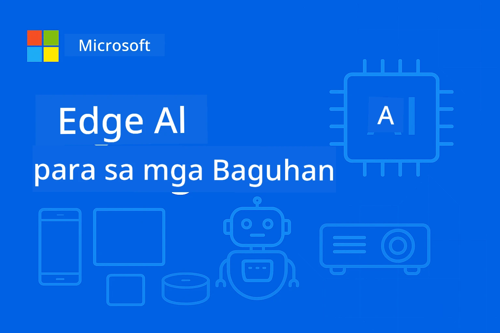

# EdgeAI para sa mga Baguhan 




[](https://GitHub.com/microsoft/edgeai-for-beginners/graphs/contributors)
[](https://GitHub.com/microsoft/edgeai-for-beginners/issues)
[](https://GitHub.com/microsoft/edgeai-for-beginners/pulls)
[](http://makeapullrequest.com)

[](https://GitHub.com/microsoft/edgeai-for-beginners/watchers)
[](https://GitHub.com/microsoft/edgeai-for-beginners/fork)
[](https://GitHub.com/microsoft/edgeai-for-beginners/stargazers)


[](https://discord.gg/nTYy5BXMWG)

Sundin ang mga hakbang na ito upang makapagsimula gamit ang mga pinanggagalingang ito:

1. **I-fork ang Repositoryo**: I-click ang [](https://GitHub.com/microsoft/edgeai-for-beginners/fork)
2. **I-clone ang Repositoryo**:   `git clone https://github.com/microsoft/edgeai-for-beginners.git`
3. [**Sumali sa Azure AI Foundry Discord at makipagkita sa mga eksperto at kapwa developer**](https://discord.com/invite/ByRwuEEgH4)


### 🌐 Suporta sa Maramihang Wika

#### Sinusuportahan sa pamamagitan ng GitHub Action (Awtomatiko at Palaging Napapanahon)

<!-- CO-OP TRANSLATOR LANGUAGES TABLE START -->
[Arabic](../ar/README.md) | [Bengali](../bn/README.md) | [Bulgarian](../bg/README.md) | [Burmese (Myanmar)](../my/README.md) | [Chinese (Simplified)](../zh-CN/README.md) | [Chinese (Traditional, Hong Kong)](../zh-HK/README.md) | [Chinese (Traditional, Macau)](../zh-MO/README.md) | [Chinese (Traditional, Taiwan)](../zh-TW/README.md) | [Croatian](../hr/README.md) | [Czech](../cs/README.md) | [Danish](../da/README.md) | [Dutch](../nl/README.md) | [Estonian](../et/README.md) | [Finnish](../fi/README.md) | [French](../fr/README.md) | [German](../de/README.md) | [Greek](../el/README.md) | [Hebrew](../he/README.md) | [Hindi](../hi/README.md) | [Hungarian](../hu/README.md) | [Indonesian](../id/README.md) | [Italian](../it/README.md) | [Japanese](../ja/README.md) | [Kannada](../kn/README.md) | [Khmer](../km/README.md) | [Korean](../ko/README.md) | [Lithuanian](../lt/README.md) | [Malay](../ms/README.md) | [Malayalam](../ml/README.md) | [Marathi](../mr/README.md) | [Nepali](../ne/README.md) | [Nigerian Pidgin](../pcm/README.md) | [Norwegian](../no/README.md) | [Persian (Farsi)](../fa/README.md) | [Polish](../pl/README.md) | [Portuguese (Brazil)](../pt-BR/README.md) | [Portuguese (Portugal)](../pt-PT/README.md) | [Punjabi (Gurmukhi)](../pa/README.md) | [Romanian](../ro/README.md) | [Russian](../ru/README.md) | [Serbian (Cyrillic)](../sr/README.md) | [Slovak](../sk/README.md) | [Slovenian](../sl/README.md) | [Spanish](../es/README.md) | [Swahili](../sw/README.md) | [Swedish](../sv/README.md) | [Tagalog (Filipino)](./README.md) | [Tamil](../ta/README.md) | [Telugu](../te/README.md) | [Thai](../th/README.md) | [Turkish](../tr/README.md) | [Ukrainian](../uk/README.md) | [Urdu](../ur/README.md) | [Vietnamese](../vi/README.md)

> **Mas gusto mo bang i-clone nang Lokal?**
>
> Kasama sa repositoryo na ito ang mahigit 50 wika na pagsasalin na labis na nagpapalaki ng laki ng pag-download. Para mag-clone nang walang mga pagsasalin, gamitin ang sparse checkout:
>
> **Bash / macOS / Linux:**
> ```bash
> git clone --filter=blob:none --sparse https://github.com/microsoft/edgeai-for-beginners.git
> cd edgeai-for-beginners
> git sparse-checkout set --no-cone '/*' '!translations' '!translated_images'
> ```
>
> **CMD (Windows):**
> ```cmd
> git clone --filter=blob:none --sparse https://github.com/microsoft/edgeai-for-beginners.git
> cd edgeai-for-beginners
> git sparse-checkout set --no-cone "/*" "!translations" "!translated_images"
> ```
>
> Ito ang magbibigay sa iyo ng lahat ng kailangan mo upang matapos ang kurso nang mas mabilis ang pag-download.
<!-- CO-OP TRANSLATOR LANGUAGES TABLE END -->

**Kung nais mo ng karagdagang mga sinusuportahang wikang pagsasalin ay nakalista [dito](https://github.com/Azure/co-op-translator/blob/main/getting_started/supported-languages.md)**
## Panimula

Maligayang pagdating sa **EdgeAI para sa mga Baguhan** – ang iyong komprehensibong paglalakbay sa makabagong mundo ng Edge Artificial Intelligence. Hinihigpit ng kursong ito ang pagitan ng malalakas na kakayahan ng AI at praktikal, totoong mundo na paglalapat sa mga edge device, na nagbibigay kapangyarihan sa iyo upang mapakinabangan ang potensyal ng AI mismo kung saan nalilikha ang data at kailangang gumawa ng mga desisyon.

### Ano ang Iyong Matututuhan

Pinagdaraan ka ng kursong ito mula sa mga batayang konsepto hanggang sa mga implementasyong handa na para sa produksyon, kabilang ang:
- **Small Language Models (SLMs)** na inangkop para sa edge deployment
- **Hardware-aware optimization** sa iba't ibang platform
- **Real-time inference** na may kakayahang pangalagaan ang privacy
- **Production deployment** na mga estratehiya para sa enterprise applications

### Bakit Mahalaga ang EdgeAI

Ang Edge AI ay kumakatawan sa isang paradigm shift na sumasaklaw sa mahahalagang hamon ng modernong panahon:
- **Privacy & Security**: Iproseso ang sensitibong data nang lokal nang hindi inilalantad sa cloud
- **Real-time Performance**: Alisin ang network latency para sa mga aplikasyong kritikal ang oras
- **Cost Efficiency**: Bawasan ang gastos sa bandwidth at cloud computing
- **Resilient Operations**: Panatilihing gumagana kahit may outage sa network
- **Regulatory Compliance**: Tiyakin ang pagsunod sa mga kinakailangan sa data sovereignty

### Edge AI

Ang Edge AI ay tumutukoy sa pagpapatakbo ng mga AI algorithm at mga language model nang lokal sa hardware, malapit sa kung saan nalilikha ang data nang hindi umaasa sa mga cloud resource para sa inference. Pinabababa nito ang latency, pinababuti ang privacy, at pinapayagan ang real-time na paggawa ng desisyon.

### Mga Pangunahing Prinsipyo:
- **On-device inference**: Tumakbo ang AI models sa mga edge device (telepono, router, microcontroller, industrial PC)
- **Offline capability**: Gumagana kahit walang tuloy-tuloy na koneksyon sa internet
- **Low latency**: Agad na tugon na angkop para sa real-time na mga sistema
- **Data sovereignty**: Pinapanatili ang sensitibong data nang lokal, pinapahusay ang seguridad at pagsunod

### Small Language Models (SLMs)

Ang mga SLM tulad ng Phi-4, Mistral-7B, at Gemma ay mga inangkop na bersyon ng mas malalaking LLM—na sinanay o dinaig upang:
- **Bawasan ang memory footprint**: Epektibong paggamit ng limitadong memorya ng edge device
- **Mababang compute demand**: Inangkop para sa CPU at edge GPU performance
- **Mas mabilis na pagsisimula**: Mabilis na initialization para sa mga responsive na aplikasyon

Pinapagana nila ang makapangyarihang kakayahan ng NLP habang tumutugon sa mga limitasyon ng:
- **Embedded systems**: Mga IoT devices at industrial controllers
- **Mobile devices**: Mga smartphone at tablet na may kakayahang offline
- **IoT Devices**: Sensors at smart devices na may limitadong resources
- **Edge servers**: Lokal na processing units na may limitadong GPU resources
- **Personal Computers**: Desktop at laptop deployment scenarios

## Mga Module ng Kurso at Navigasyon

| Module | Paksa | Pokus na Lugar | Pangunahing Nilalaman | Antas | Tagal |
|--------|-------|----------------|----------------------|-------|-------|
| [📖 00 ](./introduction.md) | [Panimula sa EdgeAI](./introduction.md) | Pundasyon at Konteksto | EdgeAI Overview • Industry Applications • SLM Introduction • Learning Objectives | Baguhan | 1-2 oras |
| [📚 01](../../Module01) | [Mga Pangunahing Kaalaman sa EdgeAI](./Module01/README.md) | Paghahambing ng Cloud vs Edge AI | EdgeAI Fundamentals • Real World Case Studies • Implementation Guide • Edge Deployment | Baguhan | 3-4 oras |
| [🧠 02](../../Module02) | [Mga Pundasyon ng SLM Model](./Module02/README.md) | Mga pamilya ng modelo at arkitektura | Phi Family • Qwen Family • Gemma Family • BitNET • μModel • Phi-Silica | Baguhan | 4-5 oras |
| [🚀 03](../../Module03) | [Praktis ng SLM Deployment](./Module03/README.md) | Lokal at cloud deployment | Advanced Learning • Local Environment • Cloud Deployment | Katamtaman | 4-5 oras |
| [⚙️ 04](../../Module04) | [Model Optimization Toolkit](./Module04/README.md) | Cross-platform optimization | Introduction • Llama.cpp • Microsoft Olive • OpenVINO • Apple MLX • Workflow Synthesis | Katamtaman | 5-6 oras |
| [🔧 05](../../Module05) | [SLMOps Production](./Module05/README.md) | Operasyon para sa produksyon | SLMOps Introduction • Model Distillation • Fine-tuning • Production Deployment | Advanced | 5-6 oras |
| [🤖 06](../../Module06) | [AI Agents & Function Calling](./Module06/README.md) | Agent frameworks at MCP | Agent Introduction • Function Calling • Model Context Protocol | Advanced | 4-5 oras |
| [💻 07](../../Module07) | [Pagpapatupad ng Platform](./Module07/README.md) | Mga halimbawa ng cross-platform | AI Toolkit • Foundry Local • Windows Development | Advanced | 3-4 oras |
| [🏭 08](../../Module08) | [Foundry Local Toolkit](./Module08/README.md) | Mga sample na handa para sa produksyon | Mga sample na aplikasyon (tingnan ang mga detalye sa ibaba) | Eksperto | 8-10 oras |

### 🏭 **Module 08: Mga Sample na Aplikasyon**

- [01: REST Chat Quickstart](./Module08/samples/01/README.md)
- [02: OpenAI SDK Integration](./Module08/samples/02/README.md)
- [03: Model Discovery & Benchmarking](./Module08/samples/03/README.md)
- [04: Chainlit RAG Application](./Module08/samples/04/README.md)
- [05: Multi-Agent Orchestration](./Module08/samples/05/README.md)
- [06: Models-as-Tools Router](./Module08/samples/06/README.md)
- [07: Direct API Client](./Module08/samples/07/README.md)
- [08: Windows 11 Chat App](./Module08/samples/08/README.md)
- [09: Advanced Multi-Agent System](./Module08/samples/09/README.md)
- [10: Foundry Tools Framework](./Module08/samples/10/README.md)

### 🎓 **Workshop: Hands-On Learning Path**

Komprehensibong mga materyales ng hands-on workshop na may mga implementasyong handa na para sa produksyon:

- **[Workshop Guide](./Workshop/Readme.md)** - Kumpletong mga layunin sa pag-aaral, resulta, at pag-navigate sa mga pinanggagalingan
- **Python Samples** (6 na sesyon) - Napapanahon at may mga best practice, error handling, at kumpletong dokumentasyon
- **Jupyter Notebooks** (8 interaktibo) - Hakbang-hakbang na mga tutorial na may benchmark at pagsubaybay sa performance
- **Session Guides** - Detalyadong mga markdown guide para sa bawat sesyon ng workshop
- **Validation Tools** - Mga script upang beripikahin ang kalidad ng code at magsagawa ng smoke test

**Ano ang Iyong Bubuoin:**
- Lokal na AI chat applications na may streaming support
- RAG pipelines na may quality evaluation (RAGAS)
- Multi-model benchmarking at paghahambing na mga tool
- Multi-agent orchestration systems
- Matalinong routing ng modelo na batay sa mga task na pinili

### 🎙️ **Workshop For Agentic: Hands-On - The AI Podcast Studio**
Bumuo ng AI-powered na podcast production pipeline mula sa simula! Itinuturo ka ng immersive workshop na ito na lumikha ng kumpletong multi-agent na sistema na nagbabago ng mga ideya sa mga propesyonal na podcast episodes.

**[🎬 Simulan ang AI Podcast Studio Workshop](./WorkshopForAgentic/README.md)**

**Ang Iyong Misyon**: Ilunsad ang "Future Bytes" — isang tech podcast na pinapalakas ng mga AI agent na ikaw mismo ang gagawa. Walang cloud dependencies, walang gastos sa API — lahat ay tumatakbo lokal sa iyong makina.

**Ano ang Natatangi Dito:**
- **🤖 Totoong Multi-Agent Orchestration** - Bumuo ng mga espesyalistang AI agent na nagreresearch, nagsusulat, at gumagawa ng audio
- **🎯 Kumpletong Production Pipeline** - Mula sa pagpili ng paksa hanggang sa huling podcast audio output
- **💻 100% Lokal na Deployment** - Gumagamit ng Ollama at lokal na mga modelo (Qwen-3-8B) para sa buong privacy at kontrol
- **🎤 Text-to-Speech Integration** - I-transform ang mga script sa natural na tunog ng multi-speaker na talakayan
- **✋ Human-in-the-Loop Workflows** - Mga approval gate na nagtitiyak ng kalidad habang pinapanatili ang automation

**Tatlong-Aktong Paglalakbay sa Pagkatuto:**

| Akt | Pokus | Mga Pangunahing Kasanayan | Tagal |
|-----|-------|--------------------------|-------|
| **[Akt 1: Kilalanin ang Iyong AI Assistants](./WorkshopForAgentic/md/01.BuildAIAgentWithSLM.md)** | Bumuo ng iyong unang AI agent | Integrasyon ng tool • Web search • Paglutas ng problema • Agentic reasoning | 2-3 oras |
| **[Akt 2: Tipunin ang Iyong Production Team](./WorkshopForAgentic/md/02.AIAgentOrchestrationAndWorkflows.md)** | Orkestrahin ang maramihang agent | Koordinasyon ng team • Approval workflows • DevUI interface • Pangangalaga ng tao | 3-4 oras |
| **[Akt 3: Buhayin ang Iyong Podcast](./WorkshopForAgentic/md/03.Multi-SpeakerPodcastGenerationWithVibeVoice.md)** | Bumuo ng podcast audio | Text-to-speech • Multi-speaker synthesis • Long-form audio • Buong automation | 2-3 oras |

**Mga Teknolohiyang Ginagamit:**
- **Microsoft Agent Framework** - Multi-agent orchestration at koordinasyon
- **Ollama** - Lokal na AI model runtime (walang kailangan na cloud)
- **Qwen-3-8B** - Open-source na language model na pinahusay para sa agentic na gawain
- **Text-to-Speech APIs** - Natural na synthesis ng boses para sa paggawa ng podcast

**Suporta sa Hardware:**
- ✅ **CPU Mode** - Gumagana sa kahit anong modernong kompyuter (8GB+ RAM ang inirerekomenda)
- 🚀 **GPU Acceleration** - Malaking bilis ng inference gamit ang NVIDIA/AMD GPUs
- ⚡ **NPU Support** - Next-generation neural processing unit acceleration

**Perpekto Para sa:**
- Mga developer na nag-aaral ng multi-agent AI system
- Sinumang interesado sa AI automation at workflows
- Mga tagalikha ng nilalaman na sumusubok ng AI-assisted production
- Mga estudyante na nag-aaral ng praktikal na AI orchestration patterns

**Simulan ang Paggawa**: [🎙️ Ang AI Podcast Studio Workshop →](./WorkshopForAgentic/README.md)

### 📊 **Buod ng Landas sa Pagkatuto**
- **Kabuuang Tagal**: 36-45 na oras
- **Landas para sa Baguhan**: Mga Module 01-02 (7-9 na oras)  
- **Landas para sa Intermediate**: Mga Module 03-04 (9-11 na oras)
- **Landas para sa Advanced**: Mga Module 05-07 (12-15 na oras)
- **Landas para sa Eksperto**: Module 08 (8-10 na oras)

## Ano ang Iyong Bubuuin

### 🎯 Pangunahing Kasanayan
- **Edge AI Architecture**: Disenyo ng lokal-na-una na mga AI system na may cloud integration
- **Model Optimization**: Pag-quantize at compression ng mga modelo para sa edge deployment (85% bilis na pagpapabilis, 75% pagbabawas ng laki)
- **Multi-Platform Deployment**: Windows, mobile, embedded, at cloud-edge hybrid na sistema
- **Production Operations**: Monitoring, scaling, at pagpapanatili ng edge AI sa production

### 🏗️ Praktikal na Mga Proyekto
- **Foundry Local Chat Apps**: Native na Windows 11 na aplikasyon na may model switching
- **Multi-Agent Systems**: Coordinator na may mga specialista na agent para sa mga kumplikadong workflows  
- **RAG Applications**: Lokal na pagproseso ng dokumento gamit ang vector search
- **Model Routers**: Matalinong pagpili sa pagitan ng mga modelo base sa pagsusuri ng gawain
- **API Frameworks**: Production-ready na mga kliyente na may streaming at health monitoring
- **Cross-Platform Tools**: Mga pattern ng integrasyon ng LangChain/Semantic Kernel

### 🏢 Mga Aplikasyon sa Industriya
**Manufacturing** • **Healthcare** • **Autonomous Vehicles** • **Smart Cities** • **Mobile Apps**

## Mabilisang Simula

**Inirerekomendang Landas sa Pag-aaral** (20-30 oras kabuuan):

0. **📖 Panimula** ([Introduction.md](./introduction.md)): Batayan ng EdgeAI + konteksto ng industriya + framework ng pagkatuto
1. **📚 Pundasyon** (Mga Module 01-02): Mga konsepto ng EdgeAI + mga pamilya ng SLM model
2. **⚙️ Optimization** (Mga Module 03-04): Deployment + quantization frameworks  
3. **🚀 Produksyon** (Mga Module 05-06): SLMOps + AI agents + function calling
4. **💻 Implementasyon** (Mga Module 07-08): Mga sample ng platform + Foundry Local toolkit

Bawat module ay may teorya, hands-on na pagsasanay, at ready-to-use na mga code sample para sa production.

## Epekto sa Karera

**Mga Teknikal na Papel**: EdgeAI Solutions Architect • ML Engineer (Edge) • IoT AI Developer • Mobile AI Developer

**Mga Industriya**: Manufacturing 4.0 • Healthcare Tech • Autonomous Systems • FinTech • Consumer Electronics

**Mga Proyektong Portfolio**: Multi-agent systems • Production RAG apps • Cross-platform deployment • Performance optimization

## Istruktura ng Repository

```
edgeai-for-beginners/
├── 📖 introduction.md  # Foundation: EdgeAI Overview & Learning Framework
├── 📚 Module01-04/     # Fundamentals → SLMs → Deployment → Optimization  
├── 🔧 Module05-06/     # SLMOps → AI Agents → Function Calling
├── 💻 Module07/        # Platform Samples (VS Code, Windows, Jetson, Mobile)
├── 🏭 Module08/        # Foundry Local Toolkit + 10 Comprehensive Samples
│   ├── samples/01-06/  # Foundation: REST, SDK, RAG, Agents, Routing
│   └── samples/07-10/  # Advanced: API Client, Windows App, Enterprise Agents, Tools
├── 🌐 translations/    # Multi-language support (8+ languages)
└── 📋 STUDY_GUIDE.md   # Structured learning paths & time allocation
```

## Mga Tampok sa Kurso

✅ **Progressive Learning**: Teorya → Praktika → Production deployment  
✅ **Totoong Case Studies**: Microsoft, Japan Airlines, mga implementasyon sa negosyo  
✅ **Hands-on Samples**: 50+ na halimbawa, 10 kumpletong Foundry Local demos  
✅ **Performance Focus**: 85% na pagpapabuti sa bilis, 75% pagbabawas ng laki  
✅ **Multi-Platform**: Windows, mobile, embedded, cloud-edge hybrid  
✅ **Production Ready**: Monitoring, scaling, seguridad, compliance frameworks

📖 **[Available na Gabay sa Pag-aaral](STUDY_GUIDE.md)**: May istrukturang 20-oras na landas sa pagkatuto na may gabay sa alokasyon ng oras at mga tool sa self-assessment.

---

**Ang EdgeAI ay kinakatawan ang hinaharap ng AI deployment**: lokal-na-una, nagpapahalaga sa privacy, at epektibo. Masterin ang mga kasanayang ito upang bumuo ng susunod na henerasyon ng mga intelligent na aplikasyon.

## Iba Pang Mga Kurso

Gumagawa rin ang aming koponan ng iba pang mga kurso! Tingnan ang:

<!-- CO-OP TRANSLATOR OTHER COURSES START -->
### LangChain
[](https://aka.ms/langchain4j-for-beginners)
[](https://aka.ms/langchainjs-for-beginners?WT.mc_id=m365-94501-dwahlin)
[](https://github.com/microsoft/langchain-for-beginners?WT.mc_id=m365-94501-dwahlin)
---

### Azure / Edge / MCP / Agents
[](https://github.com/microsoft/AZD-for-beginners?WT.mc_id=academic-105485-koreyst)
[](https://github.com/microsoft/edgeai-for-beginners?WT.mc_id=academic-105485-koreyst)
[](https://github.com/microsoft/mcp-for-beginners?WT.mc_id=academic-105485-koreyst)
[](https://github.com/microsoft/ai-agents-for-beginners?WT.mc_id=academic-105485-koreyst)

---
 
### Generative AI Series
[](https://github.com/microsoft/generative-ai-for-beginners?WT.mc_id=academic-105485-koreyst)
[-9333EA?style=for-the-badge&labelColor=E5E7EB&color=9333EA)](https://github.com/microsoft/Generative-AI-for-beginners-dotnet?WT.mc_id=academic-105485-koreyst)
[-C084FC?style=for-the-badge&labelColor=E5E7EB&color=C084FC)](https://github.com/microsoft/generative-ai-for-beginners-java?WT.mc_id=academic-105485-koreyst)
[-E879F9?style=for-the-badge&labelColor=E5E7EB&color=E879F9)](https://github.com/microsoft/generative-ai-with-javascript?WT.mc_id=academic-105485-koreyst)

---
 
### Core Learning
[](https://aka.ms/ml-beginners?WT.mc_id=academic-105485-koreyst)
[](https://aka.ms/datascience-beginners?WT.mc_id=academic-105485-koreyst)
[](https://aka.ms/ai-beginners?WT.mc_id=academic-105485-koreyst)
[](https://github.com/microsoft/Security-101?WT.mc_id=academic-96948-sayoung)
[](https://aka.ms/webdev-beginners?WT.mc_id=academic-105485-koreyst)
[](https://aka.ms/iot-beginners?WT.mc_id=academic-105485-koreyst)
[](https://github.com/microsoft/xr-development-for-beginners?WT.mc_id=academic-105485-koreyst)

---
 
### Copilot Series
[](https://aka.ms/GitHubCopilotAI?WT.mc_id=academic-105485-koreyst)
[](https://github.com/microsoft/mastering-github-copilot-for-dotnet-csharp-developers?WT.mc_id=academic-105485-koreyst)
[](https://github.com/microsoft/CopilotAdventures?WT.mc_id=academic-105485-koreyst)
<!-- CO-OP TRANSLATOR OTHER COURSES END -->

## Paghingi ng Tulong

Kung ikaw ay nahirapan o may mga tanong tungkol sa paggawa ng mga AI na app, sumali sa:

[](https://discord.gg/nTYy5BXMWG)

Kung mayroon kang puna tungkol sa produkto o mga error habang gumagawa, bisitahin ang:

[](https://aka.ms/foundry/forum)

---

<!-- CO-OP TRANSLATOR DISCLAIMER START -->
**Pagtatakwil**:  
Ang dokumentong ito ay isinalin gamit ang serbisyo ng AI translation na [Co-op Translator](https://github.com/Azure/co-op-translator). Habang nagsusumikap kami para sa katumpakan, pakatandaan na ang mga awtomatikong pagsasalin ay maaaring maglaman ng mga pagkakamali o di-tumpak na impormasyon. Ang orihinal na dokumento sa orihinal nitong wika ang dapat ituring na pangunahing sanggunian. Para sa mga mahalagang impormasyon, inirerekomenda ang propesyonal na pagsasalin ng tao. Hindi kami mananagot sa anumang hindi pagkakaunawaan o maling interpretasyon na nagmula sa paggamit ng pagsasaling ito.
<!-- CO-OP TRANSLATOR DISCLAIMER END -->