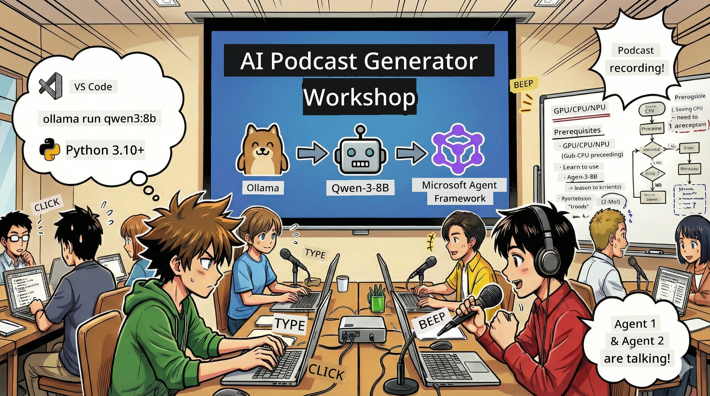
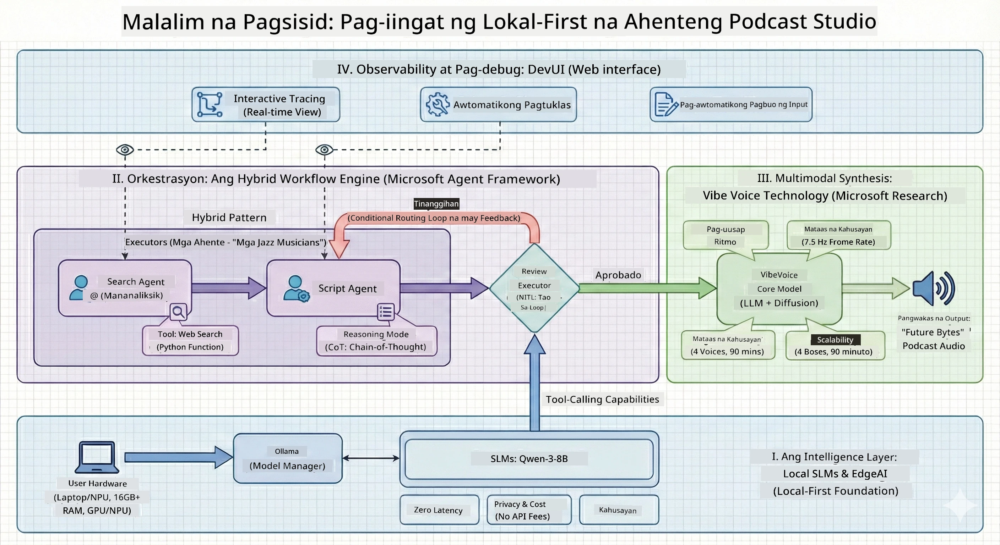

<!--
CO_OP_TRANSLATOR_METADATA:
{
  "original_hash": "f94e745264597bc5d8df967ead2eff97",
  "translation_date": "2026-01-05T10:47:32+00:00",
  "source_file": "WorkshopForAgentic/README.md",
  "language_code": "tl"
}
-->
# 🎙️ The AI Podcast Studio Workshop

> 🌏 [中文版 (Chinese Version)](translation/zh-cn/README.md)



## Your Mission

Maligayang pagdating sa **The AI Podcast Studio**! Maglulunsad ka ng sarili mong tech podcast na tinatawag na "Future Bytes" — pero may twist: gagawa ka ng isang AI-powered production team para tulungan kang likhain ito. Wala nang walang katapusang oras ng pananaliksik, pagsusulat ng script, at pag-e-edit ng audio. Sa halip, gagamit ka ng code para maging podcast producer na may AI superpowers.

## The Story

Isipin ito: Gusto mong magsimula ng podcast tungkol sa mga pinakabagong tech trends kasama ang mga kaibigan mo, pero lahat ay abala sa eskwela, trabaho, o buhay lang. Paano kung makakagawa ka ng team ng mga AI agents para gawin ang mabibigat na gawain? Isang agent ang magsasaliksik ng mga paksa, isa ang gagawa ng mga kawili-wiling script, at isa pa ang gagawa ng mga teksto na parang natural na usapan. Mukhang sci-fi? Gawin natin itong realidad.

## What You'll Learn

Sa pagtatapos ng workshop na ito, malalaman mo kung paano:
- 🤖 Mag-deploy ng sarili mong local AI model (walang bayad sa API, walang cloud dependency!)
- 🔧 Gumawa ng mga specialized AI agents na talagang nagtutulungan
- 🎬 Lumikha ng kompletong podcast production pipeline mula ideya hanggang audio

## Your Journey: Three Acts



Tulad ng magandang kwento, may tatlong acts tayo. Bawat isa ay bubuo ng iyong AI podcast studio nang paunti-unti:

| Episode | Your Quest | What Happens | Skills Unlocked |
|---------|-----------|--------------|----------------|
| **Act 1** | [Meet Your AI Assistants](md/01.BuildAIAgentWithSLM.md) | Malalaman mo kung paano gumawa ng AI agents na kaya makipag-chat, maghanap sa web, at magsolve ng problema. Parang mga research intern mo na hindi natutulog. | 🎯 Gumawa ng unang agent<br>🛠️ Bigyan ito ng superpowers (tools!)<br>🧠 Turuan itong mag-isip<br>🌐 Ikonekta ito sa internet |
| **Act 2** | [Assemble Your Production Team](md/02.AIAgentOrchestrationAndWorkflows.md) | Ngayon ay magiging mas kapanapanabik! I-o-orchestrate mo ang maraming AI agents para magtrabaho nang parang totoong podcast team. Isa ang magsasaliksik, isa ang magsusulat, ikaw ang mag-aapprove — teamwork ang susi. | 🎭 I-coordinate ang maraming agents<br>🔄 Gumawa ng approval workflows<br>🖥️ Subukan gamit ang DevUI interface<br>✋ Panatilihin ang kontrol ng tao |
| **Act 3** | [Bring Your Podcast to Life](md/03.Multi-SpeakerPodcastGenerationWithVibeVoice.md) | Ang finale! Gawing podcast audio na may realistic na mga boses at natural na usapan ang iyong mga text script. Handa na ang iyong "Future Bytes" podcast! | 🎤 Text-to-speech magic<br>👥 Maramihang speaker voices<br>⏱️ Long-form audio<br>🚀 Buong automation |

Bawat act ay magbubukas ng bagong kakayahan. Pwede kang mag-skip kung matapang ka, pero inirerekomenda naming sundan ang kwento!

## Environment Requirements

Sinusuportahan ng workshop na ito ang iba't ibang hardware environment:
- **CPU**: Akma para sa pagsubok at maliit na paggamit
- **GPU**: Rekomendado para sa production environments, malaki ang bilis ng inference na napapabuti
- **NPU**: Sinusuportahan ang next-generation neural processing unit acceleration

## What You'll Need

### Software Checklist ✅
- **Python 3.10+** (Ang wika mo sa pag-code)
- **Ollama** (Nagpapatakbo ng AI models sa iyong makina)
- **VS Code** (Ang iyong code editor)
- **Python Extension** (Ginagawang mas matalino ang VS Code)
- **Git** (Para kuhanin ang code)

### Hardware Check 💻
- **Kakayanin ko ba ito patakbuhin?**: 8GB RAM, 10GB libreng space (gumagana, pero maaaring mabagal)
- **Ideal setup**: 16GB+ RAM, magandang GPU (maayos ang takbo!)
- **May NPU?**: Mas maganda! Na-access ang next-gen performance 🚀

## Setup Your Studio 🎬

### Step 1: Python Power-Up

Siguraduhing may Python 3.10 o mas bago ka:

```bash
python --version
# Dapat ipakita ang Python 3.10.x o mas mataas pa
```

Walang Python? I-download mula sa [python.org](https://python.org) — libre ito!

### Step 2: Get Ollama (Your AI Model Runner)

Pumunta sa [ollama.ai](https://ollama.ai) at i-download ang Ollama para sa iyong OS. Isipin mo itong makina na nagpapatakbo ng iyong AI models lokal.

Suriin kung handa na:

```bash
ollama --version
```

### Step 3: Download Your AI Brain 🧠

Panahon na para kunin ang Qwen-3-8B model (parang pagkuha ng unang AI assistant mo):

```bash
ollama pull qwen3:8b
```

*Maaaring ilang minuto ito. Perfect na panahon para magpahinga at uminom ng kape! ☕*

### Step 4: Set Up VS Code

I-download ang [Visual Studio Code](https://code.visualstudio.com/) kung wala ka pa nito. Ito ang pinakamahusay na code editor (labahin mo ako 😄).

### Step 5: Python Extension

Sa VS Code:
1. Pindutin ang `Ctrl+Shift+X` (o `Cmd+Shift+X` sa Mac)
2. Hanapin ang "Python"
3. I-install ang opisyal na Microsoft Python extension

### Step 6: You're All Set! 🎉

Seryoso, handa ka na. Simulan na natin ang pagbuo ng AI magic!

### Step 7: Install Microsoft Agent Framework and Related Packages 📦

I-install lahat ng kinakailangang dependencies para sa workshop:

```bash
pip install -r ./Installations/requirements.txt -U
```

*Ii-install nito ang Microsoft Agent Framework at lahat ng kailangang packages. Magkape habang naghihintay — unang setup ay maaaring tumagal ng ilang minuto! ☕*

## Workshop Instructions

Ipapaliwanag nang detalyado ang project structure, configuration steps, at mga paraan ng pagpapatupad sa bawat hakbang ng workshop.

## Troubleshooting (When Things Go Wrong) 🔧

### "Ugh, ang tagal ng pag-download ng model!"
**Ayusin**: Gumamit ng VPN o i-configure ang Ollama gamit ang mirror source. Minsan ay ayaw lang tayo ng internet.

### "Nangingina ang computer ko! Wala nang memory!"
**Ayusin**: Lumipat sa mas maliit na model o baguhin ang `num_ctx` setting para gumamit ng mas kaunting memorya. Parang ipinadadiet mo ang AI mo.

### "Puwede ko bang pabilisin ito gamit ang GPU ko?"
**Ayusin**: Auto-detect ng Ollama ang GPUs! Siguraduhing up-to-date ang mga GPU drivers mo. Libre ang boost sa bilis! 🏎️

## Extra Resources (For the Curious) 📚

- [Ollama Docs](https://github.com/ollama/ollama) — Malalim na pag-aaral sa local AI models
- [Microsoft Agent Framework](https://microsoft.github.io/autogen/) — Alamin pa ang tungkol sa paggawa ng agent teams
- [Qwen Model Info](https://qwenlm.github.io/) — Kilalanin ang utak ng iyong AI assistant

## License

MIT License — Gumawa ng mga cool na bagay, ibahagi ito, pagandahin ang mundo! 🌍

## Want to Contribute?

Nakakita ng bug? May ideya? Mag-drop ng Issue o PR! Gustung-gusto namin ang community vibes. ✨

---

<!-- CO-OP TRANSLATOR DISCLAIMER START -->
**Paunawa**:  
Ang dokumentong ito ay isinalin gamit ang AI translation service na [Co-op Translator](https://github.com/Azure/co-op-translator). Bagaman nagsusumikap kami para sa katumpakan, pakatandaan na ang awtomatikong pagsasalin ay maaaring maglaman ng mga pagkakamali o hindi pagkakatugma. Ang orihinal na dokumento sa orihinal nitong wika ang dapat ituring na pangunahing sanggunian. Para sa mahahalagang impormasyon, inirerekomenda ang propesyonal na pagsasalin ng tao. Hindi kami mananagot sa anumang hindi pagkakaintindihan o maling interpretasyon na nagmumula sa paggamit ng pagsasaling ito.
<!-- CO-OP TRANSLATOR DISCLAIMER END -->