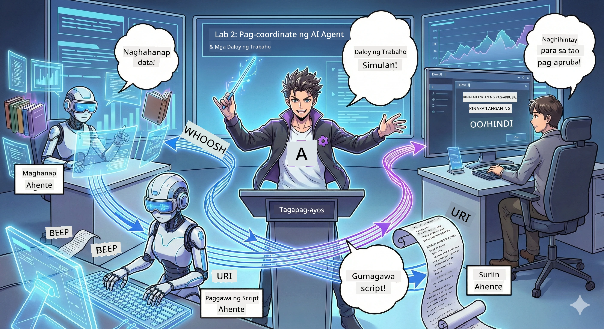

# Act 2: Buuhin ang Iyong Podcast Production Team 🎬



## Lalong Sumisikip ang Kwento

Si Alex (ang iyong AI assistant mula sa Act 1) ay kahanga-hanga, pero isang agent lang ay hindi kayang patakbuhin ang buong podcast studio. Kailangan mo ng *koponan*:
- 🔍 **Research Agent**: Naghahanap sa internet ng sariwang impormasyon
- ✍️ **Script Agent**: Ginagawang kapanapanabik na usapan ang mga research
- 👤 **Ikaw (Ang Editor)**: Inaprubahan ang mga script o ibinabalik para baguhin

Maligayang pagdating sa **AI Agent Orchestration** — kung saan ikaw ang magiging direktor ng sarili mong AI crew. Parang Avengers, pero para sa podcast production.

## Ano ang Agent Orchestration? (Ang Simpleng Bersyon)

Isipin mong nagpapatakbo ka ng isang restaurant. Hindi mo ba ginagawa lahat mag-isa? Meron kang:
- 🍳 Isang chef na nagluluto
- 👨‍🍳 Isang sous chef na naghahanda
- 👩‍🍳 Isang server na naghahatid

Ganun din ang agent orchestration, pero gamit ang AI. Bawat agent ay may espesyalisasyon, at ikaw ang nagkokordinado sa kanila upang makamit ang mas malalaking layunin. Walang isang agent na sobra ang trabaho, at mas mabilis ang pagkakatapos ng gawain.

### Ang Analohiya ng Banda 🎸

Ang iyong mga AI agents ay parang isang banda:
- **Lead singer**: Ang pangunahing agent na humahawak ng mga gawain para sa customer
- **Drummer**: Nagpapanatili ng ritmo, humahawak ng background processing  
- **Bass player**: Sumusuporta sa lahat, kumukuha ng data
- **Ikaw (Band Manager)**: Nagkokoordina sa lahat!

Kung walang koordinasyon? Ingay lang. Kung may orchestration? Magandang musika.

### Bakit Mahalaga Ito

Isang AI agent na sinusubukang gawin lahat = pagkasunog ng utak. Mga specialized agents na nagtutulungan = bukas na kahusayan! 🚀

**Totoong Kwento**: Natatandaan mo ba nung sinubukan mong mag-research, magsulat, AT mag-edit ng iyong podcast mag-isa? Oo, ang hirap niyan. Sa orchestration, bawat agent ay humahawak ng kaya nilang gawin. Ikaw lang ang gumagawa ng huling desisyon.

**Halimbawa sa Totoong Mundo**: Mga customer support bots na alam kung kailan maghahandle ng billing, tech issues, o kailan tatawagan ang tao. Iyon ang orchestration!

## Agent vs. Workflow: Ano ang Pagkakaiba?

Isipin mo ito:

### 🤖 AI Agent = Jazz Musician
- **Gumagawa ng desisyon nang biglaan** base sa naririnig
- **Nag-iimprovise** ng solusyon gamit ang mga tools niya
- **Naga-isip** gamit ang utak na LLM
- **Aayusin** ang sarili ayon sa mga ibinibigay mong input

### 🎵 Workflow = Orchestra na Tumutugtog ng Classical Music  
- **Sumusunod sa score** (mga hakbang na nakatakda)
- **Predictable** na daloy ng gawain
- **Nagkokoordina** ng maraming agents, tao, at sistema
- **May istruktura** tulad ng recipe

**Ang Magic**: Ang workflows ay *nagsasaayos* ng mga agents! Gumagawa ka ng workflow na nagsasabing kailan maglalaro ang bawat agent. Pinagsamang ganda ng dalawa. 🎭

## Tatlong Paraan para Kordinahin ang Iyong AI Crew

### 1. 🎯 Centralized (Ikaw ang Boss)

Isang pangunahing agent ang nagtatakda ng lahat. Parang ikaw ang manager ng team — ikaw ang nagdedesisyon kung sino ang gagawa ng ano at kailan.

**Mga Bentahe**:
- ✅ Malinaw na pamumuno (walang kalituhan)
- ✅ Konsistenteng desisyon
- ✅ Madaling i-debug

**Gamitin para sa**:
- Routing sa customer service ("Ito ba ay billing o tech support?")
- Workflow ng content approval ("Pumasa ba ang script?")
- Podcast production (gaya ng ginagawa natin!)

### 2. 🤝 Decentralized (Agents ang Nag-aayos)

Direkta ang usapan ng mga agents at inaayos ang mga bagay-bagay bilang grupo. Parang group chat kung saan lahat ay nagkokoordina.

**Mga Bentahe**:
- ✅ Madaling mag-scale (dagdag pa ng agents kahit kailan)
- ✅ Walang iisang punto ng pagkabigo
- ✅ Natural na pagtutulungan ng mga agents

**Gamitin para sa**:
- Mga research teams (bawat agent ay nag-eexplore sa iba't ibang sources)
- Brainstorming sessions
- Distributed problem-solving

### 3. 🔀 Hybrid (Pinagsamang Kagandahan)

Ikaw ang nagtatakda ng direksyon, pero may kalayaan ang mga agents na mag-ayos sa kanilang mga gawain. Parang CEO na nagtitiwala sa team niya.

**Perpekto para sa**: Mga komplikadong proyekto na kailangan parehong kontrol at kakayahang mag-flex.

## Microsoft Agent Framework: Ang Iyong Orchestration Toolkit 🧰

Oras na para bumuo! Ito ang gagamitin mo:

### Ang Mga Pangunahing Bahagi

#### 1. 🧱 Executors (Ang mga Trabahador Mo)
- **Ano sila**: Mga indibidwal na processing units — maaaring agents o custom na logic
- **Ano ang ginagawa nila**: Tumanggap ng input, magtrabaho, at maglabas ng output
- **Isipin sila bilang**: Mga istasyon sa assembly line

#### 2. ➡️ Edges (Ang Mga Koneksyon)
- **Ano sila**: Mga daan sa pagitan ng executors
- **Ano ang ginagawa nila**: Kinokontrol ang daloy ng mensahe ("Pagkatapos ng A, pumunta sa B")
- **Isipin sila bilang**: Mga palaso sa flowchart

#### 3. 🗺️ Workflows (Ang Pangunahing Plano)
- **Ano sila**: Kumpletong graph ng executors + edges
- **Ano ang ginagawa nila**: Nagde-define ng buong proseso mula simula hanggang matapos
- **Isipin sila bilang**: Blueprint ng iyong production pipeline

### Mga Cool na Tampok na Magugustuhan Mo

**🛡️ Type Safety**: Binubusisi ang uri ng mga mensahe sa pagitan ng agents. Walang "Oops, maling data type" na surpresa.

**🔀 Flexible Routing**: 
- If-then na kondisyon ("Kung aprobado, i-publish; kung hindi, i-rewrite")
- Parallel processing (maraming agents ang nagtatrabaho sabay)
- Dynamic na mga daan (ang workflow ay nag-aadjust ayon sa resulta)

**🔌 External Integration**:
- Kumonekta sa mga API
- Magdagdag ng human-in-the-loop checkpoints (ika-apruba bago mag-publish)
- Gumawa ng mga request/response flows

**💾 Checkpointing**: I-save ang progreso! Kung may bumagsak na proseso, magpapatuloy mula sa huling saglit.

**🤝 Multi-Agent Coordination**:
- Patakbuhin ang mga agents sunod-sunod (A → B → C)
- Patakbuhin silang sabay-sabay (A + B + C nang sabay)
- Ipalipat-lipat ang mga gawain sa pagitan ng mga agents
- Collaborative processing

## Best Practices (Mga Pro Tips) 🎯

### 1. Panatilihing Modular
Dapat bawat agent ay gawin nang talagang mahusay ang ISANG bagay. Huwag gumawa ng "super agent" na lahat ng gawain ay kaya — pagsisihan mo sa pag-debug.

### 2. Magplano Para sa Mga Pagkakamali
Nagkakamali ang mga agents. Nagkakaroon ng problema ang network. Maglagay ng error handling at backup na mga plano. Magpapasalamat ang iyong sarili sa hinaharap.

### 3. I-monitor Lahat ng Gawin
Subaybayan kung ano ang ginagawa ng mga agents mo. Gamitin ang DevUI (tatalakayin natin ito!) para makita ang workflows habang tumatakbo.

### 4. I-optimize ang Laki ng Mensahe
Huwag magpadala ng malalaking file sa pagitan ng mga agents. Panatilihing magaan at mabilis ang mga mensahe.

### 5. Piliin ang Tamang Pattern
Kailangan ng kontrol? Centralized. Kailangan ng scale? Decentralized. Hindi makapili? Hybrid!

## DevUI: Ang Iyong Workflow Debugger 🔍

### Ano ang DevUI?

Ang DevUI ay parang playground para subukan ang iyong mga agents at workflows. Isang web interface kung saan maaari kang:
- 👀 Manood ng workflow habang gumagana
- 💬 Makipag-chat direkta sa mga agents
- 🔍 Mag-debug kapag may mali
- 📊 Makita ang mga trace at performance metrics

> **Mahalaga**: Para lang sa development ang DevUI! Huwag gamitin sa production. Isipin ito bilang iyong lokal na testing environment.

### Ano ang Gawing Kahanga-hanga Nito

- **🖥️ Interactive Web UI**: Pindutin, isulat, subukan — hindi kailangan ng command line
- **📁 Drag-and-Drop Ready**: Mag-upload ng files, subukan gamit ang iba't ibang inputs
- **📂 Auto-Discovery**: I-point ito sa folder, awtomatiko nitong hahanapin lahat ng iyong agents
- **📋 No-Setup Mode**: Irehistro ang mga agents sa code, hindi kailangan ng folder structure
- **🔌 Compatible sa OpenAI**: Gumagana kasama ang OpenAI SDK (compatibility FTW!)
- **👁️ Built-in Tracing**: Makita mo eksakto kung ano ang ginagawa ng mga agents mo

### Paano Gumagana ang Input

Matalino ang DevUI tungkol sa inputs:

- **Tinetest ang Agents?** Makakakita ka ng text boxes at mga pindutan para mag-upload ng file
- **Tinetest ang Workflows?** Awtonomong ginagawa ng UI ang mga input fields base sa inaasahan ng workflow mo

Parang mahika, pero mabuting code lang talaga. ✨

## Iyong Mga Misyon: Bumuo ng Podcast Studio 🎬

### Mission 1: Gumawa ng Isang Agent gamit ang DevUI

📂 [01.AgentDevUI](../../../../WorkshopForAgentic/code/02.Workflow/01.AgentDevUI)

**Ang Hamon**: Bago bumuo ng buong koponan, subukan muna ang DevUI gamit ang isang agent: isang web search specialist.

**Ano ang Iyong Binuo**:
Isang research agent na makakapaghahanap sa internet ng mga paksa para sa podcast. Susubukan mo ito gamit ang web interface ng DevUI sa `http://localhost:8090`.

**Mga Kakayahang Matutunan**:
- 🚀 Paglulunsad ng agents sa DevUI
- 🔍 Pagsusuri ng tugon ng agent nang real-time
- 🛠️ Paggawa ng custom tools (web search)
- 📊 Pag-enable ng tracing para mag-debug
- 🖥️ Paggamit ng interactive web UI

**Ang Code**:
- `agent.py`: Ang SearchAgent mo na may superpowers sa web search
- Gumagamit ng OllamaChatClient para kumonekta sa Qwen
- Nagpapatupad ng `web_search()` na tool function
- Naglulunsad gamit ang `serve()` — awtomatikong binubuksan ang DevUI

**Kondisyon para Manalo**: Tanungin ang agent mo ng "Ano ang trending sa AI?" at panoorin itong maghanap sa web! 🎉

### Mission 2: Bumuo ng Multi-Agent Workflow

📂 [02.WorkflowDevUI](../../../../WorkshopForAgentic/code/02.Workflow/02.WorkflowDevUI)

**Ang Hamon**: Ngayon, magsimula na ng totoong saya! Bumuo ng kompletong podcast production workflow gamit ang:
1. 🔍 **Search Agent** → Nagre-research ng paksa mo
2. ✍️ **Script Agent** → Nagsusulat ng diyalogo sa pagitan ng dalawang host (nagsusulat sa Chinese!)
3. 👤 **Review Executor** → Nagtatanong SA IYO kung aaprubahan o tatanggihan
4. 🔄 **Loop Back** → Kapag tinanggihan, nire-rewrite base sa feedback mo

**Mga Kakayahang Matutunan**:
- 🧱 Paggawa ng specialized agents para sa iba't ibang trabaho
- 🔗 Pagkonekta ng agents gamit ang WorkflowBuilder
- 🔀 Paggamit ng loops ng approval (human-in-the-loop!)
- 🚦 Conditional routing (kung aprobado vs. tinanggihan)
- 🔧 Paggawa ng custom executors para sa business logic

**Ang Workflow**:
```
SearchAgent → ScriptAgent → ReviewExecutor
                             ↑          ↓ (if rejected)
                             ←─────────
```
  
**Ang Code**:
- `search_agent/agent.py`: Ang research specialist mo
- `generate_script_agent/agent.py`: Ang scriptwriter mo (nagsusulat sa Chinese!)
- `workflow/workflow.py`: Dito nangyayari ang magic ng orchestration
- `main.py`: Naglulunsad ng lahat sa DevUI

**Kondisyon para Manalo**: Magbigay ng paksa, suriin ang script, tanggihan ito isang beses para subukan ang loop, pagkatapos ay aprubahan! 🎉

### Mission 3: Gumawa ng Console App

📂 [03.Application](../../../../WorkshopForAgentic/code/02.Workflow/03.Application)

**Ang Hamon**: Kunin ang workflow mo mula sa DevUI at gawing isang sleek na terminal app na may kulay na output, loading spinners, at pag-save ng file. Ito ay handa na para sa production!

**Mga Kakayahang Matutunan**:
- ⚡ Pagpapatakbo ng workflows programmatically (walang DevUI)
- 📡 Event-driven architecture na may streaming
- 🎨 Gumawa ng magagandang terminal UIs (kulay, spinners, progress bars)
- 💾 Pagsave ng huling script sa file
- 🔄 Pag-handle ng async workflows gamit ang Python asyncio

**Mga Ginagawa**:
1. Tatanungin ka ng paksa para sa podcast
2. Ipapakita ang progreso ng real-time ("Search Agent is working...")
3. Ipapakita ang nalikhang script gamit ang kulay
4. Tatanungin kung aaprubahan mo
5. Isi-save ang aprubadong script sa `podcast.txt`

**Ang Code**:
- `podcast_app.py`: Ang pangunahing app mo na may event handling
- `workflow.py`: Ginagamit muli ang workflow mula sa Mission 2
- Nagha-handle ng mga events: `AgentRunUpdateEvent`, `RequestInfoEvent`, `WorkflowOutputEvent`
- Gumagamit ng ANSI colors para sa terminal styling

**Kondisyon para Manalo**: Patakbuhin ang app, gumawa ng podcast script, at tingnan itong na-save! Nakabuo ka ng tunay na tool. 🚀

## Mga Natutunan Mo na 🏆

Pagkatapos ng Act 2, kaya mo nang:

- ✅ Mag-orchestrate ng maraming AI agents na parang boss
- ✅ Bumuo ng workflows na may sunud-sunod AT conditional na lohika
- ✅ Magdagdag ng human approval checkpoints
- ✅ Gumamit ng DevUI para subukan at i-debug ang workflows
- ✅ Lumikha ng production-ready na console applications
- ✅ Ayusin nang maayos ang mga error sa kumplikadong sistema
- ✅ Pumili ng tamang orchestration pattern para sa anumang proyekto

## Kapag May Sira 🔧

### "Masyadong komplikado ang workflow ko!"
**Solusyon**: Hatiin ito sa mas maliit na sub-workflows. Dapat isang bagay lang ang ginagawa ng bawat workflow nang mahusay. I-chain sila kung kailangan.

### "Hindi ko masubaybayan ang nangyayari!"
**Solusyon**: Gamitin ang workflow checkpointing para i-save ang estado. I-enable ang tracing sa DevUI para makita ang bawat hakbang.

### "Isang error ng agent, bumabagsak ang lahat!"
**Solusyon**: Maglagay ng error boundaries. Dapat harapin ng bawat agent ang sarilinya nilang mga pagkakamali at may fallback na kilos.

### "Ang bagal nito"
**Solusyon**: May mga agents bang puwedeng patakbuhin sabay-sabay? Madaling gawin ang sequential workflows pero mabagal. Hanapin ang pagkakataon para sa parallelization!

## Mga Kapaki-Pakinabang na Resources 🔗

- [Workflow Docs](https://learn.microsoft.com/en-us/agent-framework/user-guide/workflows/overview) — Opisyal na mga gabay ng Microsoft  
- [Orchestration Patterns](https://www.ibm.com/think/topics/ai-agent-orchestration) — Paliwanag ng IBM tungkol dito  
- [Agent Framework GitHub](https://github.com/microsoft/agent-framework) — Tingnan ang source code
- [Mga Halimbawa ng Code](https://github.com/microsoft/agent-framework/tree/main/python/samples) — Mangopya ng mga pattern dito

---

**Handa ka na ba para sa pagtatapos?** Nakuha mo na ang iyong script. Ngayon gawing tunog na ito! → [Act 3: Ipasigla ang Iyong Podcast](03.Multi-SpeakerPodcastGenerationWithVibeVoice.md) 🎤

---

**Nakanganga? Nalilito? Nasasabik?** Ibahagi sa chat ng workshop! Sabay-sabay tayong natututo. 🚀

---

<!-- CO-OP TRANSLATOR DISCLAIMER START -->
**Pagsasaalang-alang**:  
Ang dokumentong ito ay naisalin gamit ang serbisyo ng AI na pagsasalin na [Co-op Translator](https://github.com/Azure/co-op-translator). Bagamat aming pinagsusumikapang maging tumpak, pakatandaan na ang mga awtomatikong pagsasalin ay maaaring maglaman ng mga pagkakamali o di-tumpak na impormasyon. Ang orihinal na dokumento sa orihinal nitong wika ang dapat ituring na opisyal na pinagmulan. Para sa mga mahahalagang impormasyon, inirerekomenda ang propesyonal na pagsasaling-tao. Hindi kami mananagot sa anumang hindi pagkakaunawaan o maling interpretasyon na maaaring magmula sa paggamit ng pagsasaling ito.
<!-- CO-OP TRANSLATOR DISCLAIMER END -->