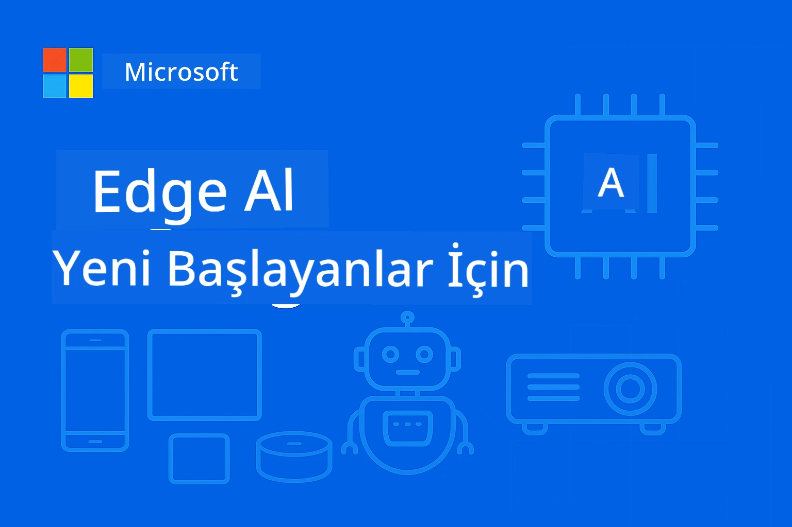

# Başlangıç için EdgeAI 




[](https://GitHub.com/microsoft/edgeai-for-beginners/graphs/contributors)
[](https://GitHub.com/microsoft/edgeai-for-beginners/issues)
[](https://GitHub.com/microsoft/edgeai-for-beginners/pulls)
[](http://makeapullrequest.com)

[](https://GitHub.com/microsoft/edgeai-for-beginners/watchers)
[](https://GitHub.com/microsoft/edgeai-for-beginners/fork)
[](https://GitHub.com/microsoft/edgeai-for-beginners/stargazers)


[](https://discord.gg/nTYy5BXMWG)

Bu kaynakları kullanmaya başlamak için şu adımları izleyin:

1. **Depoyu Çatallayın**: Tıklayın [](https://GitHub.com/microsoft/edgeai-for-beginners/fork)
2. **Depoyu Klonlayın**:   `git clone https://github.com/microsoft/edgeai-for-beginners.git`
3. [**Azure AI Foundry Discord'a Katılın ve uzmanlar ve diğer geliştiricilerle tanışın**](https://discord.com/invite/ByRwuEEgH4)


### 🌐 Çok Dilli Destek

#### GitHub Action ile Desteklenir (Otomatik & Her Zaman Güncel)

<!-- CO-OP TRANSLATOR LANGUAGES TABLE START -->
[Arapça](../ar/README.md) | [Bengalce](../bn/README.md) | [Bulgarca](../bg/README.md) | [Burmaca (Myanmar)](../my/README.md) | [Çince (Basitleştirilmiş)](../zh-CN/README.md) | [Çince (Geleneksel, Hong Kong)](../zh-HK/README.md) | [Çince (Geleneksel, Makao)](../zh-MO/README.md) | [Çince (Geleneksel, Tayvan)](../zh-TW/README.md) | [Hırvatça](../hr/README.md) | [Çekçe](../cs/README.md) | [Danca](../da/README.md) | [Flemenkçe](../nl/README.md) | [Estonca](../et/README.md) | [Fince](../fi/README.md) | [Fransızca](../fr/README.md) | [Almanca](../de/README.md) | [Yunanca](../el/README.md) | [İbranice](../he/README.md) | [Hintçe](../hi/README.md) | [Macarca](../hu/README.md) | [Endonezce](../id/README.md) | [İtalyanca](../it/README.md) | [Japonca](../ja/README.md) | [Kannada](../kn/README.md) | [Korece](../ko/README.md) | [Litvanca](../lt/README.md) | [Malayca](../ms/README.md) | [Malayalamca](../ml/README.md) | [Marathi](../mr/README.md) | [Nepalce](../ne/README.md) | [Nijerya Pidjin](../pcm/README.md) | [Norveççe](../no/README.md) | [Farsça (Farsi)](../fa/README.md) | [Lehçe](../pl/README.md) | [Portekizce (Brezilya)](../pt-BR/README.md) | [Portekizce (Portekiz)](../pt-PT/README.md) | [Pencapça (Gurmukhi)](../pa/README.md) | [Romence](../ro/README.md) | [Rusça](../ru/README.md) | [Sırpça (Sırp Kirilcesi)](../sr/README.md) | [Slovakça](../sk/README.md) | [Slovence](../sl/README.md) | [İspanyolca](../es/README.md) | [Svahili](../sw/README.md) | [İsveççe](../sv/README.md) | [Tagalogca (Filipince)](../tl/README.md) | [Tamilce](../ta/README.md) | [Telugu](../te/README.md) | [Tayca](../th/README.md) | [Türkçe](./README.md) | [Ukraynaca](../uk/README.md) | [Urduca](../ur/README.md) | [Vietnamca](../vi/README.md)

> **Yerelde Klonlamayı Tercih Ediyor musunuz?**

> Bu depo, indirme boyutunu önemli ölçüde artıran 50'den fazla dil çevirisi içerir. Çeviriler olmadan klonlamak için sparse checkout kullanın:
> ```bash
> git clone --filter=blob:none --sparse https://github.com/microsoft/edgeai-for-beginners.git
> cd edgeai-for-beginners
> git sparse-checkout set --no-cone '/*' '!translations' '!translated_images'
> ```
> Bu size kursu tamamlamak için ihtiyaç duyduğunuz her şeyi çok daha hızlı bir indirme ile sağlar.
<!-- CO-OP TRANSLATOR LANGUAGES TABLE END -->

**Ek çeviri dillerinin desteklenmesini istiyorsanız, bunlar [burada](https://github.com/Azure/co-op-translator/blob/main/getting_started/supported-languages.md) listelenmiştir.**
## Giriş

**EdgeAI for Beginners**'a hoş geldiniz – Edge Yapay Zekanın dönüştürücü dünyasına kapsamlı yolculuğunuz. Bu kurs, güçlü yapay zeka yetenekleri ile gerçek dünyada uç cihazlarda uygulama arasında köprü kurar ve verilerin oluşturulduğu ve kararların verilmesi gerektiği yerde doğrudan yapay zekanın potansiyelini kullanmanızı sağlar.

### Ustalaşacaklarınız

Bu kurs sizi temel kavramlardan üretime hazır uygulamalara kadar götürür, kapsar:
- Edge dağıtımı için optimize edilmiş **Küçük Dil Modelleri (SLM'ler)**
- Çeşitli platformlarda **donanım farkındalıklı optimizasyon**
- **Gizliliği koruyan gerçek zamanlı çıkarım**
- Kurumsal uygulamalar için **üretim dağıtım** stratejileri

### Neden EdgeAI Önemlidir

Edge AI, kritik modern zorlukları ele alan bir paradigma değişimini temsil eder:
- **Gizlilik ve Güvenlik**: Bulut maruziyeti olmadan hassas verileri yerel olarak işleyin
- **Gerçek Zamanlı Performans**: Zaman kritik uygulamalar için ağ gecikmesini ortadan kaldırın
- **Maliyet Verimliliği**: Bant genişliği ve bulut bilişim giderlerini azaltın
- **Dayanıklı Operasyonlar**: Ağ kesintileri sırasında işlevselliği sürdürün
- **Yasal Uygunluk**: Veri egemenliği gereksinimlerini karşılayın

### Edge AI

Edge AI, verilerin oluşturulduğu yere yakın donanımda, yapay zeka algoritmalarını ve dil modellerini yerel olarak çalıştırmayı ifade eder; çıkarım için bulut kaynaklarına güvenilmez. Gecikmeyi azaltır, gizliliği artırır ve gerçek zamanlı karar vermeyi mümkün kılar.

### Temel İlkeler:
- **Cihaz üzerinde çıkarım**: Yapay zeka modelleri uç cihazlarda (telefonlar, yönlendiriciler, mikrodenetleyiciler, endüstriyel PC'ler) çalışır
- **Çevrimdışı işlevsellik**: Sürekli internet bağlantısı olmadan çalışır
- **Düşük gecikme**: Gerçek zamanlı sistemlere uygun hızlı yanıtlar
- **Veri egemenliği**: Hassas verileri yerel tutar, güvenlik ve uygunluğu artırır

### Küçük Dil Modelleri (SLM'ler)

Phi-4, Mistral-7B ve Gemma gibi SLM'ler, daha büyük LLM'lerin optimize edilmiş versiyonlarıdır—şu amaçlarla eğitilmiş veya damıtılmıştır:
- **Azaltılmış bellek kullanımı**: Sınırlı uç cihaz belleğinin verimli kullanımı
- **Düşük hesaplama talebi**: CPU ve uç GPU performansı için optimize edilmiştir
- **Daha hızlı başlatma süreleri**: Tepkisel uygulamalar için hızlı başlatma

Aşağıdaki kısıtlamalara uyarak güçlü NLP yetenekleri sunarlar:
- **Gömülü sistemler**: IoT cihazları ve endüstriyel kontrolörler
- **Mobil cihazlar**: Çevrimdışı yeteneklere sahip akıllı telefonlar ve tabletler
- **IoT Cihazları**: Sınırlı kaynaklara sahip sensörler ve akıllı cihazlar
- **Uç sunucular**: Sınırlı GPU kaynaklarına sahip yerel işlem birimleri
- **Kişisel Bilgisayarlar**: Masaüstü ve dizüstü dağıtım senaryoları

## Kurs Modülleri ve Navigasyon

| Modül | Konu | Odak Alanı | Ana İçerik | Seviye | Süre |
|--------|-------|------------|-------------|--------|----------|
| [📖 00 ](./introduction.md) | [EdgeAI'ya Giriş](./introduction.md) | Temel ve Bağlam | EdgeAI Genel Bakış • Endüstri Uygulamaları • SLM Tanıtımı • Öğrenme Hedefleri | Başlangıç | 1-2 saat |
| [📚 01](../../Module01) | [EdgeAI Temelleri](./Module01/README.md) | Bulut vs Uç AI karşılaştırması | EdgeAI Temelleri • Gerçek Dünya Vaka Çalışmaları • Uygulama Rehberi • Uç Dağıtımı | Başlangıç | 3-4 saat |
| [🧠 02](../../Module02) | [SLM Model Temelleri](./Module02/README.md) | Model aileleri ve mimari | Phi Ailesi • Qwen Ailesi • Gemma Ailesi • BitNET • μModel • Phi-Silica | Başlangıç | 4-5 saat |
| [🚀 03](../../Module03) | [SLM Dağıtım Uygulaması](./Module03/README.md) | Yerel & bulut dağıtımı | İleri Düzey Öğrenme • Yerel Ortam • Bulut Dağıtımı | Orta | 4-5 saat |
| [⚙️ 04](../../Module04) | [Model Optimizasyon Araç Seti](./Module04/README.md) | Platformlar arası optimizasyon | Giriş • Llama.cpp • Microsoft Olive • OpenVINO • Apple MLX • İş Akışı Sentezi | Orta | 5-6 saat |
| [🔧 05](../../Module05) | [SLMOps Üretimi](./Module05/README.md) | Üretim operasyonları | SLMOps Tanıtımı • Model Damıtımı • İnce Ayar • Üretim Dağıtımı | İleri | 5-6 saat |
| [🤖 06](../../Module06) | [Yapay Zeka Ajanları & Fonksiyon Çağrısı](./Module06/README.md) | Ajan çerçeveleri & MCP | Ajan Tanıtımı • Fonksiyon Çağrısı • Model Bağlam Protokolü | İleri | 4-5 saat |
| [💻 07](../../Module07) | [Platform Uygulaması](./Module07/README.md) | Platformlar arası örnekler | Yapay Zeka Araç Seti • Foundry Yerel • Windows Geliştirme | İleri | 3-4 saat |
| [🏭 08](../../Module08) | [Foundry Yerel Araç Seti](./Module08/README.md) | Üretime hazır örnekler | Örnek uygulamalar (aşağıda detayları görün) | Uzman | 8-10 saat |

### 🏭 **Modül 08: Örnek Uygulamalar**

- [01: REST Chat Hızlı Başlangıç](./Module08/samples/01/README.md)
- [02: OpenAI SDK Entegrasyonu](./Module08/samples/02/README.md)
- [03: Model Keşfi & Kıyaslama](./Module08/samples/03/README.md)
- [04: Chainlit RAG Uygulaması](./Module08/samples/04/README.md)
- [05: Çoklu Ajan Orkestrasyonu](./Module08/samples/05/README.md)
- [06: Modeller-Araç Olarak Yönlendirici](./Module08/samples/06/README.md)
- [07: Doğrudan API İstemcisi](./Module08/samples/07/README.md)
- [08: Windows 11 Sohbet Uygulaması](./Module08/samples/08/README.md)
- [09: Gelişmiş Çoklu Ajan Sistemi](./Module08/samples/09/README.md)
- [10: Foundry Araç Çerçevesi](./Module08/samples/10/README.md)

### 🎓 **Atölye: Uygulamalı Öğrenme Yolu**

Üretime hazır uygulamalarla kapsamlı uygulamalı atölye materyalleri:

- **[Atölye Rehberi](./Workshop/Readme.md)** - Tam öğrenme hedefleri, sonuçlar ve kaynak navigasyonu
- **Python Örnekleri** (6 oturum) - En iyi uygulamalar, hata yönetimi ve kapsamlı dokümantasyonla güncellendi
- **Jupyter Notebooks** (8 etkileşimli) - Kıyaslama ve performans izleme ile adım adım öğreticiler
- **Oturum Rehberleri** - Her atölye oturumu için ayrıntılı markdown kılavuzları
- **Doğrulama Araçları** - Kod kalitesini doğrulama ve temel testleri çalıştırma betikleri

**Yapacaklarınız:**
- Akış destekli yerel yapay zeka sohbet uygulamaları
- Kalite değerlendirmeli RAG boru hatları (RAGAS)
- Çoklu model kıyaslama ve karşılaştırma araçları
- Çoklu ajan orkestrasyon sistemleri
- Göreve dayalı seçimle akıllı model yönlendirme

### 🎙️ **Agentic için Atölye: Uygulamalı - Yapay Zeka Podcast Stüdyosu**

Sıfırdan yapay zeka destekli podcast prodüksiyon hattı oluşturun! Bu kapsamlı atölye, fikirleri profesyonel podcast bölümlerine dönüştüren eksiksiz çoklu ajan sistemi oluşturmayı öğretir.
**[🎬 AI Podcast Stüdyosu Atölyesine Başla](./WorkshopForAgentic/README.md)**

**Göreviniz**: “Future Bytes” adlı tamamen sizin inşa edeceğiniz AI ajanları tarafından desteklenen bir teknoloji podcast’i başlatın. Bulut bağımlılığı yok, API maliyeti yok — her şey yerel olarak makinenizde çalışır.

**Bunu Benzersiz Kılanlar:**
- **🤖 Gerçek Çoklu Ajan Orkestrasyonu** - Araştırma yapan, yazan ve ses üreten uzman AI ajanları oluşturun
- **🎯 Tam Üretim Süreci** - Konu seçmeden nihai podcast ses çıkışına kadar
- **💻 %100 Yerel Dağıtım** - Tam gizlilik ve kontrol için Ollama ve yerel modeller (Qwen-3-8B) kullanır
- **🎤 Metin-Konuşmaya Entegrasyon** - Metinleri doğal sesli çok konuşmacılı sohbetlere dönüştürün
- **✋ İnsan Denetimli İş Akışları** - Onay kapıları kaliteyi sağlarken otomasyonu korur

**Üç Perde Öğrenme Yolculuğu:**

| Perde | Odak | Temel Beceriler | Süre |
|-----|-------|------------|----------|
| **[Perde 1: AI Asistanlarınızla Tanışın](./WorkshopForAgentic/md/01.BuildAIAgentWithSLM.md)** | İlk AI ajanınızı oluşturun | Araç entegrasyonu • Web araması • Problem çözme • Ajan mantığı | 2-3 saat |
| **[Perde 2: Üretim Ekibinizi Kurun](./WorkshopForAgentic/md/02.AIAgentOrchestrationAndWorkflows.md)** | Çoklu ajanları koordine edin | Ekip koordinasyonu • Onay iş akışları • Geliştirici arayüzü • İnsan gözetimi | 3-4 saat |
| **[Perde 3: Podcast’inize Hayat Verin](./WorkshopForAgentic/md/03.Multi-SpeakerPodcastGenerationWithVibeVoice.md)** | Podcast sesini üretin | Metin-konuşma • Çok konuşmacılı sentez • Uzun biçimli ses • Tam otomasyon | 2-3 saat |

**Kullanılan Teknolojiler:**
- **Microsoft Agent Framework** - Çoklu ajan orkestrasyonu ve koordinasyonu
- **Ollama** - Yerel AI model çalışma zamanı (bulut gerektirmez)
- **Qwen-3-8B** - Ajan görevleri için optimize edilmiş açık kaynak dil modeli
- **Metin-Konuşma API’leri** - Podcast üretimi için doğal ses sentezi

**Donanım Desteği:**
- ✅ **CPU Modu** - Her modern bilgisayarda çalışır (8GB+ RAM önerilir)
- 🚀 **GPU Hızlandırma** - NVIDIA/AMD GPU’larla önemli ölçüde hızlı çıkarım
- ⚡ **NPU Desteği** - Yeni nesil sinirsel işlem birimi hızlandırması

**Mükemmel Seçim:**
- Çoklu ajan AI sistemleri öğrenen geliştiriciler
- AI otomasyonu ve iş akışlarıyla ilgilenen herkes
- AI destekli üretimi keşfeden içerik oluşturucular
- Pratik AI orkestrasyon kalıplarını inceleyen öğrenciler

**Başlamaya Hazır Ol**: [🎙️ AI Podcast Stüdyosu Atölyesi →](./WorkshopForAgentic/README.md)

### 📊 **Öğrenme Yolu Özeti**
- **Toplam Süre**: 36-45 saat
- **Başlangıç Yolu**: Modüller 01-02 (7-9 saat)  
- **Orta Seviye Yolu**: Modüller 03-04 (9-11 saat)
- **İleri Seviye Yolu**: Modüller 05-07 (12-15 saat)
- **Uzman Yolu**: Modül 08 (8-10 saat)

## İnşa Edecekleriniz

### 🎯 Temel Yetkinlikler
- **Uç AI Mimarisi**: Öncelikle yerel, bulut entegrasyonlu AI sistemleri tasarlayın
- **Model Optimizasyonu**: Kenar dağıtımı için modelleri kuantize ve sıkıştırın (%85 hız artışı, %75 boyut azalması)
- **Çoklu Platform Dağıtımı**: Windows, mobil, gömülü ve bulut-kenar hibrit sistemler
- **Üretim Operasyonları**: Uç AI’yı izleme, ölçekleme ve bakım

### 🏗️ Pratik Projeler
- **Foundry Yerel Sohbet Uygulamaları**: Model değiştirme içeren Windows 11 yerel uygulaması
- **Çoklu Ajan Sistemleri**: Karmaşık iş akışları için uzman ajanlarla koordinatör
- **RAG Uygulamaları**: Vektör arama ile yerel belge işleme
- **Model Yönlendiriciler**: Görev analizine göre akıllı model seçimi
- **API Çerçeveleri**: Yayına hazır istemciler, akış ve sağlık izleme
- **Çoklu Platform Araçları**: LangChain/Semantik Kernel entegrasyon kalıpları

### 🏢 Sektör Uygulamaları
**Üretim** • **Sağlık** • **Otonom Araçlar** • **Akıllı Şehirler** • **Mobil Uygulamalar**

## Hızlı Başlangıç

**Önerilen Öğrenme Yolu** (toplam 20-30 saat):

0. **📖 Giriş** ([Introduction.md](./introduction.md)): EdgeAI temelleri + sektör bağlamı + öğrenme çerçevesi
1. **📚 Temel** (Modüller 01-02): EdgeAI kavramları + SLM model aileleri
2. **⚙️ Optimizasyon** (Modüller 03-04): Dağıtım + kuantizasyon çerçeveleri  
3. **🚀 Üretim** (Modüller 05-06): SLMOps + AI ajanları + fonksiyon çağırma
4. **💻 Uygulama** (Modüller 07-08): Platform örnekleri + Foundry Yerel araç seti

Her modül teori, uygulamalı egzersizler ve üretim hazır kod örnekleri içerir.

## Kariyer Etkisi

**Teknik Roller**: EdgeAI Çözüm Mimarı • ML Mühendisi (Edge) • IoT AI Geliştiricisi • Mobil AI Geliştiricisi

**Sektörler**: Üretim 4.0 • Sağlık Teknolojisi • Otonom Sistemler • FinTech • Tüketici Elektroniği

**Portföy Projeleri**: Çoklu ajan sistemleri • Üretim RAG uygulamaları • Çoklu platform dağıtımı • Performans optimizasyonu

## Depo Yapısı

```
edgeai-for-beginners/
├── 📖 introduction.md  # Foundation: EdgeAI Overview & Learning Framework
├── 📚 Module01-04/     # Fundamentals → SLMs → Deployment → Optimization  
├── 🔧 Module05-06/     # SLMOps → AI Agents → Function Calling
├── 💻 Module07/        # Platform Samples (VS Code, Windows, Jetson, Mobile)
├── 🏭 Module08/        # Foundry Local Toolkit + 10 Comprehensive Samples
│   ├── samples/01-06/  # Foundation: REST, SDK, RAG, Agents, Routing
│   └── samples/07-10/  # Advanced: API Client, Windows App, Enterprise Agents, Tools
├── 🌐 translations/    # Multi-language support (8+ languages)
└── 📋 STUDY_GUIDE.md   # Structured learning paths & time allocation
```

## Kurs Öne Çıkanlar

✅ **Aşamalı Öğrenme**: Teori → Pratik → Üretim dağıtımı  
✅ **Gerçek Vaka İncelemeleri**: Microsoft, Japan Airlines, kurumsal uygulamalar  
✅ **Uygulamalı Örnekler**: 50+ örnek, 10 kapsamlı Foundry Yerel demo  
✅ **Performans Odaklı**: %85 hız artışı, %75 boyut küçülmesi  
✅ **Çoklu Platform**: Windows, mobil, gömülü, bulut-kenar hibrit  
✅ **Üretime Hazır**: İzleme, ölçeklendirme, güvenlik, uyumluluk çerçeveleri

📖 **[Çalışma Kılavuzu Mevcut](STUDY_GUIDE.md)**: Zaman yönetimi rehberi ve öz değerlendirme araçları içeren yapılandırılmış 20 saatlik öğrenme yolu.

---

**EdgeAI, AI dağıtımının geleceğini temsil eder**: öncelikle yerel, gizlilik koruyan ve verimli. Zeki uygulamaların yeni neslini inşa etmek için bu becerileri ustalıkla öğrenin.

## Diğer Kurslar

Ekibimiz diğer kursları da üretiyor! Göz atın:

<!-- CO-OP TRANSLATOR OTHER COURSES START -->
### LangChain
[](https://aka.ms/langchain4j-for-beginners)
[](https://aka.ms/langchainjs-for-beginners?WT.mc_id=m365-94501-dwahlin)
[](https://github.com/microsoft/langchain-for-beginners?WT.mc_id=m365-94501-dwahlin)
---

### Azure / Edge / MCP / Ajanlar
[](https://github.com/microsoft/AZD-for-beginners?WT.mc_id=academic-105485-koreyst)
[](https://github.com/microsoft/edgeai-for-beginners?WT.mc_id=academic-105485-koreyst)
[](https://github.com/microsoft/mcp-for-beginners?WT.mc_id=academic-105485-koreyst)
[](https://github.com/microsoft/ai-agents-for-beginners?WT.mc_id=academic-105485-koreyst)

---
 
### Üretken AI Serisi
[](https://github.com/microsoft/generative-ai-for-beginners?WT.mc_id=academic-105485-koreyst)
[-9333EA?style=for-the-badge&labelColor=E5E7EB&color=9333EA)](https://github.com/microsoft/Generative-AI-for-beginners-dotnet?WT.mc_id=academic-105485-koreyst)
[-C084FC?style=for-the-badge&labelColor=E5E7EB&color=C084FC)](https://github.com/microsoft/generative-ai-for-beginners-java?WT.mc_id=academic-105485-koreyst)
[-E879F9?style=for-the-badge&labelColor=E5E7EB&color=E879F9)](https://github.com/microsoft/generative-ai-with-javascript?WT.mc_id=academic-105485-koreyst)

---
 
### Temel Öğrenme
[](https://aka.ms/ml-beginners?WT.mc_id=academic-105485-koreyst)
[](https://aka.ms/datascience-beginners?WT.mc_id=academic-105485-koreyst)
[](https://aka.ms/ai-beginners?WT.mc_id=academic-105485-koreyst)
[](https://github.com/microsoft/Security-101?WT.mc_id=academic-96948-sayoung)
[](https://aka.ms/webdev-beginners?WT.mc_id=academic-105485-koreyst)
[](https://aka.ms/iot-beginners?WT.mc_id=academic-105485-koreyst)
[](https://github.com/microsoft/xr-development-for-beginners?WT.mc_id=academic-105485-koreyst)

---
 
### Copilot Serisi
[](https://aka.ms/GitHubCopilotAI?WT.mc_id=academic-105485-koreyst)
[](https://github.com/microsoft/mastering-github-copilot-for-dotnet-csharp-developers?WT.mc_id=academic-105485-koreyst)
[](https://github.com/microsoft/CopilotAdventures?WT.mc_id=academic-105485-koreyst)
<!-- CO-OP TRANSLATOR OTHER COURSES END -->

## Yardım Alma

Tıkanırsanız veya AI uygulamaları geliştirmekle ilgili sorularınız olursa, katılın:

[](https://discord.gg/nTYy5BXMWG)

Ürün geri bildirimi veya geliştirme sırasında hatalarınız varsa ziyaret edin:

[](https://aka.ms/foundry/forum)

---

<!-- CO-OP TRANSLATOR DISCLAIMER START -->
**Feragatname**:
Bu belge, yapay zeka çeviri hizmeti [Co-op Translator](https://github.com/Azure/co-op-translator) kullanılarak çevrilmiştir. Doğruluk için çaba gösterilse de, otomatik çevirilerin hatalar veya yanlışlıklar içerebileceğini lütfen unutmayınız. Orijinal belge, kendi dilinde yetkili kaynak olarak kabul edilmelidir. Kritik bilgiler için profesyonel insan çevirisi önerilir. Bu çevirinin kullanımı sonucu oluşabilecek yanlış anlamalar veya yorum hatalarından dolayı sorumluluk kabul edilmemektedir.
<!-- CO-OP TRANSLATOR DISCLAIMER END -->