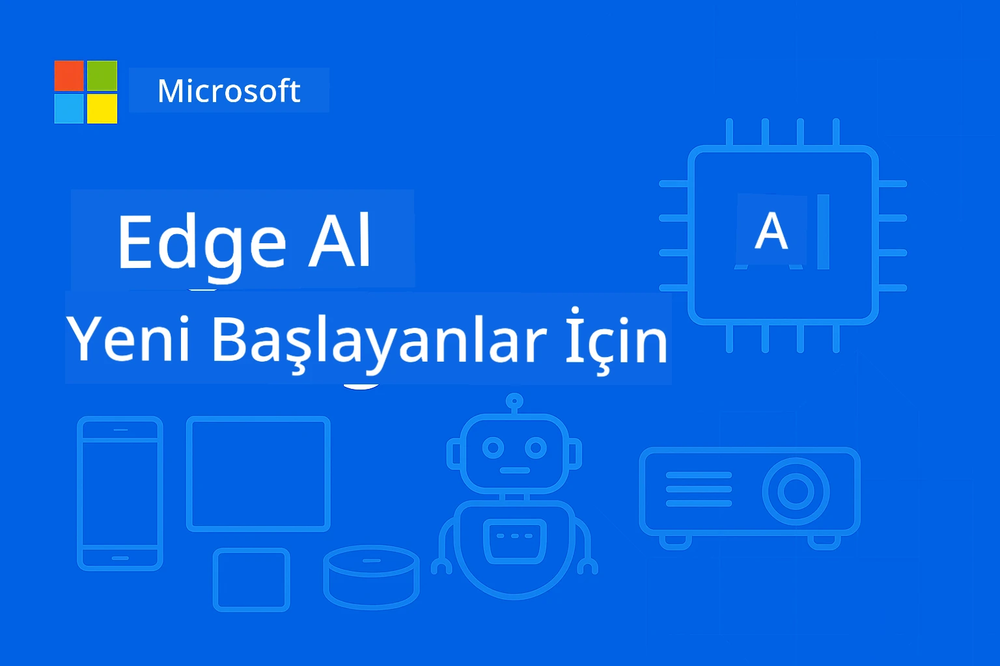

# Yeni Başlayanlar İçin EdgeAI 




[](https://GitHub.com/microsoft/edgeai-for-beginners/graphs/contributors)
[](https://GitHub.com/microsoft/edgeai-for-beginners/issues)
[](https://GitHub.com/microsoft/edgeai-for-beginners/pulls)
[](http://makeapullrequest.com)

[](https://GitHub.com/microsoft/edgeai-for-beginners/watchers)
[](https://GitHub.com/microsoft/edgeai-for-beginners/fork)
[](https://GitHub.com/microsoft/edgeai-for-beginners/stargazers)


[](https://discord.gg/nTYy5BXMWG)

Bu kaynakları kullanmaya başlamak için aşağıdaki adımları izleyin:

1. **Depoyu Çatallayın**: Tıklayın [](https://GitHub.com/microsoft/edgeai-for-beginners/fork)
2. **Depoyu Klonlayın**:   `git clone https://github.com/microsoft/edgeai-for-beginners.git`
3. [**Azure AI Foundry Discord’a Katılın ve uzmanlarla ve diğer geliştiricilerle tanışın**](https://discord.com/invite/ByRwuEEgH4)


### 🌐 Çok Dilli Destek

#### GitHub Action ile Destekleniyor (Otomatik & Her Zaman Güncel)

<!-- CO-OP TRANSLATOR LANGUAGES TABLE START -->
[Arapça](../ar/README.md) | [Bengalce](../bn/README.md) | [Bulgarca](../bg/README.md) | [Birmanca (Myanmar)](../my/README.md) | [Çince (Basitleştirilmiş)](../zh-CN/README.md) | [Çince (Geleneksel, Hong Kong)](../zh-HK/README.md) | [Çince (Geleneksel, Makao)](../zh-MO/README.md) | [Çince (Geleneksel, Tayvan)](../zh-TW/README.md) | [Hırvatça](../hr/README.md) | [Çekçe](../cs/README.md) | [Danca](../da/README.md) | [Flemenkçe](../nl/README.md) | [Estonca](../et/README.md) | [Fince](../fi/README.md) | [Fransızca](../fr/README.md) | [Almanca](../de/README.md) | [Yunanca](../el/README.md) | [İbranice](../he/README.md) | [Hintçe](../hi/README.md) | [Macarca](../hu/README.md) | [Endonezce](../id/README.md) | [İtalyanca](../it/README.md) | [Japonca](../ja/README.md) | [Kannada](../kn/README.md) | [Khmer](../km/README.md) | [Korece](../ko/README.md) | [Litvanca](../lt/README.md) | [Malayca](../ms/README.md) | [Malayalamca](../ml/README.md) | [Marathi](../mr/README.md) | [Nepalce](../ne/README.md) | [Nijerya Pidgin](../pcm/README.md) | [Norveççe](../no/README.md) | [Farsça (Farsi)](../fa/README.md) | [Lehçe](../pl/README.md) | [Portekizce (Brezilya)](../pt-BR/README.md) | [Portekizce (Portekiz)](../pt-PT/README.md) | [Punjabi (Gurmukhi)](../pa/README.md) | [Romence](../ro/README.md) | [Rusça](../ru/README.md) | [Sırpça (Kiril Alfabesi)](../sr/README.md) | [Slovakça](../sk/README.md) | [Slovence](../sl/README.md) | [İspanyolca](../es/README.md) | [Svahili](../sw/README.md) | [İsveççe](../sv/README.md) | [Tagalogca (Filipince)](../tl/README.md) | [Tamilce](../ta/README.md) | [Telugu](../te/README.md) | [Tayca](../th/README.md) | [Türkçe](./README.md) | [Ukraynaca](../uk/README.md) | [Urduca](../ur/README.md) | [Vietnamca](../vi/README.md)

> **Yerel Klonlamayı Tercih Ediyor Musunuz?**
>
> Bu depo 50’den fazla dil çevirisi içererek indirme boyutunu önemli ölçüde artırmaktadır. Çeviriler olmadan klonlamak için seyrek kontrol (sparse checkout) kullanabilirsiniz:
>
> **Bash / macOS / Linux:**
> ```bash
> git clone --filter=blob:none --sparse https://github.com/microsoft/edgeai-for-beginners.git
> cd edgeai-for-beginners
> git sparse-checkout set --no-cone '/*' '!translations' '!translated_images'
> ```
>
> **CMD (Windows):**
> ```cmd
> git clone --filter=blob:none --sparse https://github.com/microsoft/edgeai-for-beginners.git
> cd edgeai-for-beginners
> git sparse-checkout set --no-cone "/*" "!translations" "!translated_images"
> ```
>
> Bu, derse tamamlamak için gereken her şeyi çok daha hızlı bir indirme ile sunar.
<!-- CO-OP TRANSLATOR LANGUAGES TABLE END -->

**Ek çeviri dilleri desteklenmesini istiyorsanız, desteklenen diller [burada](https://github.com/Azure/co-op-translator/blob/main/getting_started/supported-languages.md) listelenmiştir.**
## Giriş

**Yeni Başlayanlar İçin EdgeAI**'e hoş geldiniz – Edge Yapay Zekâsının dönüştürücü dünyasına kapsamlı yolculuğunuz. Bu kurs, etkili yapay zeka yetenekleri ile pratik, gerçek dünya edge cihazlardaki uygulama arasındaki boşluğu doldurarak, verilerin üretildiği ve kararların alınması gerektiği yerde yapay zekanın potansiyelini kullanmanızı sağlar.

### Öğrenecekleriniz

Bu kurs temel kavramlardan üretime hazır uygulamalara kadar sizi götürür, kapsam olarak:
- Edge dağıtımı için optimize edilmiş **Küçük Dil Modelleri (KDM)**
- Çeşitli platformlarda **donanıma duyarlı optimizasyon**
- **Gizliliği koruyan gerçek zamanlı çıkarım**
- Kurumsal uygulamalar için **üretim dağıtım stratejileri**

### EdgeAI Neden Önemlidir?

Edge AI, kritik modern zorlukları ele alan bir paradigma değişimini temsil eder:
- **Gizlilik ve Güvenlik**: Bulut erişimi olmadan hassas verileri yerel olarak işlemeye imkan verir
- **Gerçek Zamanlı Performans**: Zaman kritik uygulamalarda ağ gecikmesini ortadan kaldırır
- **Maliyet Verimliliği**: Bant genişliği ve bulut bilişim maliyetlerini azaltır
- **Dayanıklı Operasyonlar**: Ağ kesintileri sırasında işlevselliği sürdürür
- **Yasal Uyumluluk**: Veri egemenliği gereksinimlerini karşılar

### Edge AI

Edge AI, yapay zeka algoritmalarını ve dil modellerini verinin üretildiği donanıma - bulut kaynaklarına bağımlı olmadan - yakında yerel olarak çalıştırmaktır. Gecikmeyi azaltır, gizliliği artırır ve gerçek zamanlı karar vermeyi mümkün kılar.

### Temel İlkeler:
- **Cihazda çıkarım:** AI modelleri edge cihazlarda (telefonlar, yönlendiriciler, mikro denetleyiciler, endüstriyel PC'ler) çalışır
- **Çevrimdışı yetenek:** Sürekli internet bağlantısı olmadan işler
- **Düşük gecikme:** Gerçek zamanlı sistemlere uygun anlık yanıtlar
- **Veri egemenliği:** Hassas verileri yerelde tutar, güvenlik ve uyumluluğu artırır

### Küçük Dil Modelleri (KDM)

Phi-4, Mistral-7B ve Gemma gibi KDM’ler, büyük LLM'lerin optimize edilmiş versiyonlarıdır—şaşırma veya özel eğitimle:
- **Azaltılmış bellek kullanımı:** Sınırlı edge cihaz hafızasının verimli kullanımı
- **Daha düşük işlem yükü:** CPU ve edge GPU için optimize edilmiş performans
- **Daha hızlı başlatma süreleri:** Çabuk başlatma ile duyarlı uygulamalara imkân

Şu kısıtları aşarken güçlü NLP yeteneklerini açarlar:
- **Gömülü sistemler:** IoT cihazları ve endüstriyel kontrolörler
- **Mobil cihazlar:** Çevrimdışı özelliklere sahip akıllı telefonlar ve tabletler
- **IoT Cihazları:** Sınırlı kaynaklara sahip sensörler ve akıllı cihazlar
- **Edge sunucuları:** Sınırlı GPU kaynaklarına sahip yerel işlem birimleri
- **Kişisel Bilgisayarlar:** Masaüstü ve dizüstü kullanım senaryoları

## Kurs Modülleri & Navigasyon

| Modül | Konu | Odak Alanı | Ana İçerik | Seviye | Süre |
|--------|-------|------------|-------------|--------|----------|
| [📖 00 ](./introduction.md) | [EdgeAI’ye Giriş](./introduction.md) | Temel & Bağlam | EdgeAI Genel Bakış • Sektör Uygulamaları • KDM Tanıtımı • Öğrenme Hedefleri | Yeni Başlayan | 1-2 saat |
| [📚 01](../../Module01) | [EdgeAI Temelleri](./Module01/README.md) | Bulut vs Edge AI karşılaştırması | EdgeAI Temelleri • Gerçek Dünya Vaka Çalışmaları • Uygulama Rehberi • Edge Dağıtımı | Yeni Başlayan | 3-4 saat |
| [🧠 02](../../Module02) | [KDM Model Temelleri](./Module02/README.md) | Model aileleri & mimari | Phi Ailesi • Qwen Ailesi • Gemma Ailesi • BitNET • μModel • Phi-Silica | Yeni Başlayan | 4-5 saat |
| [🚀 03](../../Module03) | [KDM Dağıtım Pratiği](./Module03/README.md) | Yerel & bulut dağıtımı | İleri Seviye Öğrenme • Yerel Ortam • Bulut Dağıtımı | Orta Seviye | 4-5 saat |
| [⚙️ 04](../../Module04) | [Model Optimizasyon Araç Kiti](./Module04/README.md) | Çok platformlu optimizasyon | Giriş • Llama.cpp • Microsoft Olive • OpenVINO • Apple MLX • İş Akışı Sentetiği | Orta Seviye | 5-6 saat |
| [🔧 05](../../Module05) | [KDMOps Üretimi](./Module05/README.md) | Üretim operasyonları | KDMOps Tanıtımı • Model Distilasyonu • İnce Ayar • Üretim Dağıtımı | İleri Seviye | 5-6 saat |
| [🤖 06](../../Module06) | [AI Ajanları & Fonksiyon Çağrısı](./Module06/README.md) | Ajan çerçeveleri & MCP | Ajan Tanıtımı • Fonksiyon Çağrısı • Model Bağlam Protokolü | İleri Seviye | 4-5 saat |
| [💻 07](../../Module07) | [Platform Uygulaması](./Module07/README.md) | Çok platformlu örnekler | AI Araç Kiti • Foundry Local • Windows Geliştirme | İleri Seviye | 3-4 saat |
| [🏭 08](../../Module08) | [Foundry Local Araç Kiti](./Module08/README.md) | Üretime hazır örnekler | Örnek uygulamalar (detaylar aşağıda) | Uzman | 8-10 saat |

### 🏭 **Modül 08: Örnek Uygulamalar**

- [01: REST Chat Hızlı Başlangıç](./Module08/samples/01/README.md)
- [02: OpenAI SDK Entegrasyonu](./Module08/samples/02/README.md)
- [03: Model Keşfi & Karşılaştırması](./Module08/samples/03/README.md)
- [04: Chainlit RAG Uygulaması](./Module08/samples/04/README.md)
- [05: Çok Ajanlı Orkestrasyon](./Module08/samples/05/README.md)
- [06: Araç Olarak Modeller Yönlendirici](./Module08/samples/06/README.md)
- [07: Doğrudan API İstemcisi](./Module08/samples/07/README.md)
- [08: Windows 11 Sohbet Uygulaması](./Module08/samples/08/README.md)
- [09: İleri Düzey Çok Ajanlı Sistem](./Module08/samples/09/README.md)
- [10: Foundry Araçlar Çerçevesi](./Module08/samples/10/README.md)

### 🎓 **Atölye: Pratik Öğrenme Yolu**

Üretime hazır uygulamalar içeren kapsamlı uygulamalı atölye materyalleri:

- **[Atölye Rehberi](./Workshop/Readme.md)** - Tam öğrenme hedefleri, çıktı ve kaynak navigasyonu
- **Python Örnekleri** (6 oturum) - En iyi uygulamalar, hata yönetimi ve kapsamlı dökümantasyon ile güncellenmiştir
- **Jupyter Notebooks** (8 interaktif) - Adım adım dersler, kıyaslamalar ve performans izleme ile
- **Oturum Rehberleri** - Her atölye oturumu için detaylı markdown rehberleri
- **Doğrulama Araçları** - Kod kalitesini kontrol eden ve duman testi çalıştıran betikler

**Yapacaklarınız:**
- Akış desteği ile yerel AI sohbet uygulamaları
- Kalite değerlendirmesiyle RAG boru hatları (RAGAS)
- Çoklu model kıyaslama ve karşılaştırma araçları
- Çok ajanlı orkestrasyon sistemleri
- Görev bazlı seçme ile akıllı model yönlendirme

### 🎙️ **Agentic Atölyesi: Uygulamalı - AI Podcast Stüdyosu**
Sıfırdan Yapay Zeka destekli podcast üretim hattı oluşturun! Bu kapsamlı atölye, fikirlerinizi profesyonel podcast bölümlerine dönüştüren tam bir çoklu ajan sistemi oluşturmayı öğretir.

**[🎬 AI Podcast Studio Atölyesine Başlayın](./WorkshopForAgentic/README.md)**

**Göreviniz**: Tamamen kendinizin inşa edeceği yapay zeka ajanları tarafından desteklenen "Future Bytes" adlı bir teknoloji podcast'ini başlatmak. Bulut bağımlılığı yok, API maliyeti yok — her şey yerel olarak kendi bilgisayarınızda çalışır.

**Bu Bunu Özel Kılan Nedir:**
- **🤖 Gerçek Çoklu Ajan Orkestrasyonu** - Araştırma yapan, yazan ve ses üreten uzman AI ajanları oluşturun
- **🎯 Tam Üretim Hattı** - Konu seçiminden final podcast ses çıktısına kadar
- **💻 %100 Yerel Dağıtım** - Tam gizlilik ve kontrol için Ollama ve yerel modeller (Qwen-3-8B) kullanır
- **🎤 Metin-Konuşmaya Entegrasyon** - Senaryoları doğal sesli çok konuşmacılı sohbetlere dönüştürür
- **✋ İnsan-Döngüde İş Akışları** - Kaliteyi sağlarken otomasyonu koruyan onay kapıları

**Üç Perdelik Öğrenme Yolculuğu:**

| Perde | Odak | Temel Beceriler | Süre |
|-----|-------|------------|----------|
| **[Perde 1: AI Asistanlarınızla Tanışın](./WorkshopForAgentic/md/01.BuildAIAgentWithSLM.md)** | İlk AI ajanınızı oluşturun | Araç entegrasyonu • Web arama • Sorun çözme • Ajanik akıl yürütme | 2-3 saat |
| **[Perde 2: Üretim Ekibinizi Birleştirin](./WorkshopForAgentic/md/02.AIAgentOrchestrationAndWorkflows.md)** | Çoklu ajanları orkestre edin | Ekip koordinasyonu • Onay iş akışları • DevUI arayüzü • İnsan gözetimi | 3-4 saat |
| **[Perde 3: Podcast’inizi Hayata Geçirin](./WorkshopForAgentic/md/03.Multi-SpeakerPodcastGenerationWithVibeVoice.md)** | Podcast sesini üretin | Metin-konuşmaya • Çok konuşmacılı sentez • Uzun formlu ses • Tam otomasyon | 2-3 saat |

**Kullanılan Teknolojiler:**
- **Microsoft Agent Framework** - Çoklu ajan orkestrasyonu ve koordinasyonu
- **Ollama** - Yerel AI model çalıştırma ortamı (bulut gerektirmez)
- **Qwen-3-8B** - Ajanik görevler için optimize edilmiş açık kaynak dil modeli
- **Metin-Konuşma API’leri** - Podcast üretimi için doğal ses sentezi

**Donanım Desteği:**
- ✅ **CPU Modu** - Her modern bilgisayarda çalışır (8GB+ RAM önerilir)
- 🚀 **GPU Hızlandırma** - NVIDIA/AMD GPU’larla önemli hızlandırma sağlar
- ⚡ **NPU Desteği** - Yeni nesil sinir işleme birimi hızlandırması

**Mükemmel Uygunluk:**
- Çoklu ajan AI sistemleri öğrenen geliştiriciler
- Yapay zeka otomasyonu ve iş akışlarıyla ilgilenen herkes
- AI destekli içerik üretimine meraklı içerik oluşturucular
- Pratik AI orkestrasyon kalıplarını öğrenen öğrenciler

**Başlayın**: [🎙️ AI Podcast Studio Atölyesi →](./WorkshopForAgentic/README.md)

### 📊 **Öğrenme Yolu Özeti**
- **Toplam Süre**: 36-45 saat
- **Başlangıç Seviyesi**: Modüller 01-02 (7-9 saat)  
- **Orta Seviye**: Modüller 03-04 (9-11 saat)
- **İleri Seviye**: Modüller 05-07 (12-15 saat)
- **Uzman Seviyesi**: Modül 08 (8-10 saat)

## Neler İnşa Edeceksiniz

### 🎯 Temel Yetenekler
- **Edge AI Mimarisi**: Bulut entegrasyonlu öncelikle yerel AI sistemleri tasarlayın
- **Model Optimizasyonu**: Modelleri kenar dağıtımı için nicelendirip sıkıştırın (%85 hız artışı, %75 boyut küçültme)
- **Çoklu Platform Dağıtımı**: Windows, mobil, gömülü ve bulut-kenar hibrit sistemler
- **Üretim Operasyonları**: Kenar AI’yı izleme, ölçeklendirme ve sürdürme

### 🏗️ Pratik Projeler
- **Foundry Yerel Sohbet Uygulamaları**: Model geçişli Windows 11 özgün uygulaması
- **Çoklu Ajan Sistemleri**: Karmaşık iş akışları için uzman ajanlarla koordinatör  
- **RAG Uygulamaları**: Vektör aramalı yerel belge işleme
- **Model Yönlendiriciler**: Görev analizine göre modeller arasında akıllı seçim
- **API Çerçeveleri**: Yayına hazır istemciler, akış ve sağlık izlemesi ile
- **Çapraz Platform Araçları**: LangChain/Semantic Kernel entegrasyon kalıpları

### 🏢 Sektörel Uygulamalar
**Üretim** • **Sağlık** • **Otonom Araçlar** • **Akıllı Şehirler** • **Mobil Uygulamalar**

## Hızlı Başlangıç

**Önerilen Öğrenme Yolu** (Toplam 20-30 saat):

0. **📖 Giriş** ([Introduction.md](./introduction.md)): EdgeAI temeli + sektör bağlamı + öğrenme çerçevesi  
1. **📚 Temel** (Modüller 01-02): EdgeAI kavramları + SLM model ailesi  
2. **⚙️ Optimizasyon** (Modüller 03-04): Dağıtım + nicelleştirme çerçeveleri  
3. **🚀 Üretim** (Modüller 05-06): SLMOps + AI ajanları + fonksiyon çağrısı  
4. **💻 Uygulama** (Modüller 07-08): Platform örnekleri + Foundry Yerel araç seti

Her modül teori, uygulamalı egzersizler ve üretim hazır kod örnekleri içerir.

## Kariyer Etkisi

**Teknik Roller**: EdgeAI Çözümleri Mimarı • Makine Öğrenimi Mühendisi (Edge) • IoT AI Geliştiricisi • Mobil AI Geliştiricisi

**Sektörler**: Endüstri 4.0 • Sağlık Teknolojisi • Otonom Sistemler • FinTek • Tüketici Elektroniği

**Portföy Projeleri**: Çoklu ajan sistemleri • Üretim RAG uygulamaları • Çapraz platform dağıtımı • Performans optimizasyonu

## Depo Yapısı

```
edgeai-for-beginners/
├── 📖 introduction.md  # Foundation: EdgeAI Overview & Learning Framework
├── 📚 Module01-04/     # Fundamentals → SLMs → Deployment → Optimization  
├── 🔧 Module05-06/     # SLMOps → AI Agents → Function Calling
├── 💻 Module07/        # Platform Samples (VS Code, Windows, Jetson, Mobile)
├── 🏭 Module08/        # Foundry Local Toolkit + 10 Comprehensive Samples
│   ├── samples/01-06/  # Foundation: REST, SDK, RAG, Agents, Routing
│   └── samples/07-10/  # Advanced: API Client, Windows App, Enterprise Agents, Tools
├── 🌐 translations/    # Multi-language support (8+ languages)
└── 📋 STUDY_GUIDE.md   # Structured learning paths & time allocation
```

## Kursun Öne Çıkanları

✅ **Kademeli Öğrenme**: Teori → Pratik → Üretim dağıtımı  
✅ **Gerçek Vaka İncelemeleri**: Microsoft, Japan Airlines, kurumsal uygulamalar  
✅ **Uygulamalı Örnekler**: 50+ örnek, 10 kapsamlı Foundry Yerel demosu  
✅ **Performans Odaklılık**: %85 hız artışı, %75 boyut azaltımı  
✅ **Çoklu Platform**: Windows, mobil, gömülü, bulut-kenar hibrit  
✅ **Üretime Hazır**: İzleme, ölçeklendirme, güvenlik, uyumluluk çerçeveleri

📖 **[Çalışma Rehberi Mevcut](STUDY_GUIDE.md)**: Zaman yönetimi ve öz değerlendirme araçlarıyla yapılandırılmış 20 saatlik öğrenme yolu.

---

**EdgeAI, yapay zekanın geleceğini temsil eder**: öncelikle yerel, gizliliği koruyan ve verimli. Bu becerileri öğrenerek bir sonraki nesil zeki uygulamaları inşa edin.

## Diğer Kurslar

Ekibimiz başka kurslar da üretiyor! Göz atın:

<!-- CO-OP TRANSLATOR OTHER COURSES START -->
### LangChain
[](https://aka.ms/langchain4j-for-beginners)
[](https://aka.ms/langchainjs-for-beginners?WT.mc_id=m365-94501-dwahlin)
[](https://github.com/microsoft/langchain-for-beginners?WT.mc_id=m365-94501-dwahlin)
---

### Azure / Edge / MCP / Ajanlar
[](https://github.com/microsoft/AZD-for-beginners?WT.mc_id=academic-105485-koreyst)
[](https://github.com/microsoft/edgeai-for-beginners?WT.mc_id=academic-105485-koreyst)
[](https://github.com/microsoft/mcp-for-beginners?WT.mc_id=academic-105485-koreyst)
[](https://github.com/microsoft/ai-agents-for-beginners?WT.mc_id=academic-105485-koreyst)

---
 
### Üretken AI Serisi
[](https://github.com/microsoft/generative-ai-for-beginners?WT.mc_id=academic-105485-koreyst)
[-9333EA?style=for-the-badge&labelColor=E5E7EB&color=9333EA)](https://github.com/microsoft/Generative-AI-for-beginners-dotnet?WT.mc_id=academic-105485-koreyst)
[-C084FC?style=for-the-badge&labelColor=E5E7EB&color=C084FC)](https://github.com/microsoft/generative-ai-for-beginners-java?WT.mc_id=academic-105485-koreyst)
[-E879F9?style=for-the-badge&labelColor=E5E7EB&color=E879F9)](https://github.com/microsoft/generative-ai-with-javascript?WT.mc_id=academic-105485-koreyst)

---
 
### Temel Öğrenme
[](https://aka.ms/ml-beginners?WT.mc_id=academic-105485-koreyst)
[](https://aka.ms/datascience-beginners?WT.mc_id=academic-105485-koreyst)
[](https://aka.ms/ai-beginners?WT.mc_id=academic-105485-koreyst)
[](https://github.com/microsoft/Security-101?WT.mc_id=academic-96948-sayoung)
[](https://aka.ms/webdev-beginners?WT.mc_id=academic-105485-koreyst)
[](https://aka.ms/iot-beginners?WT.mc_id=academic-105485-koreyst)
[](https://github.com/microsoft/xr-development-for-beginners?WT.mc_id=academic-105485-koreyst)

---
 
### Copilot Serisi

[](https://aka.ms/GitHubCopilotAI?WT.mc_id=academic-105485-koreyst)
[](https://github.com/microsoft/mastering-github-copilot-for-dotnet-csharp-developers?WT.mc_id=academic-105485-koreyst)
[](https://github.com/microsoft/CopilotAdventures?WT.mc_id=academic-105485-koreyst)
<!-- CO-OP TRANSLATOR OTHER COURSES END -->

## Yardım Alma

Takılırsanız veya AI uygulamaları geliştirme ile ilgili herhangi bir sorunuz varsa, katılın:

[](https://discord.gg/nTYy5BXMWG)

Ürün geri bildiriminiz veya geliştirme sırasında yaşadığınız hatalar için ziyaret edin:

[](https://aka.ms/foundry/forum)

---

<!-- CO-OP TRANSLATOR DISCLAIMER START -->
**Feragatname**:  
Bu belge, AI çeviri hizmeti [Co-op Translator](https://github.com/Azure/co-op-translator) kullanılarak çevrilmiştir. Doğruluk için çaba göstermemize rağmen, otomatik çevirilerin hatalar veya yanlışlıklar içerebileceğini lütfen unutmayın. Orijinal belge, kendi ana dilinde yetkili kaynak olarak kabul edilmelidir. Kritik bilgiler için profesyonel insan çevirisi tavsiye edilir. Bu çevirinin kullanımı sonucu ortaya çıkabilecek yanlış anlaşılmalar veya yanlış yorumlamalardan sorumlu değiliz.
<!-- CO-OP TRANSLATOR DISCLAIMER END -->