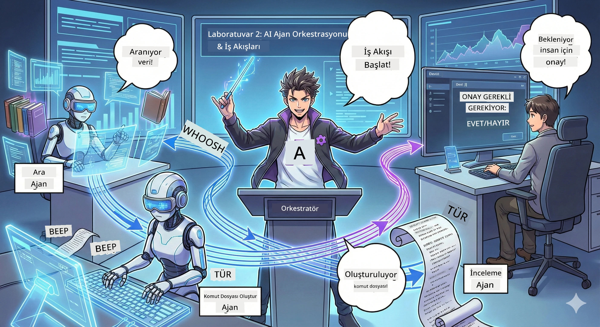

# 2. Bölüm: Podcast Üretim Ekibinizi Kurun 🎬



## Hikaye Derinleşiyor

Alex (1. Bölümden yapay zeka asistanınız) harika, ama tek bir ajan tüm podcast stüdyosunu yönetemez. Bir *ekibe* ihtiyacınız var:
- 🔍 **Araştırma Ajanı**: İnterneti taze bilgiler için tarar
- ✍️ **Senaryo Ajanı**: Araştırmayı ilgi çekici diyaloglara dönüştürür
- 👤 **Siz (Editör)**: Senaryoları onaylar veya yeniden yazılması için geri gönderir

Hoş geldiniz **Yapay Zeka Ajan Orkestrasyonu**’na — burada kendi yapay zeka ekibinizin yönetmeni oluyorsunuz. Avengers gibi, ama podcast üretimi için.

## Ajan Orkestrasyonu Nedir? (Basit Anlatım)

Bir restoran işletiyorsunuz hayal edin. Her şeyi kendiniz yapmazsınız, değil mi? Sizin var:
- 🍳 Yemek yapan bir şef
- 👨‍🍳 Hazırlık yapan yardımcı şef
- 👩‍🍳 Yemekleri sunan servis elemanı

Ajan orkestrasyonu da aynı fikir, ama yapay zekayla. Her ajanın uzmanlığı var ve onları daha büyük hedeflere ulaşması için koordine ediyorsunuz. Tek bir ajan boğulmuyor ve işler daha hızlı bitiyor.

### Grup Benzetmesi 🎸

Yapay zeka ajanlarınız bir müzik grubu gibidir:
- **Solist**: Müşteri karşısındaki görevleri yönetir
- **Davulcu**: Ritmi tutar, arka planda işler yürütür  
- **Basçı**: Herkesi destekler, veri toplar
- **Siz (Grup Menajeri)**: Hepsini koordine edersiniz!

Koordinasyon yoksa? Sadece gürültü. Orkestrasyon olursa? Güzel müzik.

### Neden Önemli?

Tek bir yapay zeka ajanının her şeyi yapmaya çalışması = tükeniş. Uzmanlaşmış ajanların birlikte çalışması = verimlilik artışı! 🚀

**Gerçek Hayattan**: Tek başınıza araştırma, yazma VE editörlüğü yapmaya çalıştığınız zamanı hatırlayın. Kötüydü, değil mi? Orkestrasyonla her ajan en iyi olduğu işi yapar. Son kararlar size kalır.

**Gerçek Dünya Örneği**: Müşteri destek botları fatura, teknik sorunlar veya insan müdahalesi gerektiğinde ne yapacağını bilir. İşte orkestrasyon!

## Ajan ile İş Akışı Arasındaki Fark Nedir?

Şöyle düşünün:

### 🤖 Yapay Zeka Ajanı = Caz Müzisyeni
- **Duyduklarına göre anlık karar verir**
- **Araçlarını kullanarak çözümler üretir**
- **LLM beyni ile düşünür**
- **Ne gelirse adapte olur**

### 🎵 İş Akışı = Klasik Müzik Orkestrası  
- **Bir partisyonu (önceden belirlenmiş adımlar) izler**
- **Öngörülebilir yürütme yolu**
- **Birden çok ajan, insan ve sistemin koordinasyonu**
- **Bir tarif gibi yapılandırılmış**

**Sihir**: İş akışları ajanları *koordine eder*! Ajanlara ne zaman görevlerini oynayacaklarını gösteren iş akışı inşa edersiniz. En iyisinin en iyisi. 🎭

## Yapay Zeka Ekibinizi Koordine Etmenin Üç Yolu

### 1. 🎯 Merkezi (Siz Patronusunuz)

Tek bir ana ajan her şeyi yönetir. Bir ekip yönettiğinizi düşünün — kim ne zaman ne yapacak siz belirlersiniz.

**Avantajları**:
- ✅ Net liderlik (karışıklık yok)
- ✅ Tutarlı kararlar
- ✅ Kolay hata ayıklama

**Kullanım Alanları**:
- Müşteri hizmetleri yönlendirmesi ("Bu fatura mı yoksa teknik destek mi?")
- İçerik onay iş akışları ("Bu senaryo uygun mu?")
- Podcast üretimi (tam olarak yapacağımız şey!)

### 2. 🤝 Merkezi Olmayan (Ajanlar Kendi Kendini Organize Eder)

Ajanlar doğrudan birbirleriyle konuşur ve grup olarak işleri çözer. Herkesin koordine olduğu bir grup sohbeti gibi.

**Avantajları**:
- ✅ Kolayca ölçeklenir (istediğiniz kadar ajan ekleyin)
- ✅ Tek hata noktası yok
- ✅ Ajanlar doğal olarak iş birliği yapar

**Kullanım Alanları**:
- Araştırma ekipleri (her ajan farklı kaynakları keşfeder)
- Fikir fırtınası oturumları
- Dağıtık problem çözme

### 3. 🔀 Hibrit (İkisinin En İyisi)

Genel yönü siz belirliyorsunuz, ama ajanlar görevlerde kendi kendini organize etme özgürlüğüne sahip. Bir CEO olarak ekibinize güvenmek gibi.

**Mükemmel**: Kontrol ve esneklik gerektiren karmaşık projeler için.

## Microsoft Agent Framework: Orkestrasyon Araç Setiniz 🧰

Başlama zamanı! İşte kullanacaklarınız:

### Temel Parçalar

#### 1. 🧱 Çalıştırıcılar (İşçileriniz)
- **Nedirler**: Bireysel işlem birimleri — ajanlar veya özel mantık olabilir
- **Ne yaparlar**: Girdi alır, işleri yapar, çıktı üretir
- **Düşünün ki**: Montaj hattındaki istasyonlar

#### 2. ➡️ Kenarlar (Bağlantılar)
- **Nedirler**: Çalıştırıcılar arasındaki yollar
- **Ne yaparlar**: Mesaj akışını kontrol eder ("A'dan sonra B'ye git")
- **Düşünün ki**: Akış şemasındaki oklar

#### 3. 🗺️ İş Akışları (Ana Plan)
- **Nedirler**: Çalıştırıcılar ve kenarların tam grafiği
- **Ne yaparlar**: Süreci baştan sona tanımlar
- **Düşünün ki**: Üretim hattı planınız

### Bayılacağınız Özellikler

**🛡️ Tip Güvenliği**: Ajanlar arası mesajlar tip kontrolünden geçer. "Aman yanlış veri tipi!" sürprizi yok.

**🔀 Esnek Yönlendirme**:  
- Eğer-o halde koşulları ("Onaylandıysa yayımla değilse yeniden yaz")
- Paralel işlem (birden çok ajan aynı anda çalışabilir)
- Dinamik yollar (iş akışı sonuçlara göre uyum sağlar)

**🔌 Dış Entegrasyon**:
- API bağlanabilirliği
- İnsan müdahalesi gereken noktalar (yayın öncesi onay sizden)
- İstek/yanıt akışları oluşturma

**💾 Kontrol Noktası**: İlerlemenizi kaydedin! Bir şey çökerse kaldığınız yerden devam edin.

**🤝 Çoklu Ajan Koordinasyonu**:
- Ajanları sıralı çalıştırma (A → B → C)
- Paralel çalıştırma (A + B + C birlikte)
- Ajanlar arası görev devri
- İş birliği içinde işleme

## En İyi Uygulamalar (Profesyonel İpuçları) 🎯

### 1. Modüler Tutun  
Her ajan TEK bir şeyi çok iyi yapmalı. Her şeyi yapan "süper ajan" yapmayın — sorun giderirken pişman olursunuz.

### 2. Hatalara Hazır Olun  
Ajanlar hata yapar. Ağlar kesilir. Hata yakalama ve yedek planlar kurun. Gelecekte kendiniz teşekkür edecek.

### 3. Her Şeyi İzleyin  
Ajanlarınızın ne yaptığını takip edin. DevUI kullanarak iş akışlarını canlı görün.

### 4. Mesaj Boyutunu Optimize Edin  
Dev ajanlar arasında devasa dosyalar göndermeyin. Mesajları hızlıca iletilecek şekilde küçük tutun.

### 5. Doğru Modeli Seçin  
Kontrol mü lazım? Merkezi yi seç. Ölçek mi? Merkezi olmayan. Kararsız mısın? Hibrit!

## DevUI: İş Akışı Hata Ayıklayıcınız 🔍

### DevUI Nedir?

DevUI, ajanlarınızı ve iş akışlarınızı test etmek için bir oyun alanı gibidir. Web arayüzüdür; burada:
- 👀 İş akışınızı canlı izleyebilirsiniz
- 💬 Ajanlarla doğrudan sohbet edebilirsiniz
- 🔍 Hataları izleyip düzeltebilirsiniz
- 📊 İzler ve performans metrikleri görebilirsiniz

> **Önemli**: DevUI sadece geliştirme içindir! Prodüksiyonda kullanmayın. Yerel test ortamınız olarak düşünün.

### Neden Harika?

- **🖥️ Etkileşimli Web UI**: Tıklayın, yazın, test edin—komut satırı yok
- **📁 Sürükle-Bırak Hazır**: Dosya yükleyin, farklı girdilerle test edin
- **📂 Otomatik Keşif**: Bir klasöre gösterin, tüm ajanları otomatik bulur
- **📋 Kurulum Gerektirmeyen Mod**: Ajanları kodda kaydedin, klasör yapısı gerekmez
- **🔌 OpenAI Uyumluluğu**: OpenAI SDK ile çalışır (uyumluluk garantili!)
- **👁️ İzleme Özelliği**: Ajanlarınızın neler yaptığını tam görün

### Girdi Nasıl İşler?

DevUI girdiler konusunda akıllı:

- **Ajan mı test ediyorsunuz?** Metin kutuları ve dosya yükleme düğmeleri verilir
- **İş akışı mı test ediyorsunuz?** UI iş akışınızın beklentilerine göre otomatik giriler oluşturur

Sihir gibi, ama sadece iyi kod. ✨

## Görevleriniz: Podcast Stüdyosu İnşa Edin 🎬

### Görev 1: DevUI ile Tek Ajan Oluşturun

📂 [01.AgentDevUI](../../../../WorkshopForAgentic/code/02.Workflow/01.AgentDevUI)

**Zorluk**: Tam bir ekip kurmadan önce DevUI’yi bir ajanla test edin: web arama uzmanı.

**Yaptığınız**: Podcast konularını internetten arayabilen bir araştırma ajanı. DevUI web arayüzünde test edeceksiniz: `http://localhost:8090`

**Öğrenecekleriniz**:
- 🚀 DevUI’da ajanları başlatma
- 🔍 Gerçek zamanlı cevapları test etme
- 🛠️ Özel araçlar (web arama) oluşturma
- 📊 İzleme açarak hata ayıklama
- 🖥️ Etkileşimli web arayüzü kullanımı

**Kodlar**:
- `agent.py`: Web arama süper gücüne sahip SearchAgent
- Qwen’e bağlanmak için OllamaChatClient kullanır
- `web_search()` araç fonksiyonunu uygular
- `serve()` ile başlar — DevUI otomatik açılır

**Başarı Koşulu**: Ajanınıza “Yapay zekada neler trend?” diye sorun ve webde aramasını izleyin! 🎉

### Görev 2: Çoklu Ajan İş Akışı Kurun

📂 [02.WorkflowDevUI](../../../../WorkshopForAgentic/code/02.Workflow/02.WorkflowDevUI)

**Zorluk**: Asıl eğlence şimdi! Tam podcast üretim iş akışı kurun:
1. 🔍 **Araştırma Ajanı** → Konuyu araştırır
2. ✍️ **Senaryo Ajanı** → İki sunucu arasında Çin dilinde diyalog yazar
3. 👤 **Değerlendirme Yürütücüsü** → SİZ onaylayın ya da reddedin
4. 🔄 **Döngü** → Reddedilirse, geri bildirime göre yeniden yazar

**Öğrenecekleriniz**:
- 🧱 Farklı işlere özgü ajanlar yaratmak
- 🔗 WorkflowBuilder ile ajanları bağlamak
- 🔀 Onay döngüleri uygulamak (insan müdahalesi!)
- 🚦 Koşullu yönlendirme (onaylandı vs reddedildi)
- 🔧 İş mantığı için özel yürütücüler kurmak

**İş Akışı**:
```
SearchAgent → ScriptAgent → ReviewExecutor
                             ↑          ↓ (if rejected)
                             ←─────────
```

**Kodlar**:
- `search_agent/agent.py`: Araştırma uzmanınız
- `generate_script_agent/agent.py`: Senaryo yazıcınız (Çince yazar!)
- `workflow/workflow.py`: Orkestrasyon burada gerçekleşir
- `main.py`: Her şeyi DevUI’da başlatır

**Başarı Koşulu**: Bir konu verin, senaryoyu inceleyin, bir kez reddedip döngüyü test edin, sonra onaylayın! 🎉

### Görev 3: Konsol Uygulaması Yapın

📂 [03.Application](../../../../WorkshopForAgentic/code/02.Workflow/03.Application)

**Zorluk**: İş akışınızı DevUI’dan alın ve renkli çıktı, yükleme göstergeleri ve dosya kaydetme özellikleri olan şık bir terminal uygulamasına dönüştürün. Bu prodüksiyon kalitesinde!

**Öğrenecekleriniz**:
- ⚡ Programatik iş akışı çalıştırma (DevUI olmadan)
- 📡 Olay odaklı mimari ve stream yönetimi
- 🎨 Güzel terminal arayüzleri yapma (renkler, spinnerlar, ilerleme çubukları)
- 💾 Son senaryoyu dosyaya kaydetme
- 🔄 Python asyncio ile asenkron iş akışları yönetme

**Yaptıkları**:
1. Podcast konusu isteyip alır
2. Gerçek zamanlı ilerlemeyi gösterir ("Araştırma Ajanı çalışıyor...")
3. Üretilen senaryoyu renklerle gösterir
4. Onayınuzu ister
5. Onaylanan senaryoyu `podcast.txt` dosyasına kaydeder

**Kodlar**:
- `podcast_app.py`: Olay yönetimi ile ana uygulamanız
- `workflow.py`: Görev 2’den iş akışını tekrar kullanır
- Olayları yönetir: `AgentRunUpdateEvent`, `RequestInfoEvent`, `WorkflowOutputEvent`
- Terminal stili için ANSI renkler kullanır

**Başarı Koşulu**: Uygulamayı çalıştırıp podcast senaryosu oluşturun ve kaydedildiğini görün! Gerçek bir araç yaptınız. 🚀

## Neleri Başardınız 🏆

2. Bölüm sonrası:

- ✅ Birden çok yapay zeka ajanını patron gibi yönetin
- ✅ Ardışık VE koşullu mantıkla iş akışları kurun
- ✅ İnsan onayı gereken noktalar ekleyin
- ✅ DevUI ile iş akışlarını test edip hata ayıklayın
- ✅ Prodüksiyon kalitesinde konsol uygulamaları oluşturun
- ✅ Karmaşık sistemlerde hataları zarifçe yönetin
- ✅ Projenize en uygun orkestrasyon modelini seçin

## Bir Şeyler Kötü Giderse 🔧

### "İş akışım çok karmaşık!"
**Çözüm**: Daha küçük alt iş akışlarına bölün. Her iş akışı TEK bir işi iyi yapmalı. Gerekirse zincirleyin.

### "Ne olduğunu takip edemiyorum!"
**Çözüm**: İş akışı kontrol noktası (checkpoint) kullanarak durumu kaydedin. DevUI’da izleme açarak adımları görün.

### "Bir ajanın hatası her şeyi çöktürüyor!"
**Çözüm**: Hata sınırları ekleyin. Her ajan kendi hatalarını yönetmeli ve yedek davranışa sahip olmalı.

### "Bu çok yavaş"
**Çözüm**: Ajanlardan bazıları paralel çalışabilir mi? Ardışık iş akışları kolay ama yavaş. Paralel çalışma fırsatlarını araştırın!

## Faydalı Kaynaklar 🔗

- [Workflow Docs](https://learn.microsoft.com/en-us/agent-framework/user-guide/workflows/overview) — Resmi Microsoft kılavuzları
- [Orchestration Patterns](https://www.ibm.com/think/topics/ai-agent-orchestration) — IBM’in bakışı
- [Agent Framework GitHub](https://github.com/microsoft/agent-framework) — Kaynak kodlarına göz atın
- [Kod Örnekleri](https://github.com/microsoft/agent-framework/tree/main/python/samples) — Buradan kalıpları alın

---

**Finale hazır mısınız?** Senaryonuz hazır. Şimdi bunu gerçek sese dönüştürelim! → [Bölüm 3: Podcast’inizi Hayata Geçirin](03.Multi-SpeakerPodcastGenerationWithVibeVoice.md) 🎤

---

**Takıldınız mı? Kafanız mı karıştı? Heyecanlı mısınız?** Atölye sohbetinde paylaşın! Hep birlikte öğreniyoruz. 🚀

---

<!-- CO-OP TRANSLATOR DISCLAIMER START -->
**Feragatname**:
Bu belge, AI çeviri hizmeti [Co-op Translator](https://github.com/Azure/co-op-translator) kullanılarak çevrilmiştir. Doğruluk için çaba sarf etsek de, otomatik çevirilerin hatalar veya yanlışlıklar içerebileceğini lütfen unutmayınız. Orijinal belge, kendi ana dilindeki haliyle yetkili kaynak olarak kabul edilmelidir. Kritik bilgiler için profesyonel insan çevirisi önerilmektedir. Bu çevirinin kullanımı sonucunda ortaya çıkabilecek herhangi bir yanlış anlama veya hatalı yorumdan sorumlu değiliz.
<!-- CO-OP TRANSLATOR DISCLAIMER END -->