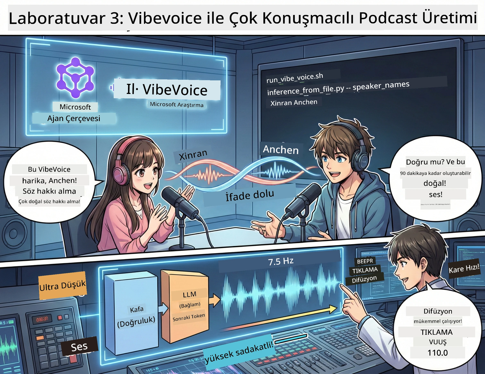

# Bölüm 3: Podcast’inizi Canlandırın 🎤



## Büyük Final

Konu araştırdınız. Senaryolar yazdınız. Şimdi işin en güzel yanı: metninizi gerçekçi seslerle gerçek podcast sesine dönüştürmek!

Karşınızda **VibeVoice** — Microsoft Research’in açık kaynak TTS (metinden sese) sihri, şunları yaratıyor:
- 🎭 Doğal konuşma sesleri
- 👥 Birden fazla konuşmacı (4’e kadar!)
- ⏱️ Uzun süreli ses (90 dakikaya kadar!)
- 🎵 İfade dolu anlatım (robot sesleri değil!)

Sentetik podcastlerin arkasındaki teknoloji bu. Haydi, sizinki de olsun!

## VibeVoice Nedir? (Havalı Özellikler)

VibeVoice, Microsoft Research’in dünyaya armağanı. Özellikle podcast tarzı sohbet sesleri için tasarlandı.

### Neden Harika? 🔥

* **⏱️ Maraton Seanslar**: Kesintisiz 90 dakikaya kadar konuşma üretiyor (tam bir podcast bölümü!)
* **👥 Çoklu Konuşmacı Büyüsü**: Tutarlı kişiliklere sahip 4 farklı ses
* **⚡ Çok Verimli**: Ultra düşük 7.5 Hz kare hızıyla işlem gücünden tasarruf ediyor
* **🧠 Akıllı Ses**: Bağlamı anlayan bir LLM ile gerçekçi ses yaratan bir diffusion modeli birleşimi
* **🎭 Doğal Akış**: Söz sırası alma, duraklama ve sohbet ritmini otomatik olarak yönetiyor

**Çeviri**: VibeVoice sadece metninizi okumaz — bunu gerçek insanların konuşması gibi *sahneye koyar*.

---

## Başlamadan Önce 🚀

**Gerekli Şeyler**:

* 🐍 **Python 3.10+** (zaten Bölüm 1 & 2’den mevcut)
* 🚀 **uv** (hızlı Python paket yöneticisi — onu kuracağız)
* 📝 **Senaryonuz**: Bölüm 2’den `podcast.txt` dosyası (`../03.Application/` içinde)

**İpucu**: Bu adım için önceden eğitilmiş modeli indirirken iyi bir internet bağlantısı gerekiyor. Kahvenizi alın! ☕

---

## Hadi Başlayalım! Kolay Yol 🎬

Bu işlemi çok basit yaptık. Tek bir shell script her şeyi hallediyor.

### Süreç

1. **Çalıştırılabilir yapın**:  
```bash
chmod +x run_vibe_voice.sh
```
  
2. **Çalıştırın**:  
```bash
./run_vibe_voice.sh
```
  
3. **Mucizeyi bekleyin** (ilk kullanımda birkaç dakika sürebilir)

### Sahnenin Arkasında Neler Oluyor 🎭

Script temelde sizin otomatik ses mühendisi:

1. **📥 VibeVoice İndirir**: Resmi GitHub reposunu klonlar
2. **📦 Bağımlılıkları Kurar**: `uv pip` ile ışık hızında paket yükler
3. **🎬 Ses Üretir**: Şu parametrelerle çıkarım scriptini çalıştırır:  
   * `--model_path`: Önceden eğitilmiş VibeVoice-7B modeli  
   * `--txt_path`: Sizin `podcast.txt` senaryonuz  
   * `--speaker_names`: Sesleri atar (varsayılan olarak Xinran & Anchen)

**Sonuç**: Senaryonuz gerçek bir podcast bölümü oluyor! 🎉

---

## Göreviniz 🎯

Bu kısmı eğlenceli yapalım:

### Görev 1: İçerik Oluştur
`../03.Application/podcast.txt` dosyasını iki kişi arasında geçen bir sohbetle düzenleyin. Konu teknoloji, hobiler ya da istediğiniz başka şey olabilir! Sadece sohbet tarzında olsun.

**Format Örneği**:  
```
Speaker 1: Hey! Did you hear about the new AI model?
Speaker 2: No way! Tell me more!
Speaker 1: It's called...
```


### Görev 2: Ses Üret
Script’i çalıştırın ve mucizenin gerçekleşmesini izleyin. İlk sefer daha uzun sürebilir (model indiriliyor).

### Görev 3: Dinle & Analiz Et
- Doğal mı geliyor?
- Konuşmacıların sesleri farklı mı?
- Söz sırası geçişleri pürüzsüz mü?
- Robotik anlar var mı?

### Görev 4: Deney Yap (Cesurlar İçin)
`run_vibe_voice.sh` dosyasını düzenleyip `--speaker_names` parametresini değiştirerek farklı ses kombinasyonları deneyin. VibeVoice’in birçok önceden eğitilmiş sesi var!

**Bonus Meydan Okuma**: 3 konuşmacılı bir sohbet dene! 🎆

---

## Daha Fazla Bilgi 📚

* **🏠 Proje Ana Sayfası**: [VibeVoice Resmi Sitesi](https://microsoft.github.io/VibeVoice/)
* **🤗 Önceden Eğitilmiş Model**: [Hugging Face - VibeVoice-7B](https://huggingface.co/vibevoice/VibeVoice-7B)
* **📖 Araştırma Makalesi**: Teknolojiye derinlemesine dalmak isteyenler için

> **⚠️ Sorumlu AI Hatırlatması**: VibeVoice çok güçlü. Etik kullanın! Deepfake veya yanıltıcı içerik yaratmayın. İnsanlara faydalı ve havalı şeyler oluşturun. 🙏

---

## 🏆 Tebrikler! Başardınız!

Tam boru hattını tamamladınız:  
1. ✅ **Bölüm 1**: Özel araçlarla AI ajanları kurdunuz  
2. ✅ **Bölüm 2**: Çoklu ajan iş akışı organize ettiniz  
3. ✅ **Bölüm 3**: Gerçek podcast sesini ürettiniz  

**Artık şunlara sahipsiniz**:  
- Çalışır durumda bir AI araştırma asistanı  
- Tam podcast prodüksiyon iş akışı  
- Paylaşabileceğiniz gerçek bir ses dosyası  

### Sonraki Adım? 🚀

**Podcast’inizi başlatın!**  
- Podcast platformlarına yükleyin  
- Sosyal medyada paylaşın  
- İyileştirin, tekrar yapın  

**Yapmaya devam edin!**  
- Farklı konular deneyin  
- Daha çok konuşmacı ile deneyler yapın  
- Arka plan müziği ekleyin  
- Web arayüzü geliştirin  
- Tüm işlemi otomatikleştirin  

**Çalışmanızı paylaşın!**  
Bizi etiketleyin! Dünyaya ne yaptığınızı gösterin. AI podcast devrimi sizinle başlar. 🎙️

---

**Sorular? Fikirler? Başarı hikayeleri?** Atölye sohbetine yazın!

**İçerik yaratımının geleceğine hoş geldiniz.** 🌟

---

<!-- CO-OP TRANSLATOR DISCLAIMER START -->
**Feragatname**:
Bu belge, AI çeviri hizmeti [Co-op Translator](https://github.com/Azure/co-op-translator) kullanılarak çevrilmiştir. Doğruluk için çaba göstersek de, otomatik çevirilerin hatalar veya yanlışlıklar içerebileceğini lütfen unutmayın. Orijinal belge, kendi dilinde yetkili kaynak olarak kabul edilmelidir. Önemli bilgiler için profesyonel insan çevirisi önerilir. Bu çevirinin kullanımından kaynaklanan herhangi bir yanlış anlama veya yanlış yorumlama için sorumluluk kabul edilmemektedir.
<!-- CO-OP TRANSLATOR DISCLAIMER END -->