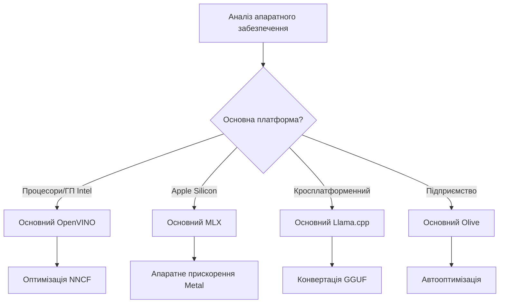
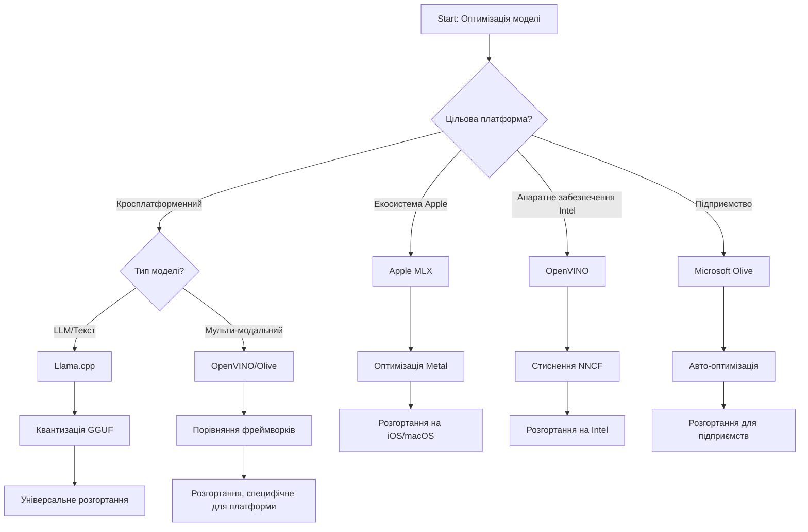
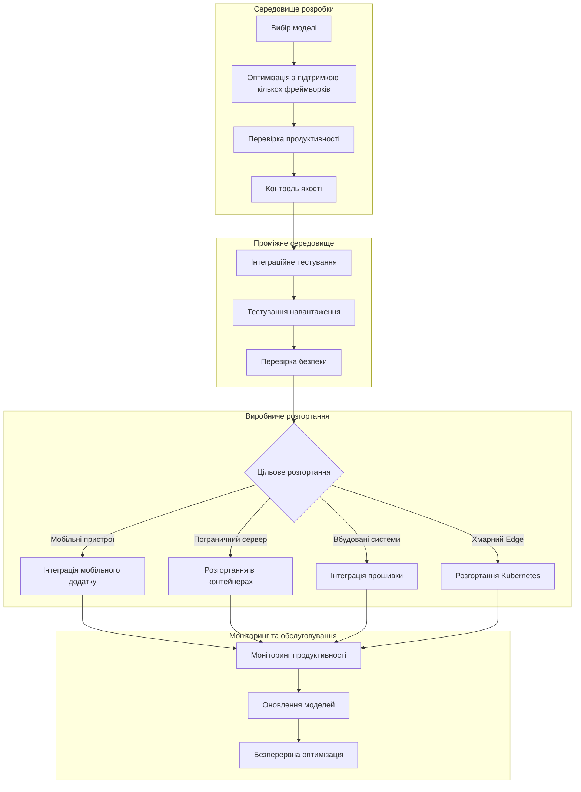

# Розділ 6: Синтез робочого процесу розробки Edge AI

## Зміст
1. [Вступ](#вступ)
2. [Навчальні цілі](#навчальні-цілі)
3. [Огляд єдиного робочого процесу](#огляд-єдиного-робочого-процесу)
4. [Матриця вибору фреймворку](#матриця-вибору-фреймворку)
5. [Синтез найкращих практик](#синтез-найкращих-практик)
6. [Посібник зі стратегії розгортання](#посібник-зі-стратегії-розгортання)
7. [Робочий процес оптимізації продуктивності](#робочий-процес-оптимізації-продуктивності)
8. [Перелік для готовності до виробництва](#перелік-готовності-до-виробництва)
9. [Усунення неполадок та моніторинг](#усунення-неполадок-і-моніторинг)
10. [Забезпечення майбутньої життєздатності вашого Edge AI конвеєра](#забезпечення-майбутньої-життєздатності-вашого-edge-ai-конвеєра)

## Вступ

Розробка Edge AI вимагає складного розуміння кількох фреймворків оптимізації, стратегій розгортання та апаратних особливостей. Цей всебічний синтез об’єднує знання з Llama.cpp, Microsoft Olive, OpenVINO і Apple MLX, створюючи єдиний робочий процес, що максимізує ефективність, підтримує якість і забезпечує успішне впровадження у виробництво.

Протягом цього курсу ми досліджували окремі фреймворки оптимізації, кожен із унікальними сильними сторонами та спеціалізованими випадками використання. Але реальні проєкти Edge AI часто потребують комбінування технік із кількох фреймворків або стратегічних рішень щодо підходу, що принесе найкращі результати для конкретних обмежень і вимог.

Цей розділ синтезує колективну мудрість усіх фреймворків у дієві робочі процеси, дерева рішень і найкращі практики, що дозволяють ефективно і результативно створювати готові до виробництва рішення Edge AI. Незалежно від того, чи оптимізуєте ви для мобільних пристроїв, вбудованих систем або серверів на периферії, цей посібник надає стратегічну основу для прийняття обґрунтованих рішень протягом усього циклу розробки.

## Навчальні цілі

Наприкінці цього розділу ви зможете:

### Стратегічне прийняття рішень
- **Оцінювати та вибирати** оптимальний фреймворк оптимізації на основі вимог проєкту, апаратних обмежень і сценаріїв розгортання
- **Розробляти комплексні робочі процеси**, які інтегрують кілька технік оптимізації для максимальної ефективності
- **Оцінювати компроміси** між точністю моделі, швидкістю висновку, використанням пам’яті та складністю розгортання у різних фреймворках

### Інтеграція робочих процесів
- **Впроваджувати єдині конвеєри розробки**, які використовують сильні сторони кількох фреймворків оптимізації
- **Створювати відтворювані робочі процеси** для послідовної оптимізації модель і розгортання в різних середовищах
- **Встановлювати контрольні точки якості** та процеси валідації, щоб гарантувати відповідність оптимізованих моделей вимогам виробництва

### Оптимізація продуктивності
- **Застосовувати систематичні стратегії оптимізації** за допомогою квантування, обрізки та апаратно-специфічних методів прискорення
- **Моніторити та проводити бенчмарки** продуктивності моделей на різних рівнях оптимізації і для різних цільових платформ
- **Оптимізувати для конкретних апаратних платформ** включно з CPU, GPU, NPU та спеціалізованими акцелераторами на периферії

### Виробниче розгортання
- **Проєктувати масштабовані архітектури розгортання**, що підтримують кілька форматів моделей і двигунів висновку
- **Впроваджувати моніторинг та спостережливість** для додатків Edge AI у виробничих середовищах
- **Встановлювати робочі процеси обслуговування** для оновлень моделей, моніторингу продуктивності та оптимізації системи

### Відмінна робота на різних платформах
- **Розгортати оптимізовані моделі** на різноманітних апаратних платформах, підтримуючи стабільну продуктивність
- **Здійснювати платформно-специфічні оптимізації** для Windows, macOS, Linux, мобільних і вбудованих систем
- **Створювати шари абстракції**, що забезпечують безшовне розгортання на різних периферійних середовищах

## Огляд єдиного робочого процесу

### Фаза 1: Аналіз вимог і вибір фреймворку

Основою успішного розгортання Edge AI є ретельний аналіз вимог, який формує вибір фреймворку та стратегію оптимізації.

#### 1.1 Оцінка апаратного забезпечення


**Ключові аспекти:**
- **Архітектура CPU**: можливості x86, ARM, Apple Silicon
- **Наявність акцелераторів**: GPU, NPU, VPU, спеціалізовані AI-чіпи
- **Обмеження пам’яті**: ліміти ОЗП, обʼєм сховища
- **Бюджет енергоспоживання**: батарея, теплові обмеження
- **Підключення**: вимоги до офлайн-режиму, обмеження пропускної здатності

#### 1.2 Матриця вимог застосунку

| Вимога | Llama.cpp | Microsoft Olive | OpenVINO | Apple MLX |
|-------------|-----------|-----------------|----------|-----------|
| Кросплатформність | ✅ Відмінно | ⚡ Добре | ⚡ Добре | ❌ Тільки Apple |
| Інтеграція для підприємств | ⚡ Базова | ✅ Відмінно | ✅ Відмінно | ⚡ Обмежена |
| Розгортання на мобільних | ✅ Відмінно | ⚡ Добре | ⚡ Добре | ✅ iOS Відмінно |
| Вивід у реальному часі | ✅ Відмінно | ✅ Відмінно | ✅ Відмінно | ✅ Відмінно |
| Різноманітність моделей | ✅ Фокус на LLM | ✅ Всі моделі | ✅ Всі моделі | ✅ Фокус на LLM |
| Простота використання | ✅ Просто | ✅ Автоматизовано | ⚡ Помірно | ✅ Просто |

### Фаза 2: Підготовка моделі і оптимізація

#### 2.1 Універсальний конвеєр оцінки моделі

```python
# Універсальна рамкова система оцінки моделей
class EdgeAIModelAssessment:
    def __init__(self, model_path, target_hardware):
        self.model_path = model_path
        self.target_hardware = target_hardware
        self.optimization_frameworks = []
        
    def assess_model_characteristics(self):
        """Analyze model size, architecture, and complexity"""
        return {
            'model_size': self.get_model_size(),
            'parameter_count': self.get_parameter_count(),
            'architecture_type': self.detect_architecture(),
            'quantization_compatibility': self.check_quantization_support()
        }
    
    def recommend_optimization_strategy(self):
        """Recommend optimal frameworks and techniques"""
        characteristics = self.assess_model_characteristics()
        
        if self.target_hardware.startswith('apple'):
            return self.mlx_optimization_strategy(characteristics)
        elif self.target_hardware.startswith('intel'):
            return self.openvino_optimization_strategy(characteristics)
        elif characteristics['model_size'] > 7_000_000_000:  # Понад 7 мільярдів параметрів
            return self.enterprise_optimization_strategy(characteristics)
        else:
            return self.lightweight_optimization_strategy(characteristics)
```

#### 2.2 Конвеєр багатофреймворкової оптимізації

**Послідовний підхід до оптимізації:**
1. **Початкове конвертування**: переведення у проміжний формат (ONNX, коли можливо)
2. **Оптимізація для конкретного фреймворку**: застосування спеціалізованих технік
3. **Перехресна валідація**: перевірка продуктивності на цільових платформах
4. **Фінальна упаковка**: підготовка до розгортання

```bash
# Скрипт багатоплатформної оптимізації
#!/bin/bash

MODEL_NAME="phi-3-mini"
BASE_MODEL="microsoft/Phi-3-mini-4k-instruct"

# Фаза 1: Конвертація ONNX (універсальна)
python convert_to_onnx.py --model $BASE_MODEL --output models/onnx/

# Фаза 2: Оптимізація для конкретної платформи
if [[ "$TARGET_PLATFORM" == "intel" ]]; then
    # Оптимізація OpenVINO
    python optimize_openvino.py --input models/onnx/ --output models/openvino/
elif [[ "$TARGET_PLATFORM" == "apple" ]]; then
    # Оптимізація MLX
    python optimize_mlx.py --input $BASE_MODEL --output models/mlx/
elif [[ "$TARGET_PLATFORM" == "cross" ]]; then
    # Оптимізація Llama.cpp
    python convert_to_gguf.py --input models/onnx/ --output models/gguf/
fi

# Фаза 3: Валідація
python validate_optimization.py --original $BASE_MODEL --optimized models/$TARGET_PLATFORM/
```

### Фаза 3: Валідація продуктивності і бенчмаркінг

#### 3.1 Комплексний фреймворк бенчмаркінгу

```python
class EdgeAIBenchmark:
    def __init__(self, optimized_models):
        self.models = optimized_models
        self.metrics = {
            'inference_time': [],
            'memory_usage': [],
            'accuracy_score': [],
            'throughput': [],
            'energy_consumption': []
        }
    
    def run_comprehensive_benchmark(self):
        """Execute standardized benchmarks across all optimized models"""
        test_inputs = self.generate_test_inputs()
        
        for model_framework, model_path in self.models.items():
            print(f"Benchmarking {model_framework}...")
            
            # Тестування затримки
            latency = self.measure_inference_latency(model_path, test_inputs)
            
            # Профілювання пам'яті
            memory = self.profile_memory_usage(model_path)
            
            # Перевірка точності
            accuracy = self.validate_model_accuracy(model_path, test_inputs)
            
            # Аналіз пропускної здатності
            throughput = self.measure_throughput(model_path)
            
            self.record_metrics(model_framework, latency, memory, accuracy, throughput)
    
    def generate_optimization_report(self):
        """Create comprehensive comparison report"""
        report = {
            'recommendations': self.analyze_performance_trade_offs(),
            'deployment_guidance': self.generate_deployment_recommendations(),
            'monitoring_requirements': self.define_monitoring_metrics()
        }
        return report
```

## Матриця вибору фреймворку

### Дерево рішень для вибору фреймворку



### Комплексні критерії вибору

#### 1. Основна сфера застосування

**Великі мовні моделі (LLM):**
- **Llama.cpp**: Найкраще для CPU-орієнтованого, кросплатформного розгортання
- **Apple MLX**: Оптимально для Apple Silicon із об'єднаною пам’яттю
- **OpenVINO**: Відмінно для апаратного забезпечення Intel з оптимізацією NNCF
- **Microsoft Olive**: Ідеально для корпоративних робочих процесів з автоматизацією

**Мультимодальні моделі:**
- **OpenVINO**: Комплексна підтримка для відео, аудіо та тексту
- **Microsoft Olive**: Корпоративна оптимізація для складних конвеєрів
- **Llama.cpp**: Обмежено текстовими моделями
- **Apple MLX**: Зростаюча підтримка мультимодальних застосунків

#### 2. Матриця апаратної платформи

| Платформа | Основний фреймворк | Вторинний варіант | Спеціалізовані можливості |
|----------|------------------|------------------|---------------------|
| Intel CPU/GPU | OpenVINO | Microsoft Olive | Стиснення NNCF, оптимізація Intel |
| NVIDIA GPU | Microsoft Olive | OpenVINO | Прискорення CUDA, корпоративні функції |
| Apple Silicon | Apple MLX | Llama.cpp | Метал шейдери, об'єднана памʼять |
| ARM Mobile | Llama.cpp | OpenVINO | Кросплатформність, мінімальні залежності |
| Edge TPU | OpenVINO | Microsoft Olive | Підтримка спеціалізованих акцелераторів |
| Вбудований ARM | Llama.cpp | OpenVINO | Мінімальний слід, ефективний висновок |

#### 3. Переваги у робочому процесі розробки

**Швидке прототипування:**
1. **Llama.cpp**: Найшвидше налаштування, миттєві результати
2. **Apple MLX**: Простий Python API, швидка ітерація
3. **Microsoft Olive**: Автоматизована оптимізація, мінімальна конфігурація
4. **OpenVINO**: Складніше налаштування, комплексний функціонал

**Виробництво для підприємств:**
1. **Microsoft Olive**: Корпоративні функції, інтеграція з Azure
2. **OpenVINO**: Екосистема Intel, комплексні інструменти
3. **Apple MLX**: Підприємницькі застосунки, орієнтовані на Apple
4. **Llama.cpp**: Просте розгортання, обмежений корпоративний функціонал

## Синтез найкращих практик

### Загальні принципи оптимізації

#### 1. Прогресивна стратегія оптимізації

```python
class ProgressiveOptimization:
    def __init__(self, base_model):
        self.base_model = base_model
        self.optimization_stages = [
            'baseline_measurement',
            'format_conversion',
            'quantization_optimization',
            'hardware_acceleration',
            'production_validation'
        ]
    
    def execute_progressive_optimization(self):
        """Apply optimization techniques incrementally"""
        
        # Етап 1: Вимірювання базового рівня
        baseline_metrics = self.measure_baseline_performance()
        
        # Етап 2: Конвертація формату
        converted_model = self.convert_to_optimal_format()
        conversion_metrics = self.measure_performance(converted_model)
        
        # Етап 3: Квантування
        quantized_model = self.apply_quantization(converted_model)
        quantization_metrics = self.measure_performance(quantized_model)
        
        # Етап 4: Апаратне прискорення
        accelerated_model = self.enable_hardware_acceleration(quantized_model)
        acceleration_metrics = self.measure_performance(accelerated_model)
        
        # Етап 5: Валідація
        production_ready = self.validate_for_production(accelerated_model)
        
        return self.compile_optimization_report(
            baseline_metrics, conversion_metrics, 
            quantization_metrics, acceleration_metrics
        )
```

#### 2. Впровадження контрольних точок якості

**Контрольні точки збереження точності:**
- Підтримувати >95% початкової точності моделі
- Проводити валідацію на репрезентативних тестових даних
- Реалізовувати A/B тестування для виробничої валідації

**Контрольні точки покращення продуктивності:**
- Досягати щонайменше 2-кратного покращення швидкості
- Зменшувати об'єм пам’яті принаймні на 50%
- Забезпечувати сталість часу висновку

**Контрольні точки готовності до виробництва:**
- Проходити стрес-тестування під навантаженням
- Демонструвати стабільну продуктивність з часом
- Проводити валідацію вимог з безпеки та конфіденційності

### Інтеграція найкращих практик, специфічних для фреймворку

#### 1. Синтез стратегії квантування

```python
# Уніфікований підхід до квантування
class UnifiedQuantizationStrategy:
    def __init__(self, model, target_platform):
        self.model = model
        self.platform = target_platform
        
    def select_optimal_quantization(self):
        """Choose best quantization based on platform and requirements"""
        
        if self.platform == 'apple_silicon':
            return self.mlx_quantization_strategy()
        elif self.platform == 'intel_hardware':
            return self.openvino_quantization_strategy()
        elif self.platform == 'cross_platform':
            return self.llamacpp_quantization_strategy()
        else:
            return self.olive_quantization_strategy()
    
    def mlx_quantization_strategy(self):
        """Apple MLX-specific quantization"""
        return {
            'method': 'mlx_quantize',
            'precision': 'int4',
            'group_size': 64,
            'optimization_target': 'unified_memory'
        }
    
    def openvino_quantization_strategy(self):
        """OpenVINO NNCF quantization"""
        return {
            'method': 'nncf_quantize',
            'precision': 'int8',
            'calibration_method': 'post_training',
            'optimization_target': 'intel_hardware'
        }
```

#### 2. Оптимізація апаратного прискорення

**Синтез оптимізації CPU:**
- **Інструкції SIMD**: використання оптимізованих ядер між фреймворками
- **Пропускна здатність пам’яті**: оптимізація структури даних для ефективності кешу
- **Паралелізм потоків**: балансування ефективності та апаратних обмежень

**Найкращі практики прискорення GPU:**
- **Пакетна обробка**: максимізація пропускної здатності за допомогою оптимального розміру пакетів
- **Управління пам’яттю**: оптимізація алокації та передачі пам’яті GPU
- **Точність**: використання FP16, коли підтримується, для покращення продуктивності

**Оптимізація NPU/спеціалізованих акселераторів:**
- **Архітектура моделі**: забезпечення сумісності з можливостями акселератора
- **Потік даних**: оптимізація pipeline введення/виведення для ефективності акселератора
- **Стратегії резервного варіанту**: впровадження відкату на CPU для неподдержуваних операцій

## Посібник зі стратегії розгортання

### Універсальна архітектура розгортання



### Патерни розгортання залежно від платформи

#### 1. Стратегія розгортання на мобільних пристроях

```yaml
# Mobile Deployment Configuration
mobile_deployment:
  ios:
    framework: apple_mlx
    optimization:
      quantization: int4
      memory_mapping: true
      background_execution: limited
    packaging:
      format: mlx
      bundle_size: <50MB
      
  android:
    framework: llama_cpp
    optimization:
      quantization: q4_k_m
      threading: android_optimized
      memory_management: conservative
    packaging:
      format: gguf
      apk_size: <100MB
      
  cross_platform:
    framework: onnx_runtime
    optimization:
      quantization: int8
      execution_provider: cpu
    packaging:
      format: onnx
      shared_libraries: minimal
```

#### 2. Розгортання на edge-серверах

```yaml
# Edge Server Deployment Configuration
edge_server:
  intel_based:
    framework: openvino
    optimization:
      quantization: int8
      acceleration: cpu_gpu_auto
      batch_processing: dynamic
    deployment:
      container: openvino_runtime
      orchestration: kubernetes
      scaling: horizontal
      
  nvidia_based:
    framework: microsoft_olive
    optimization:
      quantization: int4
      acceleration: cuda
      tensor_parallelism: true
    deployment:
      container: nvidia_triton
      orchestration: kubernetes
      scaling: gpu_aware
```

### Найкращі практики контейнеризації

```dockerfile
# Multi-Framework Edge AI Container
FROM ubuntu:22.04 as base

# Install common dependencies
RUN apt-get update && apt-get install -y \
    python3 \
    python3-pip \
    build-essential \
    cmake \
    && rm -rf /var/lib/apt/lists/*

# Framework-specific stages
FROM base as openvino
RUN pip install openvino nncf optimum[intel]

FROM base as llamacpp
RUN git clone https://github.com/ggerganov/llama.cpp.git \
    && cd llama.cpp && make LLAMA_OPENBLAS=1

FROM base as olive
RUN pip install olive-ai[auto-opt] onnxruntime-genai

# Production stage with selected framework
FROM openvino as production
COPY models/ /app/models/
COPY src/ /app/src/
WORKDIR /app

EXPOSE 8080
CMD ["python3", "src/inference_server.py"]
```

## Робочий процес оптимізації продуктивності

### Систематичне налаштування продуктивності

#### 1. Конвеєр профілювання продуктивності

```python
class EdgeAIPerformanceProfiler:
    def __init__(self, model_path, framework):
        self.model_path = model_path
        self.framework = framework
        self.profiling_results = {}
    
    def comprehensive_profiling(self):
        """Execute comprehensive performance analysis"""
        
        # Профілювання ЦП
        cpu_profile = self.profile_cpu_usage()
        
        # Профілювання пам'яті
        memory_profile = self.profile_memory_usage()
        
        # Затримка виводу
        latency_profile = self.profile_inference_latency()
        
        # Аналіз пропускної здатності
        throughput_profile = self.profile_throughput()
        
        # Споживання енергії (де доступно)
        energy_profile = self.profile_energy_consumption()
        
        return self.compile_performance_report(
            cpu_profile, memory_profile, latency_profile,
            throughput_profile, energy_profile
        )
    
    def identify_bottlenecks(self):
        """Automatically identify performance bottlenecks"""
        bottlenecks = []
        
        if self.profiling_results['cpu_utilization'] > 80:
            bottlenecks.append('cpu_bound')
        
        if self.profiling_results['memory_usage'] > 90:
            bottlenecks.append('memory_bound')
        
        if self.profiling_results['inference_variance'] > 20:
            bottlenecks.append('inconsistent_performance')
        
        return self.generate_optimization_recommendations(bottlenecks)
```

#### 2. Автоматизований конвеєр оптимізації

```python
class AutomatedOptimizationPipeline:
    def __init__(self, base_model, target_constraints):
        self.base_model = base_model
        self.constraints = target_constraints
        self.optimization_history = []
    
    def execute_optimization_search(self):
        """Systematically search optimization space"""
        
        optimization_candidates = [
            {'quantization': 'int8', 'pruning': 0.1},
            {'quantization': 'int4', 'pruning': 0.2},
            {'quantization': 'int8', 'acceleration': 'gpu'},
            {'quantization': 'int4', 'acceleration': 'npu'}
        ]
        
        best_configuration = None
        best_score = 0
        
        for config in optimization_candidates:
            optimized_model = self.apply_optimization(config)
            score = self.evaluate_optimization(optimized_model)
            
            if score > best_score and self.meets_constraints(optimized_model):
                best_score = score
                best_configuration = config
            
            self.optimization_history.append({
                'config': config,
                'score': score,
                'model': optimized_model
            })
        
        return best_configuration, self.optimization_history
```

### Багатоцільова оптимізація

#### 1. Оптимізація Парето для Edge AI

```python
class ParetoOptimization:
    def __init__(self, objectives=['speed', 'accuracy', 'memory']):
        self.objectives = objectives
        self.pareto_frontier = []
    
    def find_pareto_optimal_solutions(self, optimization_results):
        """Identify Pareto-optimal configurations"""
        
        for result in optimization_results:
            is_dominated = False
            
            for frontier_point in self.pareto_frontier:
                if self.dominates(frontier_point, result):
                    is_dominated = True
                    break
            
            if not is_dominated:
                # Видалити доміновані точки з фронту
                self.pareto_frontier = [
                    point for point in self.pareto_frontier 
                    if not self.dominates(result, point)
                ]
                
                self.pareto_frontier.append(result)
        
        return self.pareto_frontier
    
    def recommend_configuration(self, user_preferences):
        """Recommend configuration based on user preferences"""
        
        weighted_scores = []
        for config in self.pareto_frontier:
            score = sum(
                user_preferences[obj] * config['metrics'][obj] 
                for obj in self.objectives
            )
            weighted_scores.append((score, config))
        
        return max(weighted_scores, key=lambda x: x[0])[1]
```

## Перелік готовності до виробництва

### Комплексна валідація виробництва

#### 1. Забезпечення якості моделі

```python
class ProductionReadinessValidator:
    def __init__(self, optimized_model, production_requirements):
        self.model = optimized_model
        self.requirements = production_requirements
        self.validation_results = {}
    
    def validate_model_quality(self):
        """Comprehensive model quality validation"""
        
        # Перевірка точності
        accuracy_result = self.validate_accuracy()
        
        # Перевірка продуктивності
        performance_result = self.validate_performance()
        
        # Тестування на стійкість
        robustness_result = self.validate_robustness()
        
        # Оцінка безпеки
        security_result = self.validate_security()
        
        # Перевірка відповідності
        compliance_result = self.validate_compliance()
        
        return self.compile_validation_report(
            accuracy_result, performance_result, robustness_result,
            security_result, compliance_result
        )
    
    def generate_certification_report(self):
        """Generate production certification report"""
        return {
            'model_signature': self.generate_model_signature(),
            'validation_timestamp': datetime.now(),
            'validation_results': self.validation_results,
            'deployment_approval': self.check_deployment_approval(),
            'monitoring_requirements': self.define_monitoring_requirements()
        }
```

#### 2. Перелік перевірок перед розгортанням

**Валідація перед розгортанням:**
- [ ] Точність моделі відповідає мінімальним вимогам (>95% від базового рівня)
- [ ] Досягнені цільові показники продуктивності (затримка, пропускна здатність, пам’ять)
- [ ] Оцінка та усунення вразливостей у безпеці
- [ ] Завершене стрес-тестування під очікуваним навантаженням
- [ ] Перевірені сценарії відмов та процедури відновлення
- [ ] Налаштовані системи моніторингу та оповіщення
- [ ] Перевірені та задокументовані процедури відкату

**Процес розгортання:**
- [ ] Впроваджена стратегія blue-green deployment
- [ ] Налаштоване поступове нарощування трафіку
- [ ] Активні панелі моніторингу в реальному часі
- [ ] Встановлені базові показники продуктивності
- [ ] Визначені пороги помилок
- [ ] Налаштовані тригери автоматичного відкату

**Пост-виробничий моніторинг:**
- [ ] Активний контроль дрейфу моделі
- [ ] Налаштовані оповіщення про погіршення продуктивності
- [ ] Увімкнений моніторинг використання ресурсів
- [ ] Відстеження показників користувацького досвіду
- [ ] Підтримка версіонування і спадковості моделей
- [ ] Заплановані регулярні огляди продуктивності моделей

### Безперервна інтеграція / Безперервне розгортання (CI/CD)

```yaml
# Edge AI CI/CD Pipeline Configuration
edge_ai_pipeline:
  stages:
    - model_validation
    - optimization
    - testing
    - staging_deployment
    - production_deployment
    - monitoring
  
  model_validation:
    accuracy_threshold: 0.95
    performance_baseline: required
    security_scan: enabled
    
  optimization:
    frameworks:
      - llama_cpp
      - openvino
      - microsoft_olive
    validation:
      cross_validation: enabled
      performance_comparison: required
      
  testing:
    unit_tests: comprehensive
    integration_tests: full_pipeline
    load_tests: production_scale
    security_tests: comprehensive
    
  deployment:
    strategy: blue_green
    traffic_ramping: gradual
    rollback: automatic
    monitoring: real_time
```

## Усунення неполадок і моніторинг

### Універсальний фреймворк усунення неполадок

#### 1. Поширені проблеми та рішення

**Проблеми продуктивності:**
```python
class PerformanceTroubleshooter:
    def __init__(self, model_metrics):
        self.metrics = model_metrics
        
    def diagnose_performance_issues(self):
        """Systematic performance issue diagnosis"""
        
        issues = []
        
        # Діагностика високої затримки
        if self.metrics['avg_latency'] > self.metrics['target_latency']:
            issues.append(self.diagnose_latency_issues())
        
        # Діагностика використання пам’яті
        if self.metrics['memory_usage'] > self.metrics['memory_limit']:
            issues.append(self.diagnose_memory_issues())
        
        # Діагностика пропускної здатності
        if self.metrics['throughput'] < self.metrics['target_throughput']:
            issues.append(self.diagnose_throughput_issues())
        
        return self.generate_resolution_plan(issues)
    
    def diagnose_latency_issues(self):
        """Specific latency troubleshooting"""
        potential_causes = []
        
        if self.metrics['cpu_utilization'] > 80:
            potential_causes.append('cpu_bottleneck')
        
        if self.metrics['memory_bandwidth'] > 90:
            potential_causes.append('memory_bandwidth_limit')
        
        if self.metrics['model_size'] > self.metrics['optimal_size']:
            potential_causes.append('model_too_large')
        
        return {
            'issue': 'high_latency',
            'causes': potential_causes,
            'solutions': self.generate_latency_solutions(potential_causes)
        }
```

**Усунення неполадок, специфічних для фреймворку:**

| Проблема | Llama.cpp | Microsoft Olive | OpenVINO | Apple MLX |
|-------|-----------|-----------------|----------|-----------|
| Проблеми з пам’яттю | Зменшити довжину контексту | Зменшити розмір батча | Увімкнути кешування | Використати мапування пам’яті |
| Повільний висновок | Увімкнути SIMD | Перевірити квантування | Оптимізувати багатопоточність | Увімкнути Metal |
| Втрата точності | Вищий рівень квантування | Переобучення з QAT | Підвищити калібрування | Тонке налаштування постквантування |
| Сумісність | Перевірити формат моделі | Перевірити версію фреймворку | Оновити драйвери | Перевірити версію macOS |

#### 2. Стратегія моніторингу виробництва

```python
class EdgeAIMonitoring:
    def __init__(self, deployment_config):
        self.config = deployment_config
        self.metrics_collectors = []
        self.alerting_rules = []
    
    def setup_comprehensive_monitoring(self):
        """Configure comprehensive monitoring for Edge AI deployment"""
        
        # Моніторинг продуктивності моделі
        self.setup_model_performance_monitoring()
        
        # Моніторинг інфраструктури
        self.setup_infrastructure_monitoring()
        
        # Моніторинг бізнес-метрик
        self.setup_business_metrics_monitoring()
        
        # Моніторинг безпеки
        self.setup_security_monitoring()
    
    def setup_model_performance_monitoring(self):
        """Model-specific performance monitoring"""
        metrics = [
            'inference_latency_p50',
            'inference_latency_p95',
            'inference_latency_p99',
            'model_accuracy_drift',
            'prediction_confidence_distribution',
            'error_rate',
            'throughput_requests_per_second'
        ]
        
        for metric in metrics:
            self.add_metric_collector(metric)
            self.add_alerting_rule(metric)
    
    def detect_model_drift(self):
        """Automated model drift detection"""
        drift_indicators = [
            self.statistical_drift_detection(),
            self.performance_drift_detection(),
            self.data_distribution_shift_detection()
        ]
        
        return self.aggregate_drift_signals(drift_indicators)
```

### Автоматизоване вирішення проблем

```python
class AutomatedIssueResolution:
    def __init__(self, monitoring_system):
        self.monitoring = monitoring_system
        self.resolution_strategies = {}
    
    def handle_performance_degradation(self, alert):
        """Automated performance issue resolution"""
        
        if alert['type'] == 'high_latency':
            return self.resolve_latency_issue(alert)
        elif alert['type'] == 'high_memory_usage':
            return self.resolve_memory_issue(alert)
        elif alert['type'] == 'accuracy_drift':
            return self.resolve_accuracy_issue(alert)
        
    def resolve_latency_issue(self, alert):
        """Automated latency issue resolution"""
        resolution_steps = [
            'increase_cpu_allocation',
            'enable_model_caching',
            'reduce_batch_size',
            'switch_to_quantized_model'
        ]
        
        for step in resolution_steps:
            if self.apply_resolution_step(step):
                return f"Resolved latency issue with: {step}"
        
        return "Escalating to human operator"
```

## Забезпечення майбутньої життєздатності вашого Edge AI конвеєра

### Інтеграція нових технологій

#### 1. Підтримка апаратного забезпечення наступного покоління

```python
class FutureHardwareIntegration:
    def __init__(self):
        self.supported_accelerators = [
            'npu_next_gen',
            'quantum_processors',
            'neuromorphic_chips',
            'optical_processors'
        ]
    
    def design_adaptive_pipeline(self):
        """Create hardware-agnostic optimization pipeline"""
        
        pipeline = {
            'model_preparation': self.universal_model_preparation(),
            'hardware_detection': self.dynamic_hardware_detection(),
            'optimization_selection': self.adaptive_optimization_selection(),
            'performance_validation': self.hardware_agnostic_validation()
        }
        
        return pipeline
    
    def adaptive_optimization_selection(self):
        """Dynamically select optimization based on available hardware"""
        
        def optimize_for_hardware(model, available_hardware):
            if 'npu' in available_hardware:
                return self.npu_optimization(model)
            elif 'quantum' in available_hardware:
                return self.quantum_optimization(model)
            elif 'neuromorphic' in available_hardware:
                return self.neuromorphic_optimization(model)
            else:
                return self.fallback_optimization(model)
        
        return optimize_for_hardware
```

#### 2. Еволюція архітектури моделей

**Підтримка новітніх архітектур:**
- **Mixture of Experts (MoE)**: Спарсні архітектури моделей для ефективності
- **Retrieval-Augmented Generation**: Гібридні системи моделі + бази знань
- **Мультимодальні моделі**: Інтеграція візуальних, мовних і аудіо компонентів
- **Федеративне навчання**: Розподілене навчання та оптимізація

```python
class NextGenModelSupport:
    def __init__(self):
        self.architecture_handlers = {
            'moe': self.handle_mixture_of_experts,
            'rag': self.handle_retrieval_augmented,
            'multimodal': self.handle_multimodal,
            'federated': self.handle_federated_learning
        }
    
    def handle_mixture_of_experts(self, model):
        """Optimize Mixture of Experts models for edge deployment"""
        optimization_strategy = {
            'expert_pruning': True,
            'routing_optimization': True,
            'expert_quantization': 'per_expert',
            'load_balancing': 'dynamic'
        }
        return self.apply_moe_optimization(model, optimization_strategy)
```

### Безперервне навчання та адаптація

#### 1. Інтеграція онлайн-навчання

```python
class EdgeOnlineLearning:
    def __init__(self, base_model, learning_rate=0.001):
        self.base_model = base_model
        self.learning_rate = learning_rate
        self.adaptation_buffer = []
    
    def continuous_adaptation(self, new_data, feedback):
        """Continuously adapt model based on edge data"""
        
        # Приватність забезпечує локальну адаптацію
        local_updates = self.compute_local_gradients(new_data, feedback)
        
        # Застосувати оновлення з обмеженнями
        adapted_model = self.apply_constrained_updates(
            self.base_model, local_updates
        )
        
        # Перевірити якість адаптації
        if self.validate_adaptation(adapted_model):
            self.base_model = adapted_model
            return True
        
        return False
    
    def federated_learning_participation(self):
        """Participate in federated learning while preserving privacy"""
        
        # Обчислити локальні оновлення моделі
        local_updates = self.compute_private_updates()
        
        # Захист диференціальної приватності
        private_updates = self.apply_differential_privacy(local_updates)
        
        # Обмінюватися з координатором федеративного навчання
        return self.share_updates(private_updates)
```

#### 2. Сталий розвиток і «зелений» AI

```python
class GreenEdgeAI:
    def __init__(self, sustainability_targets):
        self.targets = sustainability_targets
        self.energy_monitor = EnergyMonitor()
    
    def optimize_for_sustainability(self, model):
        """Optimize model for minimal environmental impact"""
        
        optimization_objectives = [
            'minimize_energy_consumption',
            'maximize_hardware_utilization',
            'reduce_model_training_cost',
            'extend_device_lifetime'
        ]
        
        return self.multi_objective_green_optimization(
            model, optimization_objectives
        )
    
    def carbon_aware_deployment(self):
        """Deploy models considering carbon footprint"""
        
        deployment_strategy = {
            'prefer_renewable_energy_regions': True,
            'optimize_for_energy_efficiency': True,
            'minimize_data_transfer': True,
            'lifecycle_carbon_accounting': True
        }
        
        return deployment_strategy
```

## Висновок

Цей комплексний синтез робочих процесів представляє кульмінацію знань оптимізації EdgeAI, об'єднуючи найкращі практики всіх основних фреймворків оптимізації в єдиний, готовий до виробництва підхід. Дотримуючись цих рекомендацій, ви зможете:

**Досягти оптимальної продуктивності**: завдяки систематичному вибору фреймворку, прогресивній оптимізації та комплексній валідації, забезпечуючи максимальну ефективність ваших Edge AI додатків.

**Гарантувати готовність до виробництва**: за допомогою ретельного тестування, моніторингу та контрольних точок якості, що гарантують надійне розгортання та роботу у реальних умовах.

**Підтримувати довготривалий успіх**: через постійний моніторинг, автоматизоване вирішення проблем і стратегії адаптації, що зберігають продуктивність та актуальність рішень Edge AI.

**Забезпечити майбутню життєздатність інвестицій**: створюючи гнучкі, апаратно-агностичні конвеєри, які можуть розвиватися разом із новими технологіями та вимогами.

Ландшафт Edge AI швидко змінюється, регулярно з’являються нові апаратні платформи, методи оптимізації та стратегії розгортання. Цей синтез забезпечує основу для орієнтування у цій складності, створюючи надійні, ефективні та підтримувані рішення Edge AI, які приносять реальну цінність у виробничих середовищах.

Пам’ятайте, що найкраща стратегія оптимізації — це та, що задовольняє ваші конкретні вимоги, зберігаючи гнучкість для адаптації у міру їх зміни. Використовуйте цей посібник як основу для прийняття обґрунтованих рішень, але завжди підтверджуйте вибір емпіричним тестуванням і досвідом реального виробничого розгортання.

## ➡️ Що далі


- [07: Детальний огляд Qualcomm QNN Framework](./07.QualcommQNN.md)

---

<!-- CO-OP TRANSLATOR DISCLAIMER START -->
**Відмова від відповідальності**:
Цей документ було перекладено за допомогою сервісу штучного інтелекту для перекладу [Co-op Translator](https://github.com/Azure/co-op-translator). Хоча ми прагнемо до точності, будь ласка, майте на увазі, що автоматичні переклади можуть містити помилки або неточності. Оригінальний документ рідною мовою слід вважати авторитетним джерелом. Для критично важливої інформації рекомендується професійний людський переклад. Ми не несемо відповідальності за будь-які непорозуміння або неправильні тлумачення, що виникли внаслідок використання цього перекладу.
<!-- CO-OP TRANSLATOR DISCLAIMER END -->