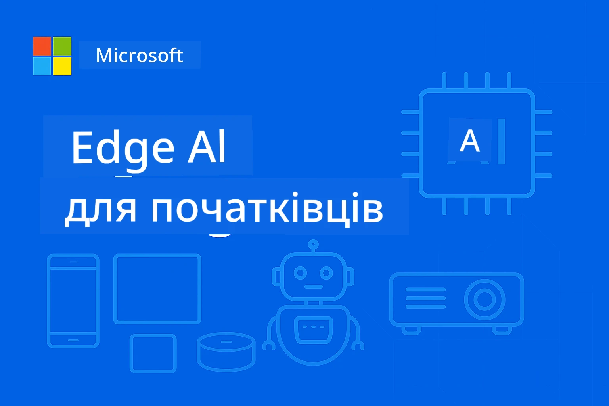

# EdgeAI для початківців 




[](https://GitHub.com/microsoft/edgeai-for-beginners/graphs/contributors)
[](https://GitHub.com/microsoft/edgeai-for-beginners/issues)
[](https://GitHub.com/microsoft/edgeai-for-beginners/pulls)
[](http://makeapullrequest.com)

[](https://GitHub.com/microsoft/edgeai-for-beginners/watchers)
[](https://GitHub.com/microsoft/edgeai-for-beginners/fork)
[](https://GitHub.com/microsoft/edgeai-for-beginners/stargazers)


[](https://discord.gg/nTYy5BXMWG)

Виконайте ці кроки, щоб почати використовувати ці ресурси:

1. **Форкніть репозиторій**: натисніть [](https://GitHub.com/microsoft/edgeai-for-beginners/fork)
2. **Клонуйте репозиторій**:   `git clone https://github.com/microsoft/edgeai-for-beginners.git`
3. [**Приєднуйтесь до Azure AI Foundry Discord, щоб зустріти експертів та колег-розробників**](https://discord.com/invite/ByRwuEEgH4)


### 🌐 Підтримка багатьох мов

#### Підтримується через GitHub Action (автоматично і завжди актуально)

<!-- CO-OP TRANSLATOR LANGUAGES TABLE START -->
[Arabic](../ar/README.md) | [Bengali](../bn/README.md) | [Bulgarian](../bg/README.md) | [Burmese (Myanmar)](../my/README.md) | [Chinese (Simplified)](../zh-CN/README.md) | [Chinese (Traditional, Hong Kong)](../zh-HK/README.md) | [Chinese (Traditional, Macau)](../zh-MO/README.md) | [Chinese (Traditional, Taiwan)](../zh-TW/README.md) | [Croatian](../hr/README.md) | [Czech](../cs/README.md) | [Danish](../da/README.md) | [Dutch](../nl/README.md) | [Estonian](../et/README.md) | [Finnish](../fi/README.md) | [French](../fr/README.md) | [German](../de/README.md) | [Greek](../el/README.md) | [Hebrew](../he/README.md) | [Hindi](../hi/README.md) | [Hungarian](../hu/README.md) | [Indonesian](../id/README.md) | [Italian](../it/README.md) | [Japanese](../ja/README.md) | [Kannada](../kn/README.md) | [Korean](../ko/README.md) | [Lithuanian](../lt/README.md) | [Malay](../ms/README.md) | [Malayalam](../ml/README.md) | [Marathi](../mr/README.md) | [Nepali](../ne/README.md) | [Nigerian Pidgin](../pcm/README.md) | [Norwegian](../no/README.md) | [Persian (Farsi)](../fa/README.md) | [Polish](../pl/README.md) | [Portuguese (Brazil)](../pt-BR/README.md) | [Portuguese (Portugal)](../pt-PT/README.md) | [Punjabi (Gurmukhi)](../pa/README.md) | [Romanian](../ro/README.md) | [Russian](../ru/README.md) | [Serbian (Cyrillic)](../sr/README.md) | [Slovak](../sk/README.md) | [Slovenian](../sl/README.md) | [Spanish](../es/README.md) | [Swahili](../sw/README.md) | [Swedish](../sv/README.md) | [Tagalog (Filipino)](../tl/README.md) | [Tamil](../ta/README.md) | [Telugu](../te/README.md) | [Thai](../th/README.md) | [Turkish](../tr/README.md) | [Ukrainian](./README.md) | [Urdu](../ur/README.md) | [Vietnamese](../vi/README.md)

> **Віддаєте перевагу клонувати локально?**

> Цей репозиторій містить понад 50 мовних перекладів, що суттєво збільшує розмір завантаження. Щоб клонувати без перекладів, використовуйте sparse checkout:
> ```bash
> git clone --filter=blob:none --sparse https://github.com/microsoft/edgeai-for-beginners.git
> cd edgeai-for-beginners
> git sparse-checkout set --no-cone '/*' '!translations' '!translated_images'
> ```
> Це дасть вам все необхідне для проходження курсу з набагато швидшим завантаженням.
<!-- CO-OP TRANSLATOR LANGUAGES TABLE END -->

**Якщо ви бажаєте мати підтримку додаткових мов для перекладів, вони перераховані [тут](https://github.com/Azure/co-op-translator/blob/main/getting_started/supported-languages.md)**
## Вступ

Ласкаво просимо до **EdgeAI для початківців** – вашого всебічного шляху у трансформаційний світ штучного інтелекту на периферії. Цей курс заповнює розрив між потужними можливостями AI та практичним впровадженням у реальному світі на пристроях периферії, даючи вам змогу використовувати потенціал AI безпосередньо там, де генерується дані і приймаються рішення.

### Чого ви навчитеся

Цей курс проведе вас від фундаментальних концепцій до виробничих впроваджень, охоплюючи:
- **Малі мовні моделі (SLMs)**, оптимізовані для розгортання на периферії
- **Оптимізація з урахуванням апаратного забезпечення** на різноманітних платформах
- **Інференс у реальному часі** з можливостями захисту приватності
- **Стратегії виробничого розгортання** для корпоративних застосунків

### Чому EdgeAI важливий

Edge AI представляє парадигму, яка вирішує критичні сучасні виклики:
- **Приватність і безпека**: обробка конфіденційних даних локально без використання хмари
- **Продуктивність у реальному часі**: усунення затримок мережі для критичних застосунків
- **Економічність**: зменшення витрат на пропускну здатність та хмарні обчислення
- **Надійна робота**: підтримка функціональності під час збоїв мережі
- **Відповідність нормам**: дотримання вимог щодо суверенітету даних

### Edge AI

Edge AI означає запуск алгоритмів штучного інтелекту та мовних моделей локально на обладнанні, близько до місця генерації даних, без залежності від хмарних ресурсів для інференсу. Це зменшує затримки, покращує конфіденційність і дає змогу приймати рішення у реальному часі.

### Основні принципи:
- **Інференс на пристрої**: моделі AI працюють на пристроях периферії (телефони, роутери, мікроконтролери, промислові ПК)
- **Оффлайн здатність**: функціонує без постійного підключення до інтернету
- **Низька затримка**: миттєві відповіді, що підходять для систем реального часу
- **Суверенітет даних**: зберігає конфіденційні дані локально, покращуючи безпеку і відповідність

### Малі мовні моделі (SLMs)

SLM, такі як Phi-4, Mistral-7B і Gemma, є оптимізованими версіями більших LLM — навчені або дистильовані для:
- **Зменшеної пам’яті**: ефективне використання обмеженої пам’яті пристроїв на периферії
- **Менших обчислювальних вимог**: оптимізовані для продуктивності CPU та периферійних GPU
- **Швидшого запуску**: швидка ініціалізація для чутливих до часу застосунків

Вони розкривають потужні можливості NLP, при цьому відповідаючи обмеженням:
- **Вбудовані системи**: IoT пристрої та промислові контролери
- **Мобільні пристрої**: смартфони та планшети з можливістю офлайн роботи
- **IoT пристрої**: сенсори та розумні пристрої з обмеженими ресурсами
- **Периферійні сервери**: локальні обчислювальні блоки з обмеженими GPU ресурсами
- **Персональні комп’ютери**: сценарії розгортання на настільних та портативних ПК

## Модулі курсу та навігація

| Модуль | Тема | Область фокусування | Ключовий зміст | Рівень | Тривалість |
|--------|-------|------------|-------------|--------|----------|
| [📖 00 ](./introduction.md) | [Вступ до EdgeAI](./introduction.md) | Основи та контекст | Огляд EdgeAI • Галузеві застосунки • Вступ до SLM • Цілі навчання | Початковий | 1-2 год |
| [📚 01](../../Module01) | [Основи EdgeAI](./Module01/README.md) | Порівняння хмари та Edge AI | Основи EdgeAI • Кейси з реального світу • Керівництво по впровадженню • Розгортання на Edge | Початковий | 3-4 год |
| [🧠 02](../../Module02) | [Основи моделей SLM](./Module02/README.md) | Сімейства моделей та архітектури | Сімейство Phi • Сімейство Qwen • Сімейство Gemma • BitNET • μModel • Phi-Silica | Початковий | 4-5 год |
| [🚀 03](../../Module03) | [Практика розгортання SLM](./Module03/README.md) | Локальне та хмарне розгортання | Поглиблене навчання • Локальне середовище • Хмарне розгортання | Середній | 4-5 год |
| [⚙️ 04](../../Module04) | [Інструменти оптимізації моделей](./Module04/README.md) | Крос-платформна оптимізація | Вступ • Llama.cpp • Microsoft Olive • OpenVINO • Apple MLX • Синтез робочих процесів | Середній | 5-6 год |
| [🔧 05](../../Module05) | [SLMOps у виробництві](./Module05/README.md) | Операції виробництва | Вступ до SLMOps • Дистиляція моделей • Тонке налаштування • Виробниче розгортання | Просунутий | 5-6 год |
| [🤖 06](../../Module06) | [AI Агенти та виклик функцій](./Module06/README.md) | Фреймворки агентів та MCP | Вступ до агентів • Виклик функцій • Протокол контексту моделей | Просунутий | 4-5 год |
| [💻 07](../../Module07) | [Реалізація платформи](./Module07/README.md) | Крос-платформені приклади | AI Інструментарій • Foundry Local • Розробка для Windows | Просунутий | 3-4 год |
| [🏭 08](../../Module08) | [Foundry Local Toolkit](./Module08/README.md) | Зразки, готові до виробництва | Зразкові застосунки (деталі нижче) | Експерт | 8-10 год |

### 🏭 **Модуль 08: Прикладні застосунки**

- [01: REST Chat Quickstart](./Module08/samples/01/README.md)
- [02: Інтеграція OpenAI SDK](./Module08/samples/02/README.md)
- [03: Виявлення моделей і бенчмаркінг](./Module08/samples/03/README.md)
- [04: Chainlit RAG застосунок](./Module08/samples/04/README.md)
- [05: Оркестрація мульти-агентів](./Module08/samples/05/README.md)
- [06: Маршрутизатор Models-as-Tools](./Module08/samples/06/README.md)
- [07: Прямий API клієнт](./Module08/samples/07/README.md)
- [08: Chat додаток для Windows 11](./Module08/samples/08/README.md)
- [09: Просунута мультіагентна система](./Module08/samples/09/README.md)
- [10: Фреймворк Foundry Tools](./Module08/samples/10/README.md)

### 🎓 **Воркшоп: Практичний шлях навчання**

Всебічні матеріали для практичного воркшопу з виробничими впровадженнями:

- **[Посібник по воркшопу](./Workshop/Readme.md)** - Повні цілі навчання, результати і навігація по ресурсах
- **Python приклади** (6 сесій) - Оновлені з найкращими практиками, обробкою помилок та повною документацією
- **Jupyter Ноутбуки** (8 інтерактивних) - Покрокові навчальні посібники з бенчмарками і моніторингом продуктивності
- **Посібники по сесіях** - Деталізовані markdown-гайди для кожної сесії воркшопу
- **Інструменти валідації** - Скрипти для перевірки якості коду та тестів

**Що ви побудуєте:**
- Локальні AI чат-додатки з підтримкою потокової трансляції
- RAG конвеєри з оцінкою якості (RAGAS)
- Інструменти бенчмаркінгу та порівняння багатьох моделей
- Системи оркестрації мульти-агентів
- Інтелектуальний маршрутизатор моделей з вибором завдань

### 🎙️ **Воркшоп Agentic: Практичний - AI Podcast Studio**

Побудуйте конвеєр для виробництва подкастів з AI з нуля! Цей захоплюючий воркшоп навчить вас створювати повну мультіагентну систему, яка перетворює ідеї у професійні епізоди подкастів.
**[🎬 Запустіть майстерню AI Podcast Studio](./WorkshopForAgentic/README.md)**

**Ваше завдання**: Запустити "Future Bytes" — технічний подкаст, повністю керований AI-агентами, яких ви створите самі. Ніяких залежностей від хмари, ніяких витрат на API — все виконується локально на вашому комп’ютері.

**Що робить це унікальним:**
- **🤖 Справжня багатофакторна оркестрація** — Створення спеціалізованих AI-агентів для досліджень, написання і виробництва аудіо
- **🎯 Повний виробничий ланцюжок** — Від вибору теми до фінального аудіо подкасту
- **💻 100% локальне розгортання** — Використання Ollama та локальних моделей (Qwen-3-8B) для повної конфіденційності та контролю
- **🎤 Інтеграція текст-в-мову** — Перетворення сценаріїв у природнє звучання з багатьма спікерами
- **✋ Людина в циклі** — Контрольні точки затвердження для забезпечення якості при збереженні автоматизації

**Навчальна подорож у трьох актах:**

| Акт | Фокус | Ключові навички | Тривалість |
|-----|-------|-----------------|------------|
| **[Акт 1: Познайомтесь зі своїми AI асистентами](./WorkshopForAgentic/md/01.BuildAIAgentWithSLM.md)** | Створення першого AI агента | Інтеграція інструментів • Веб-пошук • Розв’язання проблем • Агентське мислення | 2-3 год |
| **[Акт 2: Зберіть виробничу команду](./WorkshopForAgentic/md/02.AIAgentOrchestrationAndWorkflows.md)** | Оркестрація кількох агентів | Координація команди • Робочі процеси затвердження • Інтерфейс DevUI • Людський нагляд | 3-4 год |
| **[Акт 3: Вдихніть життя у ваш подкаст](./WorkshopForAgentic/md/03.Multi-SpeakerPodcastGenerationWithVibeVoice.md)** | Генерація аудіо подкасту | Текст-в-мову • Синтез з багатьма спікерами • Довготривале аудіо • Повна автоматизація | 2-3 год |

**Використані технології:**
- **Microsoft Agent Framework** — Оркестрація та координація багатьох агентів
- **Ollama** — Локальне виконання моделей AI (без хмари)
- **Qwen-3-8B** — Відкрита мовна модель, оптимізована для агентських завдань
- **API текст-в-мову** — Природнє синтезування голосу для створення подкастів

**Підтримка апаратного забезпечення:**
- ✅ **Режим CPU** — Працює на будь-якому сучасному комп’ютері (рекомендовано 8 ГБ+ ОЗП)
- 🚀 **Прискорення GPU** — Значно швидший висновок з NVIDIA/AMD GPU
- ⚡ **Підтримка NPU** — Прискорення за допомогою нейронних процесорів нового покоління

**Ідеально підходить для:**
- Розробників, що вивчають багатофакторні AI системи
- Усіх, хто цікавиться автоматизацією AI і робочими процесами
- Авторів контенту, які досліджують AI-підтриману продукцію
- Студентів, що вивчають практичні паттерни оркестрації AI

**Почніть створювати**: [🎙️ Майстерня AI Podcast Studio →](./WorkshopForAgentic/README.md)

### 📊 **Підсумок навчального шляху**
- **Загальна тривалість**: 36-45 годин
- **Початковий рівень**: Модулі 01-02 (7-9 год)  
- **Середній рівень**: Модулі 03-04 (9-11 год)
- **Просунутий рівень**: Модулі 05-07 (12-15 год)
- **Експертний рівень**: Модуль 08 (8-10 год)

## Що ви побудуєте

### 🎯 Основні компетенції
- **Архітектура Edge AI**: Проєктування AI-систем з локальним пріоритетом та інтеграцією хмари
- **Оптимізація моделей**: Квантизація і стиснення моделей для локального розгортання (прискорення на 85%, зменшення розміру на 75%)
- **Багатоплатформне розгортання**: Windows, мобільні, вбудовані та хмарно-крайові гібридні системи
- **Виробничі операції**: Моніторинг, масштабування і підтримка Edge AI у виробництві

### 🏗️ Практичні проєкти
- **Foundry Local Chat Apps**: Нативний застосунок Windows 11 з перемиканням моделей
- **Багатоагентні системи**: Координатор з фахівцями-агентами для складних робочих процесів  
- **RAG-додатки**: Локальна обробка документів з векторним пошуком
- **Маршрутизатори моделей**: Інтелігентний вибір моделей на основі аналізу завдань
- **API-фреймворки**: Клієнти готові до виробництва з потоковою передачею і моніторингом стану
- **Кросплатформені інструменти**: Шаблони інтеграції LangChain/Semantic Kernel

### 🏢 Галузеві застосування
**Виробництво** • **Охорона здоров’я** • **Автономні транспортні засоби** • **Розумні міста** • **Мобільні застосунки**

## Швидкий старт

**Рекомендований навчальний шлях** (загалом 20-30 год):

0. **📖 Вступ** ([Introduction.md](./introduction.md)): Основи EdgeAI + контекст галузі + навчальна структура
1. **📚 Основи** (Модулі 01-02): Концепції EdgeAI + сімейства моделей SLM
2. **⚙️ Оптимізація** (Модулі 03-04): Розгортання + квантизація  
3. **🚀 Виробництво** (Модулі 05-06): SLMOps + AI агенти + виклики функцій
4. **💻 Реалізація** (Модулі 07-08): Приклади платформ + інструментарій Foundry Local

Кожен модуль включає теорію, практичні вправи та готові до виробництва зразки коду.

## Вплив на кар’єру

**Технічні ролі**: Архітектор рішень EdgeAI • Інженер ML (Edge) • Розробник IoT AI • Розробник мобільного AI

**Галузі**: Виробництво 4.0 • Технології охорони здоров’я • Автономні системи • FinTech • Споживча електроніка

**Портфоліо проєктів**: Багатоагентні системи • Виробничі RAG-додатки • Кросплатформене розгортання • Оптимізація продуктивності

## Структура репозиторію

```
edgeai-for-beginners/
├── 📖 introduction.md  # Foundation: EdgeAI Overview & Learning Framework
├── 📚 Module01-04/     # Fundamentals → SLMs → Deployment → Optimization  
├── 🔧 Module05-06/     # SLMOps → AI Agents → Function Calling
├── 💻 Module07/        # Platform Samples (VS Code, Windows, Jetson, Mobile)
├── 🏭 Module08/        # Foundry Local Toolkit + 10 Comprehensive Samples
│   ├── samples/01-06/  # Foundation: REST, SDK, RAG, Agents, Routing
│   └── samples/07-10/  # Advanced: API Client, Windows App, Enterprise Agents, Tools
├── 🌐 translations/    # Multi-language support (8+ languages)
└── 📋 STUDY_GUIDE.md   # Structured learning paths & time allocation
```

## Основні моменти курсу

✅ **Поступове навчання**: Теорія → Практика → Виробниче розгортання  
✅ **Реальні кейси**: Microsoft, Japan Airlines, впровадження в корпоративному секторі  
✅ **Практичні зразки**: Понад 50 прикладів, 10 комплексних демо Foundry Local  
✅ **Фокус на продуктивності**: Прискорення на 85%, зменшення розміру на 75%  
✅ **Багатоплатформенність**: Windows, мобільні, вбудовані, хмарно-крайові гібриди  
✅ **Готовність до виробництва**: Моніторинг, масштабування, безпека, відповідність стандартам

📖 **[Доступний навчальний посібник](STUDY_GUIDE.md)**: Структурований 20-годинний навчальний шлях з порадами щодо розподілу часу і інструментами самооцінки.

---

**EdgeAI — це майбутнє розгортання AI**: локальний пріоритет, збереження приватності, ефективність. Опануйте ці навички, щоб створювати наступне покоління інтелектуальних застосунків.

## Інші курси

Наша команда створює й інші курси! Перегляньте:

<!-- CO-OP TRANSLATOR OTHER COURSES START -->
### LangChain
[](https://aka.ms/langchain4j-for-beginners)
[](https://aka.ms/langchainjs-for-beginners?WT.mc_id=m365-94501-dwahlin)

---

### Azure / Edge / MCP / Агенти
[](https://github.com/microsoft/AZD-for-beginners?WT.mc_id=academic-105485-koreyst)
[](https://github.com/microsoft/edgeai-for-beginners?WT.mc_id=academic-105485-koreyst)
[](https://github.com/microsoft/mcp-for-beginners?WT.mc_id=academic-105485-koreyst)
[](https://github.com/microsoft/ai-agents-for-beginners?WT.mc_id=academic-105485-koreyst)

---
 
### Серія про генеративний AI
[](https://github.com/microsoft/generative-ai-for-beginners?WT.mc_id=academic-105485-koreyst)
[-9333EA?style=for-the-badge&labelColor=E5E7EB&color=9333EA)](https://github.com/microsoft/Generative-AI-for-beginners-dotnet?WT.mc_id=academic-105485-koreyst)
[-C084FC?style=for-the-badge&labelColor=E5E7EB&color=C084FC)](https://github.com/microsoft/generative-ai-for-beginners-java?WT.mc_id=academic-105485-koreyst)
[-E879F9?style=for-the-badge&labelColor=E5E7EB&color=E879F9)](https://github.com/microsoft/generative-ai-with-javascript?WT.mc_id=academic-105485-koreyst)

---
 
### Основне навчання
[](https://aka.ms/ml-beginners?WT.mc_id=academic-105485-koreyst)
[](https://aka.ms/datascience-beginners?WT.mc_id=academic-105485-koreyst)
[](https://aka.ms/ai-beginners?WT.mc_id=academic-105485-koreyst)
[](https://github.com/microsoft/Security-101?WT.mc_id=academic-96948-sayoung)
[](https://aka.ms/webdev-beginners?WT.mc_id=academic-105485-koreyst)
[](https://aka.ms/iot-beginners?WT.mc_id=academic-105485-koreyst)
[](https://github.com/microsoft/xr-development-for-beginners?WT.mc_id=academic-105485-koreyst)

---
 
### Серія Copilot
[](https://aka.ms/GitHubCopilotAI?WT.mc_id=academic-105485-koreyst)
[](https://github.com/microsoft/mastering-github-copilot-for-dotnet-csharp-developers?WT.mc_id=academic-105485-koreyst)
[](https://github.com/microsoft/CopilotAdventures?WT.mc_id=academic-105485-koreyst)
<!-- CO-OP TRANSLATOR OTHER COURSES END -->

## Отримання допомоги

Якщо ви застрягли або маєте питання щодо створення AI-застосунків, приєднуйтесь:

[](https://discord.gg/nTYy5BXMWG)

Якщо у вас є відгуки про продукт або помилки під час розробки, відвідайте:

[](https://aka.ms/foundry/forum)

---

<!-- CO-OP TRANSLATOR DISCLAIMER START -->
**Відмова від відповідальності**:
Цей документ був перекладений за допомогою сервісу автоматичного перекладу [Co-op Translator](https://github.com/Azure/co-op-translator). Хоча ми прагнемо до точності, будь ласка, майте на увазі, що автоматичний переклад може містити помилки або неточності. Оригінальний документ рідною мовою слід вважати авторитетним джерелом інформації. Для критично важливої інформації рекомендується звертатися до професійного людського перекладу. Ми не несемо відповідальності за будь-які непорозуміння або неправильні тлумачення, що виникли внаслідок використання цього перекладу.
<!-- CO-OP TRANSLATOR DISCLAIMER END -->