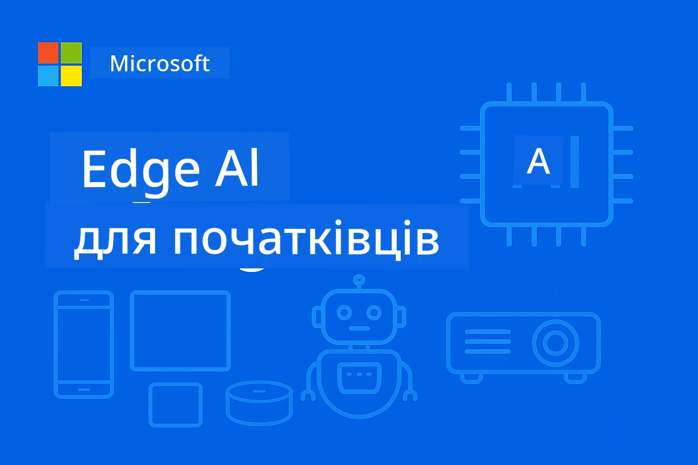

# EdgeAI для початківців 




[](https://GitHub.com/microsoft/edgeai-for-beginners/graphs/contributors)
[](https://GitHub.com/microsoft/edgeai-for-beginners/issues)
[](https://GitHub.com/microsoft/edgeai-for-beginners/pulls)
[](http://makeapullrequest.com)

[](https://GitHub.com/microsoft/edgeai-for-beginners/watchers)
[](https://GitHub.com/microsoft/edgeai-for-beginners/fork)
[](https://GitHub.com/microsoft/edgeai-for-beginners/stargazers)


[](https://discord.gg/nTYy5BXMWG)

Слідуйте цим крокам, щоб розпочати використання цих ресурсів:

1. **Форкніть репозиторій**: Натисніть [](https://GitHub.com/microsoft/edgeai-for-beginners/fork)
2. **Клонуйте репозиторій**:   `git clone https://github.com/microsoft/edgeai-for-beginners.git`
3. [**Приєднуйтесь до Azure AI Foundry Discord та знайомтесь з експертами і іншими розробниками**](https://discord.com/invite/ByRwuEEgH4)


### 🌐 Підтримка кількох мов

#### Підтримується через GitHub Action (автоматизовано та завжди актуально)

<!-- CO-OP TRANSLATOR LANGUAGES TABLE START -->
[Arabic](../ar/README.md) | [Bengali](../bn/README.md) | [Bulgarian](../bg/README.md) | [Burmese (Myanmar)](../my/README.md) | [Chinese (Simplified)](../zh-CN/README.md) | [Chinese (Traditional, Hong Kong)](../zh-HK/README.md) | [Chinese (Traditional, Macau)](../zh-MO/README.md) | [Chinese (Traditional, Taiwan)](../zh-TW/README.md) | [Croatian](../hr/README.md) | [Czech](../cs/README.md) | [Danish](../da/README.md) | [Dutch](../nl/README.md) | [Estonian](../et/README.md) | [Finnish](../fi/README.md) | [French](../fr/README.md) | [German](../de/README.md) | [Greek](../el/README.md) | [Hebrew](../he/README.md) | [Hindi](../hi/README.md) | [Hungarian](../hu/README.md) | [Indonesian](../id/README.md) | [Italian](../it/README.md) | [Japanese](../ja/README.md) | [Kannada](../kn/README.md) | [Khmer](../km/README.md) | [Korean](../ko/README.md) | [Lithuanian](../lt/README.md) | [Malay](../ms/README.md) | [Malayalam](../ml/README.md) | [Marathi](../mr/README.md) | [Nepali](../ne/README.md) | [Nigerian Pidgin](../pcm/README.md) | [Norwegian](../no/README.md) | [Persian (Farsi)](../fa/README.md) | [Polish](../pl/README.md) | [Portuguese (Brazil)](../pt-BR/README.md) | [Portuguese (Portugal)](../pt-PT/README.md) | [Punjabi (Gurmukhi)](../pa/README.md) | [Romanian](../ro/README.md) | [Russian](../ru/README.md) | [Serbian (Cyrillic)](../sr/README.md) | [Slovak](../sk/README.md) | [Slovenian](../sl/README.md) | [Spanish](../es/README.md) | [Swahili](../sw/README.md) | [Swedish](../sv/README.md) | [Tagalog (Filipino)](../tl/README.md) | [Tamil](../ta/README.md) | [Telugu](../te/README.md) | [Thai](../th/README.md) | [Turkish](../tr/README.md) | [Ukrainian](./README.md) | [Urdu](../ur/README.md) | [Vietnamese](../vi/README.md)

> **Віддаєте перевагу клонуванню локально?**
>
> Цей репозиторій містить переклади більш ніж 50 мовами, що значно збільшує розмір завантаження. Щоб клонувати без перекладів, використовуйте sparse checkout:
>
> **Bash / macOS / Linux:**
> ```bash
> git clone --filter=blob:none --sparse https://github.com/microsoft/edgeai-for-beginners.git
> cd edgeai-for-beginners
> git sparse-checkout set --no-cone '/*' '!translations' '!translated_images'
> ```
>
> **CMD (Windows):**
> ```cmd
> git clone --filter=blob:none --sparse https://github.com/microsoft/edgeai-for-beginners.git
> cd edgeai-for-beginners
> git sparse-checkout set --no-cone "/*" "!translations" "!translated_images"
> ```
>
> Це дасть вам все необхідне для проходження курсу набагато швидше.
<!-- CO-OP TRANSLATOR LANGUAGES TABLE END -->

**Якщо ви бажаєте, щоб підтримувались додаткові мови перекладів, вони перераховані [тут](https://github.com/Azure/co-op-translator/blob/main/getting_started/supported-languages.md)**
## Вступ

Ласкаво просимо до **EdgeAI для початківців** – вашої всебічної подорожі у трансформаційний світ Edge штучного інтелекту. Цей курс поєднує потужні можливості ШІ з практичним впровадженням у реальному світі на edge-пристроях, дозволяючи вам використовувати потенціал ШІ безпосередньо там, де генерується дані та потрібно приймати рішення.

### Чому Ви Навчитесь

Цей курс проведе вас від базових концепцій до рішень, готових для виробництва, охоплюючи:
- **Малі мовні моделі (SLM)**, оптимізовані для edge впровадження
- **Оптимізація з урахуванням апаратного забезпечення** на різних платформах
- **Реальний час для висновків** з можливостями захисту конфіденційності
- **Стратегії виробничого впровадження** для корпоративних застосунків

### Чому EdgeAI Важливий

Edge AI означає змінити парадигму для вирішення критичних сучасних викликів:
- **Конфіденційність і безпека**: Обробка чутливих даних локально без передачі у хмару
- **Продуктивність у реальному часі**: Усунення затримок мережі для критичних додатків
- **Економія коштів**: Зменшення витрат на пропускну здатність та хмарні обчислення
- **Стійкість роботи**: Підтримка функціоналу під час збоїв мережі
- **Відповідність регуляторним нормам**: Відповідність вимогам до суверенітету даних

### Edge AI

Edge AI означає запуск AI алгоритмів і мовних моделей локально на обладнанні, близько до місця генерації даних без залежності від хмарних ресурсів для висновків. Це знижує затримку, покращує конфіденційність і забезпечує прийняття рішень у реальному часі.

### Основні принципи:
- **Виведення на пристрої**: AI моделі працюють на edge-пристроях (телефонах, маршрутизаторах, мікроконтролерах, промислових ПК)
- **Робота офлайн**: Функціонує без постійного підключення до інтернету
- **Низька затримка**: Миттєві відповіді для систем реального часу
- **Суверенітет даних**: Чутливі дані залишаються локально, підвищуючи безпеку та відповідність

### Малі Мовні Моделі (SLM)

SLM, такі як Phi-4, Mistral-7B та Gemma, — це оптимізовані версії великих LLM, навчені або дистильовані для:
- **Зменшеного використання пам’яті**: Ефективне використання обмеженої пам’яті edge-пристроїв
- **Менших обчислювальних затрат**: Оптимізовані для продуктивності CPU та edge GPU
- **Швидшого запуску**: Швидка ініціалізація для чутливих застосунків

Вони відкривають потужні можливості NLP, відповідаючи обмеженням:
- **Вбудовані системи**: IoT пристрої та промислові контролери
- **Мобільні пристрої**: Смартфони та планшети з офлайн-функціональністю
- **IoT пристрої**: Датчики і розумні пристрої з обмеженими ресурсами
- **Edge сервери**: Локальні обчислювальні блоки з обмеженими GPU ресурсами
- **Персональні комп’ютери**: Десктопні і ноутбучні сценарії впровадження

## Модулі курсу та навігація

| Модуль | Тема | Напрямок | Ключовий контент | Рівень | Тривалість |
|--------|-------|------------|-------------|--------|----------|
| [📖 00 ](./introduction.md) | [Вступ до EdgeAI](./introduction.md) | Основи і контекст | Огляд EdgeAI • Галузеві застосування • Вступ до SLM • Навчальні цілі | Для початківців | 1-2 год |
| [📚 01](../../Module01) | [Основи EdgeAI](./Module01/README.md) | Порівняння Cloud vs Edge AI | Основи EdgeAI • Кейс-стаді у реальному світі • Посібник із впровадження • Edge Deployment | Для початківців | 3-4 год |
| [🧠 02](../../Module02) | [Основи моделей SLM](./Module02/README.md) | Сімейства моделей та архітектура | Сімейство Phi • Сімейство Qwen • Сімейство Gemma • BitNET • μModel • Phi-Silica | Для початківців | 4-5 год |
| [🚀 03](../../Module03) | [Практика впровадження SLM](./Module03/README.md) | Локальне та хмарне впровадження | Поглиблене навчання • Локальне середовище • Хмарне впровадження | Середній | 4-5 год |
| [⚙️ 04](../../Module04) | [Інструменти оптимізації моделей](./Module04/README.md) | Кросплатформна оптимізація | Вступ • Llama.cpp • Microsoft Olive • OpenVINO • Apple MLX • Синтез робочих процесів | Середній | 5-6 год |
| [🔧 05](../../Module05) | [SLMOps для виробництва](./Module05/README.md) | Операції у виробництві | Вступ до SLMOps • Дистиляція моделей • Донастройка • Виробниче впровадження | Просунутий | 5-6 год |
| [🤖 06](../../Module06) | [AI агенти та виклик функцій](./Module06/README.md) | Фреймворки агентів та MCP | Вступ до агентів • Виклик функцій • Протокол контексту моделей | Просунутий | 4-5 год |
| [💻 07](../../Module07) | [Реалізація платформи](./Module07/README.md) | Кросплатформені приклади | AI інструментарій • Foundry Local • Розробка для Windows | Просунутий | 3-4 год |
| [🏭 08](../../Module08) | [Foundry Local Інструментарій](./Module08/README.md) | Зразки, готові до виробництва | Зразкові застосунки (див. деталі нижче) | Експерт | 8-10 год |

### 🏭 **Модуль 08: Зразкові застосунки**

- [01: REST Chat Квікстарт](./Module08/samples/01/README.md)
- [02: Інтеграція OpenAI SDK](./Module08/samples/02/README.md)
- [03: Виявлення моделей і бенчмаркінг](./Module08/samples/03/README.md)
- [04: Chainlit RAG застосунок](./Module08/samples/04/README.md)
- [05: Оркестрація мульти-агентів](./Module08/samples/05/README.md)
- [06: Роутер "Моделі як інструменти"](./Module08/samples/06/README.md)
- [07: Прямий клієнт API](./Module08/samples/07/README.md)
- [08: Chat додаток для Windows 11](./Module08/samples/08/README.md)
- [09: Просунута мульти-агентська система](./Module08/samples/09/README.md)
- [10: Foundry Tools Framework](./Module08/samples/10/README.md)

### 🎓 **Воркшоп: Практичний шлях навчання**

Повний набір матеріалів практичного воркшопу з реалізаціями, готовими для виробництва:

- **[Керівництво до воркшопу](./Workshop/Readme.md)** - Повні навчальні цілі, результати та навігація по ресурсах
- **Python приклади** (6 сесій) - Оновлені з найкращими практиками, обробкою помилок та докладною документацією
- **Jupyter ноутбуки** (8 інтерактивних) - Покрокові підручники з бенчмарками та моніторингом продуктивності
- **Керівництва по сесіях** - Детальні markdown інструкції для кожної сесії воркшопу
- **Інструменти валідації** - Скрипти для перевірки якості коду та запуску smoke тестів

**Що ви створите:**
- Локальні AI чат-застосунки з підтримкою стрімінгу
- RAG пайплайни з оцінкою якості (RAGAS)
- Інструменти порівняння та бенчмаркінгу мульти-моделей
- Системи оркестрації мульти-агентів
- Інтелектуальний роутинг моделей з вибором за завданням

### 🎙️ **Воркшоп For Agentic: Практичне – AI подкаст студія**
Побудуйте конвеєр виробництва подкастів на основі штучного інтелекту з нуля! Цей захоплюючий воркшоп навчає створювати повну систему з кількох агентів, яка перетворює ідеї на професійні епізоди подкастів.

**[🎬 Почати воркшоп AI Podcast Studio](./WorkshopForAgentic/README.md)**

**Ваше завдання**: Запустити "Future Bytes" — технічний подкаст, створений повністю штучними агентами AI, яких ви створите самі. Без використання хмари, без витрат на API — усе виконується локально на вашому комп’ютері.

**Що робить це унікальним:**
- **🤖 Справжня оркестрація багатьох агентів** — побудуйте спеціалізованих агентів AI, які досліджують, пишуть і виробляють аудіо
- **🎯 Повний виробничий конвеєр** — від вибору теми до фінального аудіо до подкасту
- **💻 100% локальне розгортання** — використовує Ollama та локальні моделі (Qwen-3-8B) для повної конфіденційності та контролю
- **🎤 Інтеграція текст-в-мову** — перетворюйте скрипти у природні розмови з кількома доповідачами
- **✋ Робочі процеси з участю людини** — етапи затвердження гарантують якість при збереженні автоматизації

**Навчання у три акти:**

| Акт | Фокус | Ключові навички | Тривалість |
|-----|-------|-----------------|------------|
| **[Акт 1: Познайомтесь зі своїми AI-асистентами](./WorkshopForAgentic/md/01.BuildAIAgentWithSLM.md)** | Створіть свого першого агента AI | Інтеграція інструментів • Веб-пошук • Розв’язання проблем • Агентне мислення | 2-3 год |
| **[Акт 2: Зберіть команду виробництва](./WorkshopForAgentic/md/02.AIAgentOrchestrationAndWorkflows.md)** | Організуйте кількох агентів | Координація команди • Робочі процеси затвердження • Інтерфейс DevUI • Контроль людиною | 3-4 год |
| **[Акт 3: Реалізуйте свій подкаст**](./WorkshopForAgentic/md/03.Multi-SpeakerPodcastGenerationWithVibeVoice.md)** | Згенеруйте аудіо подкасту | Текст-в-мову • Синтез для кількох доповідачів • Довге аудіо • Повна автоматизація | 2-3 год |

**Використані технології:**
- **Microsoft Agent Framework** — оркестрація та координація багатьох агентів
- **Ollama** — локальний AI-рушій (без потреби у хмарі)
- **Qwen-3-8B** — відкрита мовна модель, оптимізована для агентних задач
- **API текст-в-мову** — природний синтез голосу для створення подкастів

**Підтримка апаратного забезпечення:**
- ✅ **Режим CPU** — працює на будь-якому сучасному комп’ютері (рекомендовано 8 ГБ+ ОЗП)
- 🚀 **Акселерація GPU** — значно швидше виконання з NVIDIA/AMD GPU
- ⚡ **Підтримка NPU** — прискорення на нейронних процесорах нового покоління

**Ідеально підходить для:**
- Розробників, які вивчають багатоагентні системи AI
- Усієї, хто цікавиться AI-автоматизацією і робочими процесами
- Творців контенту, які досліджують AI-підтримане виробництво
- Студентів, що вивчають практичні патерни оркестрації AI

**Почати будувати**: [🎙️ Воркшоп AI Podcast Studio →](./WorkshopForAgentic/README.md)

### 📊 **Підсумок навчального шляху**
- **Загальна тривалість**: 36-45 годин
- **Початковий рівень**: модулі 01-02 (7-9 год)  
- **Середній рівень**: модулі 03-04 (9-11 год)
- **Високий рівень**: модулі 05-07 (12-15 год)
- **Експертний рівень**: модуль 08 (8-10 год)

## Що ви побудуєте

### 🎯 Основні компетенції
- **Архітектура Edge AI**: Проєктування AI-систем локального рівня з інтеграцією хмари
- **Оптимізація моделей**: Квантизація і стиснення моделей для локального розгортання (прискорення на 85%, зменшення розміру на 75%)
- **Мультиплатформенне розгортання**: Windows, мобільні пристрої, вбудовані системи, гібриди хмари та краю
- **Виробничі операції**: Моніторинг, масштабування та підтримка Edge AI у виробництві

### 🏗️ Практичні проєкти
- **Foundry Local Chat Apps**: нативний додаток для Windows 11 з перемиканням моделей
- **Системи з багатьма агентами**: координатор зі спеціалістами для складних робочих процесів  
- **RAG-додатки**: локальна обробка документів із векторним пошуком
- **Маршрутизатори моделей**: інтелектуальний вибір між моделями за аналізом завдань
- **API-фреймворки**: клієнти, готові до виробництва, з потоковою передачею та моніторингом стану здоров’я
- **Кросплатформенні інструменти**: патерни інтеграції LangChain/Semantic Kernel

### 🏢 Галузеві застосування
**Виробництво** • **Охорона здоров’я** • **Автономний транспорт** • **Розумні міста** • **Мобільні додатки**

## Швидкий старт

**Рекомендований навчальний шлях** (загалом 20-30 годин):

0. **📖 Вступ** ([Introduction.md](./introduction.md)): основи EdgeAI + галузевий контекст + навчальна структура
1. **📚 Основи** (Модулі 01-02): концепції EdgeAI + сімейства моделей SLM
2. **⚙️ Оптимізація** (Модулі 03-04): розгортання + фреймворки квантизації  
3. **🚀 Виробництво** (Модулі 05-06): SLMOps + агенти AI + виклики функцій
4. **💻 Реалізація** (Модулі 07-08): зразки платформ + інструментарій Foundry Local

Кожен модуль містить теорію, практичні вправи та готові до виробництва приклади коду.

## Кар’єрний вплив

**Технічні ролі**: архітектор рішень EdgeAI • ML-інженер (Edge) • розробник IoT AI • мобільний AI-розробник

**Галузеві сектори**: Виробництво 4.0 • Медична технологія • Автономні системи • FinTech • Споживча електроніка

**Проєкти портфоліо**: багатоагентні системи • RAG-додатки для виробництва • кросплатформне розгортання • оптимізація продуктивності

## Структура репозиторію

```
edgeai-for-beginners/
├── 📖 introduction.md  # Foundation: EdgeAI Overview & Learning Framework
├── 📚 Module01-04/     # Fundamentals → SLMs → Deployment → Optimization  
├── 🔧 Module05-06/     # SLMOps → AI Agents → Function Calling
├── 💻 Module07/        # Platform Samples (VS Code, Windows, Jetson, Mobile)
├── 🏭 Module08/        # Foundry Local Toolkit + 10 Comprehensive Samples
│   ├── samples/01-06/  # Foundation: REST, SDK, RAG, Agents, Routing
│   └── samples/07-10/  # Advanced: API Client, Windows App, Enterprise Agents, Tools
├── 🌐 translations/    # Multi-language support (8+ languages)
└── 📋 STUDY_GUIDE.md   # Structured learning paths & time allocation
```

## Основні переваги курсу

✅ **Поступове навчання**: Теорія → Практика → Розгортання у виробництві  
✅ **Реальні кейси**: Microsoft, Japan Airlines, корпоративні впровадження  
✅ **Приклади коду**: понад 50 прикладів, 10 комплексних демонстрацій Foundry Local  
✅ **Акцент на продуктивність**: покращення швидкості на 85%, зменшення розміру на 75%  
✅ **Мультиплатформність**: Windows, мобільні, вбудовані системи, гібриди хмара-край  
✅ **Готовність до виробництва**: моніторинг, масштабування, безпека, відповідність стандартам

📖 **[Доступний навчальний посібник](STUDY_GUIDE.md)**: структурований 20-годинний навчальний шлях з порадами щодо розподілу часу та інструментами самооцінки.

---

**EdgeAI — це майбутнє розгортання AI**: перш за все локальний, збереження приватності та ефективний. Освойте ці навички, щоб створювати нове покоління інтелектуальних додатків.

## Інші курси

Наша команда створює інші курси! Ознайомтесь з ними:

<!-- CO-OP TRANSLATOR OTHER COURSES START -->
### LangChain
[](https://aka.ms/langchain4j-for-beginners)
[](https://aka.ms/langchainjs-for-beginners?WT.mc_id=m365-94501-dwahlin)
[](https://github.com/microsoft/langchain-for-beginners?WT.mc_id=m365-94501-dwahlin)
---

### Azure / Edge / MCP / Агенті
[](https://github.com/microsoft/AZD-for-beginners?WT.mc_id=academic-105485-koreyst)
[](https://github.com/microsoft/edgeai-for-beginners?WT.mc_id=academic-105485-koreyst)
[](https://github.com/microsoft/mcp-for-beginners?WT.mc_id=academic-105485-koreyst)
[](https://github.com/microsoft/ai-agents-for-beginners?WT.mc_id=academic-105485-koreyst)

---

### Серія генеративного AI
[](https://github.com/microsoft/generative-ai-for-beginners?WT.mc_id=academic-105485-koreyst)
[-9333EA?style=for-the-badge&labelColor=E5E7EB&color=9333EA)](https://github.com/microsoft/Generative-AI-for-beginners-dotnet?WT.mc_id=academic-105485-koreyst)
[-C084FC?style=for-the-badge&labelColor=E5E7EB&color=C084FC)](https://github.com/microsoft/generative-ai-for-beginners-java?WT.mc_id=academic-105485-koreyst)
[-E879F9?style=for-the-badge&labelColor=E5E7EB&color=E879F9)](https://github.com/microsoft/generative-ai-with-javascript?WT.mc_id=academic-105485-koreyst)

---

### Основи навчання
[](https://aka.ms/ml-beginners?WT.mc_id=academic-105485-koreyst)
[](https://aka.ms/datascience-beginners?WT.mc_id=academic-105485-koreyst)
[](https://aka.ms/ai-beginners?WT.mc_id=academic-105485-koreyst)
[](https://github.com/microsoft/Security-101?WT.mc_id=academic-96948-sayoung)
[](https://aka.ms/webdev-beginners?WT.mc_id=academic-105485-koreyst)
[](https://aka.ms/iot-beginners?WT.mc_id=academic-105485-koreyst)
[](https://github.com/microsoft/xr-development-for-beginners?WT.mc_id=academic-105485-koreyst)

---

### Серія Copilot

[](https://aka.ms/GitHubCopilotAI?WT.mc_id=academic-105485-koreyst)
[](https://github.com/microsoft/mastering-github-copilot-for-dotnet-csharp-developers?WT.mc_id=academic-105485-koreyst)
[](https://github.com/microsoft/CopilotAdventures?WT.mc_id=academic-105485-koreyst)
<!-- CO-OP TRANSLATOR OTHER COURSES END -->

## Отримання допомоги

Якщо ви застрягли або маєте будь-які питання щодо створення AI-додатків, приєднуйтесь:

[](https://discord.gg/nTYy5BXMWG)

Якщо у вас є відгуки про продукт або виникають помилки під час створення, відвідайте:

[](https://aka.ms/foundry/forum)

---

<!-- CO-OP TRANSLATOR DISCLAIMER START -->
**Відмова від відповідальності**:  
Цей документ був перекладений за допомогою сервісу AI-перекладу [Co-op Translator](https://github.com/Azure/co-op-translator). Хоча ми прагнемо до точності, будь ласка, майте на увазі, що автоматичні переклади можуть містити помилки або неточності. Оригінальний документ рідною мовою слід вважати авторитетним джерелом. Для критичної інформації рекомендується професійний переклад людиною. Ми не несемо відповідальності за будь-які непорозуміння або неправильні тлумачення, що виникли внаслідок використання цього перекладу.
<!-- CO-OP TRANSLATOR DISCLAIMER END -->