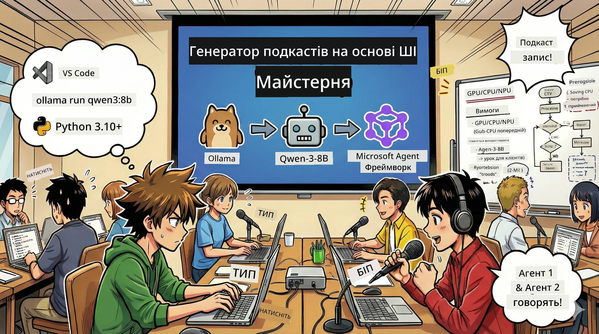
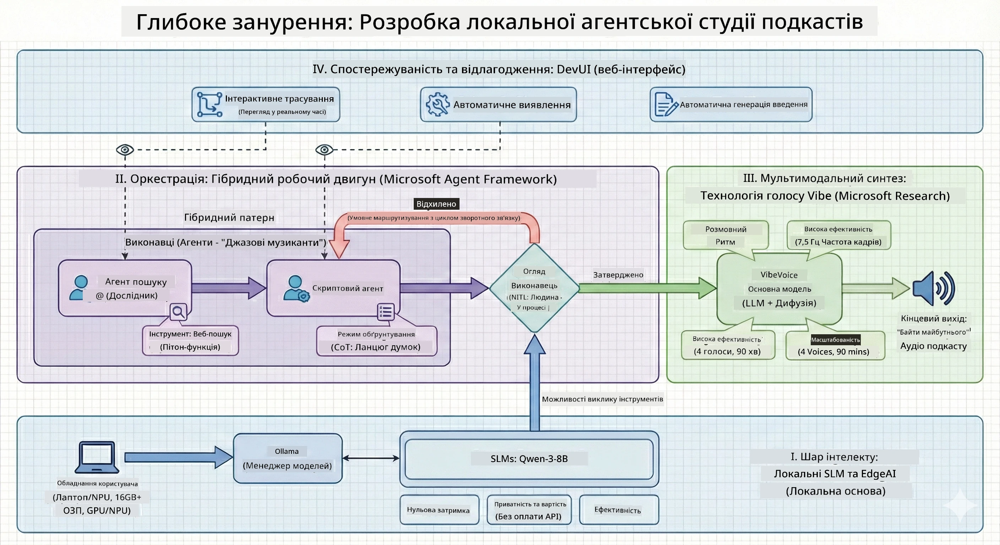

<!--
CO_OP_TRANSLATOR_METADATA:
{
  "original_hash": "f94e745264597bc5d8df967ead2eff97",
  "translation_date": "2026-01-05T10:57:43+00:00",
  "source_file": "WorkshopForAgentic/README.md",
  "language_code": "uk"
}
-->
# 🎙️ Майстерня AI Podcast Studio

> 🌏 [中文版 (Chinese Version)](translation/zh-cn/README.md)



## Ваше Завдання

Ласкаво просимо до **The AI Podcast Studio**! Ви збираєтесь запустити власний технічний подкаст під назвою «Future Bytes» — але є одна особливість: ви створите команду продюсерів на базі штучного інтелекту, яка допоможе вам його зробити. Більше не потрібно витрачати нескінченні години на дослідження, написання сценарію та редагування аудіо. Замість цього ви кодуватимете, щоб стати продюсером подкастів з AI-суперсилами.

## Історія

Уявіть собі: ви та ваші друзі хочете розпочати подкаст про найцікавіші технічні тенденції, але всі зайняті навчанням, роботою чи повсякденним життям. А що як ви могли б побудувати команду агентів ШІ, які виконуватимуть основну роботу? Один агент досліджує теми, інший пише захопливі сценарії, а третій перетворює текст у природні розмови. Звучить як наукова фантастика? Давайте зробимо це реальністю.

## Чого Ви Навчитеся

Наприкінці цієї майстерні ви будете вміти:
- 🤖 Запускати власну локальну модель ШІ (без витрат на API, без залежності від хмари!)
- 🔧 Створювати спеціалізованих агентів ШІ, які дійсно працюють разом
- 🎬 Створювати повний виробничий конвеєр подкасту від ідеї до аудіо

## Ваша Подорож: Три Акти



Як у будь-якій хорошій історії, у нас є три акти. Кожен крок поступово створює вашу AI podcast studio:

| Епізод | Ваш Квест | Що Відбувається | Навички, Що Ви Отримаєте |
|---------|-----------|--------------|----------------|
| **Акт 1** | [Познайомтесь зі Своїми AI Помічниками](md/01.BuildAIAgentWithSLM.md) | Ви дізнаєтеся, як створювати агентів ШІ, які можуть спілкуватися, шукати в Інтернеті і навіть розв’язувати проблеми. Уявіть їх як ваших дослідницьких стажерів, що ніколи не сплять. | 🎯 Створення першого агента<br>🛠️ Надайте йому суперздібності (інструменти!)<br>🧠 Навчіть його мислити<br>🌐 Підключіть до інтернету |
| **Акт 2** | [Складіть Свою Виробничу Команду](md/02.AIAgentOrchestrationAndWorkflows.md) | Тепер починається найцікавіше! Ви організуєте роботу кількох агентів ШІ, які працюють разом як справжня команда подкасту. Один досліджує, інший пише, ви затверджуєте — командна робота творить дива. | 🎭 Координація кількох агентів<br>🔄 Побудова процесів затвердження<br>🖥️ Тестування через DevUI інтерфейс<br>✋ Збереження контролю людиною |
| **Акт 3** | [Втіліть Свій Подкаст у Життя](md/03.Multi-SpeakerPodcastGenerationWithVibeVoice.md) | Фінал! Перетворіть текстові сценарії на справжнє аудіо подкасту з реалістичними голосами та природними розмовами. Ваш подкаст «Future Bytes» готовий до випуску! | 🎤 Магія текст-в-мову<br>👥 Голоси кількох спікерів<br>⏱️ Довгий аудіоформат<br>🚀 Повна автоматизація |

Кожен акт відкриває нові можливості. Якщо ви сміливі — можете перейти вперед, але ми рекомендуємо слідувати історії!

## Вимоги до Середовища

Ця майстерня підтримує різне апаратне забезпечення:
- **CPU**: Підходить для тестування та маломасштабного використання
- **GPU**: Рекомендовано для продуктивних середовищ, значно прискорює інференс
- **NPU**: Підтримує прискорення наступного покоління нейронних процесорів

## Що Вам Потрібно

### Контрольний список програмного забезпечення ✅
- **Python 3.10+** (ваша мова програмування)
- **Ollama** (запускає AI-моделі на вашій машині)
- **VS Code** (ваш редактор коду)
- **Розширення Python** (робить VS Code розумнішим)
- **Git** (щоб взяти код)

### Перевірка апаратного забезпечення 💻
- **Чи зможу я це запустити?**: 8 ГБ ОЗП, 10 ГБ вільного місця (працює, але може бути повільно)
- **Ідеальна конфігурація**: 16 ГБ+ ОЗП, пристойна GPU (плавна робота!)
- **Є NPU?**: Ще краще! Відкрийте продуктивність наступного покоління 🚀

## Налаштуйте Свою Студію 🎬

### Крок 1: Підготуйте Python

Переконайтеся, що у вас Python 3.10 або новіше:

```bash
python --version
# Має показувати Python 3.10.x або вище
```
  
Немає Python? Завантажте з [python.org](https://python.org) — це безкоштовно!

### Крок 2: Отримайте Ollama (двигун для AI-моделей)

Завантажте Ollama для своєї ОС на [ollama.ai](https://ollama.ai). Це двигун, який запускає ваші AI-моделі локально.

Перевірте, чи готовий:

```bash
ollama --version
```
  
### Крок 3: Завантажте Свій AI Мозок 🧠

Час взяти модель Qwen-3-8B (це як найняти першого AI-помічника):

```bash
ollama pull qwen3:8b
```
  
*Це може зайняти кілька хвилин. Ідеальний час, щоб випити кави! ☕*

### Крок 4: Встановіть VS Code

Завантажте [Visual Studio Code](https://code.visualstudio.com/), якщо у вас його немає. Це найкращий редактор коду (посперечаємося 😄).

### Крок 5: Розширення Python

У VS Code:
1. Натисніть `Ctrl+Shift+X` (або `Cmd+Shift+X` на Mac)
2. Введіть "Python"
3. Встановіть офіційне розширення від Microsoft

### Крок 6: Ви Готові! 🎉

Серйозно, ви готові творити магію AI!

### Крок 7: Встановіть Microsoft Agent Framework та пов’язані пакети 📦

Встановіть всі необхідні залежності для майстерні:

```bash
pip install -r ./Installations/requirements.txt -U
```
  
*Це встановить Microsoft Agent Framework і всі потрібні пакети. Візьміть каву — перше налаштування може зайняти кілька хвилин! ☕*

## Інструкції Майстерні

Покрокова структура проекту, налаштування і запуск будуть докладно пояснені під час майстерні.

## Усунення несправностей (коли щось іде не так) 🔧

### «Ух, завантаження моделі триває вічно!»
**Вирішення**: Використайте VPN або налаштуйте Ollama з дзеркальним джерелом. Інтернет іноді буває дуже примхливий.

### «Мій комп’ютер зависає! Закінчилась пам’ять!»
**Вирішення**: Перейдіть на меншу модель або змініть налаштування `num_ctx`, щоб використовувати менше пам’яті. Уявіть, що ви садите AI на дієту.

### «Чи можна це прискорити з моєю GPU?»
**Вирішення**: Ollama автоматично виявляє GPU! Просто переконайтеся, що драйвери GPU оновлені. Безкоштовний приріст швидкості! 🏎️

## Додаткові Ресурси (Для допитливих) 📚

- [Документація Ollama](https://github.com/ollama/ollama) — поглиблене вивчення локальних AI-моделей
- [Microsoft Agent Framework](https://microsoft.github.io/autogen/) — дізнайтеся більше про створення команд агентів
- [Інформація про модель Qwen](https://qwenlm.github.io/) — познайомтесь із мозком вашого AI-помічника

## Ліцензія

Ліцензія MIT — створюйте круті речі, діліться ними, робіть світ кращим! 🌍

## Хочете Допомогти?

Знайшли баг? Є ідея? Створюйте Issue або PR! Нам подобається спільнотна атмосфера. ✨

---

<!-- CO-OP TRANSLATOR DISCLAIMER START -->
**Відмова від відповідальності**:  
Цей документ було перекладено за допомогою AI-сервісу перекладу [Co-op Translator](https://github.com/Azure/co-op-translator). Хоча ми прагнемо до точності, зверніть увагу, що автоматизовані переклади можуть містити помилки або неточності. Оригінальний документ його рідною мовою слід вважати авторитетним джерелом. Для критичної інформації рекомендується звертатися до професійного людського перекладу. Ми не несемо відповідальності за будь-які непорозуміння чи неправильні тлумачення, що виникли внаслідок використання цього перекладу.
<!-- CO-OP TRANSLATOR DISCLAIMER END -->