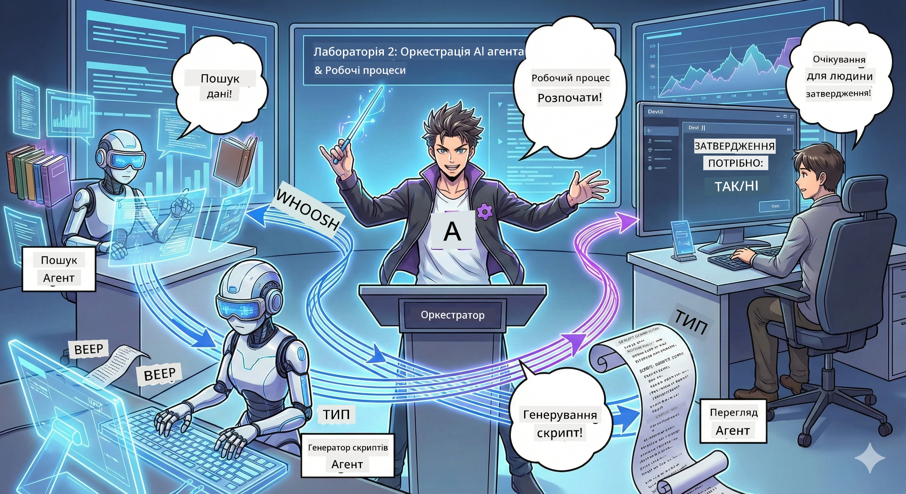

<!--
CO_OP_TRANSLATOR_METADATA:
{
  "original_hash": "93f84b804ced67c5cd017c3c4bb476ff",
  "translation_date": "2026-01-05T11:51:31+00:00",
  "source_file": "WorkshopForAgentic/md/02.AIAgentOrchestrationAndWorkflows.md",
  "language_code": "uk"
}
-->
# Акт 2: Зберіть свою команду для виробництва подкасту 🎬



## Сюжет загострюється

Алекс (ваш AI-помічник з Акту 1) чудовий, але один агент не може керувати цілою студією подкастів. Вам потрібна *команда*:
- 🔍 **Агент досліджень**: шукає в інтернеті свіжу інформацію
- ✍️ **Агент сценарист**: перетворює дослідження в захоплюючий діалог
- 👤 **Ви (Редактор)**: затверджуєте сценарії або повертаєте їх на доопрацювання

Ласкаво просимо до **Оркестрування AI Агентів** — де ви стаєте режисером своєї AI-команди. Уявіть Месників, але для виробництва подкастів.

## Що таке Оркестрування Агентів? (Простою мовою)

Уявіть, що ви керуєте рестораном. Ви ж не робите все самі, правда? У вас є:
- 🍳 Шеф-кухар, який готує
- 👨‍🍳 Су-шеф, який готує інгредієнти
- 👩‍🍳 Офіціант, який подає їжу

Оркестрування агентів — це те саме, але з AI. Кожен агент має спеціалізацію, і ви координуєте їх для досягнення більших цілей. Жоден агент не перевантажений, і робота виконується швидше.

### Аналогія з гуртом 🎸

Ваші AI агенти — як музичний гурт:
- **Вокаліст**: головний агент, який працює з клієнтами
- **Барабанщик**: задає ритм, обробляє фонові процеси  
- **Басист**: підтримує всіх, збирає дані
- **Ви (Менеджер гурту)**: координуєте все!

Без координації? Просто шум. З оркеструванням? Прекрасна музика.

### Чому це важливо

Один AI-агент намагається робити все = вигорання. Спеціалізовані агенти, які працюють разом = ефективність запущена! 🚀

**Правда життя**: Пам’ятаєте, як намагалися одночасно досліджувати, писати І редагувати свій подкаст? Так, це жахливо. З оркеструванням кожен агент робить те, що вміє найкраще. Ви лише приймаєте фінальні рішення.

**Приклад з життя**: Боти служби підтримки, які знають, коли займатися оплатою, а коли — технічними проблемами, а коли передати людині. Ось це і є оркестрування!

## Агент проти Workflow: у чому різниця?

Думайте так:

### 🤖 AI Агент = Джазовий музикант
- **Приймає рішення на льоту** залежно від того, що чує
- **Імпровізує** рішення за допомогою своїх інструментів
- **Думає** з мозком LLM
- **Адаптується** до будь-чого, що ви йому підкинете

### 🎵 Workflow = Оркестр, що грає класичну музику  
- **Слідує партитурі** (попередньо визначеним крокам)
- **Передбачуваний** шлях виконання
- **Координує** кілька агентів, людей, систем
- **Структурований**, як рецепт

**Магія**: Workflows *оркеструють* агентів! Ви створюєте workflow, який говорить агентам, коли грати свою роль. Найкраще з обох світів. 🎭

## Три способи координувати вашу AI-команду

### 1. 🎯 Централізований (Ви — бос)

Один головний агент вирішує всі питання. Уявіть, що ви керуєте командою — ви вирішуєте, хто що робить і коли.

**Переваги**:
- ✅ Чітке лідерство (без плутанини)
- ✅ Послідовність рішень
- ✅ Легко налагоджувати помилки

**Використовуйте для**:
- Маршрутизації служби підтримки ("Це оплата чи техпідтримка?")
- Робочих процесів затвердження контенту ("Чи проходить цей сценарій?")
- Виробництва подкастів (саме те, що ми будуємо!)

### 2. 🤝 Децентралізований (агенти організовуються самі)

Агенти розмовляють напряму і вирішують разом, ніби це груповий чат для координації.

**Переваги**:
- ✅ Легко масштабується (додавайте агентів коли завгодно)
- ✅ Відсутність єдиної точки відмови
- ✅ Природна співпраця агентів

**Використовуйте для**:
- Команд досліджень (кожен агент вивчає різні джерела)
- Сесій генерації ідей
- Розподіленого вирішення проблем

### 3. 🔀 Гібридний (найкраще з обох світів)

Ви задаєте загальний напрямок, але агенти мають свободу організовуватись самостійно у завданнях. Як CEO, що довіряє своїй команді.

**Ідеально для**: складних проєктів, які потребують і контролю, і гнучкості.

## Microsoft Agent Framework: Ваш набір інструментів для оркестрування 🧰

Час будувати! Ось що ви будете використовувати:

### Основні складові

#### 1. 🧱 Виконавці (Ваші працівники)
- **Що це?** Окремі обробні одиниці — це можуть бути агенти або власна логіка
- **Що роблять?** Приймають вхідні дані, виконують роботу, видають результат
- **Уявляйте їх як**: станції на конвеєрі

#### 2. ➡️ Ребра (З’єднання)
- **Що це?** Шляхи між виконавцями
- **Що роблять?** Керують потоком повідомлень ("Після А перейти до Б")
- **Уявляйте їх як**: стрілки на блок-схемі

#### 3. 🗺️ Workflows (Головний план)
- **Що це?** Повний граф виконавців + ребер
- **Що роблять?** Визначають увесь процес від початку до кінця
- **Уявляйте їх як**: план вашої виробничої лінії

### Круті функції, які вам сподобаються

**🛡️ Типова безпека**: Повідомлення між агентами перевіряються на тип. Жодних сюрпризів "Ой, невірний тип даних".

**🔀 Гнучка маршрутизація**: 
- Умови "якщо-то" ("Якщо затверджено — публікувати; інакше — переписати")
- Паралельна обробка (кілька агентів працюють одночасно)
- Динамічні шляхи (workflow підлаштовується під результати)

**🔌 Зовнішня інтеграція**:
- Підключення до API
- Додавання контрольних точок з участю людини (ви затверджуєте перед публікацією)
- Побудова потоків запит-відповідь

**💾 Контрольні точки**: Зберігайте прогрес! Якщо щось впаде, продовжуйте з останнього місця.

**🤝 Координація кількох агентів**:
- Запуск агентів послідовно (А → Б → В)
- Запуск паралельно (А + Б + В одночасно)
- Передача між агентами
- Спільна обробка

## Кращі практики (Профі поради) 🎯

### 1. Тримайте модульність
Кожен агент повинен робити ОДНУ річ дуже добре. Не створюйте "суперагента", що робить все — будете шкодувати при налагодженні.

### 2. Плануйте на випадок помилок
Агенти помиляються. Мережі глючать. Вбудовуйте обробку помилок і запасні плани. Ваш майбутній я скаже вам спасибі.

### 3. Контролюйте все
Відстежуйте, що роблять ваші агенти. Використовуйте DevUI (ми це розглянемо!), щоб бачити робочі процеси в дії.

### 4. Оптимізуйте розмір повідомлень
Не передавайте агентам гігантські файли. Тримайте повідомлення легкими і швидкими.

### 5. Вибирайте правильний патерн
Потрібен контроль? Централізований. Потрібен масштаб? Децентралізований. Не можете визначитись? Гібридний!

## DevUI: Ваш дебагер workflow 🔍

### Що таке DevUI?

DevUI — це як майданчик для тестування ваших агентів та workflow. Це веб-інтерфейс, де ви можете:
- 👀 Дивитись на свій workflow у дії
- 💬 Спілкуватись напряму з агентами
- 🔍 Відлагоджувати, коли щось іде не так
- 📊 Бачити трасування і показники продуктивності

> **Важливо**: DevUI — тільки для розробки! Не використовуйте в продакшені. Це ваша локальна тестова середа.

### Чому це круто

- **🖥️ Інтерактивний веб-інтерфейс**: клікайте, вводьте, тестуйте — без командного рядка
- **📁 Підтримка drag-and-drop**: завантажуйте файли, тестуйте з різними вхідними даними
- **📂 Автообхід**: вкажіть папку — воно автоматично знаходить усіх агентів
- **📋 Режим без налаштувань**: реєструйте агентів у коді, структура папок не потрібна
- **🔌 Сумісність з OpenAI**: працює з OpenAI SDK (сумісність на висоті!)
- **👁️ Вбудоване трасування**: бачите, що саме роблять агенти

### Як працює введення

DevUI розумний щодо введення:

- **Тестуєте агентів?** Отримуєте текстові поля та кнопки для завантаження файлів
- **Тестуєте workflows?** UI автоматично генерує поля вводу відповідно до очікувань workflow

Це наче магія, але це просто хороший код. ✨

## Ваші місії: Побудуйте студію подкастів 🎬

### Місія 1: Створіть одного агента через DevUI

📂 [01.AgentDevUI](../../../../WorkshopForAgentic/code/02.Workflow/01.AgentDevUI)

**Виклик**: Перед тим, як будувати команду, протестуйте DevUI з одним агентом: спеціалістом з веб-пошуку.

**Що ви створюєте**:
Агент досліджень, який шукає теми для подкасту в інтернеті. Ви тестуватимете його через веб-інтерфейс DevUI на `http://localhost:8090`.

**Навички, які отримаєте**:
- 🚀 Запуск агентів в DevUI
- 🔍 Тестування відповідей агента в реальному часі
- 🛠️ Створення власних інструментів (веб-пошук)
- 📊 Увімкнення трасування для відлагодження
- 🖥️ Використання інтерактивного веб-інтерфейсу

**Код**:
- `agent.py`: Ваш SearchAgent з можливістю веб-пошуку
- Використовує OllamaChatClient для підключення до Qwen
- Реалізує функцію інструменту `web_search()`
- Запускається через `serve()` — автоматично відкриває DevUI

**Умова перемоги**: Запитайте агента "Що зараз у тренді в AI?" і спостерігайте, як він шукає в інтернеті! 🎉

### Місія 2: Побудуйте workflow з кількох агентів

📂 [02.WorkflowDevUI](../../../../WorkshopForAgentic/code/02.Workflow/02.WorkflowDevUI)

**Виклик**: Тепер починається справжня гра! Створіть повний робочий процес виробництва подкасту з:
1. 🔍 **Агент досліджень** → досліджує вашу тему
2. ✍️ **Агент сценарист** → пише діалог між двома ведучими (китайською!)
3. 👤 **Виконавець рецензії** → запитує ВАС про затвердження або відмову
4. 🔄 **Цикл назад** → якщо відмовлено, переписує на основі вашого фідбеку

**Навички, які отримаєте**:
- 🧱 Створення спеціалізованих агентів для різних завдань
- 🔗 Зв’язок агентів через WorkflowBuilder
- 🔀 Реалізація циклів затвердження (участь людини!)
- 🚦 Умовна маршрутизація (затверджено проти відхилено)
- 🔧 Створення власних виконавців для бізнес-логіки

**Workflow**:
```
SearchAgent → ScriptAgent → ReviewExecutor
                             ↑          ↓ (if rejected)
                             ←─────────
```
  
**Код**:
- `search_agent/agent.py`: ваш спеціаліст з досліджень
- `generate_script_agent/agent.py`: ваш сценарист (пише китайською!)
- `workflow/workflow.py`: тут відбувається магія оркестрування
- `main.py`: запускає все в DevUI

**Умова перемоги**: Дайте тему, перегляньте сценарій, відхиліть один раз, щоб протестувати цикл, потім затвердьте! 🎉

### Місія 3: Створіть консольний додаток

📂 [03.Application](../../../../WorkshopForAgentic/code/02.Workflow/03.Application)

**Виклик**: Візьміть свій workflow з DevUI і перетворіть його на стильний термінальний додаток з кольоровим виводом, індикаторами завантаження і збереженням файлів. Це готове до продакшену рішення!

**Навички, які отримаєте**:
- ⚡ Запуск workflow програмно (без DevUI)
- 📡 Подієво-орієнтована архітектура із потоками
- 🎨 Створення красивих термінальних UI (кольори, індикатори, прогрес-бари)
- 💾 Збереження фінальних сценаріїв у файли
- 🔄 Обробка асинхронних workflow на основі asyncio Python

**Що він робить**:
1. Запитує тему подкасту
2. Показує прогрес у реальному часі ("Агент пошуку працює...")
3. Відображає згенерований сценарій кольорово
4. Запитує ваше затвердження
5. Зберігає затверджений сценарій у файл `podcast.txt`

**Код**:
- `podcast_app.py`: ваш головний додаток з обробкою подій
- `workflow.py`: повторне використання workflow з Місії 2
- Обробляє події: `AgentRunUpdateEvent`, `RequestInfoEvent`, `WorkflowOutputEvent`
- Використовує ANSI-кольори для стилізації терміналу

**Умова перемоги**: Запустіть додаток, створіть сценарій подкасту і побачте, що він збережений! Ви створили справжній інструмент. 🚀

## Чого ви навчилися 🏆

Після Акта 2 ви можете:

- ✅ Керувати кількома AI-агентами як бос
- ✅ Створювати workflows із послідовною і умовною логікою
- ✅ Додавати контрольні точки з участю людини
- ✅ Використовувати DevUI для тестування і відлагодження workflows
- ✅ Створювати готові до продакшену консольні додатки
- ✅ Грамотно обробляти помилки в складних системах
- ✅ Обирати правильний патерн оркестрування для будь-якого проєкту

## Коли щось ламається 🔧

### "Мій workflow надто складний!"
**Виправлення**: Розбийте на менші під-workflows. Кожен workflow має робити ОДНУ річ добре. За потреби об’єднуйте їх.

### "Я не можу відстежити, що відбувається!"
**Виправлення**: Використовуйте контрольні точки workflow для збереження стану. Увімкніть трасування в DevUI, щоб бачити кожен крок.

### "Помилка одного агента ламає все!"
**Виправлення**: Додайте межі помилок. Кожен агент має обробляти свої збої та мати резервну поведінку.

### "Це дуже повільно"
**Виправлення**: Чи можуть агенти працювати паралельно? Послідовні workflows легкі, але повільні. Шукайте можливості паралельності!

## Корисні ресурси 🔗

- [Документація Workflow](https://learn.microsoft.com/en-us/agent-framework/user-guide/workflows/overview) — Офіційні посібники Microsoft
- [Патерни оркестрування](https://www.ibm.com/think/topics/ai-agent-orchestration) — Погляд IBM
- [GitHub Agent Framework](https://github.com/microsoft/agent-framework) — Перегляньте вихідний код
- [Приклади коду](https://github.com/microsoft/agent-framework/tree/main/python/samples) — Запозичуйте шаблони звідси

---

**Готові до фіналу?** У вас є скрипт. Тепер перетворимо його на справжнє аудіо! → [Акт 3: Втілюємо ваш подкаст у життя](03.Multi-SpeakerPodcastGenerationWithVibeVoice.md) 🎤

---

**Застрягли? Заплуталися? В захваті?** Діліться в чаті майстерні! Ми всі вчимося разом. 🚀

---

<!-- CO-OP TRANSLATOR DISCLAIMER START -->
**Відмова від відповідальності**:
Цей документ було перекладено за допомогою сервісу автоматичного перекладу [Co-op Translator](https://github.com/Azure/co-op-translator). Хоча ми прагнемо до точності, просимо враховувати, що автоматичні переклади можуть містити помилки або неточності. Оригінальний документ рідною мовою слід вважати авторитетним джерелом. Для критично важливої інформації рекомендується звертатися до професійного перекладу, виконаного людиною. Ми не несемо відповідальності за будь-які непорозуміння або неправильні тлумачення, що виникли внаслідок використання цього перекладу.
<!-- CO-OP TRANSLATOR DISCLAIMER END -->