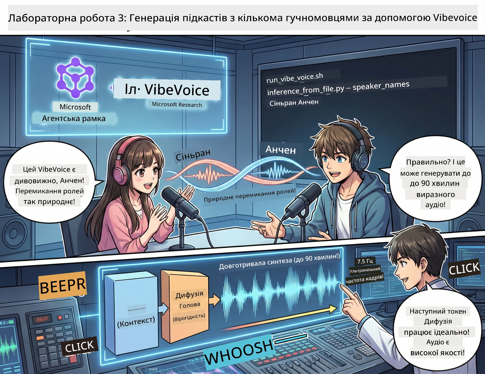

# Третя дія: Оживи свій подкаст 🎤



## Фінал

Ти вже дослідив тему. Ти вже написав сценарій. Тепер час додати останній штрих: перетворити твій текст у справжнє аудіо подкасту з реалістичним голосом!

Зустрічай **VibeVoice** — відкритий TTS (текст-в-мову) від Microsoft Research, що створює:
- 🎭 Натуральні та плавні діалоги
- 👥 Кілька голосів (до 4!)
- ⏱️ Довгі аудіо (до 90 хвилин!)
- 🎵 Виразну передачу (без роботоподібності!)

Це технологія за синтезованими подкастами. Давай створимо твій!

## Що таке VibeVoice? (крута штука)

VibeVoice — подарунок від Microsoft Research світу. Вона спеціально створена для подкастового стилю розмовного аудіо.

### Чому вона чудова 🔥

* **⏱️ Марафонські сесії**: генерує до 90 хвилин безперервної мови (це цілий епізод подкасту!)
* **👥 Магія кількох голосів**: до 4 унікальних голосів з узгодженою особистістю
* **⚡ Супершвидка**: працює з низькою частотою кадрів — 7,5 Гц для економії обчислювальних ресурсів
* **🧠 Інтелектуальне аудіо**: поєднує LLM (розуміння контексту) і дифузійні моделі (створення реалістичного звуку)
* **🎭 Натуральні діалоги**: автоматично керує чергуванням мовців, паузами і ритмом бесіди

**Переклад**: VibeVoice не просто читає твій сценарій — вона *грає* його, як справжня людина.

---

## Перш ніж почати 🚀

**Що тобі потрібно**:

* 🐍 **Python 3.10+** (вже є після першої і другої дії)
* 🚀 **uv** (швидкий менеджер пакетів для Python — ми його встановимо)
* 📝 **твій сценарій**: файл `podcast.txt` зі другої дії (у папці `../03.Application/`)

**Порада від профі**: для цього кроку потрібне стабільне інтернет-з’єднання, щоб завантажити модель. Візьми каву! ☕

---

## Почнемо! Прості кроки 🎬

Ми зробили це дуже просто. Один shell-скрипт зробить усе.

### Процес

1. **Зроби скрипт виконуваним**:
```bash
chmod +x run_vibe_voice.sh
```

2. **Запусти його**:
```bash
./run_vibe_voice.sh
```

3. **Чекай на магію** (перший запуск може зайняти кілька хвилин)

### Що відбувається за лаштунками 🎭

Скрипт — твій автоматичний звукоінженер:

1. **📥 Завантажує VibeVoice**: клонує офіційний репозиторій з GitHub
2. **📦 Встановлює залежності**: швидко ставить пакети через `uv pip`
3. **🎬 Генерує аудіо**: запускає inference-скрипт з:
   * `--model_path` — шлях до переднатренованої моделі VibeVoice-7B
   * `--txt_path` — твій сценарій `podcast.txt`
   * `--speaker_names` — призначає голоси (за замовчуванням Xinran і Anchen)

**Результат**: твій сценарій стає справжнім подкастом! 🎉

---

## Твоє завдання 🎯

Давай зробимо це цікавішим:

### Завдання 1: Створи контент
Відредагуй файл `../03.Application/podcast.txt` у вигляді діалогу між двома людьми. Нехай це буде про технології, хобі, або що завгодно! Лише зроби це діалогом.

**Приклад формату**:
```
说话人 1：嘿！你听说新的 AI 模型了吗？
说话人 2：不会吧！告诉我更多！
说话人 1：它叫...
```

### Завдання 2: Згенеруй аудіо
Запусти скрипт і дивись, як відбувається магія. Перший запуск займе більше часу через завантаження моделі.

### Завдання 3: Послухай і проаналізуй
- Чи звучить це природно?
- Чи мають мовці різні голоси?
- Чи плавно вони чергуються?
- Чи є моменти, що звучать роботизовано?

### Завдання 4: Експериментуй (для сміливих)
Відредагуй `run_vibe_voice.sh` і зміни `--speaker_names`, щоб спробувати різні комбінації голосів. У VibeVoice є багато переднатренованих голосів!

**Бонус-виклик**: спробуй діалог трьох мовців! 🎆

---

## Дізнайся більше 📚

* **🏠 Домашня сторінка проєкту**: [Офіційний сайт VibeVoice](https://microsoft.github.io/VibeVoice/)
* **🤗 Переднатренована модель**: [Hugging Face - VibeVoice-7B](https://huggingface.co/vibevoice/VibeVoice-7B)
* **📖 Наукова стаття**: деталі технології (якщо цікаво)

> **⚠️ Етичний нагадувач**: VibeVoice дуже потужна. Використовуй її відповідально! Не створюй дипфейки або вводячі в оману матеріали. Створюй корисні і класні речі. 🙏

---

## 🏆 Вітаємо! Ти це зробив!

Ти щойно пройшов повний процес:
1. ✅ **Перша дія**: побудова кастомних AI-агентів
2. ✅ **Друга дія**: оркестрування багатих AI-воркфлоу
3. ✅ **Третя дія**: генерація справжнього аудіо подкасту

**Тепер у тебе є**:
- ефективний AI-дослідницький асистент
- повний воркфлоу створення подкастів
- справжній аудіофайл, яким можна ділитися

### Що далі? 🚀

**Запусти свій подкаст!**
- Завантаж на платформи для подкастів
- Поділися в соцмережах
- Ітеративно покращуй

**Продовжуй створювати!**
- Пробуй різні теми
- Експериментуй з кількістю мовців
- Додавай фонову музику
- Будуй веб-інтерфейс
- Автоматизуй процес повністю

**Покажи свої роботи!**
Відмічай нас! Покажи світу, що ти створив. Революція AI-подкастів починається з тебе. 🎙️

---

**Питання? Ідеї? Історії успіху?** Запитай у чаті воркшопу!

**Ласкаво просимо у майбутнє створення контенту.** 🌟

---

<!-- CO-OP TRANSLATOR DISCLAIMER START -->
**Відмова від відповідальності**:  
Цей документ був перекладений за допомогою сервісу автоматичного перекладу [Co-op Translator](https://github.com/Azure/co-op-translator). Хоча ми прагнемо до точності, просимо враховувати, що автоматичні переклади можуть містити помилки або неточності. Оригінальний документ рідною мовою слід вважати авторитетним джерелом. Для критично важливої інформації рекомендується звертатися до професійного перекладача. Ми не несемо відповідальності за будь-які непорозуміння або неправильне тлумачення, що виникли внаслідок використання цього перекладу.
<!-- CO-OP TRANSLATOR DISCLAIMER END -->