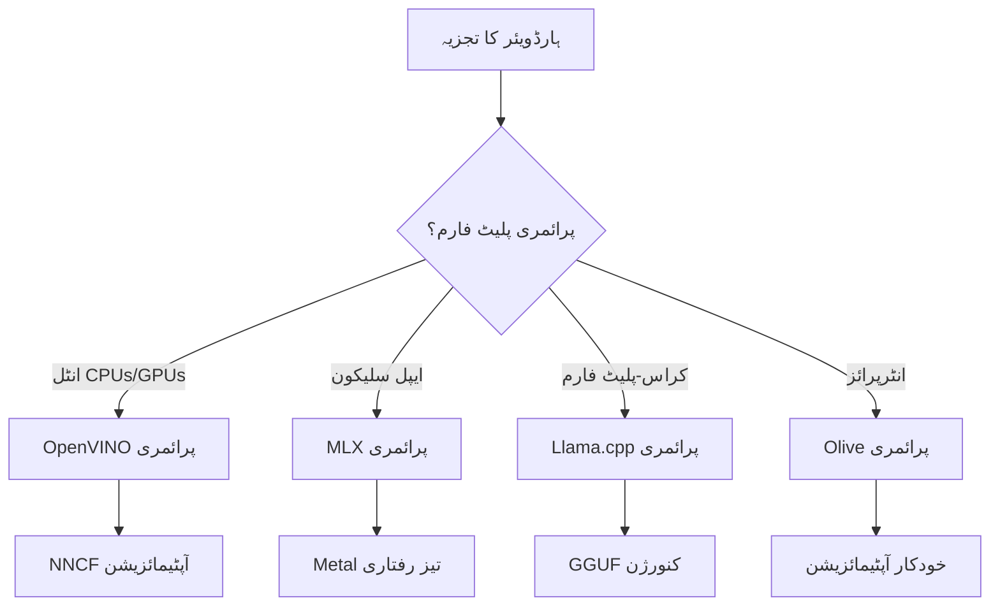
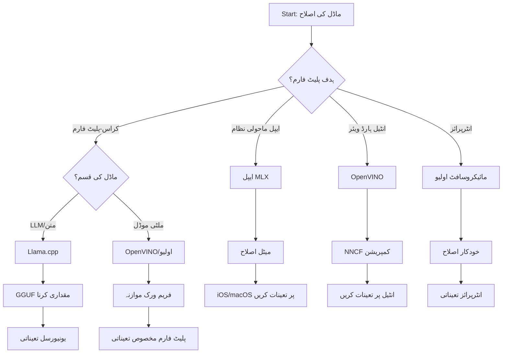
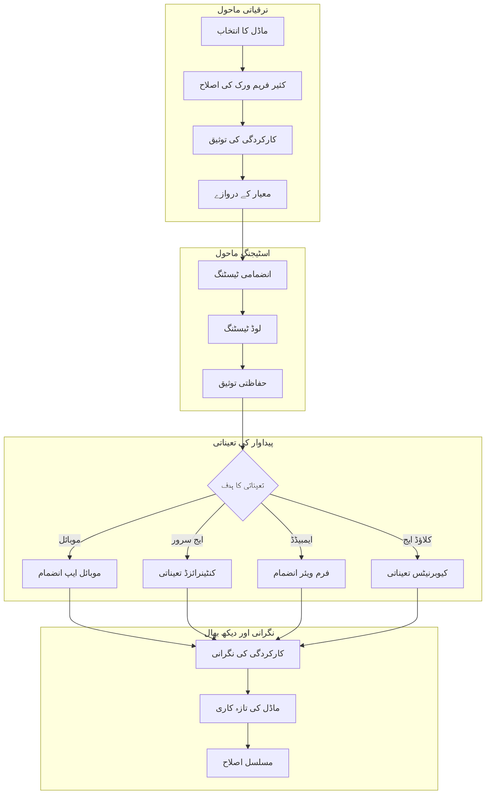

# سیکشن 6: ایج AI ڈیولپمنٹ ورک فلو سنتھیسس

## مواد کی فہرست
1. [تعریف](#تعریف)
2. [تعلیمی مقاصد](#تعلیمی-مقاصد)
3. [یکساں ورک فلو کا جائزہ](#یکساں-ورک-فلو-کا-جائزہ)
4. [فریم ورک کے انتخاب کا میٹرکس](#فریم-ورک-کے-انتخاب-کا-میٹرکس)
5. [بہترین طریقہ کار کی سنتھیسس](#بہترین-طریقہ-کار-کی-سنتھیسس)
6. [تنصیب کی حکمت عملی کی رہنمائی](#تنصیب-کی-حکمت-عملی-کی-رہنمائی)
7. [کارکردگی کی بہتری کا ورک فلو](#کارکردگی-کی-بہتری-کا-ورک-فلو)
8. [پیداوار کی تیاری کا چیک لسٹ](#پیداوار-کی-تیاری-کا-چیک-لسٹ)
9. [مسائل کا حل اور نگرانی](#مسائل-کا-حل-اور-نگرانی)
10. [آپ کے ایج AI پائپ لائن کا مستقبل محفوظ بنانا](#آپ-کے-ایج-ai-پائپ-لائن-کا-مستقبل-محفوظ-بنانا)

## تعریف

ایج AI ڈیولپمنٹ کے لیے متعدد آپٹیمائزیشن فریم ورکس، تنصیب کی حکمت عملیوں، اور ہارڈویئر کے پہلوؤں کی گہری سمجھ ضروری ہے۔ یہ جامع سنتھیسس Llama.cpp، Microsoft Olive، OpenVINO، اور Apple MLX کے علم کو یکجا کرتا ہے تاکہ ایک یکساں ورک فلو تیار کیا جا سکے جو کارکردگی کو زیادہ سے زیادہ کرے، معیار کو برقرار رکھے، اور کامیاب پروڈکشن تنصیب کو یقینی بنائے۔

اس کورس میں، ہم نے انفرادی آپٹیمائزیشن فریم ورکس کا جائزہ لیا ہے، جن کی اپنی منفرد خصوصیات اور مخصوص استعمال کے کیسز ہیں۔ تاہم، حقیقی دنیا کے ایج AI پروجیکٹس اکثر متعدد فریم ورکس کی تکنیکوں کو ملا کر یا حکمت عملی کے فیصلے کر کے کام کرتے ہیں کہ کون سا طریقہ مخصوص پابندیوں اور ضروریات کے لیے بہترین نتائج دے گا۔

یہ سیکشن تمام فریم ورکس سے جمع شدہ حکمت عملی کو قابل عمل ورک فلو، فیصلہ سازی کے درختوں، اور بہترین طریقہ کار میں تبدیل کرتا ہے جو آپ کو موثر طریقے سے پروڈکشن-ریڈی ایج AI حل تیار کرنے کے قابل بناتے ہیں۔ چاہے آپ موبائل ڈیوائسز، ایمبیڈڈ سسٹمز، یا ایج سرورز کے لیے آپٹیمائز کر رہے ہوں، یہ رہنما آپ کو ترقیاتی زندگی کے دوران باخبر فیصلے کرنے کے لیے اسٹریٹجک فریم ورک فراہم کرتا ہے۔

## تعلیمی مقاصد

اس سیکشن کے آخر تک، آپ قادر ہوں گے:

### حکمت عملی کے فیصلے کرنا
- **منصوبے کی ضروریات، ہارڈویئر کی پابندیوں، اور تنصیب کے مناظر کی بنیاد پر** مثالی آپٹیمائزیشن فریم ورک کا جائزہ لیں اور انتخاب کریں
- **مکمل ورک فلو ڈیزائن کریں** جو متعدد آپٹیمائزیشن تکنیکوں کو زیادہ سے زیادہ کارکردگی کے لیے مربوط کریں
- **ماڈل کی درستگی، مفروضہ کی رفتار، میموری کے استعمال، اور تنصیب کی پیچیدگی کے درمیان** تجارتوں کا جائزہ لیں مختلف فریم ورکس کے لحاظ سے

### ورک فلو انضمام
- **یکساں ترقیاتی پائپ لائنز نافذ کریں** جو متعدد آپٹیمائزیشن فریم ورکس کی طاقتوں کو استعمال کریں
- **پیداوری ماڈل آپٹیمائزیشن اور تنصیب کے لیے قابل تکرار ورک فلو تخلیق کریں** مختلف ماحولیات میں
- **معیار کے گیٹس اور توثیقی عمل قائم کریں** تاکہ بہتر ماڈلز پروڈکشن کی ضروریات کو پورا کریں

### کارکردگی کی بہتری
- **مقداری بنانے، pruning، اور ہارڈویئر-مخصوص تیز رفتار تکنیکوں** کا استعمال کرتے ہوئے منظم آپٹیمائزیشن حکمت عملی اپنائیں
- **کارکردگی کی نگرانی اور بینچ مارکنگ کریں** مختلف آپٹیمائزیشن سطحوں اور تنصیب کے ہدفوں پر
- **مخصوص ہارڈویئر پلیٹ فارمز کے لیے آپٹیمائز کریں** بشمول CPU، GPU، NPU، اور خصوصی ایج ایکسیلیریٹرز

### پروڈکشن کی تنصیب
- **پیمانے کے قابل تنصیب ساختیں ڈیزائن کریں** جو متعدد ماڈل فارمیٹس اور انفرنس انجنز کو سمو لیں
- **ایج AI ایپلیکیشنز کے لیے نگرانی اور دیکھ بھال نافذ کریں** پروڈکشن ماحول میں
- **ماڈل کی تازہ کاری، کارکردگی کی نگرانی، اور سسٹم آپٹیمائزیشن کے لیے دیکھ بھال کے ورک فلو قائم کریں**

### کثیر پلیٹ فارم برتری
- **مختلف ہارڈویئر پلیٹ فارمز پر بہتر ماڈلز کی تنصیب کریں** جبکہ مستقل کارکردگی برقرار رکھیں
- **ونڈوز، میک او ایس، لینکس، موبائل، اور ایمبیڈڈ سسٹمز کے لیے پلیٹ فارم-مخصوص آپٹیمائزیشنز سنبھالیں**
- **ایبستریکشن لیئرز تخلیق کریں** جو مختلف ایج ماحولیات میں آسانی سے تعیناتی کو ممکن بنائیں

## یکساں ورک فلو کا جائزہ

### مرحلہ 1: ضروریات کا تجزیہ اور فریم ورک کا انتخاب

کامیاب ایج AI تنصیب کی بنیاد اچھی طرح سے ضروریات کے تجزیے پر مبنی ہوتی ہے جو فریم ورک کے انتخاب اور آپٹیمائزیشن حکمت عملی کی رہنمائی کرتا ہے۔

#### 1.1 ہارڈویئر کا جائزہ


**اہم نکات:**
- **CPU آرکیٹیکچر**: x86، ARM، Apple Silicon کی صلاحیتیں
- **ایکسیلیریٹر کی دستیابی**: GPU، NPU، VPU، خصوصی AI چپس
- **میموری کی پابندیاں**: RAM کی حدود، ذخیرہ کرنے کی گنجائش
- **طاقت کا بجٹ**: بیٹری کی زندگی، حرارتی پابندیاں
- **کنیکٹیویٹی**: آف لائن ضروریات، بینڈوڈتھ کی حدود

#### 1.2 اپلیکیشن کی ضروریات کا میٹرکس

| ضرورت | Llama.cpp | Microsoft Olive | OpenVINO | Apple MLX |
|-------------|-----------|-----------------|----------|-----------|
| کراس-پلیٹ فارم | ✅ بہترین | ⚡ اچھا | ⚡ اچھا | ❌ صرف ایپل |
| انٹرپرائز انٹیگریشن | ⚡ بنیادی | ✅ بہترین | ✅ بہترین | ⚡ محدود |
| موبائل تنصیب | ✅ بہترین | ⚡ اچھا | ⚡ اچھا | ✅ آئی او ایس بہترین |
| ریئل ٹائم انفرنس | ✅ بہترین | ✅ بہترین | ✅ بہترین | ✅ بہترین |
| ماڈل کی مختلف النوعیت | ✅ LLM فوکس | ✅ تمام ماڈلز | ✅ تمام ماڈلز | ✅ LLM فوکس |
| استعمال میں آسانی | ✅ آسان | ✅ خودکار | ⚡ معتدل | ✅ آسان |

### مرحلہ 2: ماڈل کی تیاری اور آپٹیمائزیشن

#### 2.1 یونیورسل ماڈل اسیسمنٹ پائپ لائن

```python
# یونیورسل ماڈل اسیسمنٹ فریم ورک
class EdgeAIModelAssessment:
    def __init__(self, model_path, target_hardware):
        self.model_path = model_path
        self.target_hardware = target_hardware
        self.optimization_frameworks = []
        
    def assess_model_characteristics(self):
        """Analyze model size, architecture, and complexity"""
        return {
            'model_size': self.get_model_size(),
            'parameter_count': self.get_parameter_count(),
            'architecture_type': self.detect_architecture(),
            'quantization_compatibility': self.check_quantization_support()
        }
    
    def recommend_optimization_strategy(self):
        """Recommend optimal frameworks and techniques"""
        characteristics = self.assess_model_characteristics()
        
        if self.target_hardware.startswith('apple'):
            return self.mlx_optimization_strategy(characteristics)
        elif self.target_hardware.startswith('intel'):
            return self.openvino_optimization_strategy(characteristics)
        elif characteristics['model_size'] > 7_000_000_000:  # 7 ارب سے زائد پیرا میٹرز
            return self.enterprise_optimization_strategy(characteristics)
        else:
            return self.lightweight_optimization_strategy(characteristics)
```

#### 2.2 کثیر فریم ورک آپٹیمائزیشن پائپ لائن

**تسلسل سے آپٹیمائزیشن طریقہ کار:**
1. **ابتدائی کنورژن**: درمیانی فارمیٹ میں کنورٹ کریں (اگر ممکن ہو تو ONNX)
2. **فریم ورک مخصوص آپٹیمائزیشن**: خصوصی تکنیکوں کا اطلاق کریں
3. **کراس-ویلیڈیشن**: ہدف پلیٹ فارمز پر کارکردگی کی تصدیق کریں
4. **آخری پیکجنگ**: تنصیب کے لیے تیار کریں

```bash
# ملٹی فریم ورک آپٹیمائزیشن اسکرپٹ
#!/bin/bash

MODEL_NAME="phi-3-mini"
BASE_MODEL="microsoft/Phi-3-mini-4k-instruct"

# مرحلہ 1: ONNX تبدیلی (عالمی)
python convert_to_onnx.py --model $BASE_MODEL --output models/onnx/

# مرحلہ 2: پلیٹ فارم مخصوص آپٹیمائزیشن
if [[ "$TARGET_PLATFORM" == "intel" ]]; then
    # OpenVINO کی اصلاح
    python optimize_openvino.py --input models/onnx/ --output models/openvino/
elif [[ "$TARGET_PLATFORM" == "apple" ]]; then
    # MLX کی اصلاح
    python optimize_mlx.py --input $BASE_MODEL --output models/mlx/
elif [[ "$TARGET_PLATFORM" == "cross" ]]; then
    # Llama.cpp کی اصلاح
    python convert_to_gguf.py --input models/onnx/ --output models/gguf/
fi

# مرحلہ 3: توثیق
python validate_optimization.py --original $BASE_MODEL --optimized models/$TARGET_PLATFORM/
```

### مرحلہ 3: کارکردگی کی تصدیق اور بینچ مارکنگ

#### 3.1 جامع بینچ مارکنگ فریم ورک

```python
class EdgeAIBenchmark:
    def __init__(self, optimized_models):
        self.models = optimized_models
        self.metrics = {
            'inference_time': [],
            'memory_usage': [],
            'accuracy_score': [],
            'throughput': [],
            'energy_consumption': []
        }
    
    def run_comprehensive_benchmark(self):
        """Execute standardized benchmarks across all optimized models"""
        test_inputs = self.generate_test_inputs()
        
        for model_framework, model_path in self.models.items():
            print(f"Benchmarking {model_framework}...")
            
            # تاخیر کی جانچ
            latency = self.measure_inference_latency(model_path, test_inputs)
            
            # میموری پروفائلنگ
            memory = self.profile_memory_usage(model_path)
            
            # درستگی کی تصدیق
            accuracy = self.validate_model_accuracy(model_path, test_inputs)
            
            # تھروپٹ تجزیہ
            throughput = self.measure_throughput(model_path)
            
            self.record_metrics(model_framework, latency, memory, accuracy, throughput)
    
    def generate_optimization_report(self):
        """Create comprehensive comparison report"""
        report = {
            'recommendations': self.analyze_performance_trade_offs(),
            'deployment_guidance': self.generate_deployment_recommendations(),
            'monitoring_requirements': self.define_monitoring_metrics()
        }
        return report
```

## فریم ورک کے انتخاب کا میٹرکس

### فریم ورک انتخاب کے لیے فیصلہ درخت



### جامع انتخاب کے معیار

#### 1. بنیادی استعمال کا معاملہ

**بڑے زبان کے ماڈل (LLMs):**
- **Llama.cpp**: CPU پر مرکوز، کراس-پلیٹ فارم تنصیب کے لیے بہترین
- **Apple MLX**: Apple Silicon کے لیے مثالی، متحدہ میموری کے ساتھ
- **OpenVINO**: Intel ہارڈویئر کے لیے بہترین، NNCF آپٹیمائزیشن شامل ہے
- **Microsoft Olive**: خودکار انٹرپرائز ورک فلو کے لیے موزوں

**کثیر وضعی ماڈلز:**
- **OpenVINO**: وژن، آڈیو، اور ٹیکسٹ کی جامع حمایت
- **Microsoft Olive**: پیچیدہ پائپ لائنز کے لیے انٹرپرائز گریڈ آپٹیمائزیشن
- **Llama.cpp**: صرف ٹیکسٹ پر مبنی ماڈلز تک محدود
- **Apple MLX**: کثیر وضعی درخواستوں کی بڑھتی ہوئی حمایت

#### 2. ہارڈویئر پلیٹ فارم میٹرکس

| پلیٹ فارم | بنیادی فریم ورک | ثانوی انتخاب | مخصوص خصوصیات |
|----------|------------------|------------------|---------------------|
| Intel CPU/GPU | OpenVINO | Microsoft Olive | NNCF کمپریشن، Intel آپٹیمائزیشن |
| NVIDIA GPU | Microsoft Olive | OpenVINO | CUDA تیز رفتاری، انٹرپرائز خصوصیات |
| Apple Silicon | Apple MLX | Llama.cpp | میٹل شیڈرز، متحدہ میموری |
| ARM موبائل | Llama.cpp | OpenVINO | کراس-پلیٹ فارم، کم سے کم انحصار |
| Edge TPU | OpenVINO | Microsoft Olive | مخصوص ایکسیلیریٹر سپورٹ |
| ایمبیڈڈ ARM | Llama.cpp | OpenVINO | کم فٹ پرنٹ، موثر انفرنس |

#### 3. ترقیاتی ورک فلو کی ترجیحات

**تیز پروٹو ٹائپنگ:**
1. **Llama.cpp**: سب سے تیز سیٹ اپ، فوری نتائج
2. **Apple MLX**: سادہ پائتھون API، تیزی سے تکرار
3. **Microsoft Olive**: خودکار آپٹیمائزیشن، کم سے کم کنفیگریشن
4. **OpenVINO**: زیادہ پیچیدہ سیٹ اپ، جامع خصوصیات

**انٹرپرائز پروڈکشن:**
1. **Microsoft Olive**: انٹرپرائز خصوصیات، Azure انٹیگریشن
2. **OpenVINO**: Intel کے ماحولیاتی نظام، جامع اوزار
3. **Apple MLX**: Apple مخصوص انٹرپرائز ایپلیکیشنز
4. **Llama.cpp**: سادہ تنصیب، محدود انٹرپرائز خصوصیات

## بہترین طریقہ کار کی سنتھیسس

### یونیورسل آپٹیمائزیشن اصول

#### 1. تدریجی آپٹیمائزیشن کی حکمت عملی

```python
class ProgressiveOptimization:
    def __init__(self, base_model):
        self.base_model = base_model
        self.optimization_stages = [
            'baseline_measurement',
            'format_conversion',
            'quantization_optimization',
            'hardware_acceleration',
            'production_validation'
        ]
    
    def execute_progressive_optimization(self):
        """Apply optimization techniques incrementally"""
        
        # مرحلہ 1: بنیادی پیمائش
        baseline_metrics = self.measure_baseline_performance()
        
        # مرحلہ 2: فارمیٹ کی تبدیلی
        converted_model = self.convert_to_optimal_format()
        conversion_metrics = self.measure_performance(converted_model)
        
        # مرحلہ 3: مقداری کرنا
        quantized_model = self.apply_quantization(converted_model)
        quantization_metrics = self.measure_performance(quantized_model)
        
        # مرحلہ 4: ہارڈ ویئر کی تیز رفتار
        accelerated_model = self.enable_hardware_acceleration(quantized_model)
        acceleration_metrics = self.measure_performance(accelerated_model)
        
        # مرحلہ 5: توثیق
        production_ready = self.validate_for_production(accelerated_model)
        
        return self.compile_optimization_report(
            baseline_metrics, conversion_metrics, 
            quantization_metrics, acceleration_metrics
        )
```

#### 2. معیار کے گیٹ کا نفاذ

**درستگی کو محفوظ رکھنے والے گیٹس:**
- اصل ماڈل کی 95٪ سے زیادہ درستگی برقرار رکھیں
- نمائندہ ٹیسٹ ڈیٹا سیٹس کے مقابلے میں توثیق کریں
- پروڈکشن کی توثیق کے لیے A/B ٹیسٹنگ نافذ کریں

**کارکردگی میں بہتری کے گیٹس:**
- کم از کم 2 گنا رفتار میں بہتری حاصل کریں
- میموری کے استعمال کو کم از کم 50 فیصد کم کریں
- انفرنس وقت کی مطابقت کی تصدیق کریں

**پروڈکشن ریڈینس گیٹس:**
- لوڈ کے تحت اسٹریس ٹیسٹنگ پاس کریں
- وقت کے ساتھ مستحکم کارکردگی کا مظاہرہ کریں
- سیکیورٹی اور پرائیویسی کی ضروریات کی توثیق کریں

### فریم ورک مخصوص بہترین طریقہ کار کا انضمام

#### 1. مقداری حکمت عملی کی سنتھیسس

```python
# مربوط کمی کا طریقہ کار
class UnifiedQuantizationStrategy:
    def __init__(self, model, target_platform):
        self.model = model
        self.platform = target_platform
        
    def select_optimal_quantization(self):
        """Choose best quantization based on platform and requirements"""
        
        if self.platform == 'apple_silicon':
            return self.mlx_quantization_strategy()
        elif self.platform == 'intel_hardware':
            return self.openvino_quantization_strategy()
        elif self.platform == 'cross_platform':
            return self.llamacpp_quantization_strategy()
        else:
            return self.olive_quantization_strategy()
    
    def mlx_quantization_strategy(self):
        """Apple MLX-specific quantization"""
        return {
            'method': 'mlx_quantize',
            'precision': 'int4',
            'group_size': 64,
            'optimization_target': 'unified_memory'
        }
    
    def openvino_quantization_strategy(self):
        """OpenVINO NNCF quantization"""
        return {
            'method': 'nncf_quantize',
            'precision': 'int8',
            'calibration_method': 'post_training',
            'optimization_target': 'intel_hardware'
        }
```

#### 2. ہارڈویئر تیز رفتاری کی بہتری

**CPU آپٹیمائزیشن کا مجموعہ:**
- **SIMD ہدایات**: فریم ورکس میں بہتر کورنلز کا فائدہ اٹھائیں
- **میموری بینڈوڈتھ**: کیش مؤثر بنانے کے لیے ڈیٹا کی ترتیب بہتر کریں
- **تھرڈنگ**: وسائل کی پابندیوں کے ساتھ متوازی کام کو متوازن کریں

**GPU تیز رفتاری کے بہترین طریقے:**
- **بیچ پروسیسنگ**: مناسب بیچ سائز کے ساتھ تھروپٹ زیادہ سے زیادہ کریں
- **میموری مینجمنٹ**: GPU میموری کی الاٹمنٹ اور منتقلی کو بہتر بنائیں
- **درستگی**: بہتر کارکردگی کے لیے FP16 استعمال کریں جب ممکن ہو

**NPU/خصوصی ایکسیلیریٹر کی آپٹیمائزیشن:**
- **ماڈل آرکیٹیکچر**: ایکسیلیریٹر صلاحیتوں سے مطابقت یقینی بنائیں
- **ڈیٹا فلو**: ایکسیلیریٹر کی افادیت کے لیے ان پٹ/آؤٹ پٹ پائپ لائنز کو بہتر بنائیں
- **فالبیک حکمت عملی**: غیر سپورٹڈ آپریشنز کے لیے CPU فالبیک نافذ کریں

## تنصیب کی حکمت عملی کی رہنمائی

### یونیورسل تنصیب کی ساخت



### پلیٹ فارم مخصوص تنصیب کے انداز

#### 1. موبائل تنصیب کی حکمت عملی

```yaml
# Mobile Deployment Configuration
mobile_deployment:
  ios:
    framework: apple_mlx
    optimization:
      quantization: int4
      memory_mapping: true
      background_execution: limited
    packaging:
      format: mlx
      bundle_size: <50MB
      
  android:
    framework: llama_cpp
    optimization:
      quantization: q4_k_m
      threading: android_optimized
      memory_management: conservative
    packaging:
      format: gguf
      apk_size: <100MB
      
  cross_platform:
    framework: onnx_runtime
    optimization:
      quantization: int8
      execution_provider: cpu
    packaging:
      format: onnx
      shared_libraries: minimal
```

#### 2. ایج سرور کی تنصیب

```yaml
# Edge Server Deployment Configuration
edge_server:
  intel_based:
    framework: openvino
    optimization:
      quantization: int8
      acceleration: cpu_gpu_auto
      batch_processing: dynamic
    deployment:
      container: openvino_runtime
      orchestration: kubernetes
      scaling: horizontal
      
  nvidia_based:
    framework: microsoft_olive
    optimization:
      quantization: int4
      acceleration: cuda
      tensor_parallelism: true
    deployment:
      container: nvidia_triton
      orchestration: kubernetes
      scaling: gpu_aware
```

### کنٹینرائزیشن کے بہترین طریقے

```dockerfile
# Multi-Framework Edge AI Container
FROM ubuntu:22.04 as base

# Install common dependencies
RUN apt-get update && apt-get install -y \
    python3 \
    python3-pip \
    build-essential \
    cmake \
    && rm -rf /var/lib/apt/lists/*

# Framework-specific stages
FROM base as openvino
RUN pip install openvino nncf optimum[intel]

FROM base as llamacpp
RUN git clone https://github.com/ggerganov/llama.cpp.git \
    && cd llama.cpp && make LLAMA_OPENBLAS=1

FROM base as olive
RUN pip install olive-ai[auto-opt] onnxruntime-genai

# Production stage with selected framework
FROM openvino as production
COPY models/ /app/models/
COPY src/ /app/src/
WORKDIR /app

EXPOSE 8080
CMD ["python3", "src/inference_server.py"]
```

## کارکردگی کی بہتری کا ورک فلو

### منظم کارکردگی کی بہتری

#### 1. کارکردگی کی پروفائلنگ پائپ لائن

```python
class EdgeAIPerformanceProfiler:
    def __init__(self, model_path, framework):
        self.model_path = model_path
        self.framework = framework
        self.profiling_results = {}
    
    def comprehensive_profiling(self):
        """Execute comprehensive performance analysis"""
        
        # سی پی یو کی پروفائلنگ
        cpu_profile = self.profile_cpu_usage()
        
        # میموری کی پروفائلنگ
        memory_profile = self.profile_memory_usage()
        
        # تعقل کی تاخیر
        latency_profile = self.profile_inference_latency()
        
        # تھروپٹ کا تجزیہ
        throughput_profile = self.profile_throughput()
        
        # توانائی کی کھپت (جہاں دستیاب ہو)
        energy_profile = self.profile_energy_consumption()
        
        return self.compile_performance_report(
            cpu_profile, memory_profile, latency_profile,
            throughput_profile, energy_profile
        )
    
    def identify_bottlenecks(self):
        """Automatically identify performance bottlenecks"""
        bottlenecks = []
        
        if self.profiling_results['cpu_utilization'] > 80:
            bottlenecks.append('cpu_bound')
        
        if self.profiling_results['memory_usage'] > 90:
            bottlenecks.append('memory_bound')
        
        if self.profiling_results['inference_variance'] > 20:
            bottlenecks.append('inconsistent_performance')
        
        return self.generate_optimization_recommendations(bottlenecks)
```

#### 2. خودکار آپٹیمائزیشن کی پائپ لائن

```python
class AutomatedOptimizationPipeline:
    def __init__(self, base_model, target_constraints):
        self.base_model = base_model
        self.constraints = target_constraints
        self.optimization_history = []
    
    def execute_optimization_search(self):
        """Systematically search optimization space"""
        
        optimization_candidates = [
            {'quantization': 'int8', 'pruning': 0.1},
            {'quantization': 'int4', 'pruning': 0.2},
            {'quantization': 'int8', 'acceleration': 'gpu'},
            {'quantization': 'int4', 'acceleration': 'npu'}
        ]
        
        best_configuration = None
        best_score = 0
        
        for config in optimization_candidates:
            optimized_model = self.apply_optimization(config)
            score = self.evaluate_optimization(optimized_model)
            
            if score > best_score and self.meets_constraints(optimized_model):
                best_score = score
                best_configuration = config
            
            self.optimization_history.append({
                'config': config,
                'score': score,
                'model': optimized_model
            })
        
        return best_configuration, self.optimization_history
```

### کثیر المقاصد آپٹیمائزیشن  

#### 1. ایج AI کے لیے پیریٹو آپٹیمائزیشن

```python
class ParetoOptimization:
    def __init__(self, objectives=['speed', 'accuracy', 'memory']):
        self.objectives = objectives
        self.pareto_frontier = []
    
    def find_pareto_optimal_solutions(self, optimization_results):
        """Identify Pareto-optimal configurations"""
        
        for result in optimization_results:
            is_dominated = False
            
            for frontier_point in self.pareto_frontier:
                if self.dominates(frontier_point, result):
                    is_dominated = True
                    break
            
            if not is_dominated:
                # سرحد سے مغلوب نکات کو ہٹا دیں
                self.pareto_frontier = [
                    point for point in self.pareto_frontier 
                    if not self.dominates(result, point)
                ]
                
                self.pareto_frontier.append(result)
        
        return self.pareto_frontier
    
    def recommend_configuration(self, user_preferences):
        """Recommend configuration based on user preferences"""
        
        weighted_scores = []
        for config in self.pareto_frontier:
            score = sum(
                user_preferences[obj] * config['metrics'][obj] 
                for obj in self.objectives
            )
            weighted_scores.append((score, config))
        
        return max(weighted_scores, key=lambda x: x[0])[1]
```

## پیداوار کی تیاری کا چیک لسٹ

### جامع پیداوار کی توثیق

#### 1. ماڈل کے معیار کی یقین دہانی

```python
class ProductionReadinessValidator:
    def __init__(self, optimized_model, production_requirements):
        self.model = optimized_model
        self.requirements = production_requirements
        self.validation_results = {}
    
    def validate_model_quality(self):
        """Comprehensive model quality validation"""
        
        # درستی کی تصدیق
        accuracy_result = self.validate_accuracy()
        
        # کارکردگی کی تصدیق
        performance_result = self.validate_performance()
        
        # مضبوطی کی جانچ
        robustness_result = self.validate_robustness()
        
        # سیکیورٹی کا جائزہ
        security_result = self.validate_security()
        
        # تعمیل کی تصدیق
        compliance_result = self.validate_compliance()
        
        return self.compile_validation_report(
            accuracy_result, performance_result, robustness_result,
            security_result, compliance_result
        )
    
    def generate_certification_report(self):
        """Generate production certification report"""
        return {
            'model_signature': self.generate_model_signature(),
            'validation_timestamp': datetime.now(),
            'validation_results': self.validation_results,
            'deployment_approval': self.check_deployment_approval(),
            'monitoring_requirements': self.define_monitoring_requirements()
        }
```

#### 2. پیداوار کی تنصیب کا چیک لسٹ

**پہلے سے تنصیب کی توثیق:**
- [ ] ماڈل کی درستگی کم از کم شرائط کو پورا کرتی ہے (بنیادی لائن کا >95%)
- [ ] کارکردگی کے اہداف حاصل کیے گئے (تاخیر، تھروپٹ، میموری)
- [ ] سیکیورٹی کے نقائص کا جائزہ لیا گیا اور ان کو کم کیا گیا
- [ ] متوقع بوجھ کے تحت اسٹریس ٹیسٹنگ مکمل ہوئی
- [ ] ناکامی کے منظرنامے آزمائے گئے اور بازیابی کے طریقے درست کیے گئے
- [ ] نگرانی اور الارم کے نظام ترتیب دیے گئے
- [ ] رول بیک کے طریقہ کار کا تجربہ کیا گیا اور دستاویزی شکل دی گئی

**تنصیب کا عمل:**
- [ ] بلو-گرین تنصیب کی حکمت عملی نافذ کی گئی
- [ ] تدریجی ٹریفک کی بڑھوتری ترتیب دی گئی
- [ ] حقیقی وقت کی نگرانی کے ڈیش بورڈ فعال ہیں
- [ ] کارکردگی کے معیار قائم کیے گئے
- [ ] غلطی کی شرح کے حد بندی کی تعریف کی گئی
- [ ] خودکار رول بیک ٹرگرز کی ترتیب دی گئی

**تنصیب کے بعد نگرانی:**
- [ ] ماڈل کی تبدیلی کا پتہ لگانا فعال ہے
- [ ] کارکردگی میں کمی کے انتباہات ترتیب دیے گئے
- [ ] وسائل کے استعمال کی نگرانی فعال ہے
- [ ] صارف کے تجربے کے میٹرکس ٹریک کیے جاتے ہیں
- [ ] ماڈل کی ورژننگ اور اصل برقرار رکھی جاتی ہے
- [ ] باقاعدہ ماڈل کارکردگی کے جائزے طے کیے گئے ہیں

### مسلسل انضمام/مسلسل تنصیب (CI/CD)

```yaml
# Edge AI CI/CD Pipeline Configuration
edge_ai_pipeline:
  stages:
    - model_validation
    - optimization
    - testing
    - staging_deployment
    - production_deployment
    - monitoring
  
  model_validation:
    accuracy_threshold: 0.95
    performance_baseline: required
    security_scan: enabled
    
  optimization:
    frameworks:
      - llama_cpp
      - openvino
      - microsoft_olive
    validation:
      cross_validation: enabled
      performance_comparison: required
      
  testing:
    unit_tests: comprehensive
    integration_tests: full_pipeline
    load_tests: production_scale
    security_tests: comprehensive
    
  deployment:
    strategy: blue_green
    traffic_ramping: gradual
    rollback: automatic
    monitoring: real_time
```

## مسائل کا حل اور نگرانی

### یونیورسل مسائل حل کرنے کا فریم ورک

#### 1. عام مسائل اور حل

**کارکردگی کے مسائل:**
```python
class PerformanceTroubleshooter:
    def __init__(self, model_metrics):
        self.metrics = model_metrics
        
    def diagnose_performance_issues(self):
        """Systematic performance issue diagnosis"""
        
        issues = []
        
        # اعلی تاخیر کی تشخیص
        if self.metrics['avg_latency'] > self.metrics['target_latency']:
            issues.append(self.diagnose_latency_issues())
        
        # میموری کے استعمال کی تشخیص
        if self.metrics['memory_usage'] > self.metrics['memory_limit']:
            issues.append(self.diagnose_memory_issues())
        
        # تھروپٹ کی تشخیص
        if self.metrics['throughput'] < self.metrics['target_throughput']:
            issues.append(self.diagnose_throughput_issues())
        
        return self.generate_resolution_plan(issues)
    
    def diagnose_latency_issues(self):
        """Specific latency troubleshooting"""
        potential_causes = []
        
        if self.metrics['cpu_utilization'] > 80:
            potential_causes.append('cpu_bottleneck')
        
        if self.metrics['memory_bandwidth'] > 90:
            potential_causes.append('memory_bandwidth_limit')
        
        if self.metrics['model_size'] > self.metrics['optimal_size']:
            potential_causes.append('model_too_large')
        
        return {
            'issue': 'high_latency',
            'causes': potential_causes,
            'solutions': self.generate_latency_solutions(potential_causes)
        }
```

**فریم ورک مخصوص مسائل کا حل:**

| مسئلہ | Llama.cpp | Microsoft Olive | OpenVINO | Apple MLX |
|-------|-----------|-----------------|----------|-----------|
| میموری مسائل | کانٹیکسٹ کی لمبائی کم کریں | بیچ کا سائز کم کریں | کیشنگ فعال کریں | میموری میپنگ استعمال کریں |
| آہستہ انفرنس | SIMD فعال کریں | مقداری کو چیک کریں | تھرڈنگ کو بہتر کریں | میٹل فعال کریں |
| درستگی میں کمی | زیادہ مقداری | QAT کے ساتھ دوبارہ تربیت دیں | کیلیبریشن بڑھائیں | مقداری کے بعد فن ٹیون کریں |
| مطابقت | ماڈل فارمیٹ چیک کریں | فریم ورک کا ورژن چیک کریں | ڈرائیورز اپ ڈیٹ کریں | macOS ورژن چیک کریں |

#### 2. پیداوار کی نگرانی کی حکمت عملی

```python
class EdgeAIMonitoring:
    def __init__(self, deployment_config):
        self.config = deployment_config
        self.metrics_collectors = []
        self.alerting_rules = []
    
    def setup_comprehensive_monitoring(self):
        """Configure comprehensive monitoring for Edge AI deployment"""
        
        # ماڈل کی کارکردگی کی نگرانی
        self.setup_model_performance_monitoring()
        
        # انفراسٹرکچر کی نگرانی
        self.setup_infrastructure_monitoring()
        
        # کاروباری میٹرکس کی نگرانی
        self.setup_business_metrics_monitoring()
        
        # سیکیورٹی کی نگرانی
        self.setup_security_monitoring()
    
    def setup_model_performance_monitoring(self):
        """Model-specific performance monitoring"""
        metrics = [
            'inference_latency_p50',
            'inference_latency_p95',
            'inference_latency_p99',
            'model_accuracy_drift',
            'prediction_confidence_distribution',
            'error_rate',
            'throughput_requests_per_second'
        ]
        
        for metric in metrics:
            self.add_metric_collector(metric)
            self.add_alerting_rule(metric)
    
    def detect_model_drift(self):
        """Automated model drift detection"""
        drift_indicators = [
            self.statistical_drift_detection(),
            self.performance_drift_detection(),
            self.data_distribution_shift_detection()
        ]
        
        return self.aggregate_drift_signals(drift_indicators)
```

### خودکار مسئلہ حل

```python
class AutomatedIssueResolution:
    def __init__(self, monitoring_system):
        self.monitoring = monitoring_system
        self.resolution_strategies = {}
    
    def handle_performance_degradation(self, alert):
        """Automated performance issue resolution"""
        
        if alert['type'] == 'high_latency':
            return self.resolve_latency_issue(alert)
        elif alert['type'] == 'high_memory_usage':
            return self.resolve_memory_issue(alert)
        elif alert['type'] == 'accuracy_drift':
            return self.resolve_accuracy_issue(alert)
        
    def resolve_latency_issue(self, alert):
        """Automated latency issue resolution"""
        resolution_steps = [
            'increase_cpu_allocation',
            'enable_model_caching',
            'reduce_batch_size',
            'switch_to_quantized_model'
        ]
        
        for step in resolution_steps:
            if self.apply_resolution_step(step):
                return f"Resolved latency issue with: {step}"
        
        return "Escalating to human operator"
```

## آپ کے ایج AI پائپ لائن کا مستقبل محفوظ بنانا

### ابھرتی ہوئی ٹیکنالوجیز کا انضمام

#### 1. اگلے نسل کے ہارڈویئر کی حمایت

```python
class FutureHardwareIntegration:
    def __init__(self):
        self.supported_accelerators = [
            'npu_next_gen',
            'quantum_processors',
            'neuromorphic_chips',
            'optical_processors'
        ]
    
    def design_adaptive_pipeline(self):
        """Create hardware-agnostic optimization pipeline"""
        
        pipeline = {
            'model_preparation': self.universal_model_preparation(),
            'hardware_detection': self.dynamic_hardware_detection(),
            'optimization_selection': self.adaptive_optimization_selection(),
            'performance_validation': self.hardware_agnostic_validation()
        }
        
        return pipeline
    
    def adaptive_optimization_selection(self):
        """Dynamically select optimization based on available hardware"""
        
        def optimize_for_hardware(model, available_hardware):
            if 'npu' in available_hardware:
                return self.npu_optimization(model)
            elif 'quantum' in available_hardware:
                return self.quantum_optimization(model)
            elif 'neuromorphic' in available_hardware:
                return self.neuromorphic_optimization(model)
            else:
                return self.fallback_optimization(model)
        
        return optimize_for_hardware
```

#### 2. ماڈل آرکیٹیکچر کا ارتقا

**ابھرتے ہوئے آرکیٹیکچرز کی حمایت:**
- **مخلوط ماہرین (MoE)**: موثر کمی کے لیے کم گھنے ماڈل آرکیٹیکچرز
- **ریٹریول-اوگمنٹڈ جنریشن**: ہائبرڈ ماڈل + علم کی بنیاد کے نظام
- **کثیر وضعی ماڈلز**: وژن + زبان + آڈیو انضمام
- **وفادارانہ تعلیم**: تقسیم شدہ تربیت اور آپٹیمائزیشن

```python
class NextGenModelSupport:
    def __init__(self):
        self.architecture_handlers = {
            'moe': self.handle_mixture_of_experts,
            'rag': self.handle_retrieval_augmented,
            'multimodal': self.handle_multimodal,
            'federated': self.handle_federated_learning
        }
    
    def handle_mixture_of_experts(self, model):
        """Optimize Mixture of Experts models for edge deployment"""
        optimization_strategy = {
            'expert_pruning': True,
            'routing_optimization': True,
            'expert_quantization': 'per_expert',
            'load_balancing': 'dynamic'
        }
        return self.apply_moe_optimization(model, optimization_strategy)
```

### مسلسل تعلیم اور مطابقت

#### 1. آن لائن لرننگ انضمام

```python
class EdgeOnlineLearning:
    def __init__(self, base_model, learning_rate=0.001):
        self.base_model = base_model
        self.learning_rate = learning_rate
        self.adaptation_buffer = []
    
    def continuous_adaptation(self, new_data, feedback):
        """Continuously adapt model based on edge data"""
        
        # مقامی موافقت جو پرائیویسی کا تحفظ کرتی ہے
        local_updates = self.compute_local_gradients(new_data, feedback)
        
        # پابندیوں کے ساتھ اپڈیٹس کا اطلاق کریں
        adapted_model = self.apply_constrained_updates(
            self.base_model, local_updates
        )
        
        # موافقت کے معیار کی تصدیق کریں
        if self.validate_adaptation(adapted_model):
            self.base_model = adapted_model
            return True
        
        return False
    
    def federated_learning_participation(self):
        """Participate in federated learning while preserving privacy"""
        
        # مقامی ماڈل کی اپڈیٹس کا حساب لگائیں
        local_updates = self.compute_private_updates()
        
        # تفریقی پرائیویسی کا تحفظ
        private_updates = self.apply_differential_privacy(local_updates)
        
        # فیڈریٹڈ لرننگ کوآرڈینیٹر کے ساتھ شیئر کریں
        return self.share_updates(private_updates)
```

#### 2. پائیداری اور گرین AI

```python
class GreenEdgeAI:
    def __init__(self, sustainability_targets):
        self.targets = sustainability_targets
        self.energy_monitor = EnergyMonitor()
    
    def optimize_for_sustainability(self, model):
        """Optimize model for minimal environmental impact"""
        
        optimization_objectives = [
            'minimize_energy_consumption',
            'maximize_hardware_utilization',
            'reduce_model_training_cost',
            'extend_device_lifetime'
        ]
        
        return self.multi_objective_green_optimization(
            model, optimization_objectives
        )
    
    def carbon_aware_deployment(self):
        """Deploy models considering carbon footprint"""
        
        deployment_strategy = {
            'prefer_renewable_energy_regions': True,
            'optimize_for_energy_efficiency': True,
            'minimize_data_transfer': True,
            'lifecycle_carbon_accounting': True
        }
        
        return deployment_strategy
```

## نتیجہ

یہ جامع ورک فلو سنتھیسس ایج AI آپٹیمائزیشن کے علم کا نقطہ عروج ہے، جو تمام بڑے آپٹیمائزیشن فریم ورکس کے بہترین طریقہ کار کو یکجا کرکے ایک متحد، پروڈکشن-ریڈی طریقہ کار تیار کرتا ہے۔ ان رہنمائیوں پر عمل کر کے، آپ قابل ہوں گے:

**بہترین کارکردگی حاصل کریں**: منظم فریم ورک انتخاب، تدریجی آپٹیمائزیشن، اور جامع توثیق کے ذریعے، یہ یقینی بناتے ہوئے کہ آپ کی ایج AI ایپلیکیشنز زیادہ سے زیادہ کارکردگی فراہم کریں۔

**پروڈکشن کی تیاری کو یقینی بنائیں**: مکمل جانچ، نگرانی، اور معیار کے گیٹس کے ساتھ جو حقیقی دنیا کے ماحول میں قابل اعتماد تنصیب اور آپریشن کی ضمانت دیتے ہیں۔

**طویل مدت کی کامیابی برقرار رکھیں**: مسلسل نگرانی، خودکار مسئلہ حل، اور موافقت کی حکمت عملیوں کے ذریعے جو آپ کے ایج AI حل کو مؤثر اور متعلقہ رکھتی ہیں۔

**اپنی سرمایہ کاری کا مستقبل محفوظ کریں**: لچکدار، ہارڈویئر سے آزاد پائپ لائنز ڈیزائن کر کے جو ابھرتی ہوئی ٹیکنالوجیز اور ضروریات کے ساتھ ارتقا پزیر ہو سکتی ہیں۔

ایج AI کا منظر نامہ تیزی سے ترقی کر رہا ہے، نئی ہارڈویئر پلیٹ فارمز، آپٹیمائزیشن تکنیکوں، اور تنصیب کی حکمت عملیوں کے مستقل ظہور کے ساتھ۔ یہ سنتھیسس اس پیچیدگی میں راہنمائی فراہم کرتا ہے جبکہ مضبوط، مؤثر، اور قابلِ انتظام ایج AI حل تیار کرتا ہے جو پروڈکشن ماحول میں حقیقی قدر فراہم کرتے ہیں۔

یاد رکھیں کہ بہترین آپٹیمائزیشن حکمت عملی وہی ہے جو آپ کی مخصوص ضروریات کو پورا کرے اور وقت کے ساتھ ان ضروریات کے تبدیل ہونے پر مطابقت پذیری کی گنجائش رکھتی ہو۔ اس رہنما کو باخبر فیصلے کرنے کے لیے فریم ورک کے طور پر استعمال کریں، لیکن ہمیشہ اپنے انتخاب کو تجرباتی جانچ اور حقیقی دنیا کی تنصیب کے تجربے سے تصدیق کریں۔

## ➡️ اگلا کیا ہے


- [07: Qualcomm QNN فریم ورک کی گہری تفصیل](./07.QualcommQNN.md)

---

<!-- CO-OP TRANSLATOR DISCLAIMER START -->
**ڈس کلیمر**:
یہ دستاویز AI ترجمہ سروس [Co-op Translator](https://github.com/Azure/co-op-translator) کے ذریعے ترجمہ کی گئی ہے۔ جبکہ ہم درستگی کے لیے کوشاں ہیں، براہ کرم اس بات سے آگاہ رہیں کہ خودکار ترجمے میں غلطیاں یا عدم درستیاں ہو سکتی ہیں۔ اصل دستاویز اپنے مادری زبان میں مستند ماخذ سمجھی جائے گی۔ حساس معلومات کے لیے پیشہ ور انسانی ترجمہ کی سفارش کی جاتی ہے۔ اس ترجمے کے استعمال سے پیدا ہونے والی کسی بھی غلط فہمی یا غلط تشریح کی ذمہ داری ہم قبول نہیں کرتے۔
<!-- CO-OP TRANSLATOR DISCLAIMER END -->