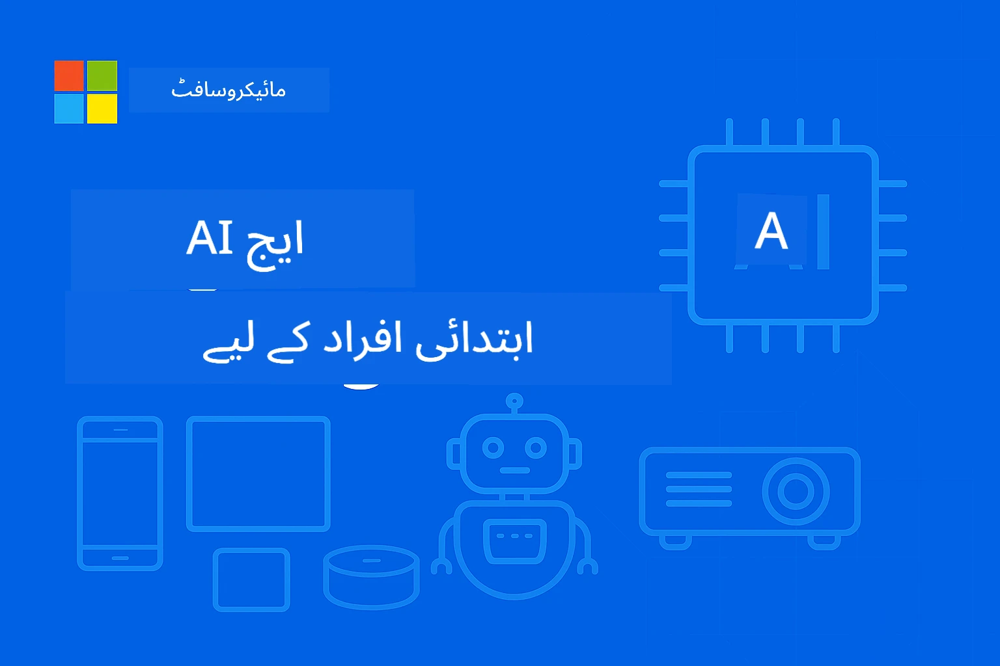

<!--
CO_OP_TRANSLATOR_METADATA:
{
  "original_hash": "ac31463ae3ed21a0ce83b0a351c23dd4",
  "translation_date": "2026-01-05T09:00:48+00:00",
  "source_file": "README.md",
  "language_code": "ur"
}
-->
# ایج اے آئی براۓ مبتدیان




[](https://GitHub.com/microsoft/edgeai-for-beginners/graphs/contributors)
[](https://GitHub.com/microsoft/edgeai-for-beginners/issues)
[](https://GitHub.com/microsoft/edgeai-for-beginners/pulls)
[](http://makeapullrequest.com)

[](https://GitHub.com/microsoft/edgeai-for-beginners/watchers)
[](https://GitHub.com/microsoft/edgeai-for-beginners/fork)
[](https://GitHub.com/microsoft/edgeai-for-beginners/stargazers)


[](https://discord.gg/nTYy5BXMWG)

ان وسائل کو استعمال کرنے کے لیے مندرجہ ذیل مراحل پر عمل کریں:

1. **ریپوزیٹری کو فورک کریں**: کلک کریں [](https://GitHub.com/microsoft/edgeai-for-beginners/fork)
2. **ریپوزیٹری کلون کریں**:   `git clone https://github.com/microsoft/edgeai-for-beginners.git`
3. [**ایزور اے آئی فاؤنڈری ڈسکارڈ میں شامل ہوں اور ماہرین و ساتھی ڈویلپرز سے ملیں**](https://discord.com/invite/ByRwuEEgH4)


### 🌐 کثیراللسانی تعاون

#### گٹ ہب ایکشن کے ذریعے تعاون یافتہ (خودکار اور ہمیشہ تازہ ترین)

<!-- CO-OP TRANSLATOR LANGUAGES TABLE START -->
[Arabic](../ar/README.md) | [Bengali](../bn/README.md) | [Bulgarian](../bg/README.md) | [Burmese (Myanmar)](../my/README.md) | [Chinese (Simplified)](../zh/README.md) | [Chinese (Traditional, Hong Kong)](../hk/README.md) | [Chinese (Traditional, Macau)](../mo/README.md) | [Chinese (Traditional, Taiwan)](../tw/README.md) | [Croatian](../hr/README.md) | [Czech](../cs/README.md) | [Danish](../da/README.md) | [Dutch](../nl/README.md) | [Estonian](../et/README.md) | [Finnish](../fi/README.md) | [French](../fr/README.md) | [German](../de/README.md) | [Greek](../el/README.md) | [Hebrew](../he/README.md) | [Hindi](../hi/README.md) | [Hungarian](../hu/README.md) | [Indonesian](../id/README.md) | [Italian](../it/README.md) | [Japanese](../ja/README.md) | [Kannada](../kn/README.md) | [Korean](../ko/README.md) | [Lithuanian](../lt/README.md) | [Malay](../ms/README.md) | [Malayalam](../ml/README.md) | [Marathi](../mr/README.md) | [Nepali](../ne/README.md) | [Nigerian Pidgin](../pcm/README.md) | [Norwegian](../no/README.md) | [Persian (Farsi)](../fa/README.md) | [Polish](../pl/README.md) | [Portuguese (Brazil)](../br/README.md) | [Portuguese (Portugal)](../pt/README.md) | [Punjabi (Gurmukhi)](../pa/README.md) | [Romanian](../ro/README.md) | [Russian](../ru/README.md) | [Serbian (Cyrillic)](../sr/README.md) | [Slovak](../sk/README.md) | [Slovenian](../sl/README.md) | [Spanish](../es/README.md) | [Swahili](../sw/README.md) | [Swedish](../sv/README.md) | [Tagalog (Filipino)](../tl/README.md) | [Tamil](../ta/README.md) | [Telugu](../te/README.md) | [Thai](../th/README.md) | [Turkish](../tr/README.md) | [Ukrainian](../uk/README.md) | [Urdu](./README.md) | [Vietnamese](../vi/README.md)

> **مقامی کلوننگ کو ترجیح دیں؟**

> یہ ریپوزیٹری 50+ زبانوں کے تراجم شامل کرتی ہے جو ڈاؤن لوڈ کے سائز کو نمایاں طور پر بڑھاتی ہے۔ بغیر تراجم کے کلون کرنے کے لیے، sparse checkout استعمال کریں:
> ```bash
> git clone --filter=blob:none --sparse https://github.com/microsoft/edgeai-for-beginners.git
> cd edgeai-for-beginners
> git sparse-checkout set --no-cone '/*' '!translations' '!translated_images'
> ```
> یہ آپ کو تمام ضروریات فراہم کرتا ہے تاکہ کورس کو بہت تیز رفتار ڈاؤن لوڈ کے ساتھ مکمل کیا جا سکے۔
<!-- CO-OP TRANSLATOR LANGUAGES TABLE END -->

**اگر آپ اضافی ترجمہ شدہ زبانوں کی حمایت چاہتے ہیں، تو وہ یہاں درج ہیں [here](https://github.com/Azure/co-op-translator/blob/main/getting_started/supported-languages.md)**
## تعارف

آپ کو خوش آمدید کہتے ہیں **EdgeAI برائے مبتدیان** – آپ کا مکمل سفر ایج آرٹیفیشل انٹیلی جنس کی تبدیلیاتی دنیا میں۔ یہ کورس طاقتور AI صلاحیتوں اور عملی، حقیقی دنیا کی تعیناتی کے درمیان پل قائم کرتا ہے، جو آپ کو AI کی صلاحیتوں کو اس جگہ براہ راست استعمال کرنے کے قابل بناتا ہے جہاں ڈیٹا پیدا ہوتا ہے اور فیصلے کیے جاتے ہیں۔

### آپ کیا سیکھیں گے

یہ کورس آپ کو بنیادی تصورات سے لے کر پروڈکشن کے قابل نفاذات تک لے جاتا ہے، جس میں شامل ہیں:
- **چھوٹے لینگویج ماڈلز (SLMs)** جو ایج ڈپلائمنٹ کے لیے بہتر کیے گئے ہیں
- **ہارڈویئر کی واقف اصلاحات** مختلف پلیٹ فارمز پر
- **ریئل ٹائم انفرنس** نجی تحفظ کی صلاحیتوں کے ساتھ
- **پروڈکشن ڈپلائمنٹ** انٹرپرائز ایپلیکیشنز کے لیے حکمت عملی

### ایج اے آئی کیوں اہم ہے؟

ایج AI ایک ایسا پیراڈائم شفٹ ہے جو اہم جدید چیلنجز کو حل کرتا ہے:
- **پرائیویسی اور سیکیورٹی**: حساس ڈیٹا کو مقامی طور پر بغیر کلاؤڈ کی نمائش کے عمل کریں
- **ریئل ٹائم کارکردگی**: وقت کے حساس ایپلیکیشنز کے لیے نیٹ ورک تاخیر کو ختم کریں
- **لاگت کی بچت**: بینڈوڈتھ اور کلاؤڈ کمپیوٹنگ کے اخراجات کو کم کریں
- **مزاحمتی آپریشنز**: نیٹ ورک کی خرابیوں کے دوران بھی فعالیت برقرار رکھیں
- **ریگولیٹری موافقت**: ڈیٹا کی ملکیت کے تقاضے پورے کریں

### ایج اے آئی

ایج AI سے مراد وہ AI الگورتھمز اور لینگویج ماڈلز ہیں جو مقامی ہارڈویئر پر چلتے ہیں، جہاں ڈیٹا پیدا ہوتا ہے وہاں قریب ہوں اور کلاؤڈ وسائل پر انحصار کیے بغیر انفرنس کرتے ہیں۔ یہ لیٹنسی کو کم کرتا ہے، پرائیویسی کو بہتر بناتا ہے، اور فوری فیصلے سازی ممکن بناتا ہے۔

### بنیادی اصول:
- **آن ڈیوائس انفرنس**: AI ماڈلز ایج ڈیوائسز (فون، روٹرز، مائیکرو کنٹرولرز، صنعتی کمپیوٹرز) پر چلتے ہیں
- **آف لائن قابلیت**: مستقل انٹرنیٹ کنیکٹیویٹی کے بغیر کام کرتا ہے
- **کم لیٹنسی**: فوری ردعمل جو ریئل ٹائم سسٹمز کے لیے موزوں ہے
- **ڈیٹا کی خودمختاری**: حساس ڈیٹا کو مقامی رکھتے ہوئے سیکیورٹی اور تعمیل کو بہتر بناتا ہے

### چھوٹے لینگویج ماڈلز (SLMs)

Phi-4, Mistral-7B، اور Gemma جیسے SLMs بڑے LLMs کے بہتر شدہ ورژن ہیں—جو تربیت یافتہ یا تقطیر کیے گئے ہیں تاکہ:
- **کم میموری کی ضرورت**: محدود ایج ڈیوائس کی میموری کی موثر استعمال
- **کم کمپیوٹ کی مانگ**: CPU اور ایج GPU کی کارکردگی کے لیے بہتر بنایا گیا
- **تیز آغاز کے اوقات**: فوری انٹرسپٹ کے لیے تیز initialization

یہ طاقتور NLP صلاحیتوں کو کھولتے ہیں جبکہ درج ذیل پابندیوں کو پورا کرتے ہیں:
- **ایمبیڈیڈ سسٹمز**: IoT ڈیوائسز اور صنعتی کنٹرولرز
- **موبائل ڈیوائسز**: اسمارٹ فون اور ٹیبلٹس جو آف لائن صلاحیت رکھتے ہیں
- **IoT ڈیوائسز**: سینسرز اور اسمارٹ ڈیوائسز جن کے وسائل محدود ہیں
- **ایج سرورز**: محدود GPU وسائل کے ساتھ مقامی پراسیسنگ یونٹس
- **ذاتی کمپیوٹرز**: ڈیسک ٹاپ اور لیپ ٹاپ کے تعیناتی منظرنامے

## کورس کے ماڈیولز اور نیویگیشن

| ماڈیول | موضوع | توجہ کا علاقہ | کلیدی مواد | سطح | دورانیہ |
|--------|-------|------------|-------------|--------|----------|
| [📖 00 ](./introduction.md) | [ایج اے آئی کا تعارف](./introduction.md) | بنیاد اور سیاق و سباق | ایج اے آئی کا جائزہ • صنعتی اطلاقات • SLM تعارف • سیکھنے کے مقاصد | مبتدی | 1-2 گھنٹے |
| [📚 01](../../Module01) | [ایج اے آئی کے بنیادی اصول](./Module01/README.md) | کلاؤڈ بمقابلہ ایج اے آئی کا موازنہ | ایج اے آئی کے بنیادی اصول • حقیقی دنیا کے کیس اسٹڈیز • نفاذی رہنمائی • ایج پر تعیناتی | مبتدی | 3-4 گھنٹے |
| [🧠 02](../../Module02) | [SLM ماڈل کی بنیادیں](./Module02/README.md) | ماڈل خاندان اور فن تعمیر | فی خاندان • کوین خاندان • جیما خاندان • بٹ نیٹ • مائیکرو ماڈل • فی سلیکا | مبتدی | 4-5 گھنٹے |
| [🚀 03](../../Module03) | [SLM تعیناتی کی مشق](./Module03/README.md) | مقامی اور کلاؤڈ تعیناتی | جدید سیکھنا • مقامی ماحول • کلاؤڈ تعیناتی | درمیانہ | 4-5 گھنٹے |
| [⚙️ 04](../../Module04) | [ماڈل آپٹیمائزیشن ٹول کٹ](./Module04/README.md) | کراس پلیٹ فارم آپٹیمائزیشن | تعارف • Llama.cpp • Microsoft Olive • OpenVINO • Apple MLX • ورک فلو کا انضمام | درمیانہ | 5-6 گھنٹے |
| [🔧 05](../../Module05) | [SLMOps پروڈکشن](./Module05/README.md) | پروڈکشن آپریشنز | SLMOps تعارف • ماڈل کی تقطیر • فائن ٹوننگ • پروڈکشن تعیناتی | اعلیٰ | 5-6 گھنٹے |
| [🤖 06](../../Module06) | [AI ایجنٹس اور فنکشن کالنگ](./Module06/README.md) | ایجنٹ فریم ورک اور MCP | ایجنٹ تعارف • فنکشن کالنگ • ماڈل کانٹیکسٹ پروٹوکول | اعلیٰ | 4-5 گھنٹے |
| [💻 07](../../Module07) | [پلیٹ فارم نفاذ](./Module07/README.md) | کراس پلیٹ فارم نمونے | AI ٹول کٹ • فاؤنڈری لوکل • ونڈوز ترقیاتی ماحول | اعلیٰ | 3-4 گھنٹے |
| [🏭 08](../../Module08) | [فاؤنڈری لوکل ٹول کٹ](./Module08/README.md) | پروڈکشن کے قابل نمونے | نمونہ ایپلیکیشنز (تفصیلات نیچے دیکھیں) | ماہر | 8-10 گھنٹے |

### 🏭 **ماڈیول 08: نمونہ ایپلیکیشنز**

- [01: REST چیٹ کوئیک اسٹارٹ](./Module08/samples/01/README.md)
- [02: OpenAI SDK انٹیگریشن](./Module08/samples/02/README.md)
- [03: ماڈل دریافت اور بینچ مارکنگ](./Module08/samples/03/README.md)
- [04: Chainlit RAG ایپلیکیشن](./Module08/samples/04/README.md)
- [05: ملٹی ایجنٹ آرکسٹریشن](./Module08/samples/05/README.md)
- [06: ماڈلز بطور ٹولز روٹر](./Module08/samples/06/README.md)
- [07: ڈائریکٹ API کلائنٹ](./Module08/samples/07/README.md)
- [08: ونڈوز 11 چیٹ ایپ](./Module08/samples/08/README.md)
- [09: جدید ملٹی ایجنٹ سسٹم](./Module08/samples/09/README.md)
- [10: فاؤنڈری ٹولز فریم ورک](./Module08/samples/10/README.md)

### 🎓 **ورکشاپ: عملی سیکھنے کا راستہ**

پروڈکشن کے قابل نفاذات کے ساتھ جامع عملی ورکشاپ مواد:

- **[ورکشاپ گائیڈ](./Workshop/Readme.md)** - مکمل تعلیمی مقاصد، نتائج، اور وسائل کی رہنمائی
- **پائتھون نمونے** (6 سیشن) - بہترین طریقہ کار، غلطی ہینڈلنگ، اور مکمل دستاویزات کے ساتھ اپ ڈیٹ شدہ
- **جویپیٹر نوٹ بکس** (8 انٹرایکٹو) - قدم بہ قدم ٹیوٹوریلز، بینچ مارکس اور کارکردگی مانیٹرنگ
- **سیشن گائیڈز** - ہر ورکشاپ سیشن کے لیے تفصیلی مارک ڈاؤن گائیڈز
- **تصدیقی اوزار** - کوڈ کے معیار کی جانچ اور سموک ٹیسٹ چلانے کے لیے اسکرپٹس

**آپ کیا تیار کریں گے:**
- مقامی AI چیٹ ایپلیکیشنز اسٹریمینگ سپورٹ کے ساتھ
- RAG پائپ لائنز کو معیاری جانچ کے ساتھ
- ملٹی ماڈل بینچ مارکنگ اور موازنہ کے آلات
- ملٹی ایجنٹ آرکسٹریشن سسٹمز
- ذہین ماڈل روٹنگ جس میں ٹاسک کی بنیاد پر انتخاب ہوتا ہے

### 🎙️ **ورکشاپ فار ایجینٹک: عملی - AI پوڈ کاسٹ اسٹوڈیو**

شروع سے ایک AI سے چلنے والی پوڈکاسٹ پروڈکشن پائپ لائن تیار کریں! یہ مکمل ورکشاپ آپ کو ایک مکمل ملٹی ایجنٹ سسٹم بنانے کی تعلیم دیتی ہے جو خیالات کو پروفیشنل پوڈکاسٹ اقساط میں تبدیل کرتا ہے۔
**[🎬 اے آئی پوڈکاسٹ اسٹوڈیو ورکشاپ شروع کریں](./WorkshopForAgentic/README.md)**

**آپ کا مشن**: "Future Bytes" لانچ کریں — ایک ٹیکنالوجی پوڈکاسٹ جو مکمل طور پر آپ کے بنائے ہوئے AI ایجنٹس کے ذریعے چلتا ہے۔ کوئی کلاؤڈ ڈیپنڈینسی نہیں، کوئی API خرچ نہیں — سب کچھ آپ کے کمپیوٹر پر مقامی طور پر چلتا ہے۔

**خاص بات کیا ہے:**
- **🤖 حقیقی ملٹی-ایجنٹ آرکیسٹریشن** - خصوصی AI ایجنٹس بنائیں جو تحقیق کریں، تحریر کریں، اور آڈیو تیار کریں
- **🎯 مکمل پروڈکشن پائپ لائن** - موضوع کے انتخاب سے لے کر آخری پوڈکاسٹ آڈیو آؤٹ پٹ تک
- **💻 100% مقامی تعیناتی** - مکمل پرائیویسی اور کنٹرول کے لیے Ollama اور مقامی ماڈلز (Qwen-3-8B) کا استعمال
- **🎤 ٹیکسٹ سے اسپیچ انٹیگریشن** - اسکرپٹس کو قدرتی لگنے والی ملٹی اسپیکر گفتگوؤں میں تبدیل کریں
- **✋ انسان-ان-دی-لوپ ورک فلو** - منظوری کے دروازے معیار کو یقینی بناتے ہیں جب کہ خودکاریت برقرار رہتی ہے

**تین مرحلوں پر مشتمل سیکھنے کا سفر:**

| مرحلہ | توجہ | کلیدی مہارتیں | دورانیہ |
|-----|-------|------------|----------|
| **[مرحلہ 1: اپنے AI اسسٹنٹس سے ملاقات کریں](./WorkshopForAgentic/md/01.BuildAIAgentWithSLM.md)** | اپنا پہلا AI ایجنٹ بنائیں | ٹول انٹیگریشن • ویب سرچ • مسئلہ حل کرنا • ایجنٹک استدلال | 2-3 گھنٹے |
| **[مرحلہ 2: اپنی پروڈکشن ٹیم ترتیب دیں](./WorkshopForAgentic/md/02.AIAgentOrchestrationAndWorkflows.md)** | متعدد ایجنٹس کا ہم آہنگی | ٹیم کوآرڈینیشن • منظوری کے ورک فلو • DevUI انٹرفیس • انسانی نگرانی | 3-4 گھنٹے |
| **[مرحلہ 3: اپنے پوڈکاسٹ کو زندگی بخشیں](./WorkshopForAgentic/md/03.Multi-SpeakerPodcastGenerationWithVibeVoice.md)** | پوڈکاسٹ آڈیو تیار کریں | ٹیکسٹ-ٹو-اسپیچ • ملٹی اسپیکر سنتھیسز • طویل فارمیٹ آڈیو • مکمل خودکاریت | 2-3 گھنٹے |

**استعمال شدہ ٹیکنالوجیز:**
- **Microsoft Agent Framework** - ملٹی-ایجنٹ آرکیسٹریشن اور کوآرڈینیشن
- **Ollama** - مقامی AI ماڈل رن ٹائم (کلاؤڈ کی ضرورت نہیں)
- **Qwen-3-8B** - ایجنٹک کاموں کے لیے بہتر کردہ اوپن سورس لینگویج ماڈل
- **ٹیکسٹ-ٹو-اسپیچ APIs** - پوڈکاسٹ تیار کرنے کے لیے قدرتی آواز کی سنتھیسز

**ہارڈویئر سپورٹ:**
- ✅ **CPU موڈ** - کسی بھی جدید کمپیوٹر پر کام کرتا ہے (8GB+ ریم کی سفارش کی جاتی ہے)
- 🚀 **GPU تیز رفتاری** - NVIDIA/AMD GPUs کے ساتھ کافی تیز تر انفیرنس
- ⚡ **NPU سپورٹ** - اگلی نسل کے نیورل پروسیسنگ یونٹ کی تیز رفتاری

**مثالی برائے:**
- ڈیولپرز جو ملٹی-ایجنٹ AI سسٹمز سیکھ رہے ہیں
- AI خودکاریت اور ورک فلو میں دلچسپی رکھنے والے افراد
- AI معاونت یافتہ پروڈکشن کو تلاش کرنے والے مواد کے خالق
- عملی AI آرکیسٹریشن پیٹرنز کا مطالعہ کرنے والے طلباء

**تعمیر شروع کریں**: [🎙️ اے آئی پوڈکاسٹ اسٹوڈیو ورکشاپ →](./WorkshopForAgentic/README.md)

### 📊 **سیکھنے کے راستے کا خلاصہ**
- **کل دورانیہ**: 36-45 گھنٹے
- **ابتدائی راستہ**: ماڈیولز 01-02 (7-9 گھنٹے)  
- **درمیانی راستہ**: ماڈیولز 03-04 (9-11 گھنٹے)
- **اعلیٰ راستہ**: ماڈیولز 05-07 (12-15 گھنٹے)
- **ماہر راستہ**: ماڈیول 08 (8-10 گھنٹے)

## جو آپ بنائیں گے

### 🎯 بنیادی صلاحیتیں
- **ایج AI آرکیٹیکچر**: کلاؤڈ انٹیگریشن کے ساتھ لوکل-فرسٹ AI سسٹمز ڈیزائن کریں
- **ماڈل آپٹیمائزیشن**: ایج تعیناتی کے لیے ماڈلز کو کوانٹائز اور کمپریس کریں (85% تیز رفتاری، 75% سائز میں کمی)
- **کئی پلیٹ فارمز پر تعیناتی**: ونڈوز، موبائل، ایمبیڈڈ، اور کلاؤڈ-ایج ہائبرڈ سسٹمز
- **پروڈکشن آپریشنز**: ایج AI کی پروڈکشن میں مانیٹرنگ، اسکیلنگ، اور مینٹیننس

### 🏗️ عملی منصوبے
- **Foundry لوکل چیٹ ایپس**: ماڈل سوئچنگ کے ساتھ ونڈوز 11 کا مقامی ایپلیکیشن
- **ملٹی-ایجنٹ سسٹمز**: پیچیدہ ورک فلو کے لیے ماہر ایجنٹس کے ساتھ کوآرڈینیٹر  
- **RAG ایپلیکیشنز**: ویکٹر سرچ کے ساتھ مقامی دستاویزات کا پراسیسنگ
- **ماڈل راوٹرز**: کام کے تجزیے کی بنیاد پر ماڈلز کا ذہین انتخاب
- **API فریم ورکس**: پروڈکشن ریڈی کلائنٹس سٹریمنگ اور صحت کی نگرانی کے ساتھ
- **کراس پلیٹ فارم ٹولز**: LangChain/Semantic Kernel انٹیگریشن پیٹرنز

### 🏢 صنعتی اطلاقات
**مینوفیکچرنگ** • **صحت کی دیکھ بھال** • **خود مختار گاڑیاں** • **اسمارٹ شہر** • **موبائل ایپس**

## تیزی سے شروع کریں

**سفارش کردہ سیکھنے کا راستہ** (کل 20-30 گھنٹے):

0. **📖 تعارف** ([Introduction.md](./introduction.md)): ایج AI بنیاد + صنعتی سیاق و سباق + سیکھنے کا فریم ورک  
1. **📚 بنیاد** (ماڈیولز 01-02): ایج AI تصورات + SLM ماڈل فیملیز  
2. **⚙️ آپٹیمائزیشن** (ماڈیولز 03-04): تعیناتی + کوانٹائزیشن فریم ورکس  
3. **🚀 پروڈکشن** (ماڈیولز 05-06): SLMOps + AI ایجنٹس + فنکشن کالنگ  
4. **💻 عمل درآمد** (ماڈیولز 07-08): پلیٹ فارم نمونے + Foundry لوکل ٹول کٹ

ہر ماڈیول میں نظریہ، عملی مشقیں، اور پروڈکشن-ریڈی کوڈ نمونے شامل ہیں۔

## کیریئر پر اثر

**ٹیکنیکل کردار**: ایج AI سولوشنز آرکیٹیکٹ • ML انجینئر (ایج) • IoT AI ڈیولپر • موبائل AI ڈیولپر

**صنعتی شعبے**: مینوفیکچرنگ 4.0 • صحت کی ٹیکنالوجی • خودمختار نظام • فنٹیک • صارف الیکٹرانکس

**پورٹ فولیو منصوبے**: ملٹی-ایجنٹ سسٹمز • پروڈکشن RAG ایپس • کراس-پلیٹ فارم تعیناتی • کارکردگی کی اصلاح

## ریپازیٹری کی ساخت

```
edgeai-for-beginners/
├── 📖 introduction.md  # Foundation: EdgeAI Overview & Learning Framework
├── 📚 Module01-04/     # Fundamentals → SLMs → Deployment → Optimization  
├── 🔧 Module05-06/     # SLMOps → AI Agents → Function Calling
├── 💻 Module07/        # Platform Samples (VS Code, Windows, Jetson, Mobile)
├── 🏭 Module08/        # Foundry Local Toolkit + 10 Comprehensive Samples
│   ├── samples/01-06/  # Foundation: REST, SDK, RAG, Agents, Routing
│   └── samples/07-10/  # Advanced: API Client, Windows App, Enterprise Agents, Tools
├── 🌐 translations/    # Multi-language support (8+ languages)
└── 📋 STUDY_GUIDE.md   # Structured learning paths & time allocation
```

## کورس کی نمایاں خصوصیات

✅ **ترقی پزیر سیکھنا**: نظریہ → عملی → پروڈکشن تعیناتی  
✅ **حقیقی کیس اسٹڈیز**: مائیکروسافٹ، جاپان ایئر لائنز، انٹرپرائز تعیناتیاں  
✅ **عملی نمونے**: 50+ مثالیں، 10 جامع Foundry لوکل ڈیموز  
✅ **کارکردگی پر توجہ**: 85% رفتار میں اضافہ، 75% سائز میں کمی  
✅ **کئی پلیٹ فارم**: ونڈوز، موبائل، ایمبیڈڈ، کلاؤڈ-ایج ہائبرڈ  
✅ **پروڈکشن ریڈی**: مانیٹرنگ، اسکیلنگ، سیکیورٹی، تعمیل فریم ورکس

📖 **[مطالعہ گائیڈ دستیاب](STUDY_GUIDE.md)**: 20 گھنٹے کے منظم سیکھنے کا راستہ، وقت کی تقسیم کی رہنمائی اور خود تشخیصی اوزار۔

---

**EdgeAI مستقبل کی AI تعیناتی کی نمائندگی کرتا ہے**: مقامی-فرسٹ، پرائیویسی کی حفاظت کرنے والا، اور موثر۔ ان مہارتوں میں مہارت حاصل کریں تاکہ اگلی نسل کی ذہین ایپلیکیشنز تیار کر سکیں۔

## دیگر کورسز

ہماری ٹیم دیگر کورسز بھی تیار کرتی ہے! دیکھیں:

<!-- CO-OP TRANSLATOR OTHER COURSES START -->
### LangChain
[](https://aka.ms/langchain4j-for-beginners)
[](https://aka.ms/langchainjs-for-beginners?WT.mc_id=m365-94501-dwahlin)

---

### Azure / Edge / MCP / Agents
[](https://github.com/microsoft/AZD-for-beginners?WT.mc_id=academic-105485-koreyst)
[](https://github.com/microsoft/edgeai-for-beginners?WT.mc_id=academic-105485-koreyst)
[](https://github.com/microsoft/mcp-for-beginners?WT.mc_id=academic-105485-koreyst)
[](https://github.com/microsoft/ai-agents-for-beginners?WT.mc_id=academic-105485-koreyst)

---
 
### جنریٹو AI سیریز
[](https://github.com/microsoft/generative-ai-for-beginners?WT.mc_id=academic-105485-koreyst)
[-9333EA?style=for-the-badge&labelColor=E5E7EB&color=9333EA)](https://github.com/microsoft/Generative-AI-for-beginners-dotnet?WT.mc_id=academic-105485-koreyst)
[-C084FC?style=for-the-badge&labelColor=E5E7EB&color=C084FC)](https://github.com/microsoft/generative-ai-for-beginners-java?WT.mc_id=academic-105485-koreyst)
[-E879F9?style=for-the-badge&labelColor=E5E7EB&color=E879F9)](https://github.com/microsoft/generative-ai-with-javascript?WT.mc_id=academic-105485-koreyst)

---
 
### بنیادی تعلیم
[](https://aka.ms/ml-beginners?WT.mc_id=academic-105485-koreyst)
[](https://aka.ms/datascience-beginners?WT.mc_id=academic-105485-koreyst)
[](https://aka.ms/ai-beginners?WT.mc_id=academic-105485-koreyst)
[](https://github.com/microsoft/Security-101?WT.mc_id=academic-96948-sayoung)
[](https://aka.ms/webdev-beginners?WT.mc_id=academic-105485-koreyst)
[](https://aka.ms/iot-beginners?WT.mc_id=academic-105485-koreyst)
[](https://github.com/microsoft/xr-development-for-beginners?WT.mc_id=academic-105485-koreyst)

---
 
### کوپائلٹ سیریز
[](https://aka.ms/GitHubCopilotAI?WT.mc_id=academic-105485-koreyst)
[](https://github.com/microsoft/mastering-github-copilot-for-dotnet-csharp-developers?WT.mc_id=academic-105485-koreyst)
[](https://github.com/microsoft/CopilotAdventures?WT.mc_id=academic-105485-koreyst)
<!-- CO-OP TRANSLATOR OTHER COURSES END -->

## مدد حاصل کریں

اگر آپ پھنس گئے ہیں یا AI ایپس بنانے کے بارے میں کوئی سوالات ہیں، تو شامل ہوں:

[](https://discord.gg/nTYy5BXMWG)

اگر آپ کے پاس مصنوعات کے بارے میں تاثرات یا تعمیر کے دوران غلطیاں ہیں تو ملاحظہ کریں:

[](https://aka.ms/foundry/forum)

---

<!-- CO-OP TRANSLATOR DISCLAIMER START -->
**دستخطی ہٹا دینا**:  
یہ دستاویز AI ترجمہ سروس [Co-op Translator](https://github.com/Azure/co-op-translator) کے ذریعے ترجمہ کی گئی ہے۔ اگرچہ ہم درستگی کی کوشش کرتے ہیں، براہ کرم نوٹ کریں کہ خودکار تراجم میں غلطیاں یا غیر درستیاں ہو سکتی ہیں۔ اصل دستاویز اپنی مادری زبان میں ہی مستند ماخذ سمجھی جائے گی۔ اہم معلومات کے لیے پیشہ ور انسانی ترجمہ کی سفارش کی جاتی ہے۔ ہم اس ترجمے کے استعمال سے پیدا ہونے والی کسی بھی غلط فہمی یا غلط تشریح کے لیے ذمہ دار نہیں ہیں۔
<!-- CO-OP TRANSLATOR DISCLAIMER END -->