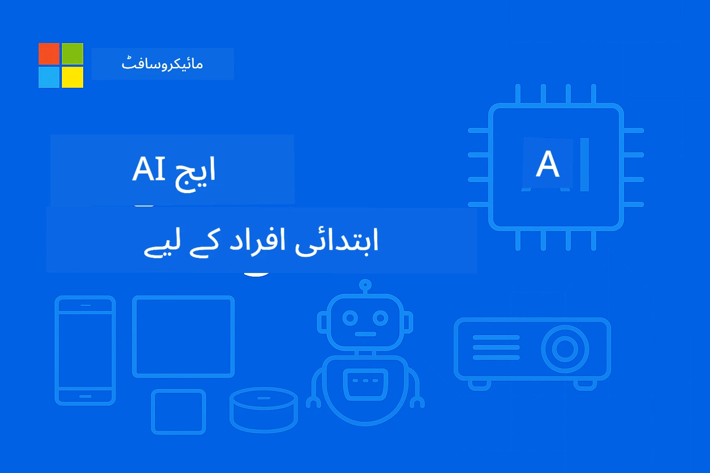

# ایج AI برائے ابتدائی افراد



[](https://GitHub.com/microsoft/edgeai-for-beginners/graphs/contributors)
[](https://GitHub.com/microsoft/edgeai-for-beginners/issues)
[](https://GitHub.com/microsoft/edgeai-for-beginners/pulls)
[](http://makeapullrequest.com)

[](https://GitHub.com/microsoft/edgeai-for-beginners/watchers)
[](https://GitHub.com/microsoft/edgeai-for-beginners/fork)
[](https://GitHub.com/microsoft/edgeai-for-beginners/stargazers)

[](https://discord.gg/nTYy5BXMWG)

ان وسائل کو استعمال شروع کرنے کے لیے درج ذیل مراحل پر عمل کریں:

1. **ریپوزیٹری کو فورک کریں**: کلک کریں [](https://GitHub.com/microsoft/edgeai-for-beginners/fork)
2. **ریپوزیٹری کلون کریں**: `git clone https://github.com/microsoft/edgeai-for-beginners.git`
3. [**Azure AI Foundry Discord میں شامل ہوں اور ماہرین اور دیگر ڈیولپرز سے ملیں**](https://discord.com/invite/ByRwuEEgH4)

### 🌐 کثیر الزبان سپورٹ

#### GitHub Action کے ذریعے مدد یافتہ (خودکار اور ہمیشہ تازہ ترین)

<!-- CO-OP TRANSLATOR LANGUAGES TABLE START -->
[عربی](../ar/README.md) | [بنگالی](../bn/README.md) | [بلغاریائی](../bg/README.md) | [برمی ( میانمار)](../my/README.md) | [چینی (سادہ)](../zh-CN/README.md) | [چینی (روایتی، ہانگ کانگ)](../zh-HK/README.md) | [چینی (روایتی، مکاؤ)](../zh-MO/README.md) | [چینی (روایتی، تائیوان)](../zh-TW/README.md) | [کروشین](../hr/README.md) | [چیک](../cs/README.md) | [ڈینش](../da/README.md) | [ڈچ](../nl/README.md) | [ایسٹونین](../et/README.md) | [فنلش](../fi/README.md) | [فرانسیسی](../fr/README.md) | [جرمن](../de/README.md) | [یونانی](../el/README.md) | [عبرانی](../he/README.md) | [ہندی](../hi/README.md) | [ہنگریائی](../hu/README.md) | [انڈونیشین](../id/README.md) | [اطالوی](../it/README.md) | [جاپانی](../ja/README.md) | [کنڑا](../kn/README.md) | [خمیر](../km/README.md) | [کوریائی](../ko/README.md) | [لتھوانین](../lt/README.md) | [ملائی](../ms/README.md) | [مالایلم](../ml/README.md) | [مراٹھی](../mr/README.md) | [نیپالی](../ne/README.md) | [نائجیرین پیجین](../pcm/README.md) | [ناروے](../no/README.md) | [فارسی ( فارسی)](../fa/README.md) | [پولش](../pl/README.md) | [پرتگالی (برازیل)](../pt-BR/README.md) | [پرتگالی (پرتگال)](../pt-PT/README.md) | [پنجابی (گرمکھی)](../pa/README.md) | [رومانیائی](../ro/README.md) | [روسی](../ru/README.md) | [سربیائی (سرلیک)](../sr/README.md) | [سلوواک](../sk/README.md) | [سلووینیائی](../sl/README.md) | [ہسپانوی](../es/README.md) | [سواحلی](../sw/README.md) | [سویڈش](../sv/README.md) | [تگالوگ (فلپائنی)](../tl/README.md) | [تمل](../ta/README.md) | [تیلگو](../te/README.md) | [تھائی](../th/README.md) | [ترکی](../tr/README.md) | [یوکرینیائی](../uk/README.md) | [اردو](./README.md) | [ویتنامی](../vi/README.md)

> **کیا آپ لوکل طور پر کلون کرنا پسند کرتے ہیں؟**
>
> یہ ریپوزیٹری 50+ زبانوں میں ترجمے شامل کرتی ہے جو ڈاؤنلوڈ سائز کو نمایاں طور پر بڑھاتے ہیں۔ بغیر ترجموں کے کلون کرنے کے لئے sparse checkout استعمال کریں:
>
> **Bash / macOS / Linux:**
> ```bash
> git clone --filter=blob:none --sparse https://github.com/microsoft/edgeai-for-beginners.git
> cd edgeai-for-beginners
> git sparse-checkout set --no-cone '/*' '!translations' '!translated_images'
> ```
>
> **CMD (Windows):**
> ```cmd
> git clone --filter=blob:none --sparse https://github.com/microsoft/edgeai-for-beginners.git
> cd edgeai-for-beginners
> git sparse-checkout set --no-cone "/*" "!translations" "!translated_images"
> ```
>
> یہ آپ کو تمام کورس مکمل کرنے کے لیے ضروری مواد بہت تیز ڈاؤنلوڈ کے ساتھ فراہم کرتا ہے۔
<!-- CO-OP TRANSLATOR LANGUAGES TABLE END -->

**اگر آپ مزید ترجمہ شدہ زبانوں کی حمایت چاہتے ہیں تو یہ [یہاں](https://github.com/Azure/co-op-translator/blob/main/getting_started/supported-languages.md) درج ہیں۔**

## تعارف

**EdgeAI for Beginners** میں خوش آمدید – آپ کی مکمل رہنمائی برائے Edge مصنوعی ذہانت کی تبدیلی پذیر دنیا میں۔ یہ کورس طاقتور AI صلاحیتوں اور عملی، حقیقی دنیا کی ایج ڈیوائسز پر تعیناتی کے درمیان پُل کا کام کرتا ہے، آپ کو AI کی صلاحیت کو براہ راست وہاں استعمال کرنے کا اختیار دیتا ہے جہاں ڈیٹا پیدا ہوتا ہے اور فیصلے کیے جاتے ہیں۔

### آپ کیا سیکھیں گے

یہ کورس آپ کو بنیادی تصورات سے لے کر پروڈکشن کے قابل نفاذ تک لے جاتا ہے، جس میں شامل ہے:
- **چھوٹے زبان ماڈلز (SLMs)** جو ایج پر تعیناتی کے لیے بہتر بنائے گئے ہیں
- **ہارڈویئر کے مطابق اصلاح** مختلف پلیٹ فارمز پر
- **حقیقی وقت میں استنتاج** نجی معلومات کی حفاظت کے ساتھ
- **پروڈکشن تعیناتی** انٹرپرائز ایپلیکیشنز کے لیے حکمت عملیاں

### ایج AI کیوں اہم ہے

ایج AI ایک نیا رجحان ہے جو جدید چیلنجز کو حل کرتا ہے:
- **رازداری اور سیکورٹی**: حساس ڈیٹا کو مقامی طور پر بغیر کلاؤڈ کے افشاء کے پراسیس کریں
- **حقیقی وقت کارکردگی**: وقت کی حساس ایپلیکیشنز کے لیے نیٹ ورک کی تاخیر ختم کریں
- **لاگت میں کمی**: بینڈوڈتھ اور کلاؤڈ کمپیوٹنگ پر اخراجات کم کریں
- **مضبوط آپریشنز**: نیٹ ورک کی بندش پر بھی فعالیت برقرار رکھیں
- **قانونی تعمیل**: ڈیٹا کی خودمختاری کی ضروریات پوری کریں

### ایج AI کیا ہے

ایج AI کا مطلب ہے کہ AI الگورتھمز اور زبان کے ماڈلز کو مقامی ہارڈویئر پر چلانا، جہاں ڈیٹا پیدا ہوتا ہے، بغیر کلاؤڈ وسائل پر انحصار کیے۔ یہ تاخیر کو کم کرتا ہے، رازداری کو بہتر بناتا ہے اور فوری فیصلے سازی ممکن کرتا ہے۔

### بنیادی اصول:
- **ڈیوائس پر استنتاج**: AI ماڈلز ایج ڈیوائسز (فونز، راؤٹرز، مائیکرو کنٹرولرز، صنعتی کمپیوٹرز) پر چلتے ہیں
- **آف لائن صلاحیت**: مستقل انٹرنیٹ کنیکشن کے بغیر کام کرتا ہے
- **کم تاخیر**: فوری جوابات جو حقیقی وقت نظام کے لیے مناسب ہوں
- **ڈیٹا خودمختاری**: حساس ڈیٹا مقامی سطح پر رکھتا ہے، سیکورٹی اور تعمیل کو بہتر بناتا ہے

### چھوٹے زبان ماڈلز (SLMs)

SLMs جیسے Phi-4، Mistral-7B، اور Gemma بڑے LLMs کے بہتر بنائے گئے ورژن ہیں—جنہیں خاص طور پر تربیت دی گئی یا کم کر کے بنایا گیا ہے تاکہ:
- **یادداشت کم استعمال ہو**: محدود ایج ڈیوائس میموری کا موثر استعمال
- **کم کمپیوٹیشن کی ضرورت**: CPU اور ایج GPU کی کارکردگی کے لیے بہتر کیا گیا
- **تیز آغاز کے اوقات**: فوری ریسپانس کے لیے تیزی سے شروع ہونا

یہ طاقتور NLP صلاحیتوں کو ان پابندیوں کے ساتھ فراہم کرتے ہیں:
- **ایمبیڈڈ سسٹمز**: IoT ڈیوائسز اور صنعتی کنٹرولرز
- **موبائل ڈیوائسز**: سمارٹ فونز اور ٹیبلٹس آف لائن صلاحیتوں کے ساتھ
- **IoT ڈیوائسز**: کمی وسائل والے سینسرز اور اسمارٹ ڈیوائسز
- **ایج سرورز**: محدود GPU وسائل والے مقامی پروسیسنگ یونٹس
- **ذاتی کمپیوٹرز**: ڈیسک ٹاپ اور لیپ ٹاپ تعیناتی کے مقصد

## کورس ماڈیولز اور نیویگیشن

| ماڈیول | موضوع | توجہ کا حصہ | کلیدی مواد | سطح | دورانیہ |
|--------|-------|------------|-------------|--------|----------|
| [📖 00 ](./introduction.md) | [EdgeAI تعارف](./introduction.md) | بنیاد اور سیاق و سباق | EdgeAI جائزہ • صنعتی اطلاقات • SLM تعارف • تعلیمی مقاصد | ابتدائی | 1-2 گھنٹے |
| [📚 01](../../Module01) | [EdgeAI بنیادی باتیں](./Module01/README.md) | کلاؤڈ بمقابلہ ایج AI موازنہ | EdgeAI بنیادی باتیں • حقیقی دنیا کے کیس اسٹڈیز • نفاذ گائیڈ • ایج تعیناتی | ابتدائی | 3-4 گھنٹے |
| [🧠 02](../../Module02) | [SLM ماڈل کی بنیادیں](./Module02/README.md) | ماڈل خاندان اور تعمیرات | فی فیملی • کوین فیملی • جیما فیملی • بٹ نیٹ • مائیکروموڈل • فی سیلیکا | ابتدائی | 4-5 گھنٹے |
| [🚀 03](../../Module03) | [SLM تعیناتی کی مشق](./Module03/README.md) | مقامی اور کلاؤڈ تعیناتی | جدید تعلیم • مقامی ماحول • کلاؤڈ تعیناتی | درمیانہ | 4-5 گھنٹے |
| [⚙️ 04](../../Module04) | [ماڈل اصلاحی ٹول کٹ](./Module04/README.md) | کراس-پلیٹ فارم اصلاح | تعارف • Llama.cpp • Microsoft Olive • OpenVINO • Apple MLX • ورک فلو سنتھیسس | درمیانہ | 5-6 گھنٹے |
| [🔧 05](../../Module05) | [SLMOps پروڈکشن](./Module05/README.md) | پروڈکشن آپریشنز | SLMOps تعارف • ماڈل کشیدگی • فائن ٹوننگ • پروڈکشن تعیناتی | اعلی | 5-6 گھنٹے |
| [🤖 06](../../Module06) | [AI ایجنٹس اور فنکشن کالنگ](./Module06/README.md) | ایجنٹ فریم ورکس اور MCP | ایجنٹ تعارف • فنکشن کالنگ • ماڈل کانٹیکسٹ پروٹوکول | اعلی | 4-5 گھنٹے |
| [💻 07](../../Module07) | [پلیٹ فارم نفاذ](./Module07/README.md) | کراس-پلیٹ فارم نمونے | AI ٹول کٹ • فاؤنڈری لوکل • ونڈوز ڈیولپمنٹ | اعلی | 3-4 گھنٹے |
| [🏭 08](../../Module08) | [فاؤنڈری لوکل ٹول کٹ](./Module08/README.md) | پروڈکشن کے قابل نمونے | نمونہ ایپلیکیشنز (تفصیلات نیچے دیکھیں) | ماہر | 8-10 گھنٹے |

### 🏭 **ماڈیول 08: نمونہ ایپلیکیشنز**

- [01: REST چیٹ جلد آغاز](./Module08/samples/01/README.md)
- [02: OpenAI SDK انضمام](./Module08/samples/02/README.md)
- [03: ماڈل دریافت اور بینچ مارکنگ](./Module08/samples/03/README.md)
- [04: Chainlit RAG ایپلیکیشن](./Module08/samples/04/README.md)
- [05: ملٹی-ایجنٹ آرکسٹریشن](./Module08/samples/05/README.md)
- [06: ماڈلز بطور ٹول روٹر](./Module08/samples/06/README.md)
- [07: ڈائریکٹ API کلائنٹ](./Module08/samples/07/README.md)
- [08: ونڈوز 11 چیٹ ایپ](./Module08/samples/08/README.md)
- [09: جدید ملٹی-ایجنٹ سسٹم](./Module08/samples/09/README.md)
- [10: فاؤنڈری ٹولز فریم ورک](./Module08/samples/10/README.md)

### 🎓 **ورکشاپ: عملی تعلیمی راستہ**

پروڈکشن کے قابل نفاذ کے ساتھ جامع عملی ورکشاپ مواد:

- **[ورکشاپ گائیڈ](./Workshop/Readme.md)** - مکمل تعلیمی مقاصد، نتائج، اور وسائل کی نیویگیشن
- **پائتھن نمونے** (6 سیشن) - بہترین طریقے، ایرر ہینڈلنگ، اور جامع دستاویزات کے ساتھ تازہ کاری شدہ
- **جوپیٹر نوٹ بکس** (8 انٹرایکٹو) - مرحلہ وار ٹیوٹوریلز، بینچ مارکس اور کارکردگی کی نگرانی کے ساتھ
- **سیشن گائیڈز** - ہر ورکشاپ سیشن کے لیے تفصیلی مارک ڈاؤن گائیڈز
- **ویلیڈیشن ٹولز** - کوڈ کے معیار کی تصدیق اور سمک ٹیسٹ چلانے کے لیے اسکرپٹس

**جو آپ بنائیں گے:**
- مقامی AI چیٹ ایپلیکیشنز جن میں اسٹریمینگ سپورٹ ہو
- RAG پائپ لائنز مع معیار جانچ (RAGAS)
- کثیر ماڈل بینچ مارکنگ اور موازنہ کے آلات
- ملٹی-ایجنٹ آرکسٹریشن سسٹمز
- ٹاسک بیس ماڈل سلیکشن کے ساتھ ذہین ماڈل روٹنگ

### 🎙️ **ورکشاپ برائے Agentic: عملی - AI پوڈکاسٹ اسٹوڈیو**
اپنا ایک مکمل AI سے چلنے والا پوڈکاسٹ پروڈکشن پائپ لائن صفر سے تعمیر کریں! یہ جامع ورکشاپ آپ کو مکمل ملٹی ایجنٹ سسٹم بنانے کی تربیت دیتی ہے جو خیالات کو پروفیشنل پوڈکاسٹ اقساط میں تبدیل کرتا ہے۔

**[🎬 AI پوڈکاسٹ اسٹوڈیو ورکشاپ شروع کریں](./WorkshopForAgentic/README.md)**

**آپ کا مشن**: "Future Bytes" شروع کریں — ایک ٹیکنالوجی پوڈکاسٹ جو مکمل طور پر آپ کے خود بنائے ہوئے AI ایجنٹس پر چلتا ہے۔ کوئی کلاؤڈ انحصار نہیں، کوئی API لاگت نہیں — سب کچھ آپ کے کمپیوٹر پر مقامی طور پر چلتا ہے۔

**یہ چیز اسے منفرد بناتی ہے:**
- **🤖 حقیقی ملٹی ایجنٹ آرکیسٹریشن** - ایسے مخصوص AI ایجنٹس بنائیں جو تحقیق کریں، لکھیں، اور آڈیو تیار کریں  
- **🎯 مکمل پروڈکشن پائپ لائن** - موضوع کے انتخاب سے لے کر آخری پوڈکاسٹ آڈیو تک  
- **💻 100% مقامی تنصیب** - مکمل پرائیویسی اور کنٹرول کے لیے Ollama اور مقامی ماڈلز (Qwen-3-8B) استعمال کرتا ہے  
- **🎤 ٹیکسٹ ٹو اسپیچ انٹیگریشن** - اسکرپٹس کو قدرتی آواز میں متعدد اسپیکرز کے مکالمے میں تبدیل کریں  
- **✋ انسان کا حصہ ورک فلو** - منظور ہونے والے مراحل معیار کو یقینی بناتے ہیں اور خودکاری برقرار رکھتے ہیں  

**تین مرحلوں کی تعلیم کا سفر:**

| مرحلہ | توجہ | اہم مہارتیں | دورانیہ |
|-----|-------|------------|----------|
| **[مرحلہ 1: اپنے AI اسسٹنٹس سے ملیں](./WorkshopForAgentic/md/01.BuildAIAgentWithSLM.md)** | اپنا پہلا AI ایجنٹ بنائیں | ٹول انٹیگریشن • ویب سرچ • مسئلہ حل کرنا • ایجنٹک استدلال | 2-3 گھنٹے |
| **[مرحلہ 2: اپنی پروڈکشن ٹیم بنائیں](./WorkshopForAgentic/md/02.AIAgentOrchestrationAndWorkflows.md)** | متعدد ایجنٹس کو منظم کریں | ٹیم کوآرڈینیشن • منظوری کے ورک فلو • ڈیولپر UI انٹرفیس • انسانی نگرانی | 3-4 گھنٹے |
| **[مرحلہ 3: اپنے پوڈکاسٹ کو زندگی دیں](./WorkshopForAgentic/md/03.Multi-SpeakerPodcastGenerationWithVibeVoice.md)** | پوڈکاسٹ آڈیو تیار کریں | ٹیکسٹ ٹو اسپیچ • ملٹی اسپیکر سنتھیسز • طویل آڈیو • مکمل خودکاری | 2-3 گھنٹے |

**استعمال شدہ ٹیکنالوجیز:**
- **Microsoft Agent Framework** - ملٹی ایجنٹ آرکیسٹریشن اور کوآرڈینیشن  
- **Ollama** - مقامی AI ماڈل رن ٹائم (کوئی کلاؤڈ کی ضرورت نہیں)  
- **Qwen-3-8B** - ایجنٹک کاموں کے لیے بہتر اوپن سورس لینگویج ماڈل  
- **ٹیکسٹ ٹو اسپیچ APIs** - پوڈکاسٹ کی تیاری کے لیے قدرتی آواز کی سنتھیسز  

**ہارڈویئر کی حمایت:**
- ✅ **CPU موڈ** - کسی بھی جدید کمپیوٹر پر کام کرتا ہے (8GB+ ریم تجویز کی جاتی ہے)  
- 🚀 **GPU تیزی** - NVIDIA/AMD GPUs کے ساتھ کافی تیز انفرنس  
- ⚡ **NPU سپورٹ** - اگلی نسل کے نیورل پروسیسنگ یونٹ کی تیزترین سپورٹ  

**بہترین برائے:**
- ملٹی ایجنٹ AI سسٹمز سیکھنے والے ڈیولپرز  
- AI خودکاری اور ورک فلو میں دلچسپی رکھنے والے  
- AI معاونت یافتہ پروڈکشن کا تجربہ کرنے والے مواد ساز  
- عملی AI آرکیسٹریشن پیٹرنز پڑھنے والے طالب علم  

**شروع کریں**: [🎙️ AI پوڈکاسٹ اسٹوڈیو ورکشاپ →](./WorkshopForAgentic/README.md)

### 📊 **تعلیمی راستہ کا خلاصہ**
- **کل دورانیہ**: 36-45 گھنٹے  
- **ابتدائی راستہ**: ماڈیول 01-02 (7-9 گھنٹے)  
- **درمیانی راستہ**: ماڈیول 03-04 (9-11 گھنٹے)  
- **اعلیٰ راستہ**: ماڈیول 05-07 (12-15 گھنٹے)  
- **ماہرانہ راستہ**: ماڈیول 08 (8-10 گھنٹے)  

## آپ کیا بنائیں گے

### 🎯 بنیادی مہارتیں
- **ایج AI آرکیٹیکچر**: کلاؤڈ انٹیگریشن کے ساتھ مقامی-اول AI سسٹمز ڈیزائن کریں  
- **ماڈل کی اصلاح**: ایج تنصیب کے لیے ماڈلز کو کوانٹائز اور کمپریس کریں (85% رفتار میں اضافہ، 75% سائز میں کمی)  
- **کثیر پلیٹ فارم تنصیب**: ونڈوز، موبائل، ایمبیڈڈ، اور کلاؤڈ-ایج ہائبرڈ سسٹمز  
- **پروڈکشن آپریشنز**: ایج AI کی مانیٹرنگ، اسکیلنگ، اور مینٹیننس  

### 🏗️ عملی پروجیکٹس
- **Foundry لوکل چیٹ ایپس**: ونڈوز 11 کا مقامی ایپلیکیشن جس میں ماڈل سوئچنگ شامل ہے  
- **ملٹی ایجنٹ سسٹمز**: پیچیدہ ورک فلو کے لیے ماہر ایجنٹس کے ساتھ کوآرڈینیٹر  
- **RAG ایپلیکیشنز**: مقامی دستاویز کی پراسیسنگ ویکٹر سرچ کے ساتھ  
- **ماڈل راؤٹرز**: ٹاسک تجزیہ کی بنیاد پر ماڈلز کے درمیان دانشمندانہ انتخاب  
- **API فریم ورکس**: سٹریمنگ اور صحت کی مانیٹرنگ کے ساتھ پروڈکشن ریڈی کلائنٹس  
- **کراس-پلیٹ فارم ٹولز**: LangChain/Semantic Kernel انٹیگریشن پیٹرنز  

### 🏢 صنعتی استعمالات
**مینوفیکچرنگ** • **ہیلتھ کیئر** • **آٹو نومس وہیکلز** • **سمارٹ سٹیز** • **موبائل ایپس**

## فوری آغاز

**تجویز کردہ تعلیمی راستہ** (20-30 گھنٹے کل):

0. **📖 تعارف** ([Introduction.md](./introduction.md)): ایج AI کی بنیاد + صنعتی تناظر + تعلیمی فریم ورک  
1. **📚 بنیاد** (ماڈیول 01-02): ایج AI کے تصورات + SLM ماڈل فیملیز  
2. **⚙️ اصلاح** (ماڈیول 03-04): تنصیب + کوانٹائزیشن فریم ورکس  
3. **🚀 پروڈکشن** (ماڈیول 05-06): SLMOps + AI ایجنٹس + فنکشن کالنگ  
4. **💻 عمل درآمد** (ماڈیول 07-08): پلیٹ فارم سیمپلز + Foundry لوکل ٹول کٹ  

ہر ماڈیول میں نظریہ، عملی مشقیں، اور پروڈکشن کے لیے کوڈ نمونے شامل ہیں۔

## کریئر پر اثر

**تکنیکی کردار**: ایج AI سلوشنز آرکیٹیکٹ • ML انجینئر (ایج) • IoT AI ڈیولپر • موبائل AI ڈیولپر

**صنعتی شعبے**: مینوفیکچرنگ 4.0 • ہیلتھ کیئر ٹیک • آٹو نومس سسٹمز • فِن ٹیک • کنزیومر الیکٹرانکس

**پورٹ فولیو پروجیکٹس**: ملٹی ایجنٹ سسٹمز • پروڈکشن RAG ایپس • کراس-پلیٹ فارم تنصیب • پرفارمنس آپٹیمائزیشن

## ریپوزیٹری کی ساخت

```
edgeai-for-beginners/
├── 📖 introduction.md  # Foundation: EdgeAI Overview & Learning Framework
├── 📚 Module01-04/     # Fundamentals → SLMs → Deployment → Optimization  
├── 🔧 Module05-06/     # SLMOps → AI Agents → Function Calling
├── 💻 Module07/        # Platform Samples (VS Code, Windows, Jetson, Mobile)
├── 🏭 Module08/        # Foundry Local Toolkit + 10 Comprehensive Samples
│   ├── samples/01-06/  # Foundation: REST, SDK, RAG, Agents, Routing
│   └── samples/07-10/  # Advanced: API Client, Windows App, Enterprise Agents, Tools
├── 🌐 translations/    # Multi-language support (8+ languages)
└── 📋 STUDY_GUIDE.md   # Structured learning paths & time allocation
```
  
## کورس کی جھلکیاں

✅ **تدریجی تعلیم**: نظریہ → عمل → پروڈکشن تنصیب  
✅ **حقیقی کیس اسٹڈیز**: Microsoft، Japan Airlines، انٹرپرائز نفاذ  
✅ **عملی مثالیں**: 50+ مثالیں، 10 جامع Foundry Local ڈیموز  
✅ **کارکردگی پر فوکس**: 85% رفتار میں اضافہ، 75% سائز میں کمی  
✅ **کثیر پلیٹ فارم**: ونڈوز، موبائل، ایمبیڈڈ، کلاؤڈ-ایج ہائبرڈ  
✅ **پروڈکشن ریڈی**: مانیٹرنگ، اسکیلنگ، سیکیورٹی، کمپلائنس فریم ورکس  

📖 **[مطالعہ گائیڈ دستیاب](STUDY_GUIDE.md)**: منظم 20 گھنٹے کا تعلیمی راستہ وقت کی تقسیم اور خود تشخیصی آلات کے ساتھ۔

---

**EdgeAI مستقبل کی AI تنصیب کی نمائندگی کرتا ہے**: مقامی-اول، پرائیویسی کی حفاظت کرنے والا، اور مؤثر۔ یہ مہارتیں حاصل کریں تاکہ ذہین ایپلی کیشنز کی اگلی نسل بنائیں۔

## دوسرے کورسز

ہماری ٹیم دیگر کورسز بھی تیار کرتی ہے! دیکھیں:

<!-- CO-OP TRANSLATOR OTHER COURSES START -->
### LangChain
[](https://aka.ms/langchain4j-for-beginners)
[](https://aka.ms/langchainjs-for-beginners?WT.mc_id=m365-94501-dwahlin)
[](https://github.com/microsoft/langchain-for-beginners?WT.mc_id=m365-94501-dwahlin)
---

### Azure / Edge / MCP / Agents
[](https://github.com/microsoft/AZD-for-beginners?WT.mc_id=academic-105485-koreyst)
[](https://github.com/microsoft/edgeai-for-beginners?WT.mc_id=academic-105485-koreyst)
[](https://github.com/microsoft/mcp-for-beginners?WT.mc_id=academic-105485-koreyst)
[](https://github.com/microsoft/ai-agents-for-beginners?WT.mc_id=academic-105485-koreyst)

---
 
### Generative AI Series
[](https://github.com/microsoft/generative-ai-for-beginners?WT.mc_id=academic-105485-koreyst)
[-9333EA?style=for-the-badge&labelColor=E5E7EB&color=9333EA)](https://github.com/microsoft/Generative-AI-for-beginners-dotnet?WT.mc_id=academic-105485-koreyst)
[-C084FC?style=for-the-badge&labelColor=E5E7EB&color=C084FC)](https://github.com/microsoft/generative-ai-for-beginners-java?WT.mc_id=academic-105485-koreyst)
[-E879F9?style=for-the-badge&labelColor=E5E7EB&color=E879F9)](https://github.com/microsoft/generative-ai-with-javascript?WT.mc_id=academic-105485-koreyst)

---
 
### Core Learning
[](https://aka.ms/ml-beginners?WT.mc_id=academic-105485-koreyst)
[](https://aka.ms/datascience-beginners?WT.mc_id=academic-105485-koreyst)
[](https://aka.ms/ai-beginners?WT.mc_id=academic-105485-koreyst)
[](https://github.com/microsoft/Security-101?WT.mc_id=academic-96948-sayoung)
[](https://aka.ms/webdev-beginners?WT.mc_id=academic-105485-koreyst)
[](https://aka.ms/iot-beginners?WT.mc_id=academic-105485-koreyst)
[](https://github.com/microsoft/xr-development-for-beginners?WT.mc_id=academic-105485-koreyst)

---
 
### کوپائلٹ سیریز
[](https://aka.ms/GitHubCopilotAI?WT.mc_id=academic-105485-koreyst)
[](https://github.com/microsoft/mastering-github-copilot-for-dotnet-csharp-developers?WT.mc_id=academic-105485-koreyst)
[](https://github.com/microsoft/CopilotAdventures?WT.mc_id=academic-105485-koreyst)
<!-- CO-OP TRANSLATOR OTHER COURSES END -->

## مدد حاصل کرنا

اگر آپ پھنس جاتے ہیں یا AI ایپس بنانے کے بارے میں کوئی سوالات ہیں، تو شامل ہوں:

[](https://discord.gg/nTYy5BXMWG)

اگر آپ کے پاس پروڈکٹ فیڈبیک یا خرابیوں کے بارے میں کوئی بات ہے تو دیکھیں:

[](https://aka.ms/foundry/forum)

---

<!-- CO-OP TRANSLATOR DISCLAIMER START -->
**دستخطی الفاظ**:  
یہ دستاویز AI ترجمہ سروس [Co-op Translator](https://github.com/Azure/co-op-translator) کے ذریعے ترجمہ کی گئی ہے۔ اگرچہ ہم درستگی کی کوشش کرتے ہیں، براہ کرم یہ جان لیں کہ خودکار تراجم میں غلطیاں یا بے درستگیاں ہو سکتی ہیں۔ اصل دستاویز اپنی مادری زبان میں معتبر ذریعہ سمجھی جانی چاہیے۔ اہم معلومات کے لیے پیشہ ور انسانی ترجمہ تجویز کیا جاتا ہے۔ ہم اس ترجمے کے استعمال سے پیدا ہونے والی کسی بھی غلط فہمی یا غلط تشریح کے ذمہ دار نہیں ہیں۔
<!-- CO-OP TRANSLATOR DISCLAIMER END -->