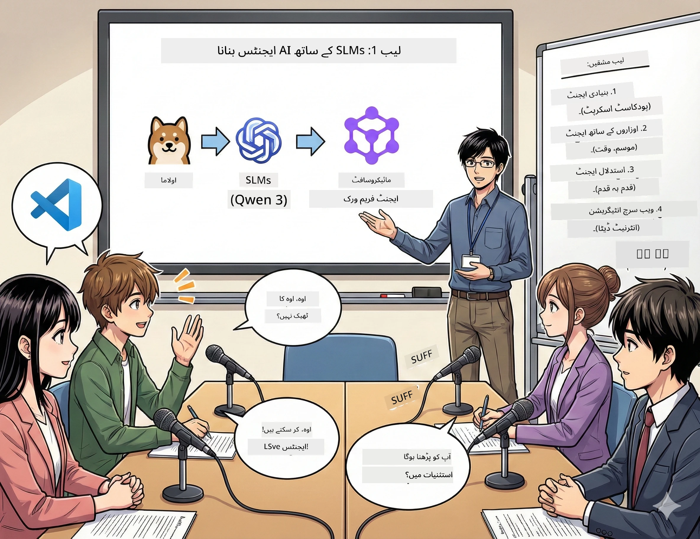

<!--
CO_OP_TRANSLATOR_METADATA:
{
  "original_hash": "7868fa418386aa7167bea3ff5ba8390b",
  "translation_date": "2026-01-05T12:43:39+00:00",
  "source_file": "WorkshopForAgentic/md/01.BuildAIAgentWithSLM.md",
  "language_code": "ur"
}
-->
# ایکٹ 1: اپنے AI ریسرچ اسسٹنٹ سے ملیں 🤖

## چیلنج

آپ "Future Bytes" شروع کر رہے ہیں، آپ کا نیا ٹیک پوڈکاسٹ۔ قسط 1 تازہ ترین AI پیش رفت کے بارے میں ہے، لیکن آپ کے پاس صرف 24 گھنٹے ہیں:
1. موضوع پر تحقیق کریں
2. قابل اعتبار ذرائع تلاش کریں
3. دلچسپ اسکرپٹ لکھیں
4. اسے قدرتی سنائیں

**موڑ**: آپ کو یہ سب اکیلے نہیں کرنا ہے۔ آپ اپنا پہلا AI اسسٹنٹ بنانے جا رہے ہیں جو اس سب میں مدد کر سکتا ہے۔ اسے الیکس کہتے ہیں — آپ کا انتھک تحقیقاتی ساتھی جو کبھی نیند نہیں لیتا۔

## چھوٹے زبان ماڈلز کیوں؟ (اشارہ: وہ شاندار ہیں)

چھوٹے زبان ماڈلز (SLMs) کو آپ کے ذاتی AI کے طور پر سوچیں جو *آپ* کے کمپیوٹر پر رہتا ہے۔ نہ کوئی کلاؤڈ، نہ ماہانہ فیس، نہ مشکوک ڈیٹا شیئرنگ۔

**کیوں SLMs 🔥 ہیں:**
- **🏠 آپ کے کمپیوٹر پر چلتے ہیں**: لیپ ٹاپ، ڈیسک ٹاپ، یہاں تک کہ ایک طاقتور Raspberry Pi
- **💸 کوئی جاری لاگت نہیں**: آپ کی لنچ مانی کھانے والی API فیس نہیں ہے
- **🔒 پرائیویسی سب سے پہلے**: آپ کا ڈیٹا کبھی آپ کے ڈیوائس سے باہر نہیں جاتا
- **⚡ بے حد تیز**: کوئی انٹرنیٹ تاخیر نہیں، فوری جواب
- **🪦 ہلکے وزن**: 1B-10B پیرامیٹرز بمقابلہ بڑے ماڈلز کے 100B+

**مشہور SLMs**: Qwen 3, Phi-4, Gemma 3 (ہم اس ورکشاپ کے لیے Qwen استعمال کر رہے ہیں)

## آپ کا ٹول کٹ

### Ollama: آپ کا AI ماڈل مینیجر

[Ollama](https://ollama.com/) AI ماڈلز کے لیے ایک طرح کا Steam ہے۔ ماڈلز ڈاؤن لوڈ کریں، چلائیں اور آسان کمانڈز سے مینیج کریں۔

**کیا اسے خاص بناتا ہے:**
- کسی بھی ماڈل کو ایک کمانڈ سے ڈاؤن لوڈ اور چلائیں
- میک، ونڈوز، لینکس پر کام کرتا ہے
- اگر آپ کے پاس GPU ہے تو خود بخود استعمال کرتا ہے
- انتہائی میموری موثر

### Microsoft Agent Framework: جہاں جادو ہوتا ہے

[Microsoft Agent Framework](https://github.com/microsoft/agent-framework) آپ کا کھیل کا میدان ہے AI ایجنٹس بنانے کا جو کہ:

- 💬 بات چیت کر سکتے ہیں اور گفتگو یاد رکھ سکتے ہیں
- 🛠️ مخصوص ٹولز استعمال کر سکتے ہیں (جیسے ویب سرچ یا موسم چیک کرنا)
- 🧠 پیچیدہ مسائل کو قدم بہ قدم سوچ سکتے ہیں
- 🤝 دوسری ایجنٹس کے ساتھ ٹیم میں کام کر سکتے ہیں
- 🔌 مختلف AI فراہم کنندگان سے جڑ سکتے ہیں (OpenAI, Ollama, Azure)

**عمارت کے اجزاء:**
- **ایجنٹس**: آپ کے AI اسسٹنٹس جن کے مخصوص کام ہوتے ہیں
- **ٹولز**: خاص صلاحیتیں جو آپ انہیں دیتے ہیں
- **میموری**: تاکہ وہ آپ کی گفتگو بھولیں نہیں
- **منطق**: انہیں سوچنا سکھانا، صرف جواب دینا نہیں

## آپ کی تربیت کا منظرنامہ: 4 مشن

### مشن 1: اپنا پہلا ایجنٹ بنائیں

📓 [نوٹ بک کھولیں](../code/01.BasicAgent/00.BasicAgent-agent.ipynb)

**مقصد**: الیکس بنائیں، آپ کا پوڈکاسٹ اسکرپٹ رائٹر AI۔ الیکس کو دو میزبانوں کے درمیان ٹیک موضوعات پر گفتگو تیار کرنی ہے۔

**آپ کیا سیکھیں گے**:
- AI ایجنٹ کو کیسے جگائیں (پیر کو جگانے سے آسان)
- اسے شخصیت اور ہدایات دینا
- اسے اصل پوڈکاسٹ اسکرپٹ بنانے پر مجبور کرنا
- سمجھنا کہ وہ آپ کو کیا کہہ رہا ہے

**فتح کی شرط**: الیکس آپ کے "Future Bytes" پائلٹ قسط کے لیے AI کے بارے میں اسکرپٹ بنائے! 🎯

### مشن 2: الیکس کو سپر پاورز دیں (ٹولز!)

📓 [نوٹ بک کھولیں](../code/01.BasicAgent/01.BasicAgent-tools.ipynb)

**مقصد**: الیکس ذہین ہے، لیکن اسے آج کا موسم یا وقت معلوم نہیں۔ آئیں ٹولز دے کر اس کی مدد کریں!

**آپ کیا سیکھیں گے**:
- "ٹولز" کے طور پر کسٹم پائتھن فنکشنز بنانا
- الیکس کو فیصلہ کرنے دینا کہ کب کون سا ٹول استعمال کرنا ہے
- خود مختار طریقے سے مسائل حل کرنا دیکھنا
- پیچیدہ کاموں کے لیے کئی ٹولز کو یکجا کرنا

**فتح کی شرط**: پوچھیں "ٹوکیو میں موسم کیسا ہے؟" اور الیکس خود اسے معلوم کرے! ☁️

### مشن 3: الیکس کو سوچنا سکھائیں

📓 [نوٹ بک کھولیں](../code/01.BasicAgent/02.BasicAgent-reasoning.ipynb)

**مقصد**: الیکس کو اپنا کام دکھائیں۔ مسائل حل کرتے وقت، آپ یہ دیکھنا چاہتے ہیں کہ وہ *کیسے* سوچ رہا ہے، صرف جواب نہیں۔

**آپ کیا سیکھیں گے**:
- "منطق کا موڈ" فعال کریں (یہ ویسا ہی ہے جیسے ریاضی کی کلاس میں اپنا کام دکھانا)
- الیکس کے قدم بہ قدم سوچنے کا عمل دیکھیں
- چین آف تھوٹ پرامپٹنگ کو سمجھیں
- جب الیکس الجھ جائے تو ڈیبگ کریں

**فتح کی شرط**: ایک پیچیدہ ریاضی کا مسئلہ پوچھیں اور الیکس کو اسے حل کرتے ہوئے دیکھیں! 🧠

### مشن 4: الیکس کو انٹرنیٹ سے جوڑیں

📓 [نوٹ بک کھولیں](../code/01.BasicAgent/03.BasicAgent-websearch.ipynb)

**مقصد**: الیکس کی معلومات کی ایک حد ہے۔ آئیے اسے حقیقی وقت کی معلومات کے لیے ویب سے جوڑیں!

**آپ کیا سیکھیں گے**:
- ایک کسٹم ویب سرچ ٹول بنائیں
- بیرونی APIs کو انٹیگریٹ کریں
- نیٹ ورک کی غلطیوں کو مہارت سے سنبھالیں
- الیکس کی تربیتی معلومات سے باہر کی تفصیلات حاصل کریں

**فتح کی شرط**: آج کی ٹیک خبریں پوچھیں اور تازہ نتائج حاصل کریں! 📰

## شروع کرنے سے پہلے 🚀

**ضروری سامان**:
- Python 3.10+ انسٹال ہونا چاہیے
- Ollama چل رہا ہو (چیک کریں `ollama --version` سے)
- VS Code Python ایکسٹینشن کے ساتھ
- کم از کم 8GB RAM (16GB اگر آپ کو ہموار تجربہ چاہیے)

## مشن کا ترتیب

پورا قصہ سننے کے لیے نوٹ بکس کو ترتیب سے فالو کریں:

1. [00.BasicAgent-agent.ipynb](../code/01.BasicAgent/00.BasicAgent-agent.ipynb) — الیکس سے ملاقات (آپ کا پہلا ایجنٹ)
2. [01.BasicAgent-tools.ipynb](../code/01.BasicAgent/01.BasicAgent-tools.ipynb) — طاقت بڑھائیں!
3. [02.BasicAgent-reasoning.ipynb](../code/01.BasicAgent/02.BasicAgent-reasoning.ipynb) — الیکس کو سوچنا سکھائیں
4. [03.BasicAgent-websearch.ipynb](../code/01.BasicAgent/03.BasicAgent-websearch.ipynb) — انٹرنیٹ کی رسائی کھلی!

## آپ کیا مہارت حاصل کریں گے

ایکٹ 1 کے بعد، آپ کر سکیں گے:

- ✅ اپنے ہارڈویئر پر AI ماڈلز چلائیں (کلاؤڈ کی ضرورت نہیں!)
- ✅ مخصوص شخصیات اور مہارتوں والے ایجنٹس بنائیں
- ✅ ایجنٹس کو ایسے ٹولز دیں جو حقیقی دنیا کے مسائل حل کریں
- ✅ ایجنٹس کو ان کی منطق کا عمل دکھانے کے قابل بنائیں
- ✅ ایجنٹس کو بیرونی ڈیٹا سورسز سے جوڑیں
- ✅ جب کچھ غلط ہو جائے تو ڈیبگ کریں

## جب چیزیں خراب ہوں (اور انہیں کیسے ٹھیک کریں) 🔧

### "الیکس لوڈ نہیں ہو رہا! میموری ختم ہو گئی!"
**حل**: آپ کا کمپیوٹر محنت کر رہا ہے۔ دیگر ایپس بند کریں، یا چھوٹا ماڈل استعمال کریں۔ 8GB RAM کم از کم ہے۔

### "الیکس بہت سست ہے"
**حل**: Ollama کی سیٹنگز میں GPU ایکسیلیریشن فعال کریں۔ یا کانٹیکسٹ ونڈو سائز کم کریں۔ سپیڈ ڈیمون موڈ آن! 🏎️

### "ٹولز کام نہیں کر رہے!"
**حل**: اپنے فنکشن سگنیچرز دوبارہ چیک کریں۔ الیکس کو سمجھنے کے لیے واضح ٹائپ ہنٹس چاہیے۔ اسے واضح ہدایات دینے جیسا سمجھیں۔

## مددگار لنکس 🔗

- [Agent Framework ڈاکیومنٹس](https://github.com/microsoft/agent-framework) — سرکاری گائیڈز اور مثالیں
- [Ollama ماڈل لائبریری](https://ollama.com/library) — تمام دستیاب ماڈلز دیکھیں
- [Qwen ماڈل](https://ollama.com/library/qwen3) — اپنے AI کے ذہن سے ملیں
- [کوڈ مثالیں](https://github.com/microsoft/agent-framework/tree/main/python/samples) — یہاں سے آئیڈیاز حاصل کریں

## اگلا: ایکٹ 2 🎬

ایک ایجنٹ ہے۔ لیکن اگر آپ کے پاس ایجنٹس کی *ٹیم* ہو جو ساتھ کام کر رہی ہو؟ ایکٹ 2 میں، آپ اپنی پوری پوڈکاسٹ پروڈکشن ٹیم بنائیں گے:
- **ریسرچر ایجنٹ**: بہترین ذرائع تلاش کرتا ہے
- **رائٹر ایجنٹ**: بہترین اسکرپٹ تیار کرتا ہے  
- **ایڈیٹر (آپ!)**: منظوری دیتا ہے یا تبدیلی کا مطالبہ کرتا ہے

چلیں AI کا جادو ترتیب دیں! → [ایکٹ 2: اپنی پروڈکشن ٹیم بنائیں](02.AIAgentOrchestrationAndWorkflows.md)

---

**فنس گئے؟** ورکشاپ کے دوران سوالات پوچھیں۔ ہم سب مل کر سیکھ رہے ہیں! 🙌

---

<!-- CO-OP TRANSLATOR DISCLAIMER START -->
**ڈس کلیمر**:
یہ دستاویز AI ترجمہ سروس [Co-op Translator](https://github.com/Azure/co-op-translator) کے ذریعے ترجمہ کی گئی ہے۔ اگرچہ ہم درستگی کے لیے کوشاں ہیں، براہ کرم اس بات سے آگاہ رہیں کہ خودکار تراجم میں غلطیاں یا عدم صحت ہو سکتی ہے۔ اصل دستاویز اپنی مادری زبان میں ہی معتبر ماخذ سمجھی جائے گی۔ اہم معلومات کے لیے پیشہ ور انسانی ترجمہ تجویز کیا جاتا ہے۔ ہم اس ترجمے کے استعمال سے ہونے والی کسی بھی غلط فہمی یا تشریح کی ذمہ داری سے مبرا ہیں۔
<!-- CO-OP TRANSLATOR DISCLAIMER END -->