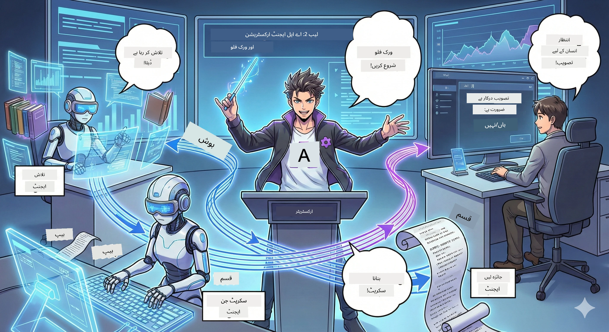

# دوسرے منظر: اپنی پوڈکاسٹ پروڈکشن ٹیم بنانا 🎬



## کہانی کا گرم ہونا

ایلیکس(آپ کے پہلے منظر میں AI اسسٹنٹ) زبردست ہے، لیکن ایک ایجنٹ پورے پوڈکاسٹ اسٹوڈیو کو نہیں چلا سکتا۔ آپ کو ایک *ٹیم* کی ضرورت ہے:  
- 🔍 **ریسرچ ایجنٹ**: ویب پر تازہ معلومات تلاش کرنا  
- ✍️ **اسکرپٹ ایجنٹ**: تحقیق کو دلچسپ مکالمے میں تبدیل کرنا  
- 👤 **آپ (ایڈیٹر)**: اسکرپٹ کی منظوری دینا یا دوبارہ لکھنے کے لیے واپس بھیجنا  

خوش آمدید **AI ایجنٹ ارینجمنٹ** میں — آپ اپنی AI ٹیم کے ڈائریکٹر بن جاتے ہیں۔ سوچیں ایوینجرز کی طرح، مگر پوڈکاسٹ پروڈکشن کے لیے۔

## ایجنٹ ارینجمنٹ کیا ہے؟ (سادہ ورژن)

سوچیں کہ آپ ایک ریستوراں چلا رہے ہیں۔ آپ خود سب کچھ نہیں کرتے، ہے نا؟ آپ کے پاس:  
- 🍳 باورچی کھانا پکانے کے لیے  
- 👨‍🍳 اسسٹنٹ باورچی تیاری کے لیے  
- 👩‍🍳 ویٹر کھانا سرو کرنے کے لیے  

ایجنٹ ارینجمنٹ بھی یہی خیال ہے، مگر AI کے ساتھ۔ ہر ایجنٹ کی خاص مہارت ہوتی ہے، اور آپ انہیں بڑے مقصد کے لیے منظم کرتے ہیں۔ کوئی ایک ایجنٹ زیادہ بوجھل نہیں ہوتا، کام تیزی سے مکمل ہوتا ہے۔

### بینڈ کی مثال 🎸

آپ کے AI ایجنٹس ایک بینڈ کی طرح ہیں:  
- **لیڈ گلوکار**: کلائنٹ سے متعلق اہم کام سنبھالتا ہے  
- **ڈرمز بجانے والا**: تیز تال برقرار رکھتا ہے، بیک اینڈ پروسیسنگ کرتا ہے  
- **بیس گٹار نواز**: سب کی مدد کرتا ہے، ڈیٹا حاصل کرتا ہے  
- **آپ (بینڈ مینیجر)**: سب کو ہم آہنگ کرتے ہیں!

اگر کوآرڈینیشن نہ ہو؟ صرف شور ہے۔ ارینجمنٹ ہو؟ شاندار موسیقی۔

### یہ کیوں اہم ہے؟

ایک AI ایجنٹ سب کچھ کرنے کی کوشش کرنا = تھکن۔ ماہر ایجنٹس کا ساتھ مل کر کام کرنا = کارکردگی میں اضافہ!🚀

**صاف گوئی**: کیا آپ نے اکیلے پوڈکاسٹ کے لیے تحقیق، تحریر اور ایڈیٹنگ کی کوشش کی؟ ہاں، یہ برا تھا۔ ارینجمنٹ سے ہر ایجنٹ اپنے بہترین کام کرتا ہے۔ آپ صرف آخری فیصلہ کرتے ہیں۔

**حقیقی دنیا کی مثال**: کسٹمر سپورٹ بوٹس جانتے ہیں کہ کب بلنگ کا مسئلہ حل کرنا ہے، کب تکنیکی مسئلہ، اور کب انسانی مدد طلب کرنی ہے۔ یہی ہے ارینجمنٹ!

## ایجنٹ vs ورک فلو: کیا فرق ہے؟

ایسا سوچیں:

### 🤖 AI ایجنٹ = جاز موسیقار  
- **فی البدیہ فیصلہ سازی** جو وہ سنتا ہے اس پر مبنی  
- **فی البدیہ تخلیق** اپنے ٹولز استعمال کرتے ہوئے حل بنانے  
- **سوچنا** LLM دماغ کے ساتھ  
- **مطابقت** جو بھی آپ اسے دیں  

### 🎵 ورک فلو = آرکسٹرا جو کلاسیکل موسیقی بجا رہا ہو  
- **نوٹس کی پیروی** (پہلے سے طے شدہ مراحل)  
- **متوقع** عمل  
- **ہم آہنگی** کئی ایجنٹس، انسانوں، سسٹمز کے درمیان  
- **ساخت** جیسے ایک نسخہ  

**جادو**: ورک فلو *ارینج* کرتا ہے ایجنٹس کو! آپ ورک فلو بناتے ہیں، اور ایجنٹس کو بتاتے ہیں کب اور کیا کرنا ہے۔ دونوں کی بہترین بات۔🎭

## اپنی AI ٹیم کو منظم کرنے کے تین طریقے

### 1. 🎯 مرکزی (آپ باس ہیں)

ایک مرکزی ایجنٹ حکم دیتا ہے۔ اسے سمجھیں جیسے آپ ایک ٹیم چلاتے ہیں — آپ فیصلہ کرتے ہیں کون کیا اور کب کرے گا۔

**فائدے**:  
- ✅ واضح قیادت (کوئی الجھن نہیں)  
- ✅ یکساں فیصلے  
- ✅ آسان ڈیبگ  

**کارآمد**:  
- کسٹمر سروس روٹنگ ("کیا یہ بلنگ ہے یا ٹیک سپورٹ؟")  
- مواد کی منظوری ورک فلو ("یہ اسکرپٹ منظور ہوا؟")  
- پوڈکاسٹ پروڈکشن (جو ہم بنا رہے ہیں!)  

### 2. 🤝 غیر مرکزی (ایجنٹس خود منظم)

ایجنٹس سیدھے ایک دوسرے سے بات کرتے ہیں اور گروپ کے طور پر مسئلہ حل کرتے ہیں۔ جیسے سب ایک گروپ چیٹ میں ہم آہنگ ہوں۔

**فائدے**:  
- ✅ آسان توسیع (مزید ایجنٹس کبھی بھی شامل کریں)  
- ✅ کوئی سنگل پوائنٹ آف فیلئر نہیں  
- ✅ ایجنٹس فطری طور پر تعاون کرتے ہیں  

**کارآمد**:  
- تحقیقاتی ٹیم (ہر ایجنٹ مختلف ماخذ دیکھے)  
- برین اسٹورم میٹنگز  
- تقسیم شدہ مسئلہ حل کرنا  

### 3. 🔀 ہائبرڈ (دونوں کی بہترین)

آپ مجموعی سمت طے کرتے ہیں، لیکن ایجنٹس کاموں پر آزاد تنظیم کرتے ہیں۔ جیسے ایک CEO جو ٹیم پر اعتماد کرتا ہو۔

**مثالی**: پیچیدہ پروجیکٹس جہاں کنٹرول اور لچک دونوں ضروری ہوں۔

## Microsoft Agent Framework: آپ کا ارینجمنٹ کِٹ 🧰

اب وقت ہے تعمیر کرنے کا! یہ وہ چیز ہے جو آپ استعمال کریں گے:

### بلڈنگ بلاکس

#### 1. 🧱 ایگزیکیٹرز (آپ کے ورکرز)  
- **کیا ہیں**: الگ الگ پروسیسنگ یونٹس — ہو سکتے ہیں ایجنٹ یا کسٹم لاجک  
- **کیا کرتے ہیں**: ان پٹ لیتے ہیں، کام مکمل کرتے ہیں، آؤٹ پٹ پیدا کرتے ہیں  
- **تصور کریں**: پروڈکشن لائن پر ورک اسٹیشن  

#### 2. ➡️ ایجز (کنکشنز)  
- **کیا ہیں**: ایگزیکیٹرز کے درمیان راستے  
- **کیا کرتے ہیں**: میسج فلو کنٹرول کرتے ہیں ("A کے بعد B")  
- **تصور کریں**: فلو چارٹ میں تیر  

#### 3. 🗺️ ورک فلو (مجموعی منصوبہ)  
- **کیا ہیں**: ایگزیکیٹرز + ایجز کا مکمل گراف  
- **کیا کرتے ہیں**: شروع سے آخر تک پورے عمل کو وضاحت کرتے ہیں  
- **تصور کریں**: آپ کے پروڈکشن عمل کا نقشہ  

### زبردست خصوصیات جو آپ پسند کریں گے

**🛡️ ٹائپ سیفٹی**: ایجنٹس کے درمیان میسجز کی ٹائپ چیک ہوتی ہے۔ "اوہ، غلط ڈیٹا ٹائپ" کی کوئی حیرت نہیں۔

**🔀 لچکدار روٹنگ**:  
- If-then شرائط ("اگر منظوری، تو شائع؛ ورنہ دوبارہ لکھو")  
- متوازی پروسیسنگ (کئی ایجنٹس ایک ساتھ کام کرتے ہیں)  
- متحرک راستے (ورک فلو نتائج کے مطابق بدلتا ہے)  

**🔌 بیرونی انٹیگریشن**:  
- API کنکشن  
- مین ان دی لوپ چیک پوائنٹس (آپ شائع کرنے سے پہلے منظوری دیتے ہیں)  
- درخواست / جواب کا سلسلہ بنائیں  

**💾 چیک پوائنٹس**: پیش رفت محفوظ کریں! اگر کچھ کریش ہو جائے تو جگہ سے دوبارہ شروع کریں۔

**🤝 ملٹی ایجنٹ کوآرڈینیشن**:  
- ایجنٹس کو ترتیب سے چلائیں (A → B → C)  
- متوازی چلائیں (A + B + C بیک وقت)  
- ایجنٹس کے مابین ہینڈ آفس  
- تعاون سے حل  

## بہترین طریقے (پروفیشنل ٹپس) 🎯

### 1. ماڈیولر رہیں  
ہر ایجنٹ کو ایک حقیقی کام میں ماہر ہونا چاہیے۔ کوئی "سپر ایجنٹ" نہ بنائیں جو سب کچھ کرے — آپ کو ڈیبگ کرتے ہوئے پچھتانا پڑے گا۔

### 2. فیل ہونے کی منصوبہ بندی کریں  
ایجنٹس غلطی کریں گے۔ نیٹ ورک گر سکتا ہے۔ ایرر ہینڈلنگ اور بیک اپ پلان بنائیں۔ آپ کا مستقبل خود آپ کا شکریہ ادا کرے گا۔

### 3. سب کچھ مانیٹر کریں  
اپنے ایجنٹس کے کام کو ٹریک کریں۔ DevUI استعمال کریں (جسے ہم بعد میں جائزہ لیں گے!) چلتے ہوئے ورک فلو دیکھنے کے لیے۔

### 4. میسج سائز بہتر کریں  
ایجنٹس کے درمیان بڑے فائلز بھیجنے سے گریز کریں۔ پیغامات کو چھوٹا رکھیں تاکہ رفتار بہتر ہو۔

### 5. صحیح ماڈل منتخب کریں  
کنٹرول چاہیے؟ مرکزی منتخب کریں۔ پیمانہ چاہیے؟ غیر مرکزی منتخب کریں۔ فیصلہ نہیں کر سکتے؟ ہائبرڈ منتخب کریں!

## DevUI: آپ کا ورک فلو ڈیبگر 🔍

### DevUI کیا ہے؟

DevUI آپ کے ایجنٹس اور ورک فلوز کی ٹیسٹنگ کے لیے ایک گراونڈ ہے۔ یہ ایک ویب انٹرفیس ہے جہاں آپ:  
- 👀 اپنا ورک فلو چلا سکتے ہیں  
- 💬 ایجنٹس سے براہ راست بات کر سکتے ہیں  
- 🔍 جب کوئی مسئلہ ہو تو ڈیبگ کر سکتے ہیں  
- 📊 ٹریسنگ اور پرفارمنس میٹرکس دیکھ سکتے ہیں  

> **اہم**: DevUI صرف ڈیویلپمنٹ کے لیے ہے! اسے پروڈکشن میں استعمال نہ کریں۔ اسے اپنی لوکل ٹیسٹنگ انوائرمنٹ سمجھیں۔

### کیا اسے بہترین بناتا ہے

- **🖥️ انٹریکٹو ویب UI**: کلک کریں، ٹائپ کریں، ٹیسٹ کریں — کمانڈ لائن کی ضرورت نہیں  
- **📁 ڈریگ اینڈ ڈراپ تیار**: فائل اپ لوڈ کریں اور مختلف ان پٹ سے ٹیسٹ کریں  
- **📂 آٹو ڈسکور**: فولڈر پوائنٹ کریں، یہ خود تمام ایجنٹس تلاش کر لے گا  
- **📋 کوئی پیچیدہ سیٹ اپ نہیں**: کوڈ میں ایجنٹس رجسٹر کریں، فولڈر اسٹرکچر کی ضرورت نہیں  
- **🔌 OpenAI کمپیٹیبل**: OpenAI SDK کے ساتھ میل کھاتا ہے (کمپیٹیبیلٹی زندہ باد!)  
- **👁️ بلٹ ان ٹریسنگ**: ٹھیک دیکھیں کہ آپ کے ایجنٹس کیا کر رہے ہیں  

### ان پٹ کیسے کام کرتا ہے

DevUI ان پٹ کے لیے ذہین ہے:  

- **ایجنٹ ٹیسٹ کر رہے ہیں؟** آپ کو ٹیکسٹ باکس اور فائل اپ لوڈ بٹن ملیں گے  
- **ورک فلو ٹیسٹ کر رہے ہیں؟** UI آپ کے ورک فلو کی توقعات کے مطابق ان پٹ فیلڈز خود بنا دے گا  

یہ جادو کی طرح ہے، لیکن یہ صرف بہتر کوڈ ہے۔✨

## آپ کا مشن: پوڈکاسٹ اسٹوڈیو بنائیں 🎬

### چیلنج 1: DevUI کے ساتھ ایک ایجنٹ بنائیں

📂 [01.AgentDevUI](../../../../../WorkshopForAgentic/code/02.Workflow/01.AgentDevUI)

**چیلنج**: مکمل ٹیم بنانے سے پہلے، ایک ایجنٹ کے ساتھ DevUI کا تجربہ کریں: ویب سرچ ایکسپرٹ۔

**آپ کیا بنا رہے ہیں**:  
ایک ایسا ریسرچ ایجنٹ جو انٹرنیٹ پر پوڈکاسٹ موضوعات تلاش کرے۔ آپ DevUI کی ویب انٹرفیس `http://localhost:8090` سے ٹیسٹ کریں گے۔

**آپ کیا سیکھیں گے**:  
- 🚀 DevUI میں ایجنٹ شروع کرنا  
- 🔍 حقیقی وقت میں ایجنٹ کے جوابات کی جانچ  
- 🛠️ کسٹم ٹولز بنانا (ویب سرچ)  
- 📊 مسائل ڈیبگ کرنے کے لیے ٹریسنگ آن کرنا  
- 🖥️ انٹریکٹو ویب UI کا استعمال  

**کوڈ**:  
- `agent.py`: آپ کا سرچ ایجنٹ جو ویب سرچ سپرپاور رکھتا ہے  
- OllamaChatClient کے ذریعے Qwen سے کنیکٹ ہونا  
- `web_search()` ٹول فنکشن کا نفاذ  
- `serve()` کے ذریعے شروع کرنا — DevUI خود بخود کھل جائے گا  

**جیت کی شرط**: ایجنٹ سے پوچھیں "AI کے شعبے میں کیا گرم موضوعات ہیں؟" اور اسے ویب سرچ کرتے دیکھیں! 🎉

### چیلنج 2: ملٹی ایجنٹ ورک فلو بنائیں

📂 [02.WorkflowDevUI](../../../../../WorkshopForAgentic/code/02.Workflow/02.WorkflowDevUI)

**چیلنج**: اصل مزہ اب شروع ہوتا ہے! مکمل پوڈکاسٹ پروڈکشن ورک فلو بنائیں:  
1. 🔍 **سرچ ایجنٹ** → اپنے موضوع کی تحقیق کریں  
2. ✍️ **اسکرپٹ ایجنٹ** → دو میزبانوں کے درمیان گفتگو لکھیں (چینی زبان میں!)  
3. 👤 **ریویو ایگزیکیٹر** → آپ کی منظوری یا انکار کا مطالبہ  
4. 🔄 **لُوپ بیک** → اگر انکار ہو، آپ کے فیڈ بیک کے مطابق دوبارہ لکھیں  

**آپ کیا سیکھیں گے**:  
- 🧱 مختلف کاموں کے لیے مخصوص ایجنٹس بنائیں  
- 🔗 WorkflowBuilder سے ایجنٹس کو جوڑیں  
- 🔀 منظوری کا لُوپ نافذ کریں (مین ان دی لوپ!)  
- 🚦 مشروط روٹنگ (منظوری بمقابلہ انکار)  
- 🔧 بزنس لاجک کے لیے کسٹم ایگزیکیٹرز بنائیں  

**ورک فلو**:  
```
SearchAgent → ScriptAgent → ReviewExecutor
                             ↑          ↓ (如果被拒绝)
                             ←─────────
```
  
**کوڈ**:  
- `search_agent/agent.py`: آپ کا ریسرچ ایکسپرٹ  
- `generate_script_agent/agent.py`: آپ کا اسکرپٹ رائٹر (چینی میں!)  
- `workflow/workflow.py`: ارینجمنٹ کی جادوئی جگہ  
- `main.py`: DevUI میں سب کچھ شروع کرتا ہے  

**جیت کی شرط**: ایک موضوع دیں، اسکرپٹ کا جائزہ لیں، ایک بار انکار کریں تاکہ لُوپ ٹیسٹ ہو، پھر منظوری دیں! 🎉

### چیلنج 3: کونسول اپلیکیشن بنائیں

📂 [03.Application](../../../../../WorkshopForAgentic/code/02.Workflow/03.Application)

**چیلنج**: اپنا ورک فلو DevUI سے لے کر ایک جدید ٹرمینل ایپ میں تبدیل کریں جس میں رنگین آؤٹ پٹ، لوڈنگ اسپنر اور فائل سیونگ ہو۔ یہ پروڈکشن کے قابل چیز ہے!

**آپ کیا سیکھیں گے**:  
- ⚡ پروگرامنگ کے ذریعے ورک فلو چلانا (بغیر DevUI)  
- 📡 ایونٹ ڈریونڈ اسٹریم پروسیسنگ استعمال کرنا  
- 🎨 خوبصورت ٹرمینل UI بنانا (رنگ، اسپنرز، پروگریس بار)  
- 💾 فائنل اسکرپٹ کو فائل میں بچانا  
- 🔄 Python کی asyncio کے ذریعے غیر ہم عصر ورک فلو  

**یہ کیا کرتا ہے**:  
1. آپ سے پوڈکاسٹ کا موضوع پوچھتا ہے  
2. ریئل ٹائم پروگریس دکھاتا ہے ("سرچ ایجنٹ کام کر رہا ہے...")  
3. پیدا شدہ اسکرپٹ رنگین انداز میں دکھاتا ہے  
4. آپ کی منظوری مانگتا ہے  
5. منظور شدہ اسکرپٹ `podcast.txt` میں محفوظ کرتا ہے  

**کوڈ**:  
- `podcast_app.py`: ایونٹ ہینڈلنگ کے ساتھ آپ کی مین ایپ  
- `workflow.py`: چیلنج 2 کا ورک فلو پھر سے استعمال کرتے ہیں  

- ایونٹس کو سنبھالنا: `AgentRunUpdateEvent`، `RequestInfoEvent`، `WorkflowOutputEvent`
- ٹرمینل سٹائل کے لیے ANSI رنگوں کا استعمال

**فتح کے شرائط**: ایپلیکیشن چلائیں، پوڈکاسٹ اسکرپٹ بنائیں، اور دیکھیں کہ وہ محفوظ ہوگیا ہے! آپ نے واقعی ایک ٹول بنایا ہے۔🚀

## آپ نے جو سیکھا ہے 🏆

دوسرے منظر کے بعد، آپ کر سکتے ہیں:

- ✅ کئی AI ایجنٹس کو باس کی طرح آرکیسٹریٹ کریں
- ✅ ترتیب اور مشروط منطقی کے ساتھ ورک فلو بنائیں
- ✅ مانوئیل منظوری چیک پوائنٹ شامل کریں
- ✅ DevUI کا استعمال کرکے ورک فلو کو ٹیسٹ اور ڈیبگ کریں
- ✅ پروڈکشن ریڈی کنسول ایپلیکیشن بنائیں
- ✅ پیچیدہ سسٹمز میں غلطیوں کو شائستگی سے سنبھالیں
- ✅ کسی بھی پروجیکٹ کے لیے درست آرکیسٹریشن پیٹرن منتخب کریں

## جب چیزیں غلط ہو جائیں 🔧

### "میرا ورک فلو بہت پیچیدہ ہے!"
**حل**: اسے چھوٹے ذیلی ورک فلو میں تقسیم کریں۔ ہر ورک فلو کو ایک کام اچھے سے کرنا چاہیے۔ ضرورت ہو تو انہیں آپس میں جوڑیں۔

### "میں نہیں جان پاتا کہ کیا ہو رہا ہے!"
**حل**: ورک فلو چیک پوائنٹس کا استعمال کرکے اسٹیٹس محفوظ کریں۔ DevUI میں ٹریکنگ فعال کریں تاکہ ہر قدم دیکھ سکیں۔

### "ایک ایجنٹ کی خرابی سب چیزیں گرادیتی ہے!"
**حل**: ایرر بارڈرز شامل کریں۔ ہر ایجنٹ کو اپنی ناکامی سنبھالنی چاہیے اور بیک اپ رویہ رکھنا چاہیے۔

### "یہ بہت سست ہے"
**حل**: کیا ایجنٹس کو متوازی طور پر چلایا جا سکتا ہے؟ ترتیب وار ورک فلو آسان ہوتے ہیں لیکن سست۔ متوازی مواقع تلاش کریں!

## مفید وسائل 🔗

- [ورک فلو دستاویزات](https://learn.microsoft.com/en-us/agent-framework/user-guide/workflows/overview) —— مائیکروسافٹ کی سرکاری رہنمائی
- [آرکیسٹریشن پیٹرنز](https://www.ibm.com/think/topics/ai-agent-orchestration) —— IBM کا نقطہ نظر
- [ایجنٹ فریم ورک GitHub](https://github.com/microsoft/agent-framework) —— سورس کوڈ دیکھیں
- [کوڈ مثالیں](https://github.com/microsoft/agent-framework/tree/main/python/samples) —— یہاں سے پیٹرنز لیں

---

**کیا آپ بڑے اختتام کے لیے تیار ہیں؟** آپ کے پاس اسکرپٹ ہے۔ اب اسے حقیقی آڈیو بنائیں!→ [تیسرا منظر: اپنے پوڈکاسٹ کو زندہ کریں](03.Multi-SpeakerPodcastGenerationWithVibeVoice.md) 🎤

---

**رکاوٹ ہے؟ الجھن ہے؟ پرجوش ہیں؟** ورکشاپ چیٹ میں شیئر کریں! ہم ایک دوسرے سے سیکھیں گے۔🚀

---

<!-- CO-OP TRANSLATOR DISCLAIMER START -->
**دستخطی ذمہ داری**:
یہ دستاویز AI ترجمہ سروس [Co-op Translator](https://github.com/Azure/co-op-translator) کے ذریعے ترجمہ کی گئی ہے۔ اگرچہ ہم درستگی کی کوشش کرتے ہیں، براہ کرم اس بات سے آگاہ رہیں کہ خودکار ترجمے میں غلطیاں یا نواقص ہو سکتے ہیں۔ اصل دستاویز اپنی مادری زبان میں مستند ماخذ سمجھی جاتی ہے۔ اہم معلومات کے لیے پیشہ ور انسانی ترجمہ تجویز کیا جاتا ہے۔ ہم اس ترجمے کے استعمال سے پیدا ہونے والی کسی بھی غلط فہمی یا غلط تشریح کے ذمہ دار نہیں ہیں۔
<!-- CO-OP TRANSLATOR DISCLAIMER END -->