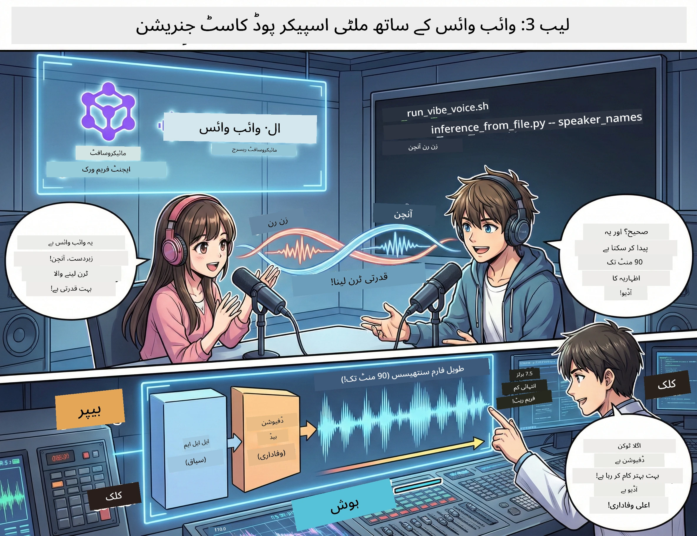

# تیسرا حصہ: اپنے پوڈکاسٹ کو زندہ کریں 🎤



## فائنل ایکشن

آپ نے موضوع پر تحقیق کی ہے۔ آپ نے اسکرپٹ لکھا ہے۔ اب وقت ہے اسے خوبصورت بنانے کا: اپنے متن کو حقیقی پوڈکاسٹ آڈیو میں تبدیل کریں حقیقت پسندانہ آواز کے ساتھ!

مقدمہ **VibeVoice** —— مائیکروسافٹ ریسرچ انسٹی ٹیوٹ کی اوپن سورس TTS (ٹیکسٹ ٹو اسپیچ) جادو، جو بناتی ہے:
- 🎭 قدرتی اور روان مکالمہ
- 👥 متعدد بولنے والے (زیادہ سے زیادہ 4!)
- ⏱️ طویل فارمیٹ کی آڈیو (زیادہ سے زیادہ 90 منٹ!)
- 🎵 بھرپور اظہار کے ساتھ ترسیل (مشینی آواز نہیں!)

یہی ہے پوڈکاسٹ کمپوزیشن کے پیچھے کی ٹیکنالوجی۔ آئیے آپ کا بنائیں!

## VibeVoice کیا ہے؟ (زبردست چیزیں)

VibeVoice مائیکروسافٹ ریسرچ کی طرف سے دنیا کے لیے ایک تحفہ ہے۔ یہ خاص طور پر پوڈکاسٹ طرز کے مکالماتی آڈیو کے لیے ڈیزائن کیا گیا ہے۔

### یہ کیوں بہترین ہے 🔥

* **⏱️ ماراثونی گفتگو**: 90 منٹ تک مسلسل آواز پیدا کرتا ہے (یہ ایک مکمل پوڈکاسٹ قسط ہے!)
* **👥 متعدد بولنے والے جادو**: زیادہ سے زیادہ 4 مختلف آوازیں، مستقل مزاج شخصیات کے ساتھ
* **⚡ انتہائی موثر**: انتہائی کم 7.5 Hz فریم ریٹ استعمال کرتا ہے جو کمپیوٹیشنل وسائل بچاتا ہے
* **🧠 ذہین آڈیو**: LLM (سیاق و سباق کی سمجھ) اور ڈفیوزن ماڈلز (حقیقی آڈیو بنانے کے لیے) کو ملا کر
* **🎭 قدرتی اور روان**: باری باری بولنے، توقف، اور مکالمے کی رفتار کو خود بخود سنبھالتا ہے

**ترجمہ**: VibeVoice صرف آپ کے اسکرپٹ کو پڑھتا نہیں — یہ اسے انسان کی طرح*اداکاری* کے ساتھ بولتا ہے۔

---

## شروع کرنے سے پہلے 🚀

**آپ کو کیا چاہیے**:

* 🐍 **Python 3.10+** (جو آپ کو پہلے اور دوسرے حصے سے پہلے ہی حاصل ہے)
* 🚀 **uv** (ایک تیز Python پیکیج مینیجر —— ہم اسے انسٹال کریں گے)
* 📝 **آپ کا اسکرپٹ**: دوسرا حصہ سے لیا گیا `podcast.txt` فائل (`../03.Application/` میں)

**پرو ٹپ**: اس مرحلے کے لیے ایک مضبوط انٹرنیٹ کنکشن ضروری ہے تاکہ پری ٹرینڈ ماڈلز ڈاؤن لوڈ ہو سکیں۔ ایک کپ کافی پی لیں! ☕

---

## شروع کریں! آسان طریقہ 🎬

ہم نے اسے بہت آسان کر رکھا ہے۔ ایک شیل اسکرپٹ تمام کام کرتا ہے۔

### عمل

1. **اسے قابلِ عمل بنائیں**:
```bash
chmod +x run_vibe_voice.sh
```

2. **اسے چلائیں**:
```bash
./run_vibe_voice.sh
```

3. **جادو کے لئے انتظار کریں** (پہلی بار چلانے میں کچھ منٹ لگ سکتے ہیں)

### پیچھے کیا ہو رہا ہے 🎭

اسکرپٹ بنیادی طور پر آپ کا خودکار صوتی انجینئر ہے:

1. **📥 VibeVoice ڈاؤن لوڈ کریں**: گٹ ہب سے سرکاری ریپوزٹری کلون کرنا
2. **📦 انحصارات انسٹال کریں**: تیز رفتار پیکج انسٹالیشن کے لیے `uv pip` استعمال کرنا
3. **🎬 آڈیو بنائیں**: انفرنس اسکرپٹ چلائیں، استعمال کریں:
   * `--model_path`: پری ٹرینڈ VibeVoice-7B ماڈل
   * `--txt_path`: آپ کا `podcast.txt` اسکرپٹ
   * `--speaker_names`: آوازیں تفویض کریں (ڈیفالٹ طور پر Xinran اور Anchen)

**نتیجہ**: آپ کا اسکرپٹ ایک حقیقی پوڈکاسٹ قسط میں بدل گیا! 🎉

---

## آپ کا کام 🎯

آئیے اسے دلچسپ بنائیں:

### کام 1: مواد تخلیق کریں  
`../03.Application/podcast.txt` کو دو لوگوں کے مکالمے کے ساتھ ایڈٹ کریں۔ اسے ٹیکنالوجی، مشغلے، یا کوئی بھی موضوع بنائیں! بس مکالماتی رہنے دیں۔

**فارمیٹ کی مثال**:
```
说话人 1：嘿！你听说新的 AI 模型了吗？
说话人 2：不会吧！告诉我更多！
说话人 1：它叫...
```

### کام 2: آڈیو بنائیں  
اسکرپٹ چلائیں اور جادو دیکھیں۔ پہلی بار میں زیادہ وقت لگے گا (ماڈل ڈاؤن لوڈ کرنا ہوگا)۔

### کام 3: سنیں اور تجزیہ کریں  
- کیا آواز فطری لگتی ہے؟  
- کیا بولنے والوں کی آوازیں مختلف ہیں؟  
- کیا باری باری بولنا روانی سے ہوتا ہے؟  
- کیا کوئی مشینی لمحات ہیں؟  

### کام 4: تجربہ کریں (دلیر لوگوں کے لیے)  
`run_vibe_voice.sh` کو ایڈٹ کریں اور `--speaker_names` کو تبدیل کریں تاکہ مختلف آوازوں کے امتزاج آزمائیں۔ VibeVoice میں متعدد پری ٹرینڈ آوازیں ہیں!

**چیلنج**: تین بولنے والوں کا مکالمہ بنانے کی کوشش کریں! 🎆

---

## مزید جانیں 📚

* **🏠 پروجیکٹ کا ہوم پیج**: [VibeVoice Official](https://microsoft.github.io/VibeVoice/)  
* **🤗 پری ٹرینڈ ماڈل**: [Hugging Face - VibeVoice-7B](https://huggingface.co/vibevoice/VibeVoice-7B)  
* **📖 ریسرچ پیپر**: تکنیکی تفصیل کے لیے (اگر آپ دلچسپی رکھتے ہوں)

> **⚠️ ذمہ دار AI کی یاددہانی**: VibeVoice بہت طاقتور ہے۔ اس کا اخلاقی استعمال کریں! ڈیپ فیک یا گمراہ کن مواد مت بنائیں۔ ایسی چیزیں بنائیں جو لوگوں کی مدد کریں۔ 🙏

---

## 🏆 مبارک ہو! آپ نے کر دکھایا!

آپ نے مکمل عمل پورا کر لیا ہے:  
1. ✅ **پہلا حصہ**: اپنی مرضی کے AI एजنٹ بنائیں  
2. ✅ **دوسرا حصہ**: متعدد ایجنٹ ورک فلو ترتیب دیں  
3. ✅ **تیسرا حصہ**: حقیقی پوڈکاسٹ آڈیو تیار کریں

**اب آپ کے پاس ہے**:  
- ایک فعال AI ریسرچ اسسٹنٹ  
- مکمل پوڈکاسٹ پیداوار ورک فلو  
- ایک حقیقی آڈیو فائل جو آپ شیئر کر سکتے ہیں

### اگلا قدم؟ 🚀

**اپنا پوڈکاسٹ لانچ کریں!**  
- پوڈکاسٹ پلیٹ فارمز پر اپلوڈ کریں  
- سوشل میڈیا پر شیئر کریں  
- بہتر بنانے اور دہرائیں

**مزید بنائیں!**  
- مختلف موضوعات آزمائیں  
- مزید بولنے والوں کے ساتھ تجربہ کریں  
- بیک گراؤنڈ موسیقی شامل کریں  
- ویب انٹرفیس تیار کریں  
- پورے عمل کو خودکار بنائیں

**اپنا کام شیئر کریں!**  
ہمیں ٹیگ کریں! دنیا کو دکھائیں کہ آپ نے کیا تخلیق کیا ہے۔ AI پوڈکاسٹ انقلاب آپ سے شروع ہوتا ہے۔ 🎙️

---

**کسی سوال، خیال یا کامیابی کی کہانی؟** ورکشاپ چیٹ میں پوچھیں!

**مواد تخلیق کے مستقبل میں خوش آمدید۔** 🌟

---

<!-- CO-OP TRANSLATOR DISCLAIMER START -->
**دستخطی نوٹ**:
یہ دستاویز AI ترجمہ سروس [Co-op Translator](https://github.com/Azure/co-op-translator) کے ذریعے ترجمہ کی گئی ہے۔ اگرچہ ہم درستگی کے لئے کوشاں ہیں، براہ کرم نوٹ فرمائیں کہ خودکار تراجم میں غلطیاں یا نواقص ہو سکتے ہیں۔ اصل دستاویز اپنی مادری زبان میں معتبر ذریعہ سمجھی جانی چاہیے۔ اہم معلومات کے لیے پیشہ ور انسانی ترجمہ کی سفارش کی جاتی ہے۔ اس ترجمہ کے استعمال سے ہونے والی کسی بھی غلط فہمی یا غلط تشریح کی ذمہ داری ہم پر نہیں ہوگی۔
<!-- CO-OP TRANSLATOR DISCLAIMER END -->