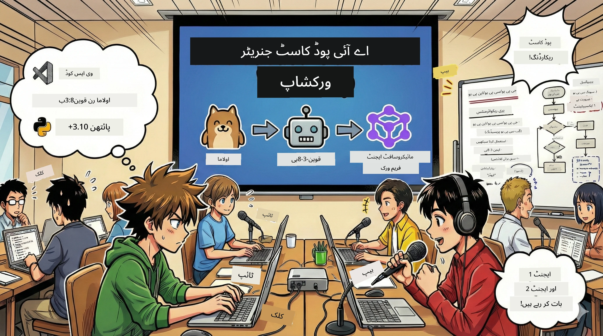

<!--
CO_OP_TRANSLATOR_METADATA:
{
  "original_hash": "aa775a734bda4590ecbe3a94a3b62197",
  "translation_date": "2026-01-05T17:25:54+00:00",
  "source_file": "WorkshopForAgentic/translation/zh-cn/README.md",
  "language_code": "ur"
}
-->
# 🎙️ AI پوڈکاسٹ اسٹوڈیو ورکشاپ



## آپ کا کام

خوش آمدید **AI پوڈکاسٹ اسٹوڈیو** میں! آپ اپنے ٹیکنالوجی پوڈکاسٹ "مستقبل کے بائٹس" کو شروع کرنے جا رہے ہیں — لیکن ایک موڑ کے ساتھ: آپ ایک AI سے چلنے والی پروڈکشن ٹیم بنائیں گے جو آپ کی مدد کرے گی اسے تخلیق کرنے میں۔ اب بے انتہا تحقیق، اسکرپٹ لکھنے اور آڈیو ایڈیٹنگ کی ضرورت نہیں۔ اس کے بجائے، آپ پروگرامنگ کے ذریعے ایک AI زبردست قوتوں والے پوڈکاسٹ ساز بن جائیں گے۔

## کہانی کا پس منظر

تصور کریں: آپ اور آپ کے دوست سب سے زبردست ٹیکنالوجی رجحانات کے بارے میں پوڈکاسٹ شروع کرنا چاہتے ہیں، لیکن ہر کوئی پڑھائی، کام یا زندگی میں مصروف ہے۔ اگر آپ ایک AI ایجنٹ ٹیم بنا سکیں جو بھاری کام کرے تو کیسا ہوگا؟ ایک ایجنٹ تحقیق کرے گا، دوسرا پرکشش اسکرپٹ لکھے گا، تیسرا متن کو قدرتی اور روان گفتگو میں تبدیل کرے گا۔ یہ سائنس فکشن لگ رہا ہے؟ آئیے اسے حقیقت میں بدلتے ہیں۔

## آپ کیا سیکھیں گے

اس ورکشاپ کے اختتام پر، آپ جانیں گے کہ کیسے:
- 🤖 اپنے خود کے مقامی AI ماڈل کو ڈیپلائے کریں (کوئی API فیس نہیں، کوئی کلاؤڈ انحصار نہیں!)
- 🔧 عملی تعاون کرنے والے پروفیشنل AI ایجنٹ بنائیں
- 🎬 تخلیق سے لے کر آڈیو تک مکمل پوڈکاسٹ پروڈکشن کا عمل بنائیں

## آپ کا سفر: تین پردے

کسی بھی اچھی کہانی کی طرح، ہمارے پاس تین پردے ہیں۔ ہر پردے میں آپ کا AI پوڈکاسٹ اسٹوڈیو مرحلہ وار تعمیر ہوگا:

| باب | آپ کا کام | کیا ہوتا ہے | مہارتیں کھلتی ہیں |
|---------|-----------|--------------|----------------|
| **پہلا پردہ** | [اپنے AI اسسٹنٹ کو پہچانیں](01.BuildAIAgentWithSLM.md) | آپ سیکھیں گے کہ کیسے چیٹ کر سکنے، ویب سرچ اور مسائل حل کرنے والے AI ایجنٹ بنائیں۔ انہیں ایسے تصور کریں جیسے کبھی نہ سونے والے ریسرچ انٹرنز۔ | 🎯 اپنا پہلا ایجنٹ بنائیں<br>🛠️ اسے طاقتور بنائیں (اوزار!)<br>🧠 اسے سوچنا سکھائیں<br>🌐 انٹرنیٹ سے جوڑیں |
| **دوسرا پردہ** | [اپنی پروڈکشن ٹیم ترتیب دیں](02.AIAgentOrchestrationAndWorkflows.md) | اب مزہ آتا ہے! آپ متعدد AI ایجنٹس کو اصلی پوڈکاسٹ ٹیم کی طرح مل کر کام کرنے کے لئے منظم کریں گے۔ ایک تحقیق کرے گا، دوسرا لکھے گا، آپ منظوری دیں گے — ٹیم ورک خواب پورا کرتا ہے۔ | 🎭 متعدد ایجنٹس کی ہم آہنگی<br>🔄 منظوری کے ورک فلو بنائیں<br>🖥️ DevUI انٹرفیس میں ٹیسٹ کریں<br>✋ انسانی کنٹرول برقرار رکھیں |
| **تیسرا پردہ** | [اپنے پوڈکاسٹ کو زندہ کریں](03.Multi-SpeakerPodcastGenerationWithVibeVoice.md) | بڑا اختتام! اپنے متن اسکرپٹ کو حقیقتی آواز اور قدرتی گفتگو کے ساتھ اصلی پوڈکاسٹ آڈیو میں تبدیل کریں۔ آپ کا "مستقبل کے بائٹس" پوڈکاسٹ شائع ہونے کے لئے تیار ہے! | 🎤 متن کو آواز میں تبدیلی کا جادو<br>👥 متعدد اسپیکر آوازیں<br>⏱️ طویل مدت کی آڈیو<br>🚀 مکمل خودکار |

ہر پردے میں نئی صلاحیتیں کھلیں گی۔ اگر آپ بہادر ہیں تو ترتیب چھوڑ کر چلیں، لیکن ہم مشورہ دیتے ہیں کہ ترتیب سے سیکھیں!

## ماحول کی ضروریات

یہ ورکشاپ کئی قسم کے ہارڈویئر ماحول کی حمایت کرتی ہے:
- **CPU**: ٹیسٹ اور چھوٹے پیمانے کے استعمال کے لئے مناسب
- **GPU**: پروڈکشن ماحول کے لئے سفارش شدہ، قابلِ ذکر تجزیہ کی رفتار میں اضافہ
- **NPU**: اگلی نسل نیورل پروسیسنگ یونٹ سپورٹ

## آپ کو کیا چاہیے

### سوفٹ ویئر کی فہرست ✅
- **Python 3.10+** (آپ کی پروگرامنگ زبان)
- **Ollama** (آپ کے مشین پر AI ماڈل چلانے والا)
- **VS Code** (آپ کا کوڈ ایڈیٹر)
- **Python ایکسٹینشن** (VS Code کو مزید ذہین بنانے کے لیے)
- **Git** (کوڈ حاصل کرنے کے لیے)

### ہارڈویئر چیک 💻
- **کیا میں چلا سکتا ہوں؟**: 8GB ریم، 10GB دستیاب جگہ (چلے گا، لیکن شاید تھوڑا سست)
- **آئڈیل کنفیگریشن**: 16GB+ ریم، ایک اچھی GPU (ہموار چلانے کے لیے!)
- **کیا آپ کے پاس NPU ہے؟**: تو اور بہتر! اگلی نسل کی کارکردگی کھولیں 🚀

## اپنا اسٹوڈیو بنائیں 🎬

### مرحلہ 1: Python کو اپ گریڈ کریں

یقین کر لیں کہ آپ کے پاس Python 3.10 یا جدید ورژن ہے:

```bash
python --version
# Python 3.10.x یا اس سے زیادہ ورژن ظاہر ہونا چاہیے
```

Python نہیں ہے؟ [python.org](https://python.org) سے حاصل کریں — یہ مفت ہے!

### مرحلہ 2: Ollama حاصل کریں (آپ کا AI ماڈل رنر)

اپنے آپریٹنگ سسٹم کے لئے Ollama ڈاؤن لوڈ کرنے کے لئے جائیں [ollama.ai](https://ollama.ai)۔ اسے ایسے سمجھیں جیسے آپ کے کمپیوٹر پر AI ماڈلز چلانے والا انجن۔

تیاری چیک کریں:

```bash
ollama --version
```

### مرحلہ 3: اپنا AI دماغ ڈاؤن لوڈ کریں 🧠

اب وقت ہے Qwen-3-8B ماڈل حاصل کرنے کا (جیسے اپنا پہلا AI اسسٹنٹ رکھنا):

```bash
ollama pull qwen3:8b
```

*یہ چند منٹ لے سکتا ہے۔ بہترین کافی کا وقت! ☕*

### مرحلہ 4: VS Code سیٹ کریں

اگر آپ نے نہیں لیا تو [Visual Studio Code](https://code.visualstudio.com/) حاصل کریں۔ یہ بہترین کوڈ ایڈیٹر ہے (تنازعہ نہیں😄)۔

### مرحلہ 5: Python ایکسٹینشن

VS Code میں:
1. `Ctrl+Shift+X` دبائیں (Mac پر `Cmd+Shift+X`)
2. "Python" تلاش کریں
3. Microsoft کا سرکاری Python ایکسٹینشن انسٹال کریں

### مرحلہ 6: کام مکمل! 🎉

سچ کہوں تو آپ تیار ہیں۔ آئیں تھوڑی AI جادوگری کرتے ہیں!

### مرحلہ 7: Microsoft Agent Framework اور متعلقہ پیکجز انسٹال کریں 📦

ورکشاپ کی ضرورت کے تمام ڈیپنڈنسیز انسٹال کریں:

```bash
pip install -r ./Installations/requirements.txt -U
```

*یہ Microsoft Agent Framework اور تمام ضروری پیکجز انسٹال کرے گا۔ کافی پیئیں — پہلی بار انسٹال کرنے میں چند منٹ لگ سکتے ہیں! ☕*

## ورکشاپ کی ہدایات

پروجیکٹ کی تفصیلی ساخت، ترتیب کے مراحل اور چلانے کے طریقے ورکشاپ کے دوران مرحلہ وار بیان کیے جائیں گے۔

## مسئلے حل کرنا (جب چیزیں خراب ہوں) 🔧

### "ارے، ماڈل ڈاؤنلوڈ بہت سست ہے!"
**حل**: VPN استعمال کریں یا Ollama کے مرر سورس کو کنفیگر کریں۔ کبھی کبھی نیٹ ورک سست ہوتا ہے۔

### "میرا کمپیوٹر کریش ہونے والا ہے! ریم کم ہے!"
**حل**: چھوٹا ماڈل استعمال کریں یا `num_ctx` سیٹنگ کو کم کر کے کم ریم استعمال کریں۔ اسے اپنے AI کی ڈائیٹنگ سمجھیں۔

### "کیا میں GPU استعمال کر کے اسے تیز کر سکتا ہوں؟"
**حل**: Ollama خودکار طریقے سے GPU شناخت کرے گا! بس یقینی بنائیں کہ آپ کے GPU کے ڈرائیورز تازہ ترین ہیں۔ مفت میں رفتار بڑھائیں! 🏎️

## اضافی وسائل (تجسس والوں کے لئے) 📚

- [Ollama ڈاکیومنٹیشن](https://github.com/ollama/ollama) — مقامی AI ماڈلز کی گہری معلومات
- [Microsoft Agent Framework](https://microsoft.github.io/autogen/) — ایجنٹ ٹیم بنانے کے بارے میں مزید جانیں
- [Qwen ماڈل معلومات](https://qwenlm.github.io/) — اپنے AI اسسٹنٹ کے دماغ سے واقف ہوں

## لائسنس

MIT لائسنس — زبردست چیزیں بنائیں، بانٹیں، اور دنیا کو بہتر بنائیں! 🌍

## تعاون کرنا چاہتے ہیں؟

بگ ملا؟ کوئی خیال؟ Issue یا PR جمع کریں! ہمیں کمیونٹی کا ماحول پسند ہے۔ ✨

---

<!-- CO-OP TRANSLATOR DISCLAIMER START -->
**ڈس کلیمر**:  
یہ دستاویز AI ترجمہ سروس [Co-op Translator](https://github.com/Azure/co-op-translator) کے ذریعے ترجمہ کی گئی ہے۔ اگرچہ ہم درستگی کے لیے کوشاں ہیں، براہِ کرم ذہن نشین کریں کہ خودکار تراجم میں غلطیاں یا نقصانات ہو سکتے ہیں۔ اصل دستاویز اپنی مادری زبان میں ہی مستند ماخذ سمجھی جائے گی۔ حساس معلومات کے لیے پیشہ ور انسانی ترجمہ کی سفارش کی جاتی ہے۔ اس ترجمہ کے استعمال سے ہونے والے کسی بھی غلط فہمی یا غلط تشریحات کے لیے ہم ذمہ دار نہیں ہیں۔
<!-- CO-OP TRANSLATOR DISCLAIMER END -->