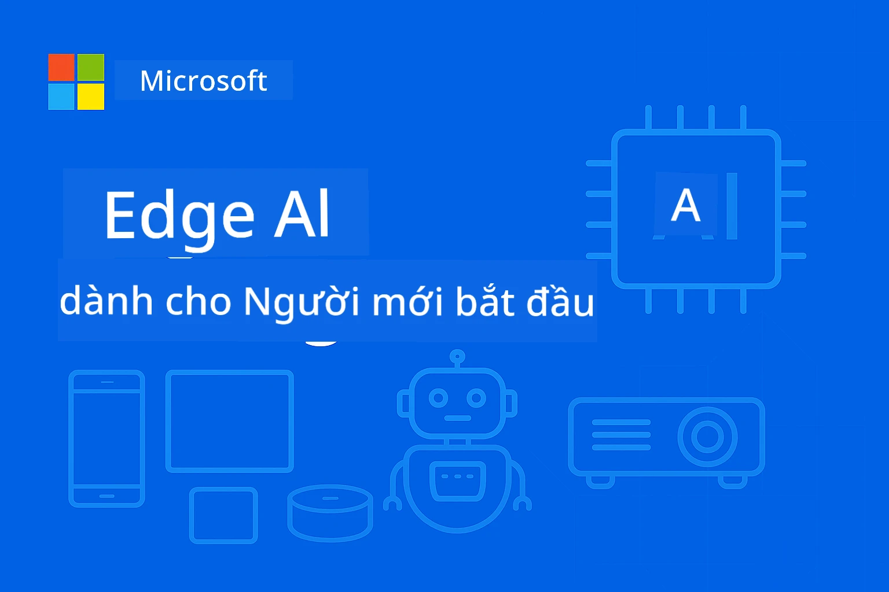

<!--
CO_OP_TRANSLATOR_METADATA:
{
  "original_hash": "ac31463ae3ed21a0ce83b0a351c23dd4",
  "translation_date": "2026-01-05T09:40:55+00:00",
  "source_file": "README.md",
  "language_code": "vi"
}
-->
# EdgeAI cho Người mới bắt đầu 




[](https://GitHub.com/microsoft/edgeai-for-beginners/graphs/contributors)
[](https://GitHub.com/microsoft/edgeai-for-beginners/issues)
[](https://GitHub.com/microsoft/edgeai-for-beginners/pulls)
[](http://makeapullrequest.com)

[](https://GitHub.com/microsoft/edgeai-for-beginners/watchers)
[](https://GitHub.com/microsoft/edgeai-for-beginners/fork)
[](https://GitHub.com/microsoft/edgeai-for-beginners/stargazers)


[](https://discord.gg/nTYy5BXMWG)

Hãy làm theo các bước sau để bắt đầu sử dụng các tài nguyên này:

1. **Fork kho lưu trữ**: Nhấn [](https://GitHub.com/microsoft/edgeai-for-beginners/fork)
2. **Clone kho lưu trữ**:   `git clone https://github.com/microsoft/edgeai-for-beginners.git`
3. [**Tham gia Azure AI Foundry Discord và gặp gỡ các chuyên gia cùng nhà phát triển khác**](https://discord.com/invite/ByRwuEEgH4)


### 🌐 Hỗ trợ Đa Ngôn Ngữ

#### Được hỗ trợ thông qua GitHub Action (Tự động & Luôn Cập Nhật)

<!-- CO-OP TRANSLATOR LANGUAGES TABLE START -->
[Arabic](../ar/README.md) | [Bengali](../bn/README.md) | [Bulgarian](../bg/README.md) | [Burmese (Myanmar)](../my/README.md) | [Chinese (Simplified)](../zh/README.md) | [Chinese (Traditional, Hong Kong)](../hk/README.md) | [Chinese (Traditional, Macau)](../mo/README.md) | [Chinese (Traditional, Taiwan)](../tw/README.md) | [Croatian](../hr/README.md) | [Czech](../cs/README.md) | [Danish](../da/README.md) | [Dutch](../nl/README.md) | [Estonian](../et/README.md) | [Finnish](../fi/README.md) | [French](../fr/README.md) | [German](../de/README.md) | [Greek](../el/README.md) | [Hebrew](../he/README.md) | [Hindi](../hi/README.md) | [Hungarian](../hu/README.md) | [Indonesian](../id/README.md) | [Italian](../it/README.md) | [Japanese](../ja/README.md) | [Kannada](../kn/README.md) | [Korean](../ko/README.md) | [Lithuanian](../lt/README.md) | [Malay](../ms/README.md) | [Malayalam](../ml/README.md) | [Marathi](../mr/README.md) | [Nepali](../ne/README.md) | [Nigerian Pidgin](../pcm/README.md) | [Norwegian](../no/README.md) | [Persian (Farsi)](../fa/README.md) | [Polish](../pl/README.md) | [Portuguese (Brazil)](../br/README.md) | [Portuguese (Portugal)](../pt/README.md) | [Punjabi (Gurmukhi)](../pa/README.md) | [Romanian](../ro/README.md) | [Russian](../ru/README.md) | [Serbian (Cyrillic)](../sr/README.md) | [Slovak](../sk/README.md) | [Slovenian](../sl/README.md) | [Spanish](../es/README.md) | [Swahili](../sw/README.md) | [Swedish](../sv/README.md) | [Tagalog (Filipino)](../tl/README.md) | [Tamil](../ta/README.md) | [Telugu](../te/README.md) | [Thai](../th/README.md) | [Turkish](../tr/README.md) | [Ukrainian](../uk/README.md) | [Urdu](../ur/README.md) | [Vietnamese](./README.md)

> **Ưa thích Clone cục bộ?**

> Kho lưu trữ này bao gồm hơn 50 bản dịch ngôn ngữ làm tăng đáng kể kích thước tải xuống. Để clone mà không có bản dịch, hãy sử dụng sparse checkout:
> ```bash
> git clone --filter=blob:none --sparse https://github.com/microsoft/edgeai-for-beginners.git
> cd edgeai-for-beginners
> git sparse-checkout set --no-cone '/*' '!translations' '!translated_images'
> ```
> Điều này cung cấp cho bạn tất cả những gì cần để hoàn thành khóa học với tốc độ tải xuống nhanh hơn nhiều.
<!-- CO-OP TRANSLATOR LANGUAGES TABLE END -->

**Nếu bạn muốn có nhiều ngôn ngữ dịch hỗ trợ hơn, danh sách có tại [đây](https://github.com/Azure/co-op-translator/blob/main/getting_started/supported-languages.md)**
## Giới thiệu

Chào mừng đến với **EdgeAI cho Người mới bắt đầu** – hành trình toàn diện của bạn vào thế giới biến đổi của Trí tuệ nhân tạo biên. Khóa học này cầu nối khoảng cách giữa các khả năng AI mạnh mẽ và việc triển khai thực tiễn trên các thiết bị biên, giúp bạn khai thác tiềm năng AI ngay tại nơi dữ liệu được tạo ra và các quyết định cần được đưa ra.

### Bạn sẽ làm chủ điều gì

Khóa học này dẫn dắt bạn từ khái niệm cơ bản đến thực thi sẵn sàng cho sản xuất, bao gồm:
- **Mô hình Ngôn ngữ Nhỏ (SLMs)** được tối ưu hóa cho triển khai biên
- **Tối ưu nhận thức phần cứng** trên các nền tảng đa dạng
- **Suy diễn thời gian thực** với khả năng bảo vệ quyền riêng tư
- **Chiến lược triển khai sản xuất** cho ứng dụng doanh nghiệp

### Tại sao EdgeAI quan trọng

Edge AI đại diện cho một sự thay đổi mô hình giải quyết các thách thức hiện đại quan trọng:
- **Quyền riêng tư & Bảo mật**: Xử lý dữ liệu nhạy cảm tại chỗ mà không cần mạng đám mây
- **Hiệu suất thời gian thực**: Loại bỏ độ trễ mạng cho các ứng dụng yêu cầu thời gian cực nhanh
- **Hiệu quả chi phí**: Giảm băng thông và chi phí điện toán đám mây
- **Hoạt động kiên cường**: Duy trì chức năng khi mất mạng
- **Tuân thủ quy định**: Đáp ứng yêu cầu chủ quyền dữ liệu

### Edge AI

Edge AI đề cập đến việc chạy các thuật toán AI và mô hình ngôn ngữ cục bộ trên phần cứng, gần nơi dữ liệu được tạo ra mà không phụ thuộc vào tài nguyên đám mây cho suy diễn. Nó giảm độ trễ, tăng cường quyền riêng tư và cho phép ra quyết định thời gian thực.

### Nguyên tắc cốt lõi:
- **Suy diễn tại thiết bị**: Mô hình AI chạy trên các thiết bị biên (điện thoại, bộ định tuyến, vi điều khiển, máy tính công nghiệp)
- **Khả năng hoạt động ngoại tuyến**: Hoạt động mà không cần kết nối internet liên tục
- **Độ trễ thấp**: Phản hồi ngay lập tức phù hợp với hệ thống thời gian thực
- **Chủ quyền dữ liệu**: Giữ dữ liệu nhạy cảm tại chỗ, cải thiện bảo mật và tuân thủ

### Mô hình Ngôn ngữ Nhỏ (SLMs)

SLMs như Phi-4, Mistral-7B, và Gemma là phiên bản tối ưu của các LLM lớn hơn—được đào tạo hoặc cô đọng để:
- **Giảm kích thước bộ nhớ**: Sử dụng hiệu quả bộ nhớ hạn chế trên thiết bị biên
- **Giảm nhu cầu tính toán**: Tối ưu cho hiệu suất CPU và GPU biên
- **Khởi động nhanh hơn**: Khởi tạo nhanh cho các ứng dụng phản hồi nhanh

Chúng mở khóa các khả năng NLP mạnh mẽ trong khi đáp ứng các giới hạn của:
- **Hệ thống nhúng**: Thiết bị IoT và bộ điều khiển công nghiệp
- **Thiết bị di động**: Điện thoại thông minh và máy tính bảng với khả năng ngoại tuyến
- **Thiết bị IoT**: Cảm biến và thiết bị thông minh với nguồn lực hạn chế
- **Máy chủ biên**: Đơn vị xử lý cục bộ với tài nguyên GPU hạn chế
- **Máy tính cá nhân**: Kịch bản triển khai trên desktop và laptop

## Các Mô đun Khóa học & Điều hướng

| Mô đun | Chủ đề | Lĩnh vực tập trung | Nội dung chính | Cấp độ | Thời lượng |
|--------|---------|--------------------|----------------|---------|-------------|
| [📖 00 ](./introduction.md) | [Giới thiệu về EdgeAI](./introduction.md) | Nền tảng & Bối cảnh | Tổng quan EdgeAI • Ứng dụng ngành • Giới thiệu SLM • Mục tiêu học tập | Người mới | 1-2 giờ |
| [📚 01](../../Module01) | [Kiến thức cơ bản về EdgeAI](./Module01/README.md) | So sánh Cloud và Edge AI | Kiến thức cơ bản EdgeAI • Các case thực tế • Hướng dẫn triển khai • Triển khai biên | Người mới | 3-4 giờ |
| [🧠 02](../../Module02) | [Nền tảng mô hình SLM](./Module02/README.md) | Dòng mô hình & kiến trúc | Gia đình Phi • Gia đình Qwen • Gia đình Gemma • BitNET • μModel • Phi-Silica | Người mới | 4-5 giờ |
| [🚀 03](../../Module03) | [Thực hành triển khai SLM](./Module03/README.md) | Triển khai cục bộ & đám mây | Học nâng cao • Môi trường cục bộ • Triển khai đám mây | Trung cấp | 4-5 giờ |
| [⚙️ 04](../../Module04) | [Bộ công cụ tối ưu mô hình](./Module04/README.md) | Tối ưu đa nền tảng | Giới thiệu • Llama.cpp • Microsoft Olive • OpenVINO • Apple MLX • Tổng hợp quy trình | Trung cấp | 5-6 giờ |
| [🔧 05](../../Module05) | [SLMOps sản xuất](./Module05/README.md) | Vận hành sản xuất | Giới thiệu SLMOps • Chưng cất mô hình • Tinh chỉnh • Triển khai sản xuất | Nâng cao | 5-6 giờ |
| [🤖 06](../../Module06) | [Tác nhân AI & Gọi hàm](./Module06/README.md) | Khung tác nhân & MCP | Giới thiệu tác nhân • Gọi hàm • Giao thức ngữ cảnh mô hình | Nâng cao | 4-5 giờ |
| [💻 07](../../Module07) | [Triển khai nền tảng](./Module07/README.md) | Ví dụ đa nền tảng | Bộ công cụ AI • Foundry Local • Phát triển Windows | Nâng cao | 3-4 giờ |
| [🏭 08](../../Module08) | [Bộ công cụ Foundry Local](./Module08/README.md) | Ví dụ sẵn sàng cho sản xuất | Các ứng dụng mẫu (xem chi tiết bên dưới) | Chuyên gia | 8-10 giờ |

### 🏭 **Mô đun 08: Ứng dụng Mẫu**

- [01: Bắt đầu nhanh trò chuyện REST](./Module08/samples/01/README.md)
- [02: Tích hợp SDK OpenAI](./Module08/samples/02/README.md)
- [03: Khám phá & Đánh giá mô hình](./Module08/samples/03/README.md)
- [04: Ứng dụng Chainlit RAG](./Module08/samples/04/README.md)
- [05: Điều phối đa tác nhân](./Module08/samples/05/README.md)
- [06: Bộ định tuyến Mô hình như Công cụ](./Module08/samples/06/README.md)
- [07: Khách hàng API trực tiếp](./Module08/samples/07/README.md)
- [08: Ứng dụng chat Windows 11](./Module08/samples/08/README.md)
- [09: Hệ thống đa tác nhân nâng cao](./Module08/samples/09/README.md)
- [10: Khung Công cụ Foundry](./Module08/samples/10/README.md)

### 🎓 **Hội thảo: Lộ trình Học tập Thực hành**

Tài liệu hội thảo thực hành toàn diện với các triển khai sẵn sàng cho sản xuất:

- **[Hướng dẫn Hội thảo](./Workshop/Readme.md)** - Mục tiêu học tập, kết quả, và điều hướng tài nguyên đầy đủ
- **Mẫu Python** (6 phiên) - Cập nhật với thực hành tốt nhất, xử lý lỗi, và tài liệu toàn diện
- **Sổ tay Jupyter** (8 tương tác) - Hướng dẫn từng bước với benchmark và theo dõi hiệu suất
- **Hướng dẫn phiên học** - Tài liệu markdown chi tiết cho mỗi phiên hội thảo
- **Công cụ xác thực** - Script để xác minh chất lượng mã và chạy kiểm thử khói

**Bạn sẽ xây dựng:**
- Ứng dụng chat AI cục bộ hỗ trợ streaming
- Pipeline RAG với đánh giá chất lượng (RAGAS)
- Công cụ benchmark và so sánh đa mô hình
- Hệ thống điều phối đa tác nhân
- Bộ định tuyến mô hình thông minh với lựa chọn theo tác vụ

### 🎙️ **Hội thảo Dành cho Agentic: Thực hành - Phòng thu Podcast AI**

Xây dựng pipeline sản xuất podcast được điều khiển bởi AI từ đầu! Hội thảo nhập vai này sẽ dạy bạn tạo một hệ thống đa tác nhân hoàn chỉnh biến ý tưởng thành các tập podcast chuyên nghiệp.
**[🎬 Bắt đầu Workshop AI Podcast Studio](./WorkshopForAgentic/README.md)**

**Nhiệm vụ của bạn**: Ra mắt "Future Bytes" — một podcast công nghệ được vận hành hoàn toàn bởi các tác nhân AI do bạn tự xây dựng. Không phụ thuộc đám mây, không tốn phí API — mọi thứ đều chạy cục bộ trên máy của bạn.

**Điều tạo nên sự độc đáo:**
- **🤖 Thực sự điều phối đa tác nhân** - Xây dựng các tác nhân AI chuyên biệt để nghiên cứu, viết và sản xuất âm thanh
- **🎯 Quy trình sản xuất hoàn chỉnh** - Từ lựa chọn chủ đề đến sản xuất âm thanh podcast cuối cùng
- **💻 Triển khai 100% cục bộ** - Sử dụng Ollama và các mô hình cục bộ (Qwen-3-8B) để đảm bảo toàn quyền kiểm soát và riêng tư
- **🎤 Tích hợp Text-to-Speech** - Biến kịch bản thành các cuộc hội thoại đa diễn giả có giọng nói tự nhiên
- **✋ Quy trình có sự tham gia của con người** - Cổng phê duyệt đảm bảo chất lượng đồng thời duy trì tự động hóa

**Hành trình học ba phần:**

| Phần | Trọng tâm | Kỹ năng chính | Thời lượng |
|-----|-------|------------|----------|
| **[Phần 1: Gặp gỡ các trợ lý AI của bạn](./WorkshopForAgentic/md/01.BuildAIAgentWithSLM.md)** | Xây dựng tác nhân AI đầu tiên của bạn | Tích hợp công cụ • Tìm kiếm web • Giải quyết vấn đề • Lập luận tác nhân | 2-3 giờ |
| **[Phần 2: Tập hợp nhóm sản xuất của bạn](./WorkshopForAgentic/md/02.AIAgentOrchestrationAndWorkflows.md)** | Điều phối nhiều tác nhân | Điều phối nhóm • Quy trình phê duyệt • Giao diện DevUI • Giám sát con người | 3-4 giờ |
| **[Phần 3: Đưa podcast của bạn đến cuộc sống](./WorkshopForAgentic/md/03.Multi-SpeakerPodcastGenerationWithVibeVoice.md)** | Tạo âm thanh podcast | Text-to-speech • Tổng hợp đa diễn giả • Âm thanh dài • Tự động hóa hoàn toàn | 2-3 giờ |

**Công nghệ sử dụng:**
- **Microsoft Agent Framework** - Điều phối và phối hợp đa tác nhân
- **Ollama** - Môi trường chạy mô hình AI cục bộ (không cần đám mây)
- **Qwen-3-8B** - Mô hình ngôn ngữ mã nguồn mở tối ưu cho các tác vụ tác nhân
- **API Text-to-Speech** - Tổng hợp giọng nói tự nhiên để tạo podcast

**Hỗ trợ phần cứng:**
- ✅ **Chế độ CPU** - Hoạt động trên mọi máy tính hiện đại (khuyến nghị RAM 8GB+)
- 🚀 **Tăng tốc GPU** - Thực thi nhanh hơn đáng kể với GPU NVIDIA/AMD
- ⚡ **Hỗ trợ NPU** - Tăng tốc bộ xử lý thần kinh thế hệ mới

**Phù hợp cho:**
- Nhà phát triển học hệ thống AI đa tác nhân
- Bất kỳ ai quan tâm đến tự động hóa AI và quy trình làm việc
- Người sáng tạo nội dung khám phá sản xuất hỗ trợ AI
- Sinh viên nghiên cứu các mô hình điều phối AI thực tiễn

**Bắt đầu xây dựng**: [🎙️ Workshop AI Podcast Studio →](./WorkshopForAgentic/README.md)

### 📊 **Tóm tắt lộ trình học**
- **Tổng thời lượng**: 36-45 giờ
- **Lộ trình người mới**: Các module 01-02 (7-9 giờ)  
- **Lộ trình trung cấp**: Các module 03-04 (9-11 giờ)
- **Lộ trình nâng cao**: Các module 05-07 (12-15 giờ)
- **Lộ trình chuyên gia**: Module 08 (8-10 giờ)

## Bạn sẽ xây dựng gì

### 🎯 Năng lực cốt lõi
- **Kiến trúc AI biên**: Thiết kế hệ thống AI ưu tiên cục bộ với tích hợp đám mây
- **Tối ưu mô hình**: Lượng tử hóa và nén mô hình để triển khai biên (tăng tốc 85%, giảm kích thước 75%)
- **Triển khai đa nền tảng**: Hệ thống Windows, di động, nhúng và đám mây-biên lai
- **Hoạt động sản xuất**: Giám sát, mở rộng và duy trì AI biên trong sản xuất

### 🏗️ Dự án thực tiễn
- **Ứng dụng chat cục bộ Foundry**: Ứng dụng gốc Windows 11 với chuyển đổi mô hình
- **Hệ thống đa tác nhân**: Bộ điều phối với các tác nhân chuyên gia cho quy trình làm việc phức tạp  
- **Ứng dụng RAG**: Xử lý tài liệu cục bộ với tìm kiếm vector
- **Bộ định tuyến mô hình**: Lựa chọn thông minh giữa các mô hình dựa trên phân tích tác vụ
- **Khung API**: Khách hàng sẵn sàng sản xuất với streaming và giám sát sức khỏe
- **Công cụ đa nền tảng**: Mẫu tích hợp LangChain/Semantic Kernel

### 🏢 Ứng dụng trong ngành
**Sản xuất** • **Chăm sóc sức khỏe** • **Phương tiện tự lái** • **Thành phố thông minh** • **Ứng dụng di động**

## Bắt đầu nhanh

**Lộ trình học đề xuất** (tổng 20-30 giờ):

0. **📖 Giới thiệu** ([Introduction.md](./introduction.md)): Nền tảng EdgeAI + bối cảnh ngành + khung học tập
1. **📚 Nền tảng** (Modules 01-02): Khái niệm EdgeAI + họ mô hình SLM
2. **⚙️ Tối ưu hóa** (Modules 03-04): Công cụ triển khai + lượng tử hóa  
3. **🚀 Sản xuất** (Modules 05-06): SLMOps + tác nhân AI + gọi hàm
4. **💻 Triển khai** (Modules 07-08): Mẫu nền tảng + bộ công cụ Foundry Local

Mỗi module bao gồm lý thuyết, bài tập thực hành và mẫu mã nguồn sẵn sàng sản xuất.

## Tác động sự nghiệp

**Vai trò kỹ thuật**: Kiến trúc sư giải pháp EdgeAI • Kỹ sư ML (Edge) • Nhà phát triển AI IoT • Nhà phát triển AI di động

**Ngành nghề**: Sản xuất 4.0 • Công nghệ chăm sóc sức khỏe • Hệ thống tự vận hành • FinTech • Điện tử tiêu dùng

**Dự án đóng góp hồ sơ**: Hệ thống đa tác nhân • Ứng dụng RAG sản xuất • Triển khai đa nền tảng • Tối ưu hiệu năng

## Cấu trúc kho lưu trữ

```
edgeai-for-beginners/
├── 📖 introduction.md  # Foundation: EdgeAI Overview & Learning Framework
├── 📚 Module01-04/     # Fundamentals → SLMs → Deployment → Optimization  
├── 🔧 Module05-06/     # SLMOps → AI Agents → Function Calling
├── 💻 Module07/        # Platform Samples (VS Code, Windows, Jetson, Mobile)
├── 🏭 Module08/        # Foundry Local Toolkit + 10 Comprehensive Samples
│   ├── samples/01-06/  # Foundation: REST, SDK, RAG, Agents, Routing
│   └── samples/07-10/  # Advanced: API Client, Windows App, Enterprise Agents, Tools
├── 🌐 translations/    # Multi-language support (8+ languages)
└── 📋 STUDY_GUIDE.md   # Structured learning paths & time allocation
```

## Điểm nổi bật khóa học

✅ **Học tập tiến bộ**: Lý thuyết → Thực hành → Triển khai sản xuất  
✅ **Nghiên cứu tình huống thực tế**: Microsoft, Japan Airlines, triển khai doanh nghiệp  
✅ **Mẫu thực hành**: Hơn 50 ví dụ, 10 demo Foundry Local toàn diện  
✅ **Tập trung vào hiệu năng**: Cải thiện tốc độ 85%, giảm kích thước 75%  
✅ **Đa nền tảng**: Windows, di động, nhúng, đám mây-biên lai  
✅ **Sẵn sàng sản xuất**: Giám sát, mở rộng, bảo mật, khung tuân thủ

📖 **[Hướng dẫn học tập có sẵn](STUDY_GUIDE.md)**: Lộ trình học 20 giờ có cấu trúc với hướng dẫn phân bổ thời gian và công cụ tự đánh giá.

---

**EdgeAI đại diện cho tương lai của triển khai AI**: ưu tiên cục bộ, bảo mật riêng tư và hiệu quả. Làm chủ kỹ năng này để xây dựng thế hệ ứng dụng thông minh tiếp theo.

## Các khóa học khác

Đội ngũ của chúng tôi còn sản xuất các khóa học khác! Xem thêm:

<!-- CO-OP TRANSLATOR OTHER COURSES START -->
### LangChain
[](https://aka.ms/langchain4j-for-beginners)
[](https://aka.ms/langchainjs-for-beginners?WT.mc_id=m365-94501-dwahlin)

---

### Azure / Edge / MCP / Agents
[](https://github.com/microsoft/AZD-for-beginners?WT.mc_id=academic-105485-koreyst)
[](https://github.com/microsoft/edgeai-for-beginners?WT.mc_id=academic-105485-koreyst)
[](https://github.com/microsoft/mcp-for-beginners?WT.mc_id=academic-105485-koreyst)
[](https://github.com/microsoft/ai-agents-for-beginners?WT.mc_id=academic-105485-koreyst)

---
 
### Chuỗi AI sinh tạo
[](https://github.com/microsoft/generative-ai-for-beginners?WT.mc_id=academic-105485-koreyst)
[-9333EA?style=for-the-badge&labelColor=E5E7EB&color=9333EA)](https://github.com/microsoft/Generative-AI-for-beginners-dotnet?WT.mc_id=academic-105485-koreyst)
[-C084FC?style=for-the-badge&labelColor=E5E7EB&color=C084FC)](https://github.com/microsoft/generative-ai-for-beginners-java?WT.mc_id=academic-105485-koreyst)
[-E879F9?style=for-the-badge&labelColor=E5E7EB&color=E879F9)](https://github.com/microsoft/generative-ai-with-javascript?WT.mc_id=academic-105485-koreyst)

---
 
### Học phần cốt lõi
[](https://aka.ms/ml-beginners?WT.mc_id=academic-105485-koreyst)
[](https://aka.ms/datascience-beginners?WT.mc_id=academic-105485-koreyst)
[](https://aka.ms/ai-beginners?WT.mc_id=academic-105485-koreyst)
[](https://github.com/microsoft/Security-101?WT.mc_id=academic-96948-sayoung)
[](https://aka.ms/webdev-beginners?WT.mc_id=academic-105485-koreyst)
[](https://aka.ms/iot-beginners?WT.mc_id=academic-105485-koreyst)
[](https://github.com/microsoft/xr-development-for-beginners?WT.mc_id=academic-105485-koreyst)

---
 
### Chuỗi Copilot
[](https://aka.ms/GitHubCopilotAI?WT.mc_id=academic-105485-koreyst)
[](https://github.com/microsoft/mastering-github-copilot-for-dotnet-csharp-developers?WT.mc_id=academic-105485-koreyst)
[](https://github.com/microsoft/CopilotAdventures?WT.mc_id=academic-105485-koreyst)
<!-- CO-OP TRANSLATOR OTHER COURSES END -->

## Nhận Hỗ Trợ

Nếu bạn gặp khó khăn hoặc có bất kỳ câu hỏi nào về việc xây dựng ứng dụng AI, hãy tham gia:

[](https://discord.gg/nTYy5BXMWG)

Nếu bạn có phản hồi về sản phẩm hoặc lỗi trong quá trình xây dựng, hãy truy cập:

[](https://aka.ms/foundry/forum)

---

<!-- CO-OP TRANSLATOR DISCLAIMER START -->
**Tuyên bố miễn trừ trách nhiệm**:  
Tài liệu này đã được dịch bằng dịch vụ dịch thuật AI [Co-op Translator](https://github.com/Azure/co-op-translator). Mặc dù chúng tôi cố gắng đảm bảo độ chính xác, xin lưu ý rằng bản dịch tự động có thể chứa lỗi hoặc thông tin không chính xác. Tài liệu gốc bằng ngôn ngữ nguyên bản của nó nên được coi là nguồn chính thức. Đối với những thông tin quan trọng, nên sử dụng dịch vụ dịch thuật chuyên nghiệp do con người thực hiện. Chúng tôi không chịu trách nhiệm về bất kỳ sự hiểu lầm hoặc giải thích sai lệch nào phát sinh từ việc sử dụng bản dịch này.
<!-- CO-OP TRANSLATOR DISCLAIMER END -->