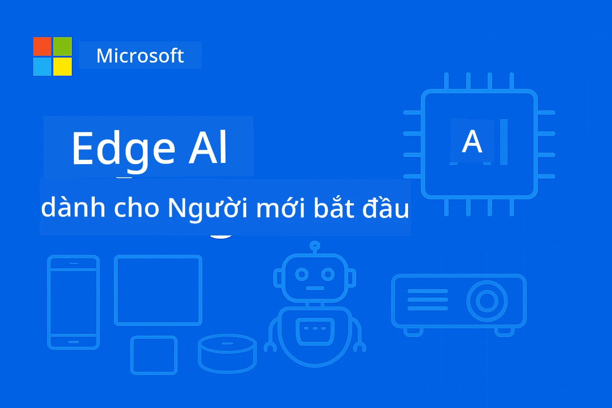

# EdgeAI cho Người Mới Bắt Đầu 




[](https://GitHub.com/microsoft/edgeai-for-beginners/graphs/contributors)
[](https://GitHub.com/microsoft/edgeai-for-beginners/issues)
[](https://GitHub.com/microsoft/edgeai-for-beginners/pulls)
[](http://makeapullrequest.com)

[](https://GitHub.com/microsoft/edgeai-for-beginners/watchers)
[](https://GitHub.com/microsoft/edgeai-for-beginners/fork)
[](https://GitHub.com/microsoft/edgeai-for-beginners/stargazers)


[](https://discord.gg/nTYy5BXMWG)

Hãy làm theo các bước sau để bắt đầu sử dụng các tài nguyên này:

1. **Fork Kho Lưu Trữ**: Nhấp vào [](https://GitHub.com/microsoft/edgeai-for-beginners/fork)
2. **Clone Kho Lưu Trữ**:   `git clone https://github.com/microsoft/edgeai-for-beginners.git`
3. [**Tham gia Azure AI Foundry Discord và gặp gỡ các chuyên gia cùng các nhà phát triển khác**](https://discord.com/invite/ByRwuEEgH4)


### 🌐 Hỗ Trợ Đa Ngôn Ngữ

#### Hỗ trợ qua GitHub Action (Tự động & Luôn Cập Nhật)

<!-- CO-OP TRANSLATOR LANGUAGES TABLE START -->
[Tiếng Ả Rập](../ar/README.md) | [Tiếng Bengal](../bn/README.md) | [Tiếng Bulgaria](../bg/README.md) | [Tiếng Miến Điện (Myanmar)](../my/README.md) | [Tiếng Trung (Giản thể)](../zh-CN/README.md) | [Tiếng Trung (Phồn thể, Hồng Kông)](../zh-HK/README.md) | [Tiếng Trung (Phồn thể, Macau)](../zh-MO/README.md) | [Tiếng Trung (Phồn thể, Đài Loan)](../zh-TW/README.md) | [Tiếng Croatia](../hr/README.md) | [Tiếng Séc](../cs/README.md) | [Tiếng Đan Mạch](../da/README.md) | [Tiếng Hà Lan](../nl/README.md) | [Tiếng Estonia](../et/README.md) | [Tiếng Phần Lan](../fi/README.md) | [Tiếng Pháp](../fr/README.md) | [Tiếng Đức](../de/README.md) | [Tiếng Hy Lạp](../el/README.md) | [Tiếng Do Thái](../he/README.md) | [Tiếng Hindi](../hi/README.md) | [Tiếng Hungary](../hu/README.md) | [Tiếng Indonesia](../id/README.md) | [Tiếng Ý](../it/README.md) | [Tiếng Nhật](../ja/README.md) | [Tiếng Kannada](../kn/README.md) | [Tiếng Khmer](../km/README.md) | [Tiếng Hàn](../ko/README.md) | [Tiếng Litva](../lt/README.md) | [Tiếng Mã Lai](../ms/README.md) | [Tiếng Malayalam](../ml/README.md) | [Tiếng Marathi](../mr/README.md) | [Tiếng Nepali](../ne/README.md) | [Tiếng Pidgin Nigeria](../pcm/README.md) | [Tiếng Na Uy](../no/README.md) | [Tiếng Ba Tư (Farsi)](../fa/README.md) | [Tiếng Ba Lan](../pl/README.md) | [Tiếng Bồ Đào Nha (Brazil)](../pt-BR/README.md) | [Tiếng Bồ Đào Nha (Bồ Đào Nha)](../pt-PT/README.md) | [Tiếng Punjabi (Gurmukhi)](../pa/README.md) | [Tiếng Romania](../ro/README.md) | [Tiếng Nga](../ru/README.md) | [Tiếng Serbia (Chữ Cyrillic)](../sr/README.md) | [Tiếng Slovakia](../sk/README.md) | [Tiếng Slovenia](../sl/README.md) | [Tiếng Tây Ban Nha](../es/README.md) | [Tiếng Swahili](../sw/README.md) | [Tiếng Thụy Điển](../sv/README.md) | [Tiếng Tagalog (Filipino)](../tl/README.md) | [Tiếng Tamil](../ta/README.md) | [Tiếng Telugu](../te/README.md) | [Tiếng Thái](../th/README.md) | [Tiếng Thổ Nhĩ Kỳ](../tr/README.md) | [Tiếng Ukraina](../uk/README.md) | [Tiếng Urdu](../ur/README.md) | [Tiếng Việt](./README.md)

> **Thích Clone Cục Bộ?**
>
> Kho lưu trữ này bao gồm hơn 50 bản dịch ngôn ngữ, điều này làm tăng đáng kể kích thước tải xuống. Để clone mà không có bản dịch, sử dụng sparse checkout:
>
> **Bash / macOS / Linux:**
> ```bash
> git clone --filter=blob:none --sparse https://github.com/microsoft/edgeai-for-beginners.git
> cd edgeai-for-beginners
> git sparse-checkout set --no-cone '/*' '!translations' '!translated_images'
> ```
>
> **CMD (Windows):**
> ```cmd
> git clone --filter=blob:none --sparse https://github.com/microsoft/edgeai-for-beginners.git
> cd edgeai-for-beginners
> git sparse-checkout set --no-cone "/*" "!translations" "!translated_images"
> ```
>
> Điều này cho bạn mọi thứ cần thiết để hoàn thành khóa học với tốc độ tải xuống nhanh hơn nhiều.
<!-- CO-OP TRANSLATOR LANGUAGES TABLE END -->

**Nếu bạn muốn có thêm các ngôn ngữ dịch khác được hỗ trợ, vui lòng xem danh sách [tại đây](https://github.com/Azure/co-op-translator/blob/main/getting_started/supported-languages.md)**
## Giới Thiệu

Chào mừng đến với **EdgeAI cho Người Mới Bắt Đầu** – hành trình toàn diện của bạn vào thế giới chuyển đổi của Trí Tuệ Nhân Tạo trên thiết bị Edge. Khóa học này kết nối khoảng cách giữa khả năng AI mạnh mẽ và triển khai thực tế ngay tại các thiết bị edge, giúp bạn khai thác tiềm năng AI ngay tại nơi dữ liệu được tạo ra và nơi cần ra quyết định.

### Những Điều Bạn Sẽ Thành Thạo

Khóa học này dẫn bạn từ các khái niệm cơ bản đến các triển khai sẵn sàng sản xuất, bao gồm:
- **Mô hình Ngôn ngữ Nhỏ (SLMs)** được tối ưu hóa cho triển khai edge
- **Tối ưu hóa nhận thức phần cứng** trên nhiều nền tảng đa dạng
- **Phân tích theo thời gian thực** với khả năng bảo vệ quyền riêng tư
- **Chiến lược triển khai sản xuất** cho các ứng dụng doanh nghiệp

### Tại Sao EdgeAI Lại Quan Trọng

Edge AI đại diện cho một sự chuyển đổi mô hình giải quyết các thách thức quan trọng hiện nay:
- **Bảo mật & Riêng tư**: Xử lý dữ liệu nhạy cảm tại chỗ mà không cần đưa lên đám mây
- **Hiệu suất theo thời gian thực**: Loại bỏ độ trễ mạng cho các ứng dụng đòi hỏi thời gian nhanh
- **Hiệu quả về chi phí**: Giảm băng thông và chi phí tính toán đám mây
- **Vận hành bền vững**: Duy trì chức năng khi mạng bị gián đoạn
- **Tuân thủ pháp lý**: Đáp ứng yêu cầu chủ quyền dữ liệu

### Edge AI

Edge AI là thuật ngữ chỉ việc chạy các thuật toán AI và mô hình ngôn ngữ ngay tại phần cứng gần nơi dữ liệu được sinh ra mà không cần dựa vào tài nguyên đám mây để suy luận. Điều này giảm độ trễ, nâng cao quyền riêng tư và cho phép ra quyết định theo thời gian thực.

### Nguyên Tắc Cốt Lõi:
- **Suy luận trên thiết bị**: Mô hình AI chạy trên các thiết bị edge (điện thoại, bộ định tuyến, vi điều khiển, máy tính công nghiệp)
- **Khả năng hoạt động ngoại tuyến**: Hoạt động mà không cần kết nối internet liên tục
- **Độ trễ thấp**: Phản hồi ngay lập tức phù hợp với hệ thống thời gian thực
- **Chủ quyền dữ liệu**: Giữ dữ liệu nhạy cảm tại chỗ, nâng cao bảo mật và tuân thủ

### Mô hình Ngôn ngữ Nhỏ (SLMs)

SLMs như Phi-4, Mistral-7B và Gemma là các phiên bản được tối ưu hóa của các LLM lớn hơn — được huấn luyện hoặc chưng cất để:
- **Giảm dung lượng bộ nhớ**: Sử dụng hiệu quả bộ nhớ hạn chế của thiết bị edge
- **Giảm yêu cầu tính toán**: Tối ưu cho hiệu năng CPU và GPU trên thiết bị edge
- **Thời gian khởi động nhanh hơn**: Khởi tạo nhanh cho các ứng dụng cần phản hồi nhanh

Chúng mở khóa các khả năng NLP mạnh mẽ trong khi đáp ứng các giới hạn của:
- **Hệ thống nhúng**: Thiết bị IoT và bộ điều khiển công nghiệp
- **Thiết bị di động**: Điện thoại thông minh và máy tính bảng có khả năng ngoại tuyến
- **Thiết bị IoT**: Cảm biến và thiết bị thông minh với tài nguyên hạn chế
- **Máy chủ edge**: Đơn vị xử lý địa phương với tài nguyên GPU hạn chế
- **Máy tính cá nhân**: Kịch bản triển khai trên máy tính để bàn và laptop

## Các Mô-đun Khóa Học & Điều Hướng

| Mô-đun | Chủ đề | Khu vực tập trung | Nội dung chính | Trình độ | Thời lượng |
|--------|-------|------------|-------------|--------|----------|
| [📖 00 ](./introduction.md) | [Giới thiệu về EdgeAI](./introduction.md) | Nền tảng & Bối cảnh | Tổng quan EdgeAI • Ứng dụng ngành • Giới thiệu SLM • Mục tiêu học tập | Người mới bắt đầu | 1-2 giờ |
| [📚 01](../../Module01) | [Kiến thức cơ bản về EdgeAI](./Module01/README.md) | So sánh Cloud và Edge AI | Kiến thức cơ bản EdgeAI • Nghiên cứu thực tế • Hướng dẫn triển khai • Triển khai trên Edge | Người mới bắt đầu | 3-4 giờ |
| [🧠 02](../../Module02) | [Nền tảng Mô hình SLM](./Module02/README.md) | Gia đình mô hình & kiến trúc | Gia đình Phi • Gia đình Qwen • Gia đình Gemma • BitNET • μModel • Phi-Silica | Người mới bắt đầu | 4-5 giờ |
| [🚀 03](../../Module03) | [Thực hành Triển khai SLM](./Module03/README.md) | Triển khai cục bộ & đám mây | Học nâng cao • Môi trường cục bộ • Triển khai đám mây | Trung cấp | 4-5 giờ |
| [⚙️ 04](../../Module04) | [Bộ Công Cụ Tối Ưu Mô Hình](./Module04/README.md) | Tối ưu đa nền tảng | Giới thiệu • Llama.cpp • Microsoft Olive • OpenVINO • Apple MLX • Tổng hợp quy trình | Trung cấp | 5-6 giờ |
| [🔧 05](../../Module05) | [SLMOps Sản Xuất](./Module05/README.md) | Vận hành sản xuất | Giới thiệu SLMOps • Chưng cất mô hình • Điều chỉnh tinh • Triển khai sản xuất | Nâng cao | 5-6 giờ |
| [🤖 06](../../Module06) | [Tác nhân AI & Gọi Hàm](./Module06/README.md) | Khung tác nhân & MCP | Giới thiệu tác nhân • Gọi hàm • Giao thức Ngữ cảnh mô hình | Nâng cao | 4-5 giờ |
| [💻 07](../../Module07) | [Triển khai trên Nền tảng](./Module07/README.md) | Ví dụ đa nền tảng | Bộ công cụ AI • Foundry Local • Phát triển Windows | Nâng cao | 3-4 giờ |
| [🏭 08](../../Module08) | [Bộ Công Cụ Foundry Local](./Module08/README.md) | Ví dụ sẵn sàng sản xuất | Ứng dụng mẫu (xem chi tiết bên dưới) | Chuyên gia | 8-10 giờ |

### 🏭 **Mô-đun 08: Ứng Dụng Mẫu**

- [01: Khởi động nhanh REST Chat](./Module08/samples/01/README.md)
- [02: Tích hợp SDK OpenAI](./Module08/samples/02/README.md)
- [03: Khám phá & Đánh giá mô hình](./Module08/samples/03/README.md)
- [04: Ứng dụng Chainlit RAG](./Module08/samples/04/README.md)
- [05: Tổ chức đa tác nhân](./Module08/samples/05/README.md)
- [06: Bộ định tuyến Mô hình như Công cụ](./Module08/samples/06/README.md)
- [07: Khách hàng API trực tiếp](./Module08/samples/07/README.md)
- [08: Ứng dụng Chat Windows 11](./Module08/samples/08/README.md)
- [09: Hệ thống đa tác nhân nâng cao](./Module08/samples/09/README.md)
- [10: Khung công cụ Foundry](./Module08/samples/10/README.md)

### 🎓 **Hội Thảo: Lộ Trình Học Tập Thực Hành**

Tài liệu hội thảo thực hành toàn diện với các triển khai sẵn sàng sản xuất:

- **[Hướng dẫn Hội thảo](./Workshop/Readme.md)** - Mục tiêu học tập hoàn chỉnh, kết quả và điều hướng tài nguyên
- **Ví dụ Python** (6 buổi) - Cập nhật với các phương pháp tốt nhất, xử lý lỗi và tài liệu đầy đủ
- **Sổ tay Jupyter** (8 tương tác) - Hướng dẫn từng bước với điểm chuẩn và theo dõi hiệu năng
- **Hướng dẫn Buổi học** - Hướng dẫn markdown chi tiết cho từng buổi hội thảo
- **Công cụ Kiểm tra** - Tập lệnh xác minh chất lượng mã và chạy kiểm tra nhanh

**Những gì bạn sẽ xây dựng:**
- Ứng dụng trò chuyện AI cục bộ với hỗ trợ streaming
- Pipeline RAG với đánh giá chất lượng (RAGAS)
- Công cụ đánh giá và so sánh đa mô hình
- Hệ thống tổ chức đa tác nhân
- Điều hướng mô hình thông minh với lựa chọn dựa trên tác vụ

### 🎙️ **Hội thảo cho Agentic: Thực hành - Studio Podcast AI**
Xây dựng một quy trình sản xuất podcast được hỗ trợ bởi AI từ đầu! Workshop nhập vai này sẽ dạy bạn tạo ra một hệ thống đa tác nhân hoàn chỉnh biến ý tưởng thành các tập podcast chuyên nghiệp.

**[🎬 Bắt Đầu Workshop AI Podcast Studio](./WorkshopForAgentic/README.md)**

**Nhiệm Vụ Của Bạn**: Ra mắt "Future Bytes" — một podcast công nghệ hoàn toàn do các tác nhân AI bạn tự xây dựng vận hành. Không phụ thuộc đám mây, không tốn phí API — mọi thứ chạy hoàn toàn trên máy của bạn.

**Điều Gì Làm Nên Sự Độc Đáo:**
- **🤖 Điều Phối Đa Tác Nhân Thực Thụ** - Xây dựng các tác nhân AI chuyên biệt nghiên cứu, viết và sản xuất âm thanh
- **🎯 Quy Trình Sản Xuất Hoàn Chỉnh** - Từ chọn chủ đề đến đầu ra âm thanh podcast cuối cùng
- **💻 Triển Khai 100% Cục Bộ** - Sử dụng Ollama và các mô hình cục bộ (Qwen-3-8B) đảm bảo quyền riêng tư và kiểm soát toàn diện
- **🎤 Tích Hợp Văn Bản Thành Giọng Nói** - Chuyển kịch bản thành các cuộc hội thoại đa diễn giả tự nhiên
- **✋ Quy Trình Có Can Thiệp Con Người** - Các bước phê duyệt đảm bảo chất lượng trong khi vẫn duy trì tự động hóa

**Hành Trình Học Ba Phần:**

| Phần | Trọng Tâm | Kỹ Năng Chính | Thời Lượng |
|-----|-------|------------|----------|
| **[Phần 1: Làm Quen Với Các Trợ Lý AI](./WorkshopForAgentic/md/01.BuildAIAgentWithSLM.md)** | Xây dựng tác nhân AI đầu tiên của bạn | Tích hợp công cụ • Tìm kiếm web • Giải quyết vấn đề • Lý luận có tác nhân | 2-3 giờ |
| **[Phần 2: Tập Hợp Đội Sản Xuất](./WorkshopForAgentic/md/02.AIAgentOrchestrationAndWorkflows.md)** | Điều phối nhiều tác nhân | Phối hợp đội nhóm • Quy trình phê duyệt • Giao diện DevUI • Giám sát con người | 3-4 giờ |
| **[Phần 3: Hiện Thực Hóa Podcast Của Bạn](./WorkshopForAgentic/md/03.Multi-SpeakerPodcastGenerationWithVibeVoice.md)** | Tạo âm thanh podcast | Văn bản thành giọng nói • Tổng hợp đa diễn giả • Âm thanh dài • Tự động hóa toàn diện | 2-3 giờ |

**Công Nghệ Sử Dụng:**
- **Microsoft Agent Framework** - Điều phối và phối hợp đa tác nhân
- **Ollama** - Môi trường chạy mô hình AI cục bộ (không cần đám mây)
- **Qwen-3-8B** - Mô hình ngôn ngữ mã nguồn mở tối ưu cho các tác vụ có tác nhân
- **API Văn Bản Thành Giọng Nói** - Tổng hợp giọng nói tự nhiên dùng để tạo podcast

**Hỗ Trợ Phần Cứng:**
- ✅ **Chế Độ CPU** - Chạy trên mọi máy tính hiện đại (khuyên dùng 8GB+ RAM)
- 🚀 **Tăng Tốc GPU** - Thực thi nhanh hơn đáng kể với GPU NVIDIA/AMD
- ⚡ **Hỗ Trợ NPU** - Tăng tốc bằng đơn vị xử lý thần kinh thế hệ mới

**Phù Hợp Cho:**
- Nhà phát triển muốn học hệ thống AI đa tác nhân
- Người quan tâm đến tự động hóa AI và quy trình làm việc
- Người sáng tạo nội dung khám phá sản xuất hỗ trợ AI
- Sinh viên nghiên cứu các mẫu phối hợp AI thực tế

**Bắt Đầu Xây Dựng**: [🎙️ Workshop AI Podcast Studio →](./WorkshopForAgentic/README.md)

### 📊 **Tóm Tắt Lộ Trình Học**
- **Tổng Thời Lượng**: 36-45 giờ
- **Lộ Trình Người Mới**: Module 01-02 (7-9 giờ)  
- **Lộ Trình Trung Cấp**: Module 03-04 (9-11 giờ)
- **Lộ Trình Nâng Cao**: Module 05-07 (12-15 giờ)
- **Lộ Trình Chuyên Gia**: Module 08 (8-10 giờ)

## Những Gì Bạn Sẽ Xây Dựng

### 🎯 Năng Lực Cốt Lõi
- **Kiến Trúc AI Cạnh**: Thiết kế hệ thống AI ưu tiên cục bộ có tích hợp đám mây
- **Tối Ưu Mô Hình**: Lượng tử hóa và nén mô hình để triển khai edge (tăng tốc 85%, giảm kích thước 75%)
- **Triển Khai Đa Nền Tảng**: Windows, di động, nhúng và hệ thống lai đám mây-cạnh
- **Vận Hành Sản Xuất**: Giám sát, mở rộng và duy trì AI cạnh trong sản xuất

### 🏗️ Dự Án Thực Tiễn
- **Ứng Dụng Chat Cục Bộ Foundry**: Ứng dụng Windows 11 bản địa với khả năng chuyển đổi mô hình
- **Hệ Thống Đa Tác Nhân**: Điều phối viên với các tác nhân chuyên gia cho quy trình phức tạp  
- **Ứng Dụng RAG**: Xử lý tài liệu cục bộ với tìm kiếm vector
- **Bộ Chuyển Mô Hình**: Lựa chọn thông minh giữa các mô hình dựa trên phân tích tác vụ
- **Khung API**: Khách hàng sẵn sàng sản xuất với streaming và giám sát sức khỏe
- **Công Cụ Đa Nền Tảng**: Mẫu tích hợp LangChain/Semantic Kernel

### 🏢 Ứng Dụng Trong Ngành
**Sản Xuất** • **Chăm Sóc Sức Khỏe** • **Phương Tiện Tự Lái** • **Thành Phố Thông Minh** • **Ứng Dụng Di Động**

## Bắt Đầu Nhanh

**Lộ Trình Học Đề Xuất** (20-30 giờ tổng cộng):

0. **📖 Giới Thiệu** ([Introduction.md](./introduction.md)): Nền tảng EdgeAI + bối cảnh ngành + khung học tập
1. **📚 Nền Tảng** (Module 01-02): Khái niệm EdgeAI + các dòng mô hình SLM
2. **⚙️ Tối Ưu** (Module 03-04): Triển khai + khung lượng tử hóa  
3. **🚀 Sản Xuất** (Module 05-06): SLMOps + tác nhân AI + gọi hàm
4. **💻 Triển Khai** (Module 07-08): Các mẫu nền tảng + bộ công cụ Foundry Local

Mỗi module bao gồm lý thuyết, bài tập thực hành và ví dụ mã sẵn sàng sản xuất.

## Tác Động Nghề Nghiệp

**Vai Trò Kỹ Thuật**: Kiến trúc sư giải pháp EdgeAI • Kỹ sư ML (Edge) • Nhà phát triển AI IoT • Nhà phát triển AI di động

**Ngành Công Nghiệp**: Sản Xuất 4.0 • Công nghệ chăm sóc sức khỏe • Hệ thống tự động • FinTech • Điện tử tiêu dùng

**Dự Án Hồ Sơ**: Hệ thống đa tác nhân • Ứng dụng RAG sản xuất • Triển khai đa nền tảng • Tối ưu hiệu suất

## Cấu Trúc Kho Lưu Trữ

```
edgeai-for-beginners/
├── 📖 introduction.md  # Foundation: EdgeAI Overview & Learning Framework
├── 📚 Module01-04/     # Fundamentals → SLMs → Deployment → Optimization  
├── 🔧 Module05-06/     # SLMOps → AI Agents → Function Calling
├── 💻 Module07/        # Platform Samples (VS Code, Windows, Jetson, Mobile)
├── 🏭 Module08/        # Foundry Local Toolkit + 10 Comprehensive Samples
│   ├── samples/01-06/  # Foundation: REST, SDK, RAG, Agents, Routing
│   └── samples/07-10/  # Advanced: API Client, Windows App, Enterprise Agents, Tools
├── 🌐 translations/    # Multi-language support (8+ languages)
└── 📋 STUDY_GUIDE.md   # Structured learning paths & time allocation
```

## Điểm Nổi Bật Khóa Học

✅ **Học Tăng Tiến**: Lý thuyết → Thực hành → Triển khai sản xuất  
✅ **Nghiên Cứu Thực Tế**: Microsoft, Japan Airlines, triển khai doanh nghiệp  
✅ **Ví Dụ Thực Hành**: Hơn 50 ví dụ, 10 demo Foundry Local toàn diện  
✅ **Tập Trung Hiệu Suất**: Tăng tốc 85%, giảm kích thước 75%  
✅ **Đa Nền Tảng**: Windows, di động, nhúng, lai đám mây-cạnh  
✅ **Sẵn Sàng Sản Xuất**: Giám sát, mở rộng, bảo mật, tuân thủ

📖 **[Hướng Dẫn Học](STUDY_GUIDE.md)**: Lộ trình học 20 giờ có cấu trúc với phân bổ thời gian và công cụ tự đánh giá.

---

**EdgeAI đại diện cho tương lai của triển khai AI**: ưu tiên cục bộ, bảo vệ quyền riêng tư và hiệu quả. Thành thạo các kỹ năng này để xây dựng thế hệ ứng dụng thông minh tiếp theo.

## Các Khóa Học Khác

Đội ngũ của chúng tôi còn sản xuất các khóa học khác! Xem tại:

<!-- CO-OP TRANSLATOR OTHER COURSES START -->
### LangChain
[](https://aka.ms/langchain4j-for-beginners)
[](https://aka.ms/langchainjs-for-beginners?WT.mc_id=m365-94501-dwahlin)
[](https://github.com/microsoft/langchain-for-beginners?WT.mc_id=m365-94501-dwahlin)
---

### Azure / Edge / MCP / Agents
[](https://github.com/microsoft/AZD-for-beginners?WT.mc_id=academic-105485-koreyst)
[](https://github.com/microsoft/edgeai-for-beginners?WT.mc_id=academic-105485-koreyst)
[](https://github.com/microsoft/mcp-for-beginners?WT.mc_id=academic-105485-koreyst)
[](https://github.com/microsoft/ai-agents-for-beginners?WT.mc_id=academic-105485-koreyst)

---
 
### Chuỗi AI Tạo Sinh
[](https://github.com/microsoft/generative-ai-for-beginners?WT.mc_id=academic-105485-koreyst)
[-9333EA?style=for-the-badge&labelColor=E5E7EB&color=9333EA)](https://github.com/microsoft/Generative-AI-for-beginners-dotnet?WT.mc_id=academic-105485-koreyst)
[-C084FC?style=for-the-badge&labelColor=E5E7EB&color=C084FC)](https://github.com/microsoft/generative-ai-for-beginners-java?WT.mc_id=academic-105485-koreyst)
[-E879F9?style=for-the-badge&labelColor=E5E7EB&color=E879F9)](https://github.com/microsoft/generative-ai-with-javascript?WT.mc_id=academic-105485-koreyst)

---
 
### Học Cốt Lõi
[](https://aka.ms/ml-beginners?WT.mc_id=academic-105485-koreyst)
[](https://aka.ms/datascience-beginners?WT.mc_id=academic-105485-koreyst)
[](https://aka.ms/ai-beginners?WT.mc_id=academic-105485-koreyst)
[](https://github.com/microsoft/Security-101?WT.mc_id=academic-96948-sayoung)
[](https://aka.ms/webdev-beginners?WT.mc_id=academic-105485-koreyst)
[](https://aka.ms/iot-beginners?WT.mc_id=academic-105485-koreyst)
[](https://github.com/microsoft/xr-development-for-beginners?WT.mc_id=academic-105485-koreyst)

---
 
### Chuỗi Copilot
[](https://aka.ms/GitHubCopilotAI?WT.mc_id=academic-105485-koreyst)
[](https://github.com/microsoft/mastering-github-copilot-for-dotnet-csharp-developers?WT.mc_id=academic-105485-koreyst)
[](https://github.com/microsoft/CopilotAdventures?WT.mc_id=academic-105485-koreyst)
<!-- CO-OP TRANSLATOR OTHER COURSES END -->

## Nhận Trợ Giúp

Nếu bạn bị mắc kẹt hoặc có bất kỳ câu hỏi nào về xây dựng ứng dụng AI, hãy tham gia:

[](https://discord.gg/nTYy5BXMWG)

Nếu bạn có phản hồi về sản phẩm hoặc lỗi trong quá trình xây dựng, hãy truy cập:

[](https://aka.ms/foundry/forum)

---

<!-- CO-OP TRANSLATOR DISCLAIMER START -->
**Tuyên bố miễn trách nhiệm**:  
Tài liệu này đã được dịch bằng dịch vụ dịch thuật AI [Co-op Translator](https://github.com/Azure/co-op-translator). Trong khi chúng tôi cố gắng đảm bảo độ chính xác, xin lưu ý rằng bản dịch tự động có thể chứa lỗi hoặc không chính xác. Tài liệu gốc bằng ngôn ngữ nguyên bản nên được coi là nguồn tham khảo chính thức. Đối với thông tin quan trọng, nên sử dụng dịch thuật chuyên nghiệp của con người. Chúng tôi không chịu trách nhiệm về bất kỳ sự hiểu nhầm hoặc giải thích sai nào phát sinh từ việc sử dụng bản dịch này.
<!-- CO-OP TRANSLATOR DISCLAIMER END -->