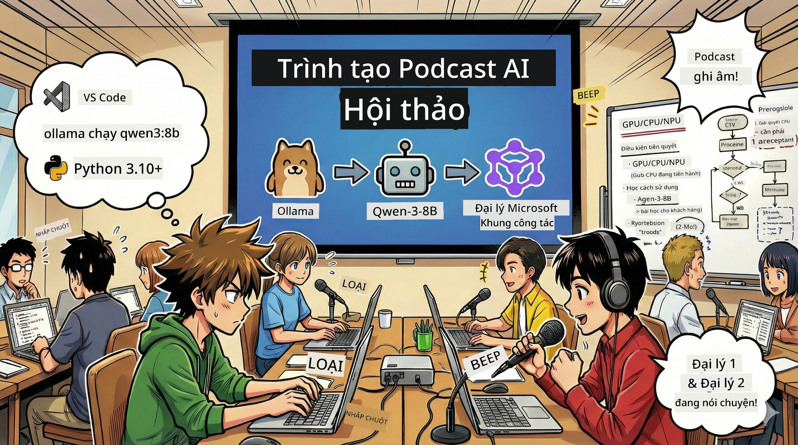

# 🎙️ Workshop Studio Podcast AI

> 🌏 [中文版 (Phiên bản tiếng Trung)](translation/zh-cn/README.md)



## Nhiệm vụ của bạn

Chào mừng bạn đến với **Studio Podcast AI**! Bạn sắp khởi chạy podcast công nghệ của riêng mình có tên "Future Bytes" — nhưng điều đặc biệt là: bạn sẽ xây dựng một đội sản xuất được hỗ trợ bởi AI để giúp bạn tạo ra nó. Không còn dành hàng giờ nghiên cứu, viết kịch bản và chỉnh sửa âm thanh. Thay vào đó, bạn sẽ viết code để trở thành nhà sản xuất podcast với siêu năng lực AI.

## Câu chuyện

Hãy tưởng tượng: Bạn và các bạn muốn bắt đầu một podcast về các xu hướng công nghệ tuyệt vời nhất, nhưng ai cũng bận học, làm việc hoặc cuộc sống thường nhật. Nếu bạn có thể xây dựng một đội các tác nhân AI làm những phần việc nặng nhọc? Một tác nhân nghiên cứu chủ đề, một tác nhân khác viết kịch bản hấp dẫn, và một tác nhân thứ ba biến văn bản thành các cuộc hội thoại tự nhiên. Nghe như khoa học viễn tưởng? Hãy biến nó thành hiện thực.

## Bạn sẽ học được gì

Sau khi kết thúc workshop này, bạn sẽ biết cách:
- 🤖 Triển khai mô hình AI cục bộ của riêng bạn (không tốn phí API, không phụ thuộc vào đám mây!)
- 🔧 Xây dựng các tác nhân AI chuyên biệt hoạt động cùng nhau hiệu quả
- 🎬 Tạo một quy trình sản xuất podcast hoàn chỉnh từ ý tưởng đến âm thanh

## Hành trình của bạn: Ba phần


Như bất kỳ câu chuyện hay nào, chúng tôi có ba phần. Mỗi phần xây dựng studio podcast AI của bạn từng chút một:

| Tập | Nhiệm vụ của bạn | Điều gì xảy ra | Kỹ năng mở khóa |
|---------|-----------|--------------|----------------|
| **Phần 1** | [Gặp gỡ các Trợ lý AI của bạn](md/01.BuildAIAgentWithSLM.md) | Bạn tìm hiểu cách tạo các tác nhân AI có thể trò chuyện, tìm kiếm web, và thậm chí giải quyết vấn đề. Hãy coi họ như các thực tập sinh nghiên cứu không bao giờ ngủ. | 🎯 Xây dựng tác nhân đầu tiên<br>🛠️ Trang bị siêu năng lực (công cụ!)<br>🧠 Dạy nó cách suy nghĩ<br>🌐 Kết nối với internet |
| **Phần 2** | [Tập hợp Đội sản xuất của bạn](md/02.AIAgentOrchestrationAndWorkflows.md) | Giờ mọi thứ trở nên thú vị! Bạn sẽ điều phối nhiều tác nhân AI làm việc chung như một đội podcast thật sự. Một người nghiên cứu, một người viết, bạn duyệt — làm việc nhóm tạo nên giấc mơ. | 🎭 Điều phối nhiều tác nhân<br>🔄 Xây dựng quy trình duyệt<br>🖥️ Thử nghiệm qua giao diện DevUI<br>✋ Giữ con người kiểm soát |
| **Phần 3** | [Mang Podcast của bạn đến cuộc sống](md/03.Multi-SpeakerPodcastGenerationWithVibeVoice.md) | Phần cuối cùng! Biến kịch bản văn bản thành âm thanh podcast thực tế với giọng nói tự nhiên và hội thoại sống động. Podcast "Future Bytes" của bạn đã sẵn sàng để phát hành! | 🎤 Thần chú chuyển văn bản thành giọng nói<br>👥 Nhiều giọng nói người nói<br>⏱️ Âm thanh dài<br>🚀 Tự động hóa toàn bộ |

Mỗi phần mở khóa các khả năng mới. Nếu bạn táo bạo, có thể nhảy tới phần sau, nhưng chúng tôi khuyến khích bạn theo sát câu chuyện!

## Yêu cầu môi trường

Workshop này hỗ trợ nhiều thiết bị phần cứng:
- **CPU**: Phù hợp để thử nghiệm và sử dụng quy mô nhỏ
- **GPU**: Đề xuất cho môi trường sản xuất, tăng tốc độ suy luận đáng kể
- **NPU**: Hỗ trợ tăng tốc bằng đơn vị xử lý thần kinh thế hệ mới

## Những gì bạn cần

### Danh sách phần mềm ✅
- **Python 3.10+** (Ngôn ngữ lập trình của bạn)
- **Ollama** (Chạy các mô hình AI trên máy của bạn)
- **VS Code** (Trình soạn thảo mã nguồn)
- **Tiện ích mở rộng Python** (Giúp VS Code thông minh hơn)
- **Git** (Dùng để lấy mã nguồn)

### Kiểm tra phần cứng 💻
- **Tôi có chạy được không?**: 8GB RAM, 10GB dung lượng trống (được nhưng có thể chậm)
- **Cấu hình lý tưởng**: 16GB RAM trở lên, GPU khá (mượt mà!)
- **Có NPU không?**: Tốt hơn nữa! Hiệu năng thế hệ mới được mở khóa 🚀

## Thiết lập Studio của bạn 🎬

### Bước 1: Nâng cấp Python

Hãy đảm bảo bạn có Python 3.10 trở lên:

```bash
python --version
# Nên hiển thị Python 3.10.x hoặc cao hơn
```

Chưa có Python? Tải về tại [python.org](https://python.org) — miễn phí!

### Bước 2: Tải Ollama (Trình chạy mô hình AI của bạn)

Truy cập [ollama.ai](https://ollama.ai) và tải Ollama cho hệ điều hành của bạn. Hãy nghĩ nó như động cơ chạy các mô hình AI cục bộ.

Kiểm tra xem đã sẵn sàng chưa:

```bash
ollama --version
```

### Bước 3: Tải về Bộ não AI của bạn 🧠

Đã đến lúc lấy mô hình Qwen-3-8B (giống như tuyển trợ lý AI đầu tiên của bạn):

```bash
ollama pull qwen3:8b
```

*Việc này có thể mất vài phút. Thời gian lý tưởng để uống cà phê! ☕*

### Bước 4: Cài đặt VS Code

Tải [Visual Studio Code](https://code.visualstudio.com/) nếu bạn chưa có. Nó là trình soạn thảo mã tốt nhất (thách đấu 😄).

### Bước 5: Tiện ích mở rộng Python

Trong VS Code:
1. Nhấn `Ctrl+Shift+X` (hoặc `Cmd+Shift+X` trên Mac)
2. Tìm "Python"
3. Cài đặt tiện ích mở rộng Python chính thức của Microsoft

### Bước 6: Bạn đã sẵn sàng! 🎉

Thật sự, bạn đã có thể bắt đầu tạo phép màu AI!

### Bước 7: Cài đặt Microsoft Agent Framework và các gói liên quan 📦

Cài đặt toàn bộ phụ thuộc cần thiết cho workshop:

```bash
pip install -r ./Installations/requirements.txt -U
```

*Việc này sẽ cài Microsoft Agent Framework và tất cả các gói cần thiết. Hãy pha một ly cà phê — lần đầu thiết lập có thể mất vài phút! ☕*

## Hướng dẫn Workshop

Cấu trúc dự án chi tiết, các bước cấu hình và cách chạy sẽ được trình bày từng bước trong workshop.

## Khắc phục sự cố (Khi có vấn đề xảy ra) 🔧

### "Ôi, tải mô hình lâu quá!"
**Khắc phục**: Dùng VPN hoặc cấu hình Ollama với nguồn mirror. Đôi khi mạng Internet không ưu ái chúng ta.

### "Máy tôi chết bạn ơi! Hết bộ nhớ!"
**Khắc phục**: Chuyển sang mô hình nhỏ hơn hoặc chỉnh `num_ctx` dùng ít bộ nhớ hơn. Coi như cho AI ăn kiêng vậy.

### "Tôi có thể tăng tốc bằng GPU không?"
**Khắc phục**: Ollama tự động nhận GPU! Chỉ cần đảm bảo driver GPU của bạn cập nhật. Boost tốc độ miễn phí! 🏎️

## Tài nguyên thêm (Dành cho người tò mò) 📚

- [Tài liệu Ollama](https://github.com/ollama/ollama) — Tìm hiểu sâu về mô hình AI cục bộ
- [Microsoft Agent Framework](https://microsoft.github.io/autogen/) — Tìm hiểu thêm về xây dựng đội tác nhân
- [Thông tin mô hình Qwen](https://qwenlm.github.io/) — Làm quen với bộ não trợ lý AI của bạn

## Giấy phép

Giấy phép MIT — Tạo ra thứ hay ho, chia sẻ, làm cho thế giới tốt hơn! 🌍

## Muốn đóng góp?

Phát hiện lỗi? Có ý tưởng? Hãy tạo Issue hoặc PR! Chúng tôi rất yêu cộng đồng. ✨

---

<!-- CO-OP TRANSLATOR DISCLAIMER START -->
**Tuyên bố miễn trừ trách nhiệm**:  
Tài liệu này đã được dịch bằng dịch vụ dịch thuật AI [Co-op Translator](https://github.com/Azure/co-op-translator). Mặc dù chúng tôi nỗ lực đảm bảo độ chính xác, xin lưu ý rằng bản dịch tự động có thể chứa lỗi hoặc sai sót. Tài liệu gốc bằng ngôn ngữ nguyên bản được coi là nguồn chính thống và đáng tin cậy. Đối với thông tin quan trọng, nên sử dụng bản dịch chuyên nghiệp do con người thực hiện. Chúng tôi không chịu trách nhiệm về bất kỳ sự hiểu lầm hoặc giải thích sai nào phát sinh từ việc sử dụng bản dịch này.
<!-- CO-OP TRANSLATOR DISCLAIMER END -->