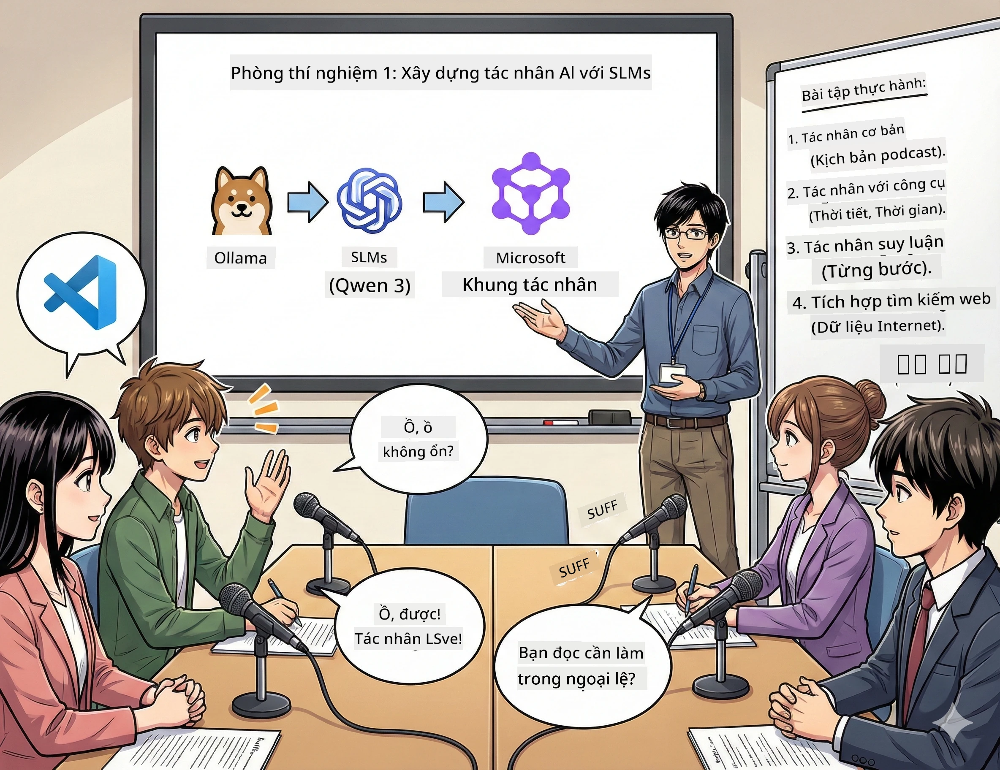

<!--
CO_OP_TRANSLATOR_METADATA:
{
  "original_hash": "7868fa418386aa7167bea3ff5ba8390b",
  "translation_date": "2026-01-05T13:09:51+00:00",
  "source_file": "WorkshopForAgentic/md/01.BuildAIAgentWithSLM.md",
  "language_code": "vi"
}
-->
# Hành động 1: Gặp gỡ Trợ lý Nghiên cứu AI của bạn 🤖

## Thử thách

Bạn đang khởi động "Future Bytes," podcast công nghệ mới của bạn. Tập 1 nói về những đột phá AI mới nhất, nhưng bạn chỉ có 24 giờ để:
1. Nghiên cứu chủ đề
2. Tìm nguồn tin cậy
3. Viết kịch bản hấp dẫn
4. Làm cho nó nghe tự nhiên

**Bước ngoặt**: Bạn không phải làm một mình. Bạn sắp xây dựng trợ lý AI đầu tiên có thể giúp bạn tất cả điều này. Gọi họ là Alex — đối tác nghiên cứu không biết mệt mỏi, không bao giờ cần ngủ của bạn.

## Tại sao lại là Mô hình Ngôn ngữ Nhỏ? (Tiết lộ: Chúng thật tuyệt)

Hãy tưởng tượng Mô hình Ngôn ngữ Nhỏ (SLMs) như AI cá nhân sống trên *máy tính* của bạn. Không dùng đám mây, không phí hàng tháng, không chia sẻ dữ liệu đáng ngờ.

**Tại sao SLMs lại 🔥:**
- **🏠 Chạy trên máy bạn**: Laptop, desktop, thậm chí Raspberry Pi mạnh mẽ
- **💸 Không tốn phí thường xuyên**: Không phải trả phí API tốn tiền của bạn
- **🔒 Ưu tiên sự riêng tư**: Dữ liệu của bạn không bao giờ rời thiết bị
- **⚡ Siêu nhanh**: Không có độ trễ internet, phản hồi ngay lập tức
- **🪦 Nhẹ nhàng**: 1 tỷ - 10 tỷ tham số so với 100 tỷ+ của các ông lớn

**SLMs phổ biến**: Qwen 3, Phi-4, Gemma 3 (chúng ta dùng Qwen cho workshop này)

## Bộ công cụ của bạn

### Ollama: Trình Quản Lý Mô hình AI của bạn

[Ollama](https://ollama.com/) giống như Steam cho các mô hình AI. Tải về, chạy và quản lý mô hình bằng lệnh đơn giản.

**Điểm thú vị:**
- Một lệnh để tải và chạy bất kỳ mô hình nào
- Hỗ trợ Mac, Windows, Linux
- Tự động dùng GPU nếu bạn có
- Tiết kiệm bộ nhớ cực cao

### Microsoft Agent Framework: Nơi Phép Thuật Xảy Ra

[Microsoft Agent Framework](https://github.com/microsoft/agent-framework) là sân chơi của bạn để xây dựng các đại lý AI có thể:

- 💬 Trò chuyện và nhớ những gì bạn đã nói
- 🛠️ Dùng công cụ tùy chỉnh (như tìm kiếm web hoặc kiểm tra thời tiết)
- 🧠 Tư duy giải quyết vấn đề phức tạp từng bước
- 🤝 Hợp tác với các đại lý khác trong đội nhóm
- 🔌 Kết nối với các nhà cung cấp AI khác nhau (OpenAI, Ollama, Azure)

**Những Khối Xây Dựng:**
- **Agents**: Trợ lý AI của bạn với các công việc cụ thể
- **Tools**: Năng lực đặc biệt bạn trao cho họ
- **Memory**: Để họ không quên cuộc trò chuyện
- **Reasoning**: Dạy họ cách suy nghĩ, không chỉ hồi đáp

## Hành trình huấn luyện của bạn: 4 Nhiệm vụ

### Nhiệm vụ 1: Tạo đại lý đầu tiên

📓 [Mở sổ tay](../code/01.BasicAgent/00.BasicAgent-agent.ipynb)

**Nhiệm vụ**: Xây dựng Alex, AI viết kịch bản podcast của bạn. Alex cần tạo đối thoại giữa hai người dẫn bàn luận về công nghệ.

**Bạn sẽ học được**:
- Cách đánh thức một đại lý AI (dễ hơn thức dậy vào thứ Hai)
- Cho nó cá tính và hướng dẫn
- Làm nó tạo kịch bản podcast thực tế
- Hiểu những gì nó nói lại với bạn

**Điều kiện chiến thắng**: Alex tạo kịch bản cho tập mở đầu "Future Bytes" về AI! 🎯

### Nhiệm vụ 2: Trao siêu năng lực cho Alex (Công cụ!)

📓 [Mở sổ tay](../code/01.BasicAgent/01.BasicAgent-tools.ipynb)

**Nhiệm vụ**: Alex thông minh, nhưng không biết thời tiết hôm nay hay mấy giờ. Chúng ta sẽ bổ sung công cụ cho nó!

**Bạn sẽ học được**:
- Tạo hàm Python tùy chỉnh làm "công cụ"
- Để Alex quyết định *khi nào* dùng công cụ nào
- Quan sát nó tự động giải quyết vấn đề
- Kết hợp nhiều công cụ cho nhiệm vụ phức tạp

**Điều kiện chiến thắng**: Hỏi "Thời tiết Tokyo ra sao?" và Alex tự tìm ra! ☁️

### Nhiệm vụ 3: Dạy Alex suy nghĩ

📓 [Mở sổ tay](../code/01.BasicAgent/02.BasicAgent-reasoning.ipynb)

**Nhiệm vụ**: Làm cho Alex chứng minh cách nó suy nghĩ. Khi giải bài toán, bạn muốn xem *cách* nó tư duy, không chỉ kết quả.

**Bạn sẽ học được**:
- Kích hoạt "chế độ suy luận" (giống như trình bày bài toán ở lớp toán)
- Xem quá trình suy nghĩ từng bước của Alex
- Hiểu cách dùng chain-of-thought prompting
- Gỡ lỗi khi Alex bị rối

**Điều kiện chiến thắng**: Đặt câu hỏi toán hóc búa và xem Alex tư duy! 🧠

### Nhiệm vụ 4: Kết nối Alex với Internet

📓 [Mở sổ tay](../code/01.BasicAgent/03.BasicAgent-websearch.ipynb)

**Nhiệm vụ**: Kiến thức của Alex có giới hạn thời gian. Hãy kết nối nó với web để có thông tin thời gian thực!

**Bạn sẽ học được**:
- Tạo công cụ tìm kiếm web tùy chỉnh
- Tích hợp API bên ngoài
- Xử lý lỗi mạng một cách mềm dẻo
- Lấy thông tin vượt ngoài dữ liệu đào tạo của Alex

**Điều kiện chiến thắng**: Hỏi tin tức công nghệ hôm nay và nhận kết quả mới nhất! 📰

## Trước khi bắt đầu 🚀

**Yêu cầu thiết bị**:
- Cài Python 3.10 trở lên
- Ollama đang chạy (kiểm tra với `ollama --version`)
- VS Code có extension Python
- Ít nhất 8GB RAM (16GB nếu muốn trải nghiệm mượt mà)

## Thứ tự làm nhiệm vụ

Theo dõi sổ tay theo thứ tự để có câu chuyện đầy đủ:

1. [00.BasicAgent-agent.ipynb](../code/01.BasicAgent/00.BasicAgent-agent.ipynb) — Gặp Alex (đại lý đầu tiên của bạn)
2. [01.BasicAgent-tools.ipynb](../code/01.BasicAgent/01.BasicAgent-tools.ipynb) — Thời gian nâng cấp sức mạnh!
3. [02.BasicAgent-reasoning.ipynb](../code/01.BasicAgent/02.BasicAgent-reasoning.ipynb) — Dạy Alex suy nghĩ
4. [03.BasicAgent-websearch.ipynb](../code/01.BasicAgent/03.BasicAgent-websearch.ipynb) — Mở khóa truy cập Internet!

## Bạn sẽ thành thạo những gì

Sau Hành động 1, bạn có thể:

- ✅ Chạy mô hình AI trên phần cứng của riêng bạn (không cần đám mây!)
- ✅ Xây dựng đại lý với cá tính và kỹ năng tùy chỉnh
- ✅ Cung cấp công cụ để đại lý giải quyết vấn đề thực tế
- ✅ Làm cho đại lý trình bày quá trình suy luận
- ✅ Kết nối đại lý với nguồn dữ liệu bên ngoài
- ✅ Gỡ lỗi khi gặp sự cố

## Khi gặp sự cố (và cách khắc phục) 🔧

### "Alex không tải được! Hết bộ nhớ!"
**Khắc phục**: Máy bạn đang quá tải. Thử đóng ứng dụng khác, hoặc dùng mô hình nhỏ hơn. 8GB RAM là tối thiểu.

### "Alex chạy chậm quá"
**Khắc phục**: Bật tăng tốc GPU trong cài đặt Ollama. Hoặc giảm kích thước cửa sổ ngữ cảnh. Chế độ tăng tốc bật! 🏎️

### "Công cụ không hoạt động!"
**Khắc phục**: Kiểm tra kỹ chữ ký hàm. Alex cần định rõ kiểu dữ liệu để hiểu công cụ làm gì. Tưởng như đang đưa chỉ dẫn rõ ràng.

## Liên kết hữu ích 🔗

- [Agent Framework Docs](https://github.com/microsoft/agent-framework) — Hướng dẫn và ví dụ chính thức
- [Ollama Model Library](https://ollama.com/library) — Duyệt qua tất cả mô hình có sẵn
- [Qwen Model](https://ollama.com/library/qwen3) — Hệ thần kinh AI của bạn
- [Code Examples](https://github.com/microsoft/agent-framework/tree/main/python/samples) — Mượn ý tưởng từ đây

## Tiếp theo: Hành động 2 🎬

Bạn đã có một đại lý. Nhưng nếu bạn có *đội* đại lý làm việc cùng nhau thì sao? Trong Hành động 2, bạn sẽ tạo đội sản xuất podcast hoàn chỉnh:
- **Đại lý Nghiên cứu**: Tìm nguồn tin tốt nhất
- **Đại lý Viết**: Tạo kịch bản hoàn hảo  
- **Biên tập (Bạn!)**: Phê duyệt hoặc yêu cầu chỉnh sửa

Cùng tạo ra phép màu AI! → [Hành động 2: Tổ chức Đội sản xuất](02.AIAgentOrchestrationAndWorkflows.md)

---

**Gặp khó?** Hãy hỏi trong buổi workshop. Chúng ta cùng học nhé! 🙌

---

<!-- CO-OP TRANSLATOR DISCLAIMER START -->
**Tuyên bố từ chối trách nhiệm**:  
Tài liệu này đã được dịch bằng dịch vụ dịch thuật AI [Co-op Translator](https://github.com/Azure/co-op-translator). Mặc dù chúng tôi nỗ lực để đảm bảo độ chính xác, xin lưu ý rằng bản dịch tự động có thể chứa lỗi hoặc không chính xác. Tài liệu gốc bằng ngôn ngữ gốc của nó nên được coi là nguồn tin cậy và chính thức. Đối với thông tin quan trọng, nên sử dụng dịch vụ dịch thuật chuyên nghiệp của con người. Chúng tôi không chịu trách nhiệm đối với bất kỳ sự hiểu lầm hoặc giải thích sai nào phát sinh từ việc sử dụng bản dịch này.
<!-- CO-OP TRANSLATOR DISCLAIMER END -->