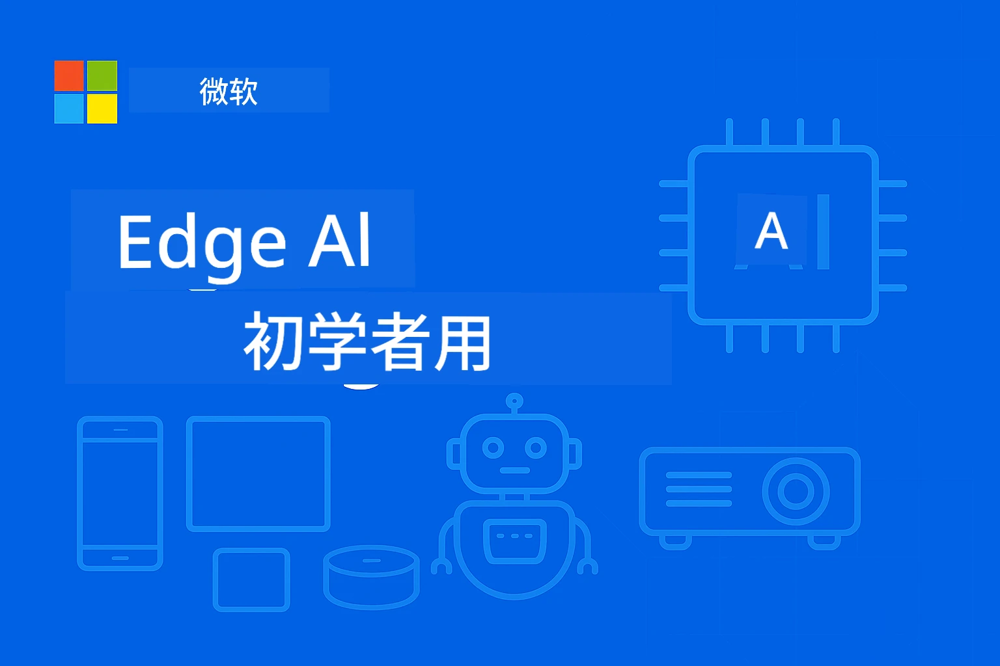

# 面向初学者的边缘人工智能（EdgeAI）




[](https://GitHub.com/microsoft/edgeai-for-beginners/graphs/contributors)
[](https://GitHub.com/microsoft/edgeai-for-beginners/issues)
[](https://GitHub.com/microsoft/edgeai-for-beginners/pulls)
[](http://makeapullrequest.com)

[](https://GitHub.com/microsoft/edgeai-for-beginners/watchers)
[](https://GitHub.com/microsoft/edgeai-for-beginners/fork)
[](https://GitHub.com/microsoft/edgeai-for-beginners/stargazers)


[](https://discord.gg/nTYy5BXMWG)

按照以下步骤开始使用这些资源：

1. **Fork 仓库**：点击 [](https://GitHub.com/microsoft/edgeai-for-beginners/fork)
2. <strong>克隆仓库</strong>：   `git clone https://github.com/microsoft/edgeai-for-beginners.git`
3. [**加入 Azure AI Foundry Discord，与专家和开发者交流**](https://discord.com/invite/ByRwuEEgH4)


### 🌐 多语言支持

#### 通过 GitHub Action 支持（自动且始终保持最新）

<!-- CO-OP TRANSLATOR LANGUAGES TABLE START -->
[阿拉伯语](../ar/README.md) | [孟加拉语](../bn/README.md) | [保加利亚语](../bg/README.md) | [缅甸语](../my/README.md) | [中文（简体）](./README.md) | [中文（繁体，香港）](../zh-HK/README.md) | [中文（繁体，澳门）](../zh-MO/README.md) | [中文（繁体，台湾）](../zh-TW/README.md) | [克罗地亚语](../hr/README.md) | [捷克语](../cs/README.md) | [丹麦语](../da/README.md) | [荷兰语](../nl/README.md) | [爱沙尼亚语](../et/README.md) | [芬兰语](../fi/README.md) | [法语](../fr/README.md) | [德语](../de/README.md) | [希腊语](../el/README.md) | [希伯来语](../he/README.md) | [印地语](../hi/README.md) | [匈牙利语](../hu/README.md) | [印尼语](../id/README.md) | [意大利语](../it/README.md) | [日语](../ja/README.md) | [卡纳达语](../kn/README.md) | [高棉语](../km/README.md) | [韩语](../ko/README.md) | [立陶宛语](../lt/README.md) | [马来语](../ms/README.md) | [马拉雅拉姆语](../ml/README.md) | [马拉地语](../mr/README.md) | [尼泊尔语](../ne/README.md) | [尼日利亚黑话](../pcm/README.md) | [挪威语](../no/README.md) | [波斯语（法尔西语）](../fa/README.md) | [波兰语](../pl/README.md) | [葡萄牙语（巴西）](../pt-BR/README.md) | [葡萄牙语（葡萄牙）](../pt-PT/README.md) | [旁遮普语（古鲁姆奇）](../pa/README.md) | [罗马尼亚语](../ro/README.md) | [俄语](../ru/README.md) | [塞尔维亚语（西里尔文）](../sr/README.md) | [斯洛伐克语](../sk/README.md) | [斯洛文尼亚语](../sl/README.md) | [西班牙语](../es/README.md) | [斯瓦希里语](../sw/README.md) | [瑞典语](../sv/README.md) | [他加禄语（菲律宾语）](../tl/README.md) | [泰米尔语](../ta/README.md) | [泰卢固语](../te/README.md) | [泰语](../th/README.md) | [土耳其语](../tr/README.md) | [乌克兰语](../uk/README.md) | [乌尔都语](../ur/README.md) | [越南语](../vi/README.md)

> **想要本地克隆？**
>
> 本仓库包含 50 多种语言翻译，显著增加下载大小。若想不下载翻译内容，可使用稀疏检出：
>
> **Bash / macOS / Linux:**
> ```bash
> git clone --filter=blob:none --sparse https://github.com/microsoft/edgeai-for-beginners.git
> cd edgeai-for-beginners
> git sparse-checkout set --no-cone '/*' '!translations' '!translated_images'
> ```
>
> **CMD (Windows):**
> ```cmd
> git clone --filter=blob:none --sparse https://github.com/microsoft/edgeai-for-beginners.git
> cd edgeai-for-beginners
> git sparse-checkout set --no-cone "/*" "!translations" "!translated_images"
> ```
>
> 这样可以更快完成课程内容下载。
<!-- CO-OP TRANSLATOR LANGUAGES TABLE END -->

**如果希望支持更多翻译语言，请查看 [这里](https://github.com/Azure/co-op-translator/blob/main/getting_started/supported-languages.md)**
## 简介

欢迎来到 **面向初学者的边缘人工智能（EdgeAI）** —— 您通往边缘人工智能变革世界的全面旅程。本课程连接了强大 AI 能力与边缘设备上的实际部署，让您能够直接在数据产生和决策需要发生的地方，充分利用 AI 的潜力。

### 您将掌握的内容

本课程涵盖基础概念到生产级实现，包括：
- **针对边缘部署优化的小型语言模型（SLMs）**
- <strong>面向多平台的硬件感知优化</strong>
- <strong>具有隐私保护能力的实时推理</strong>
- <strong>企业级生产部署策略</strong>

### 为什么边缘 AI 重要

边缘 AI 是一种范式转变，解决现代关键挑战：
- <strong>隐私与安全</strong>：本地处理敏感数据，无需云端暴露
- <strong>实时性能</strong>：消除网络延迟，应对时间关键应用
- <strong>成本效率</strong>：节省带宽和云计算开销
- <strong>弹性操作</strong>：网络中断时仍保持功能
- <strong>法规遵从</strong>：满足数据主权要求

### 边缘 AI

边缘 AI 指在数据生成地附近的硬件上本地运行 AI 算法与语言模型，无需依赖云资源进行推理。它降低延迟，提升隐私，支持实时决策。

### 核心原则：
- <strong>设备端推理</strong>：AI 模型在边缘设备（手机、路由器、微控制器、工业PC）上运行
- <strong>离线能力</strong>：无需持续联网也能工作
- <strong>低延迟</strong>：即时响应，适合实时系统
- <strong>数据主权</strong>：敏感数据保留在本地，提升安全性和合规性

### 小型语言模型（SLMs）

类似 Phi-4、Mistral-7B 和 Gemma 的 SLM，是大型语言模型（LLMs）的优化版本，经过训练或蒸馏，用于：
- <strong>减少内存占用</strong>：高效利用有限的边缘设备内存
- <strong>降低计算需求</strong>：优化 CPU 和边缘 GPU 性能
- <strong>启动更快</strong>：快速初始化，实现响应迅速的应用

它们为以下设备和场景解锁强大自然语言处理能力，满足限制：
- <strong>嵌入式系统</strong>：物联网设备和工业控制器
- <strong>移动设备</strong>：支持离线能力的智能手机和平板
- <strong>物联网设备</strong>：有限资源的传感器和智能设备
- <strong>边缘服务器</strong>：有限 GPU 资源的本地处理单元
- <strong>个人计算机</strong>：桌面和笔记本部署场景

## 课程模块与导航

| 模块 | 主题 | 关注点 | 主要内容 | 级别 | 时长 |
|--------|-------|------------|-------------|--------|----------|
| [📖 00 ](./introduction.md) | [边缘 AI 介绍](./introduction.md) | 基础与背景 | 边缘 AI 概述 • 行业应用 • SLM 介绍 • 学习目标 | 初学者 | 1-2 小时 |
| [📚 01](../../Module01) | [边缘 AI 基础](./Module01/README.md) | 云端与边缘 AI 对比 | 边缘 AI 基础 • 真实案例 • 实施指南 • 边缘部署 | 初学者 | 3-4 小时 |
| [🧠 02](../../Module02) | [SLM 模型基础](./Module02/README.md) | 模型家族与架构 | Phi 家族 • Qwen 家族 • Gemma 家族 • BitNET • μModel • Phi-Silica | 初学者 | 4-5 小时 |
| [🚀 03](../../Module03) | [SLM 部署实战](./Module03/README.md) | 本地与云端部署 | 高阶学习 • 本地环境 • 云端部署 | 中级 | 4-5 小时 |
| [⚙️ 04](../../Module04) | [模型优化工具包](./Module04/README.md) | 跨平台优化 | 介绍 • Llama.cpp • Microsoft Olive • OpenVINO • Apple MLX • 工作流整合 | 中级 | 5-6 小时 |
| [🔧 05](../../Module05) | [SLMOps 生产运维](./Module05/README.md) | 生产运营 | SLMOps 介绍 • 模型蒸馏 • 微调 • 生产部署 | 高级 | 5-6 小时 |
| [🤖 06](../../Module06) | [AI 代理与功能调用](./Module06/README.md) | 代理框架与 MCP | 代理介绍 • 功能调用 • 模型上下文协议 | 高级 | 4-5 小时 |
| [💻 07](../../Module07) | [平台实现](./Module07/README.md) | 跨平台示例 | AI 工具包 • Foundry 本地 • Windows 开发 | 高级 | 3-4 小时 |
| [🏭 08](../../Module08) | [Foundry 本地工具包](./Module08/README.md) | 生产就绪示例 | 示例应用（详见下方） | 专家级 | 8-10 小时 |

### 🏭 **模块 08：示例应用**

- [01：REST 聊天快速入门](./Module08/samples/01/README.md)
- [02：OpenAI SDK 集成](./Module08/samples/02/README.md)
- [03：模型发现与基准测试](./Module08/samples/03/README.md)
- [04：Chainlit RAG 应用](./Module08/samples/04/README.md)
- [05：多代理编排](./Module08/samples/05/README.md)
- [06：模型即工具路由器](./Module08/samples/06/README.md)
- [07：直接 API 客户端](./Module08/samples/07/README.md)
- [08：Windows 11 聊天应用](./Module08/samples/08/README.md)
- [09：高级多代理系统](./Module08/samples/09/README.md)
- [10：Foundry 工具框架](./Module08/samples/10/README.md)

### 🎓 **工作坊：动手学习路径**

全面的动手工作坊材料，配备生产就绪实现：

- **[工作坊指南](./Workshop/Readme.md)** - 完整的学习目标、成果及资源导航
- **Python 示例**（6 课）- 采用最佳实践、错误处理和全面文档更新
- **Jupyter 笔记本**（8 个交互式）- 逐步教程，含基准和性能监控
- <strong>课程指南</strong> - 每个工作坊课时的详细 Markdown 指南
- <strong>验证工具</strong> - 验证代码质量和进行冒烟测试的脚本

**您将构建的内容：**
- 支持流式传输的本地 AI 聊天应用
- 具备质量评估的 RAG 流水线（RAGAS）
- 多模型基准测试与对比工具
- 多代理编排系统
- 基于任务选择的智能模型路由

### 🎙️ **Agentic 工作坊：动手实践 - AI 播客工作室**
从零开始构建一个由 AI 驱动的播客制作流水线！这个沉浸式研讨会将教你创建一个完整的多代理系统，将创意转化为专业的播客节目。

**[🎬 开始 AI 播客工作室研讨会](./WorkshopForAgentic/README.md)**

<strong>你的任务</strong>：启动“未来字节”——一个完全由你自己构建的 AI 代理驱动的技术播客。无云依赖，无 API 费用——所有内容均在本地电脑运行。

**此课程的独特之处：**
- **🤖 真正的多代理编排** - 构建专门的 AI 代理进行调研、撰写和音频制作
- **🎯 完整的生产流水线** - 从话题选择到最终播客音频输出
- **💻 100% 本地部署** - 使用 Ollama 和本地模型（Qwen-3-8B），保障隐私和完全控制
- **🎤 文本转语音集成** - 将脚本转化为自然的多角色对话
- **✋ 人工干预工作流** - 审核环节确保质量，同时保持自动化

**三幕式学习旅程：**

| 幕   | 重点                             | 关键技能                                           | 时长    |
|-----|--------------------------------|--------------------------------------------------|--------|
| **[第一幕：认识你的 AI 助手](./WorkshopForAgentic/md/01.BuildAIAgentWithSLM.md)** | 构建你的第一个 AI 代理                   | 工具集成 • 网络搜索 • 问题解决 • 代理推理          | 2-3 小时 |
| **[第二幕：组建你的制作团队](./WorkshopForAgentic/md/02.AIAgentOrchestrationAndWorkflows.md)** | 协调整个多代理系统                       | 团队协调 • 审批工作流 • DevUI 界面 • 人工监督      | 3-4 小时 |
| **[第三幕：让你的播客活起来](./WorkshopForAgentic/md/03.Multi-SpeakerPodcastGenerationWithVibeVoice.md)** | 生成播客音频                           | 文本转语音 • 多角色合成 • 长时音频 • 全自动         | 2-3 小时 |

**所用技术：**
- **Microsoft Agent Framework** - 多代理编排与协调
- **Ollama** - 本地 AI 模型运行时（无需云）
- **Qwen-3-8B** - 针对代理任务优化的开源语言模型
- **文本转语音 API** - 用于自然声音合成的播客生成

**硬件支持：**
- ✅ **CPU 模式** - 适用于任何现代计算机（建议 8GB 及以上内存）
- 🚀 **GPU 加速** - 使用 NVIDIA/AMD GPU 显著加速推理
- ⚡ **NPU 支持** - 下一代神经处理单元加速

**适合人群：**
- 学习多代理 AI 系统的开发者
- 对 AI 自动化和工作流感兴趣的任何人
- 探索 AI 辅助内容制作的创作者
- 学习实用 AI 编排模式的学生

<strong>开始构建</strong>：[🎙️ AI 播客工作室研讨会 →](./WorkshopForAgentic/README.md)

### 📊 <strong>学习路径总结</strong>
- <strong>总时长</strong>：36-45 小时
- <strong>初学者路径</strong>：模块 01-02（7-9 小时）  
- <strong>中级路径</strong>：模块 03-04（9-11 小时）
- <strong>高级路径</strong>：模块 05-07（12-15 小时）
- <strong>专家路径</strong>：模块 08（8-10 小时）

## 你将构建的内容

### 🎯 核心能力
- **边缘 AI 架构**：设计以本地优先、云集成的 AI 系统
- <strong>模型优化</strong>：量化和压缩模型以用于边缘部署（速度提升85%，大小减小75%）
- <strong>多平台部署</strong>：支持 Windows、移动、嵌入式及云边混合系统
- <strong>生产运维</strong>：边缘 AI 的监控、扩展和维护

### 🏗️ 实践项目
- **Foundry 本地聊天应用**：Windows 11 原生应用，支持模型切换
- <strong>多代理系统</strong>：协调员与专家代理完成复杂工作流  
- **RAG 应用**：本地文档处理与向量搜索
- <strong>模型路由器</strong>：基于任务分析智能选择模型
- **API 框架**：具备流式传输和健康监控的生产级客户端
- <strong>跨平台工具</strong>：LangChain / Semantic Kernel 集成方案

### 🏢 行业应用
<strong>制造业</strong> • <strong>医疗健康</strong> • <strong>自动驾驶</strong> • <strong>智慧城市</strong> • <strong>移动应用</strong>

## 快速开始

<strong>推荐学习路径</strong>（共计 20-30 小时）：

0. **📖 介绍** ([Introduction.md](./introduction.md))：EdgeAI 基础 + 行业背景 + 学习框架
1. **📚 基础**（模块 01-02）：EdgeAI 概念 + SLM 模型家族
2. **⚙️ 优化**（模块 03-04）：部署 + 量化框架  
3. **🚀 生产**（模块 05-06）：SLMOps + AI 代理 + 函数调用
4. **💻 实现**（模块 07-08）：平台示例 + Foundry 本地工具包

每个模块包含理论、动手练习及生产级代码示例。

## 职业影响

<strong>技术岗位</strong>：边缘 AI 解决方案架构师 • ML 工程师（边缘）• 物联网 AI 开发者 • 移动 AI 开发者

<strong>行业领域</strong>：制造 4.0 • 医疗科技 • 自动驾驶系统 • 金融科技 • 消费电子

<strong>作品集项目</strong>：多代理系统 • 生产级 RAG 应用 • 跨平台部署 • 性能优化

## 仓库结构

```
edgeai-for-beginners/
├── 📖 introduction.md  # Foundation: EdgeAI Overview & Learning Framework
├── 📚 Module01-04/     # Fundamentals → SLMs → Deployment → Optimization  
├── 🔧 Module05-06/     # SLMOps → AI Agents → Function Calling
├── 💻 Module07/        # Platform Samples (VS Code, Windows, Jetson, Mobile)
├── 🏭 Module08/        # Foundry Local Toolkit + 10 Comprehensive Samples
│   ├── samples/01-06/  # Foundation: REST, SDK, RAG, Agents, Routing
│   └── samples/07-10/  # Advanced: API Client, Windows App, Enterprise Agents, Tools
├── 🌐 translations/    # Multi-language support (8+ languages)
└── 📋 STUDY_GUIDE.md   # Structured learning paths & time allocation
```

## 课程亮点

✅ <strong>渐进式学习</strong>：理论 → 实践 → 生产部署  
✅ <strong>真实案例</strong>：微软、日本航空、企业实施案例  
✅ <strong>动手示例</strong>：50+ 代码示例，10 个完整 Foundry 本地演示  
✅ <strong>性能优化</strong>：85% 提速，75% 缩减大小  
✅ <strong>多平台支持</strong>：Windows、移动、嵌入式、云边混合  
✅ <strong>生产就绪</strong>：监控、扩展、安全、合规框架

📖 **[学习指南可用](STUDY_GUIDE.md)**：结构化 20 小时学习路径，含时间分配和自我评估工具。

---

**EdgeAI 代表 AI 部署的未来**：以本地为先，隐私保护，高效。掌握这些技能，打造下一代智能应用。

## 其它课程

我们的团队还制作了其他课程！请查看：

<!-- CO-OP TRANSLATOR OTHER COURSES START -->
### LangChain
[](https://aka.ms/langchain4j-for-beginners)
[](https://aka.ms/langchainjs-for-beginners?WT.mc_id=m365-94501-dwahlin)
[](https://github.com/microsoft/langchain-for-beginners?WT.mc_id=m365-94501-dwahlin)
---

### Azure / Edge / MCP / Agents
[](https://github.com/microsoft/AZD-for-beginners?WT.mc_id=academic-105485-koreyst)
[](https://github.com/microsoft/edgeai-for-beginners?WT.mc_id=academic-105485-koreyst)
[](https://github.com/microsoft/mcp-for-beginners?WT.mc_id=academic-105485-koreyst)
[](https://github.com/microsoft/ai-agents-for-beginners?WT.mc_id=academic-105485-koreyst)

---
 
### 生成式 AI 系列
[](https://github.com/microsoft/generative-ai-for-beginners?WT.mc_id=academic-105485-koreyst)
[-9333EA?style=for-the-badge&labelColor=E5E7EB&color=9333EA)](https://github.com/microsoft/Generative-AI-for-beginners-dotnet?WT.mc_id=academic-105485-koreyst)
[-C084FC?style=for-the-badge&labelColor=E5E7EB&color=C084FC)](https://github.com/microsoft/generative-ai-for-beginners-java?WT.mc_id=academic-105485-koreyst)
[-E879F9?style=for-the-badge&labelColor=E5E7EB&color=E879F9)](https://github.com/microsoft/generative-ai-with-javascript?WT.mc_id=academic-105485-koreyst)

---
 
### 核心学习
[](https://aka.ms/ml-beginners?WT.mc_id=academic-105485-koreyst)
[](https://aka.ms/datascience-beginners?WT.mc_id=academic-105485-koreyst)
[](https://aka.ms/ai-beginners?WT.mc_id=academic-105485-koreyst)
[](https://github.com/microsoft/Security-101?WT.mc_id=academic-96948-sayoung)
[](https://aka.ms/webdev-beginners?WT.mc_id=academic-105485-koreyst)
[](https://aka.ms/iot-beginners?WT.mc_id=academic-105485-koreyst)
[](https://github.com/microsoft/xr-development-for-beginners?WT.mc_id=academic-105485-koreyst)

---
 
### Copilot 系列

[](https://aka.ms/GitHubCopilotAI?WT.mc_id=academic-105485-koreyst)
[](https://github.com/microsoft/mastering-github-copilot-for-dotnet-csharp-developers?WT.mc_id=academic-105485-koreyst)
[](https://github.com/microsoft/CopilotAdventures?WT.mc_id=academic-105485-koreyst)
<!-- CO-OP TRANSLATOR OTHER COURSES END -->

## 获取帮助

如果你遇到困难或对构建 AI 应用有任何疑问，请加入：

[](https://discord.gg/nTYy5BXMWG)

如果你有产品反馈或在构建过程中遇到错误，请访问：

[](https://aka.ms/foundry/forum)

---

<!-- CO-OP TRANSLATOR DISCLAIMER START -->
**免责声明**：
本文件已使用 AI 翻译服务 [Co-op Translator](https://github.com/Azure/co-op-translator) 进行翻译。虽然我们力求准确，但请注意，自动翻译可能包含错误或不准确之处。原文的母语版本应被视为权威来源。对于关键信息，建议使用专业人工翻译。对于因使用本翻译而产生的任何误解或错误解释，我们概不负责。
<!-- CO-OP TRANSLATOR DISCLAIMER END -->