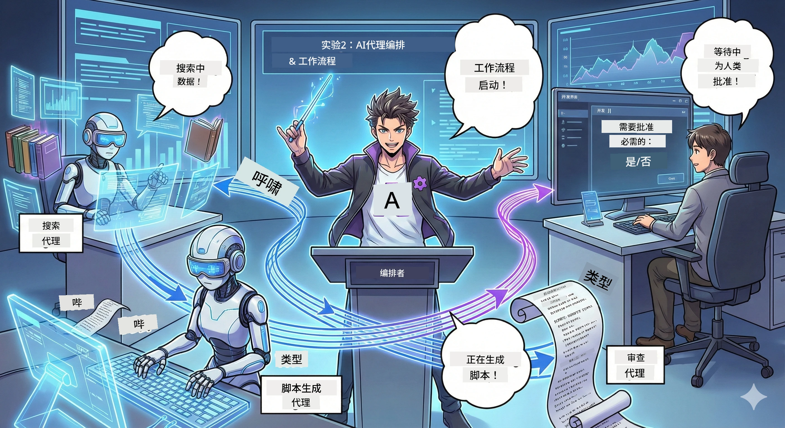

# 第二幕：组建您的播客制作团队 🎬



## 情节发展

Alex（第一幕中的您的 AI 助手）很棒，但一个代理无法运行整个播客工作室。您需要一个*团队*：
- 🔍 **研究代理**：在互联网上搜寻最新信息
- ✍️ **脚本代理**：将调研转化为引人入胜的对话
- 👤 **您（编辑）**：批准脚本或退回重写

欢迎来到**AI 代理编排**——在这里，您成为自己 AI 团队的导演。想象复仇者联盟，但专注于播客制作。

## 什么是代理编排？（简单版）

想象您经营一家餐厅。您不会亲力亲为所有事情，对吧？您有：
- 🍳 一位主厨负责烹饪
- 👨‍🍳 一位副厨负责准备
- 👩‍🍳 一位服务员负责送餐

代理编排的理念类似，但对象是 AI。每个代理各司其职，您协调他们以实现更大目标。没有单个代理被压垮，工作完成得更快。

### 乐队类比 🎸

您的 AI 代理就像一个乐队：
- **主唱**：主要负责客户交互任务
- **鼓手**：保持节奏，处理后台任务  
- **贝斯手**：支持大家，获取数据
- **您（乐队经理）**：协调一切！

没有协调？就是噪音。有了编排？就是美妙的音乐。

### 为什么这很重要

让一个 AI 代理尝试处理一切 = 精疲力竭。专业化代理协作 = 释放效率！🚀

**实话实说**：还记得尝试独自进行调研、写作和编辑播客时的痛苦吗？很糟糕。通过编排，每个代理负责擅长的部分。您只需做最终决定。

**现实示例**：会判断处理账单问题、技术问题，还是转给人工客服的客户支持机器人。这就是编排！

## 代理 vs. 工作流：有什么区别？

这样理解：

### 🤖 AI 代理 = 爵士乐手
- **根据听到的内容即兴决策**
- **临时发挥**其工具解决方案
- **用大型语言模型思考**
- **适应**您抛来的任何挑战

### 🎵 工作流 = 古典乐团
- **遵循谱子**（预定义步骤）
- **执行路径可预期**
- **协调**多个代理、人员和系统
- **结构**如同食谱

**魔力所在**：工作流*编排*代理！您构建工作流，告诉代理何时出场。两全其美。🎭

## 协调您 AI 团队的三种方式

### 1. 🎯 集中式（您是老板）

一位主代理负责所有决策。就像您管理团队－决定谁做什么、何时做。

**优点**：
- ✅ 领导明确（没有混淆）
- ✅ 决策一致
- ✅ 易于调试

**适用场景**：
- 客服路由（“这是账单问题还是技术支持？”）
- 内容审批工作流（“这份脚本通过了吗？”）
- 播客制作（正是我们正在构建的！）

### 2. 🤝 去中心化（代理自组织）

代理之间直接交流，共同协商。像群聊，每个人协调分工。

**优点**：
- ✅ 易扩展（随时添加代理）
- ✅ 无单点故障
- ✅ 代理天然协作

**适用场景**：
- 研究团队（各代理调查不同来源）
- 头脑风暴
- 分布式问题解决

### 3. 🔀 混合模式（两者兼得）

您设定总体方向，代理对任务有自由空间自组织。像信任团队的 CEO。

**适合于**：既需要控制又需灵活的复杂项目。

## Microsoft 代理框架：您的编排工具箱 🧰

开始构建！您将使用：

### 构建模块

#### 1. 🧱 执行器（您的工人）
- **定义**：独立处理单元——可为代理或自定义逻辑
- **作用**：接收输入，执行任务，生成输出
- **形象比喻**：装配线上的工作站

#### 2. ➡️ 边（连接线）
- **定义**：执行器之间的路径
- **作用**：控制消息流向（“先A后B”）
- **比喻为**：流程图中的箭头

#### 3. 🗺️ 工作流（总体规划）
- **定义**：执行器+边的完整图
- **作用**：定义从开始到结束的全过程
- **形象比喻**：您的生产流程蓝图

### 您会喜欢的酷功能

**🛡️ 类型安全**：代理间消息经过类型检查，杜绝“哎呀，数据类型错了”的惊喜。

**🔀 灵活路由**：
- 条件判断（“如果批准，就发布；否则重写”）
- 并行处理（多个代理同时工作）
- 动态路径（根据结果自动调整工作流）

**🔌 外部集成**：
- 连接 API
- 添加人工干预点（发布前您批准）
- 构建请求/响应流程

**💾 检查点功能**：保存进度！出现故障可以从断点继续。

**🤝 多代理协调**：
- 依次运行代理（A → B → C）
- 并行运行（A + B + C）
- 代理间交接
- 协作处理

## 最佳实践（专业提示）🎯

### 1. 保持模块化
每个代理专注做好一件事。别做“万能代理”——调试时会很后悔。

### 2. 预备故障
代理会出错，网络会失败。建立错误处理和备用方案。未来的您会感谢现在的自己。

### 3. 全面监测
追踪代理表现。利用 DevUI（后面介绍）观察工作流实际运行。

### 4. 优化消息大小
别在代理间传递巨量文件。保持消息轻量，以提升速度。

### 5. 选对模式
要控制？用集中式。要扩展？用去中心化。拿不定主意？用混合式！

## DevUI：您的工作流调试器 🔍

### 什么是 DevUI？

DevUI 是测试您的代理和工作流的游乐场。网页界面，您能：
- 👀 实时观看工作流运行
- 💬 直接与代理聊天
- 🔍 出错时调试
- 📊 查看追踪信息和性能指标

> **重要提示**：DevUI 仅供开发使用！不要在生产环境部署。把它当作本地测试环境。

### 它有多棒

- **🖥️ 交互式网页 UI**：点击、输入、测试，无需命令行
- **📁 拖拽上传**：上传文件，测试不同输入
- **📂 自动发现**：指定文件夹，自动识别所有代理
- **📋 零配置模式**：可用代码注册代理，无需文件夹结构
- **🔌 支持 OpenAI**：兼容 OpenAI SDK（兼容性王道！）
- **👁️ 内置追踪**：查看代理做了什么，步骤一览无遗

### 输入机制

DevUI 输入非常智能：

- **测试代理？** 提供文本框和上传按钮
- **测试工作流？** 根据预期自动生成输入字段

如魔法般简便，实际上是优秀代码。✨

## 您的任务：构建播客工作室 🎬

### 任务 1：用 DevUI 创建单个代理

📂 [01.AgentDevUI](../../../../WorkshopForAgentic/code/02.Workflow/01.AgentDevUI)

**挑战**：构建完整团队前，先用一个代理测试 DevUI：网络搜索专家。

**构建内容**：
一个研究代理，能搜索播客话题。使用 DevUI 的网页界面（`http://localhost:8090`）测试。

**学习技能**：
- 🚀 启动代理于 DevUI
- 🔍 实时测试代理响应
- 🛠️ 构建自定义工具（网络搜索）
- 📊 开启追踪调试
- 🖥️ 使用交互网页 UI

**代码说明**：
- `agent.py`：拥有网络搜索超能力的 SearchAgent
- 用 OllamaChatClient 连接 Qwen
- 实现 `web_search()` 工具函数
- 用 `serve()` 启动，自动打开 DevUI

**胜利条件**：问代理“AI 领域哪些话题正在流行？”看它如何搜索网络！🎉

### 任务 2：构建多代理工作流

📂 [02.WorkflowDevUI](../../../../WorkshopForAgentic/code/02.Workflow/02.WorkflowDevUI)

**挑战**：现在开始真正的乐趣！构建完整播客制作工作流：
1. 🔍 **搜索代理** → 调研话题
2. ✍️ **脚本代理** → 编写两位主持人的中文对话
3. 👤 **审查执行器** → 请求您批准或拒绝
4. 🔄 **循环回退** → 若拒绝，根据反馈重写

**学习技能**：
- 🧱 为不同任务创建专精代理
- 🔗 用 WorkflowBuilder 连接代理
- 🔀 实现审批循环（人工干预）
- 🚦 条件路由（批准 vs 拒绝）
- 🔧 构建自定义执行器处理业务逻辑

**工作流**：
```
SearchAgent → ScriptAgent → ReviewExecutor
                             ↑          ↓ (if rejected)
                             ←─────────
```

**代码说明**：
- `search_agent/agent.py`：您的研究专家
- `generate_script_agent/agent.py`：脚本作者（中文写作！）
- `workflow/workflow.py`：编排魔法发生地
- `main.py`：在 DevUI 启动所有

**胜利条件**：给出话题，审核脚本，测试一次拒绝再批准！🎉

### 任务 3：构建控制台应用

📂 [03.Application](../../../../WorkshopForAgentic/code/02.Workflow/03.Application)

**挑战**：将您的 DevUI 工作流变成炫酷终端应用，带有彩色输出、加载指示器和文件保存。准备投入生产！

**学习技能**：
- ⚡ 编程方式运行工作流（无需 DevUI）
- 📡 事件驱动架构和流式处理
- 🎨 创造美观终端界面（颜色，指示器，进度条）
- 💾 保存最终脚本为文件
- 🔄 用 Python asyncio 处理异步工作流

**功能**：
1. 询问您播客话题
2. 实时展示进度（“搜索代理正在工作...”）
3. 显示带颜色的生成脚本
4. 请求您的批准
5. 保存获得批准的脚本到 `podcast.txt`

**代码**：
- `podcast_app.py`：主应用，处理事件
- `workflow.py`：复用第二任务中的工作流
- 事件处理：`AgentRunUpdateEvent`、`RequestInfoEvent`、`WorkflowOutputEvent`
- 使用 ANSI 色彩美化终端

**胜利条件**：运行应用，创建播客脚本并保存！您已构建真实工具。🚀

## 您已掌握的技能 🏆

完成第二幕后，您可以：

- ✅ 像老板一样编排多个 AI 代理
- ✅ 构建顺序和条件逻辑工作流
- ✅ 添加人工审批检查点
- ✅ 使用 DevUI 测试和调试工作流
- ✅ 创建生产级控制台应用
- ✅ 优雅应对复杂系统错误
- ✅ 为任何项目选择合适的编排模式

## 遇到问题怎么办 🔧

### “我的工作流太复杂了！”
**解决方法**：拆分为更小子工作流。每个工作流只做好一件事，必要时链式组合。

### “我搞不清进展！”
**解决方法**：使用工作流检查点保存状态。开启 DevUI 追踪查看每一步。

### “某代理出错导致整个流程崩溃！”
**解决方法**：添加错误边界。让每个代理处理自身失败并设应急方案。

### “好慢啊”
**解决方法**：看看哪些代理能并行运行？顺序工作流简单但慢。尽量并行化！

## 有用资源 🔗

- [工作流文档](https://learn.microsoft.com/en-us/agent-framework/user-guide/workflows/overview) — 官方微软指南
- [编排模式](https://www.ibm.com/think/topics/ai-agent-orchestration) — IBM 解析
- [Agent Framework GitHub](https://github.com/microsoft/agent-framework) — 源码浏览
- [代码示例](https://github.com/microsoft/agent-framework/tree/main/python/samples) — 从这里借鉴模式

---

**准备好迎接终章了吗？** 你已经有了脚本。现在让我们把它变成真正的音频！→ [第3幕：让你的播客生动起来](03.Multi-SpeakerPodcastGenerationWithVibeVoice.md) 🎤

---

**卡住了吗？困惑吗？兴奋吗？** 在工作坊聊天室分享吧！我们一起学习。🚀

---

<!-- CO-OP TRANSLATOR DISCLAIMER START -->
**免责声明**：
本文件由人工智能翻译服务 [Co-op Translator](https://github.com/Azure/co-op-translator) 翻译。虽然我们努力确保准确性，但请注意，自动翻译可能包含错误或不准确之处。原始语言的文档应视为权威来源。对于重要信息，建议使用专业人工翻译。对于因使用本翻译而产生的任何误解或误释，我们概不负责。
<!-- CO-OP TRANSLATOR DISCLAIMER END -->