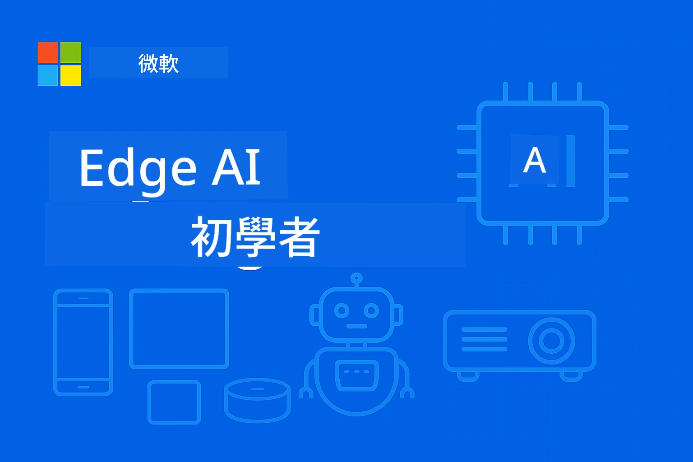

# EdgeAI 初學者指南




[](https://GitHub.com/microsoft/edgeai-for-beginners/graphs/contributors)
[](https://GitHub.com/microsoft/edgeai-for-beginners/issues)
[](https://GitHub.com/microsoft/edgeai-for-beginners/pulls)
[](http://makeapullrequest.com)

[](https://GitHub.com/microsoft/edgeai-for-beginners/watchers)
[](https://GitHub.com/microsoft/edgeai-for-beginners/fork)
[](https://GitHub.com/microsoft/edgeai-for-beginners/stargazers)


[](https://discord.gg/nTYy5BXMWG)

按以下步驟開始使用這些資源：

1. **Fork 儲存庫**：點擊 [](https://GitHub.com/microsoft/edgeai-for-beginners/fork)
2. <strong>複製儲存庫</strong>：   `git clone https://github.com/microsoft/edgeai-for-beginners.git`
3. [**加入 Azure AI Foundry Discord，認識專家及其他開發者**](https://discord.com/invite/ByRwuEEgH4)


### 🌐 多語言支援

#### 透過 GitHub Action 支援（自動且始終保持最新）

<!-- CO-OP TRANSLATOR LANGUAGES TABLE START -->
[阿拉伯語](../ar/README.md) | [孟加拉語](../bn/README.md) | [保加利亞語](../bg/README.md) | [緬甸語 (Myanmar)](../my/README.md) | [中文 (簡體)](../zh-CN/README.md) | [中文 (繁體，香港)](./README.md) | [中文 (繁體，澳門)](../zh-MO/README.md) | [中文 (繁體，台灣)](../zh-TW/README.md) | [克羅地亞語](../hr/README.md) | [捷克語](../cs/README.md) | [丹麥語](../da/README.md) | [荷蘭語](../nl/README.md) | [愛沙尼亞語](../et/README.md) | [芬蘭語](../fi/README.md) | [法語](../fr/README.md) | [德語](../de/README.md) | [希臘語](../el/README.md) | [希伯來語](../he/README.md) | [印地語](../hi/README.md) | [匈牙利語](../hu/README.md) | [印尼語](../id/README.md) | [意大利語](../it/README.md) | [日語](../ja/README.md) | [坎納達語](../kn/README.md) | [高棉語](../km/README.md) | [韓語](../ko/README.md) | [立陶宛語](../lt/README.md) | [馬來語](../ms/README.md) | [馬拉雅拉姆語](../ml/README.md) | [馬拉地語](../mr/README.md) | [尼泊爾語](../ne/README.md) | [奈及利亞皮欽語](../pcm/README.md) | [挪威語](../no/README.md) | [波斯語 (法爾西)](../fa/README.md) | [波蘭語](../pl/README.md) | [葡萄牙語 (巴西)](../pt-BR/README.md) | [葡萄牙語 (葡萄牙)](../pt-PT/README.md) | [旁遮普語 (Gurmukhi)](../pa/README.md) | [羅馬尼亞語](../ro/README.md) | [俄語](../ru/README.md) | [塞爾維亞語 (西里爾字母)](../sr/README.md) | [斯洛伐克語](../sk/README.md) | [斯洛維尼亞語](../sl/README.md) | [西班牙語](../es/README.md) | [斯瓦希里語](../sw/README.md) | [瑞典語](../sv/README.md) | [他加祿語 (菲律賓語)](../tl/README.md) | [泰米爾語](../ta/README.md) | [泰盧固語](../te/README.md) | [泰語](../th/README.md) | [土耳其語](../tr/README.md) | [烏克蘭語](../uk/README.md) | [烏爾都語](../ur/README.md) | [越南語](../vi/README.md)

> **偏好本機複製？**
>
> 本儲存庫包含 50 多種語言翻譯，會顯著增加下載大小。若想複製時不包含翻譯，請使用稀疏檢出：
>
> **Bash / macOS / Linux:**
> ```bash
> git clone --filter=blob:none --sparse https://github.com/microsoft/edgeai-for-beginners.git
> cd edgeai-for-beginners
> git sparse-checkout set --no-cone '/*' '!translations' '!translated_images'
> ```
>
> **CMD (Windows):**
> ```cmd
> git clone --filter=blob:none --sparse https://github.com/microsoft/edgeai-for-beginners.git
> cd edgeai-for-beginners
> git sparse-checkout set --no-cone "/*" "!translations" "!translated_images"
> ```
>
> 這樣能更快速完成課程所需的所有內容下載。
<!-- CO-OP TRANSLATOR LANGUAGES TABLE END -->

**若您希望支援額外的翻譯語言，請參考 [此處](https://github.com/Azure/co-op-translator/blob/main/getting_started/supported-languages.md)**
## 介紹

歡迎使用 **EdgeAI 初學者指南** — 一條帶你深入變革性邊緣人工智能世界的完整學習路線。本課程彌合強大 AI 能力與邊緣設備實際部署的鴻溝，讓你能直接在數據生成和決策所需之處，充分發揮 AI 潛力。

### 你將掌握的內容

本課程從基礎觀念到可投入生產的實現，涵蓋：
- **針對邊緣部署優化的小型語言模型 (SLMs)**
- <strong>多平台的硬體感知優化</strong>
- <strong>具備隱私保護功能的即時推論</strong>
- <strong>企業應用的生產部署策略</strong>

### 為什麼 EdgeAI 重要

Edge AI 代表了解決現代關鍵挑戰的範式轉移：
- <strong>隱私與安全</strong>：在本地處理敏感數據，無需將資料暴露於雲端
- <strong>即時效能</strong>：消除針對時間關鍵應用的網絡延遲
- <strong>成本效益</strong>：降低頻寬和雲端運算費用
- <strong>韌性操作</strong>：在網絡中斷時仍維持功能
- <strong>符合法規要求</strong>：遵守資料主權規定

### 邊緣人工智能介紹

邊緣 AI 指在靠近數據產生地點的硬體上本地運行 AI 演算法和語言模型，不依賴雲端資源進行推論。它能降低延遲、提升隱私，並實現即時決策。

### 核心原則：
- <strong>設備端推論</strong>：AI 模型在邊緣設備（手機、路由器、微控制器、工業 PC）上運行
- <strong>離線能力</strong>：在無持續網路連接下仍能工作
- <strong>低延遲</strong>：即時回應，適用於即時系統
- <strong>數據主權</strong>：將敏感資料留在本地，提高安全與合規

### 小型語言模型 (SLMs)

像 Phi-4、Mistral-7B 和 Gemma 等 SLM 是大型語言模型的優化版本—經過訓練或蒸餾以實現：
- <strong>降低記憶體占用</strong>：有效利用有限邊緣裝置的記憶體
- <strong>減少運算需求</strong>：針對 CPU 和邊緣 GPU 做效能優化
- <strong>更快啟動時間</strong>：快速初始化以提升響應速度

它們在滿足以下限制條件下，開啟強大 NLP 功能：
- <strong>嵌入式系統</strong>：物聯網裝置與工業控制器
- <strong>行動裝置</strong>：具離線功能的智慧手機和平板
- <strong>物聯網設備</strong>：資源有限的傳感器與智慧設備
- <strong>邊緣伺服器</strong>：具有限制 GPU 資源的本地處理單元
- <strong>個人電腦</strong>：桌面及筆電部署環境

## 課程模組與導航

| 模組 | 主題 | 焦點領域 | 主要內容 | 等級 | 時長 |
|--------|-------|------------|-------------|--------|----------|
| [📖 00 ](./introduction.md) | [EdgeAI 介紹](./introduction.md) | 基礎與背景 | EdgeAI 概述 • 產業應用 • SLM 介紹 • 學習目標 | 初學者 | 1-2 小時 |
| [📚 01](../../Module01) | [EdgeAI 基礎](./Module01/README.md) | 雲端 vs 邊緣 AI 比較 | EdgeAI 基礎 • 真實案例研究 • 實作指南 • 邊緣部署 | 初學者 | 3-4 小時 |
| [🧠 02](../../Module02) | [SLM 模型基礎](./Module02/README.md) | 模型系列與架構 | Phi 系列 • Qwen 系列 • Gemma 系列 • BitNET • μModel • Phi-Silica | 初學者 | 4-5 小時 |
| [🚀 03](../../Module03) | [SLM 部署實務](./Module03/README.md) | 本地與雲端部署 | 進階學習 • 本地環境 • 雲端部署 | 中階 | 4-5 小時 |
| [⚙️ 04](../../Module04) | [模型優化工具包](./Module04/README.md) | 跨平台優化 | 介紹 • Llama.cpp • Microsoft Olive • OpenVINO • Apple MLX • 工作流程合成 | 中階 | 5-6 小時 |
| [🔧 05](../../Module05) | [SLMOps 生產運維](./Module05/README.md) | 生產運維 | SLMOps 介紹 • 模型蒸餾 • 微調 • 生產部署 | 高階 | 5-6 小時 |
| [🤖 06](../../Module06) | [AI 代理人與函式呼叫](./Module06/README.md) | 代理人框架與 MCP | 代理人介紹 • 函式呼叫 • 模型上下文協定 | 高階 | 4-5 小時 |
| [💻 07](../../Module07) | [平台實作](./Module07/README.md) | 跨平台範例 | AI 工具包 • Foundry Local • Windows 開發 | 高階 | 3-4 小時 |
| [🏭 08](../../Module08) | [Foundry Local 工具包](./Module08/README.md) | 生產就緒範例 | 範例應用程式（詳情見下） | 專家 | 8-10 小時 |

### 🏭 **模組 08：範例應用程式**

- [01：REST Chat 快速入門](./Module08/samples/01/README.md)
- [02：OpenAI SDK 整合](./Module08/samples/02/README.md)
- [03：模型探索與基準測試](./Module08/samples/03/README.md)
- [04：Chainlit RAG 應用](./Module08/samples/04/README.md)
- [05：多代理協調](./Module08/samples/05/README.md)
- [06：模型即工具路由器](./Module08/samples/06/README.md)
- [07：直接 API 用戶端](./Module08/samples/07/README.md)
- [08：Windows 11 聊天應用](./Module08/samples/08/README.md)
- [09：進階多代理系統](./Module08/samples/09/README.md)
- [10：Foundry 工具框架](./Module08/samples/10/README.md)

### 🎓 **工作坊：實作學習路徑**

全面的實作工作坊教材，包含生產就緒實現：

- **[工作坊指南](./Workshop/Readme.md)** — 完整學習目標、成果與資源導航
- **Python 範例** (6 節) — 更新為最佳實務、錯誤處理與完整文件
- **Jupyter 筆記本** (8 個互動式) — 步驟導引教程，含基準與效能監控
- <strong>課程指南</strong> — 每節工作坊詳細的 markdown 指南
- <strong>驗證工具</strong> — 用於檢查程式碼品質及執行煙霧測試的腳本

**你將實作：**
- 具串流支援的本地 AI 聊天應用
- 具質量評估功能的 RAG 管線 (RAGAS)
- 多模型基準測試與比較工具
- 多代理協調系統
- 以任務為基礎的智慧模型路由

### 🎙️ **Agentic 工作坊：實作 - AI 播客工作室**
從零開始構建由 AI 驅動的播客製作流程！這個沉浸式工作坊將教你如何創建一整套多智能體系統，將想法轉化為專業播客節目。

**[🎬 開始 AI 播客工作室工作坊](./WorkshopForAgentic/README.md)**

<strong>你的任務</strong>：推出「Future Bytes」— 一個完全由你自己構建的 AI 智能體驅動的科技播客。無需雲端依賴，無 API 費用 — 一切在你的本地機器上運行。

**這個工作坊的獨特之處：**
- **🤖 真正的多智能體協調** — 建立專門的 AI 智能體，進行研究、撰寫和音頻製作
- **🎯 完整製作流程** — 從主題選擇到最終播客音頻輸出
- **💻 100% 本地部署** — 使用 Ollama 和本地模型（Qwen-3-8B）確保完整隱私與控制
- **🎤 文字轉語音整合** — 將稿件轉化為自然的多說話者對話音頻
- **✋ 人工監督工作流** — 審核關卡確保品質，同時維持自動化

**三幕學習旅程：**

| 幕 | 焦點 | 主要技能 | 時長 |
|-----|-------|------------|----------|
| **[第一幕：認識你的 AI 助手](./WorkshopForAgentic/md/01.BuildAIAgentWithSLM.md)** | 建立你的第一個 AI 智能體 | 工具整合 • 網路搜尋 • 問題解決 • 智能體推理 | 2-3 小時 |
| **[第二幕：組建你的製作團隊](./WorkshopForAgentic/md/02.AIAgentOrchestrationAndWorkflows.md)** | 協調多個智能體 | 團隊協作 • 審批工作流 • DevUI 介面 • 人工監督 | 3-4 小時 |
| **[第三幕：讓你的播客活起來](./WorkshopForAgentic/md/03.Multi-SpeakerPodcastGenerationWithVibeVoice.md)** | 生成播客音頻 | 文本轉語音 • 多說話者合成 • 長音頻 • 全自動化 | 2-3 小時 |

**使用技術：**
- **Microsoft Agent Framework** — 多智能體協調與配合
- **Ollama** — 本地 AI 模型執行環境（無需雲端）
- **Qwen-3-8B** — 為智能體任務優化的開源語言模型
- **文字轉語音 API** — 用於播客生成的自然語音合成

**硬件支持：**
- ✅ **CPU 模式** — 支援任何現代電腦（建議 8GB+ RAM）
- 🚀 **GPU 加速** — 使用 NVIDIA/AMD GPU 顯著提升推理速度
- ⚡ **NPU 支援** — 次世代神經網路處理器加速

**非常適合：**
- 學習多智能體 AI 系統的開發者
- 對 AI 自動化和工作流程感興趣的人士
- 探索 AI 協助製作的內容創作者
- 研究實用 AI 協調模式的學生

<strong>開始構建</strong>：[🎙️ AI 播客工作室工作坊 →](./WorkshopForAgentic/README.md)

### 📊 <strong>學習路徑摘要</strong>
- <strong>總時長</strong>：36-45 小時
- <strong>初學者路徑</strong>：模組 01-02（7-9 小時）  
- <strong>中階路徑</strong>：模組 03-04（9-11 小時）
- <strong>高階路徑</strong>：模組 05-07（12-15 小時）
- <strong>專家路徑</strong>：模組 08（8-10 小時）

## 你將學會構建

### 🎯 核心能力
- **邊緣 AI 架構**：設計本地優先並兼顧雲端整合的 AI 系統
- <strong>模型優化</strong>：量化與壓縮模型以適合邊緣部署（提升 85% 速度，縮小 75% 尺寸）
- <strong>多平台部署</strong>：Windows、手機、嵌入式及雲-邊緣混合系統
- <strong>生產運維</strong>：監控、擴展與維護邊緣 AI 的生產環境

### 🏗️ 實作項目
- **Foundry 本地聊天應用**：Windows 11 原生應用，帶模型切換功能
- <strong>多智能體系統</strong>：協調員與專家智能體處理複雜工作流程  
- **RAG 應用**：本地文件處理與向量搜尋
- <strong>模型路由器</strong>：基於任務分析智能選擇模型
- **API 框架**：生產級客戶端，支持串流與健康監控
- <strong>跨平台工具</strong>：LangChain/Semantic Kernel 整合範式

### 🏢 行業應用
<strong>製造業</strong> • <strong>醫療保健</strong> • <strong>自動駕駛車輛</strong> • <strong>智慧城市</strong> • <strong>手機應用</strong>

## 快速入門

<strong>推薦學習路徑</strong>（共 20-30 小時）：

0. **📖 介紹** ([Introduction.md](./introduction.md))：邊緣 AI 基礎 + 行業背景 + 學習架構
1. **📚 基礎**（模組 01-02）：邊緣 AI 概念 + SLM 模型家族
2. **⚙️ 優化**（模組 03-04）：部署 + 量化框架  
3. **🚀 生產**（模組 05-06）：SLMOps + AI 智能體 + 函數調用
4. **💻 實作**（模組 07-08）：平台示例 + Foundry 本地工具包

每個模組包含理論、實作練習和可用於生產的程式碼範例。

## 職涯影響

<strong>技術角色</strong>：邊緣 AI 解決方案架構師 • 邊緣機器學習工程師 • 物聯網 AI 開發者 • 移動 AI 開發者

<strong>行業領域</strong>：製造 4.0 • 醫療技術 • 自主系統 • 金融科技 • 消費電子

<strong>作品集項目</strong>：多智能體系統 • 生產 RAG 應用 • 跨平台部署 • 性能優化

## 儲存庫結構

```
edgeai-for-beginners/
├── 📖 introduction.md  # Foundation: EdgeAI Overview & Learning Framework
├── 📚 Module01-04/     # Fundamentals → SLMs → Deployment → Optimization  
├── 🔧 Module05-06/     # SLMOps → AI Agents → Function Calling
├── 💻 Module07/        # Platform Samples (VS Code, Windows, Jetson, Mobile)
├── 🏭 Module08/        # Foundry Local Toolkit + 10 Comprehensive Samples
│   ├── samples/01-06/  # Foundation: REST, SDK, RAG, Agents, Routing
│   └── samples/07-10/  # Advanced: API Client, Windows App, Enterprise Agents, Tools
├── 🌐 translations/    # Multi-language support (8+ languages)
└── 📋 STUDY_GUIDE.md   # Structured learning paths & time allocation
```

## 課程亮點

✅ <strong>循序漸進學習</strong>：理論 → 實作 → 生產部署  
✅ <strong>真實案例</strong>：微軟、日本航空、企業實施  
✅ <strong>實作範例</strong>：50+ 範例，10 個完整 Foundry 本地演示  
✅ <strong>性能優化</strong>：提升 85% 速度，縮小 75% 大小  
✅ <strong>多平台支援</strong>：Windows、手機、嵌入式、雲-邊緣混合  
✅ <strong>生產就緒</strong>：監控、擴展、安全與合規框架

📖 **[學習指南](STUDY_GUIDE.md)**：結構化 20 小時學習路徑，包含時間分配指引與自我評估工具。

---

**邊緣 AI 代表 AI 部署的未來**：本地優先、隱私保護及高效能。掌握這些技能，打造下一代智能應用。

## 其他課程

我們團隊還推出其他課程！請查看：

<!-- CO-OP TRANSLATOR OTHER COURSES START -->
### LangChain
[](https://aka.ms/langchain4j-for-beginners)
[](https://aka.ms/langchainjs-for-beginners?WT.mc_id=m365-94501-dwahlin)
[](https://github.com/microsoft/langchain-for-beginners?WT.mc_id=m365-94501-dwahlin)
---

### Azure / Edge / MCP / Agents
[](https://github.com/microsoft/AZD-for-beginners?WT.mc_id=academic-105485-koreyst)
[](https://github.com/microsoft/edgeai-for-beginners?WT.mc_id=academic-105485-koreyst)
[](https://github.com/microsoft/mcp-for-beginners?WT.mc_id=academic-105485-koreyst)
[](https://github.com/microsoft/ai-agents-for-beginners?WT.mc_id=academic-105485-koreyst)

---
 
### 生成式 AI 系列
[](https://github.com/microsoft/generative-ai-for-beginners?WT.mc_id=academic-105485-koreyst)
[-9333EA?style=for-the-badge&labelColor=E5E7EB&color=9333EA)](https://github.com/microsoft/Generative-AI-for-beginners-dotnet?WT.mc_id=academic-105485-koreyst)
[-C084FC?style=for-the-badge&labelColor=E5E7EB&color=C084FC)](https://github.com/microsoft/generative-ai-for-beginners-java?WT.mc_id=academic-105485-koreyst)
[-E879F9?style=for-the-badge&labelColor=E5E7EB&color=E879F9)](https://github.com/microsoft/generative-ai-with-javascript?WT.mc_id=academic-105485-koreyst)

---
 
### 核心學習
[](https://aka.ms/ml-beginners?WT.mc_id=academic-105485-koreyst)
[](https://aka.ms/datascience-beginners?WT.mc_id=academic-105485-koreyst)
[](https://aka.ms/ai-beginners?WT.mc_id=academic-105485-koreyst)
[](https://github.com/microsoft/Security-101?WT.mc_id=academic-96948-sayoung)
[](https://aka.ms/webdev-beginners?WT.mc_id=academic-105485-koreyst)
[](https://aka.ms/iot-beginners?WT.mc_id=academic-105485-koreyst)
[](https://github.com/microsoft/xr-development-for-beginners?WT.mc_id=academic-105485-koreyst)

---
 
### Copilot 系列

[](https://aka.ms/GitHubCopilotAI?WT.mc_id=academic-105485-koreyst)
[](https://github.com/microsoft/mastering-github-copilot-for-dotnet-csharp-developers?WT.mc_id=academic-105485-koreyst)
[](https://github.com/microsoft/CopilotAdventures?WT.mc_id=academic-105485-koreyst)
<!-- CO-OP TRANSLATOR OTHER COURSES END -->

## 尋求協助

如果你遇到困難或對建立 AI 應用程式有任何問題，請加入：

[](https://discord.gg/nTYy5BXMWG)

如果你在開發過程中有產品反饋或錯誤，請造訪：

[](https://aka.ms/foundry/forum)

---

<!-- CO-OP TRANSLATOR DISCLAIMER START -->
**免責聲明**：  
本文件經由AI翻譯服務[Co-op Translator](https://github.com/Azure/co-op-translator)翻譯而成。雖然我們努力確保準確性，但請注意自動翻譯可能包含錯誤或不準確之處。原始文件的母語版本應被視為權威來源。對於重要資訊，建議採用專業人工翻譯。我們對因使用本翻譯而引起的任何誤解或誤釋不承擔任何責任。
<!-- CO-OP TRANSLATOR DISCLAIMER END -->