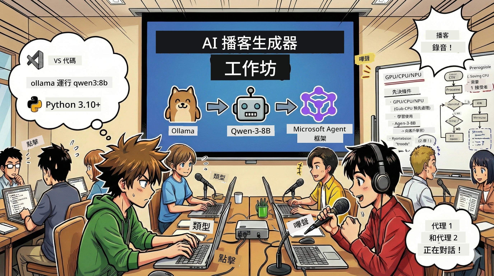
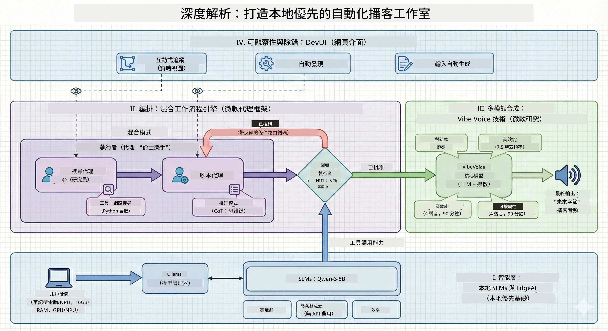

# 🎙️ The AI Podcast Studio 工作坊

> 🌏 [中文版 (Chinese Version)](translation/zh-cn/README.md)



## 你的任務

歡迎來到 **The AI Podcast Studio**！你即將推出自己的科技播客《Future Bytes》——但這裡有個轉折：你會建立一個由 AI 驅動的製作團隊來幫助你創作。不再需要無止盡的研究、撰寫腳本和音頻剪輯。相反，你將透過程式碼成為擁有 AI 超能力的播客製作者。

## 故事背景

想像一下：你和朋友想開啟一個關於最酷科技趨勢的播客，但大家都忙於學校、工作或生活。如果你可建立一個由 AI 代理組成的團隊來承擔繁重任務呢？一個代理負責主題研究，另一個寫出吸引人的腳本，第三個將文字轉成自然的對話。聽起來像科幻小說嗎？讓我們實現它。

## 你將學會什麼

完成這次工作坊後，你將會知道如何：
- 🤖 部署自己的本地 AI 模型（無 API 費用，無雲端依賴！）
- 🔧 建立真正能協作的專業 AI 代理
- 🎬 從構想到音頻，打造完整的播客製作流程

## 你的旅程：三幕劇



就像好的故事一樣，我們有三幕劇。每一幕逐步構建你的 AI 播客工作室：

| 集數 | 你的任務 | 發生什麼 | 解鎖技能 |
|---------|-----------|--------------|----------------|
| **第一幕** | [認識你的 AI 助手](md/01.BuildAIAgentWithSLM.md) | 你會學會如何建立能聊天、網路搜尋、甚至解決問題的 AI 代理。它們就像你不曾休息的研究實習生。 | 🎯 建立你的第一個代理<br>🛠️ 賦予它超能力（工具！）<br>🧠 教它思考<br>🌐 連接網際網路 |
| **第二幕** | [組建你的製作團隊](md/02.AIAgentOrchestrationAndWorkflows.md) | 現在事情變得有趣了！你將協調多個 AI 代理一起工作，就像真正的播客團隊。一個做研究，一個寫稿，你負責審核——團隊合作成就夢想。 | 🎭 協調多個代理<br>🔄 建立審核流程<br>🖥️ 使用 DevUI 介面測試<br>✋ 保持人類控制 |
| **第三幕** | [令你的播客栩栩如生](md/03.Multi-SpeakerPodcastGenerationWithVibeVoice.md) | 終章！將你的文字腳本化為真實的播客音頻，採用逼真的聲音和自然對話。《Future Bytes》播客準備上線！ | 🎤 文字轉語音魔法<br>👥 多人聲音<br>⏱️ 長篇音頻<br>🚀 全自動化 |

每幕都解鎖新能力。勇敢的話可以跳過，但我們建議跟著故事一同前進！

## 環境需求

此工作坊支援多種硬體環境：
- **CPU**：適合測試及小規模使用
- **GPU**：推薦用於生產環境，大幅提升推理速度
- **NPU**：支援新一代神經處理單元加速

## 你需要準備

### 軟件清單 ✅
- **Python 3.10+**（你的程式語言）
- **Ollama**（在本機運行 AI 模型）
- **VS Code**（你的程式編輯器）
- **Python 擴充功能**（讓 VS Code 更聰明）
- **Git**（用來抓取程式碼）

### 硬件檢查 💻
- **我能運行嗎？**：8GB 記憶體，10GB 空間（可行，但可能較慢）
- **理想設定**：16GB+ 記憶體，配備不錯 GPU（順暢無比！）
- **有 NPU 嗎？**：更棒！解鎖下一代性能 🚀

## 建置你的工作室 🎬

### 步驟 1：Python 充電

確定你有 Python 3.10 或更新版本：

```bash
python --version
# 應該顯示 Python 3.10.x 或更高版本
```

沒有 Python？可以在 [python.org](https://python.org) 下載——免費！

### 步驟 2：取得 Ollama（你的 AI 模型引擎）

到 [ollama.ai](https://ollama.ai) 下載對應作業系統的 Ollama。想像它是本機運行 AI 模型的引擎。

確認是否準備好：

```bash
ollama --version
```

### 步驟 3：下載你的 AI 大腦 🧠

是時候下載 Qwen-3-8B 模型（就像請來你的第一個 AI 助手）：

```bash
ollama pull qwen3:8b
```

*這可能需要幾分鐘，正好喝杯咖啡！☕*

### 步驟 4：安裝 VS Code

如果你沒有，請抓 [Visual Studio Code](https://code.visualstudio.com/)。它是最棒的程式編輯器（不服來辯 😄）。

### 步驟 5：Python 擴充套件

在 VS Code：
1. 按下 `Ctrl+Shift+X`（Mac 是 `Cmd+Shift+X`）
2. 搜尋「Python」
3. 安裝官方 Microsoft Python 擴充套件

### 步驟 6：一切就緒！🎉

真的，你已經準備好大展身手。讓我們創造一些 AI 魔法吧！

### 步驟 7：安裝 Microsoft Agent Framework 及相關套件 📦

安裝本工作坊所有必需的依賴：

```bash
pip install -r ./Installations/requirements.txt -U
```

*這會安裝 Microsoft Agent Framework 和所有必要套件。拿杯咖啡，首次設定可能需幾分鐘！☕*

## 工作坊說明

專案結構、設定步驟以及執行方法將在工作坊中逐步詳細說明。

## 疑難排解（當事情出錯時）🔧

### 「哎呀，模型下載好久啊！」
**解決方案**：使用 VPN 或設定 Ollama 使用鏡像來源。有時網路就是跟你作對。

### 「我的電腦快死了！記憶體不足！」
**解決方案**：改用較小模型，或調整 `num_ctx` 參數以減少記憶體使用。把你的 AI 送去節食。

### 「能用 GPU 讓它快點嗎？」
**解決方案**：Ollama 會自動偵測 GPU！只要確保 GPU 驅動程式是最新的。免費的速度提升！🏎️

## 額外資源（給好奇的你）📚

- [Ollama Docs](https://github.com/ollama/ollama) — 深入了解本地 AI 模型
- [Microsoft Agent Framework](https://microsoft.github.io/autogen/) — 學習如何打造代理團隊
- [Qwen 模型資訊](https://qwenlm.github.io/) — 認識你的 AI 助手大腦

## 授權許可

MIT 授權 — 創造酷炫東西，分享它，讓世界更美好！🌍

## 想要貢獻？

發現錯誤或有好點子？提交 Issue 或 PR！我們喜歡充滿活力的社群。✨

---

<!-- CO-OP TRANSLATOR DISCLAIMER START -->
**免責聲明**：  
本文件係使用人工智能翻譯服務 [Co-op Translator](https://github.com/Azure/co-op-translator) 進行翻譯。雖然我們致力於翻譯的準確性，但請注意，自動翻譯可能包含錯誤或不準確之處。原始文件的母語版本應被視為權威來源。對於重要資訊，建議採用專業人工翻譯。我們對因使用本翻譯而引致的任何誤解或誤釋概不負責。
<!-- CO-OP TRANSLATOR DISCLAIMER END -->