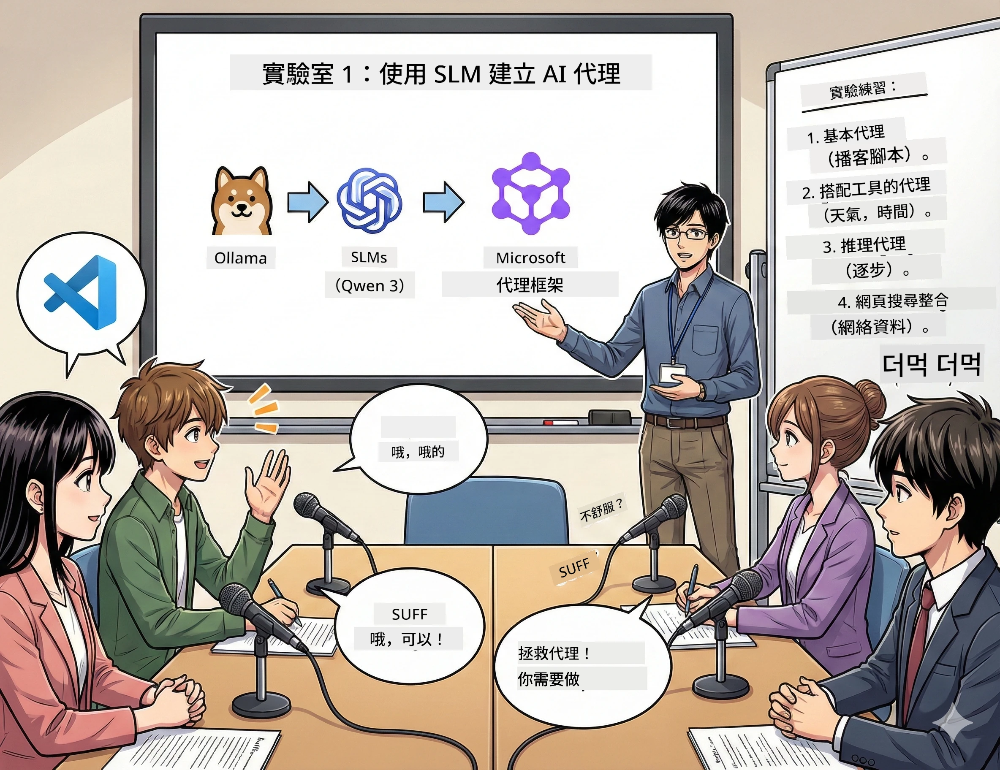

# Act 1: 認識你的 AI 研究助理 🤖

## 挑戰

你要推出新科技播客「Future Bytes」。第一集是關於最新的 AI 突破，但你只有 24 小時來：
1. 研究主題
2. 找可信來源
3. 撰寫吸引人的腳本
4. 讓內容聽起來自然流暢

**劇情轉折**：你不必單打獨鬥。你將打造你的第一位 AI 助手，幫你完成所有這些。就叫他 Alex —— 你不眠不休的研究夥伴。

## 為什麼選用小型語言模型？（答案：它們超棒）

把小型語言模型（SLMs）想像成專屬於 *你* 電腦的個人 AI。無需雲端、無月費、無可疑資料分享。

**小型語言模型的優點🔥：**
- **🏠 直接在你的機器上運行**：筆電、桌機，甚至一台強勁的 Raspberry Pi
- **💸 無持續成本**：不用 API 費用吃掉你的零用錢
- **🔒 以隱私為先**：資料永遠不會離開你的裝置
- **⚡ 超快反應**：不用等網絡延遲，即時回應
- **🪦 輕量化**：1B-10B 參數，遠比大模型的 100B+ 輕巧

**熱門 SLMs**：Qwen 3、Phi-4、Gemma 3（本工作坊使用 Qwen）

## 你的工具包

### Ollama：你的 AI 模型管理器

[Ollama](https://ollama.com/) 就像是 AI 模型的 Steam。用簡單指令下載、執行和管理模型。

**超讚之處：**
- 一條指令下載並運行任何模型
- 支援 Mac、Windows、Linux
- 若有 GPU，自動啟用加速
- 超省記憶體

### Microsoft Agent Framework：魔法發生的地方

[Microsoft Agent Framework](https://github.com/microsoft/agent-framework) 是你打造 AI 代理人的遊樂場，它能：

- 💬 聊天並記得你們的對話
- 🛠️ 使用自訂工具（例如網路搜尋或查天氣）
- 🧠 逐步推理解決複雜問題
- 🤝 與其他代理人協作組隊
- 🔌 連接不同 AI 供應商（OpenAI、Ollama、Azure）

**組成元件：**
- **代理人**：負責特定任務的 AI 助手
- **工具**：賦予他們的特別能力
- **記憶**：不讓他們忘記對話
- **推理**：教他們思考，而不只是應答

## 你的訓練過程：4 個任務

### 任務 1：建立你的第一個代理人

📓 [開啟筆記本](../code/01.BasicAgent/00.BasicAgent-agent.ipynb)

**任務目標**：建立 Alex，你的播客稿撰寫 AI。Alex 需要產生兩位主持人討論科技主題的對話。

**你將學到：**
- 如何喚醒一個 AI 代理人（比星期一早上起床還簡單）
- 給他個性和指示
- 讓它生成真正的播客腳本
- 理解它回覆的內容

**成功條件**：Alex 產出你「Future Bytes」試播集關於 AI 的腳本！ 🎯

### 任務 2：給 Alex 超能力（工具！）

📓 [開啟筆記本](../code/01.BasicAgent/01.BasicAgent-tools.ipynb)

**任務目標**：Alex 很聰明，但不知道今天的天氣或現在時間。讓我們給他工具！

**你將學到：**
- 建立自訂 Python 函數作為「工具」
- 讓 Alex 自主決定＊何時＊使用哪個工具
- 看它自主解決問題
- 結合多種工具更有挑戰的任務

**成功條件**：問「東京今天天氣如何？」Alex 自己找答案！ ☁️

### 任務 3：教 Alex 思考

📓 [開啟筆記本](../code/01.BasicAgent/02.BasicAgent-reasoning.ipynb)

**任務目標**：讓 Alex 展示推理過程。解題時，你想看到＊它如何＊思考，而不只是答案。

**你將學到：**
- 啟動「推理模式」（就像數學課展示解題過程）
- 看到 Alex 的逐步思考過程
- 了解鏈式思考提示法
- 排除 Alex 疑惑時的問題

**成功條件**：問一個棘手數學問題，觀看 Alex 思考過程！ 🧠

### 任務 4：連接 Alex 上網

📓 [開啟筆記本](../code/01.BasicAgent/03.BasicAgent-websearch.ipynb)

**任務目標**：Alex 的知識有截止日期。讓它接上網路，獲取即時情報！

**你將學到：**
- 建立自訂網頁搜尋工具
- 整合外部 API
- 優雅處理網路錯誤
- 超越訓練資料取得資訊

**成功條件**：查詢今日科技新聞，拿到最新結果！ 📰

## 開始前準備 🚀

**必備裝備**：
- 安裝 Python 3.10+
- 執行 Ollama （用 `ollama --version` 檢查）
- VS Code 與 Python 擴充套件
- 至少 8GB RAM（想更順暢建議 16GB）

## 任務順序

依序跟著筆記本進行完整故事：

1. [00.BasicAgent-agent.ipynb](../code/01.BasicAgent/00.BasicAgent-agent.ipynb) — 認識 Alex（你的第一個代理人）
2. [01.BasicAgent-tools.ipynb](../code/01.BasicAgent/01.BasicAgent-tools.ipynb) — 充能時間！
3. [02.BasicAgent-reasoning.ipynb](../code/01.BasicAgent/02.BasicAgent-reasoning.ipynb) — 教 Alex 思考
4. [03.BasicAgent-websearch.ipynb](../code/01.BasicAgent/03.BasicAgent-websearch.ipynb) — 解鎖上網功能！

## 你將掌握

完成第一幕後，你能：

- ✅ 在自己的硬體上運行 AI 模型（不用上雲）
- ✅ 建立有自訂個性和技能的代理人
- ✅ 賦予代理人工具來解決實際問題
- ✅ 讓代理人展示推理過程
- ✅ 連接代理人至外部資料源
- ✅ 問題時能自行除錯

## 當遇到問題時（及解決方案）🔧

### 「Alex 讀取失敗！記憶體爆掉！」
**解決方法**：你的電腦不夠力。試著關閉其他程式，或換小一點的模型。8GB RAM 是最低門檻。

### 「Alex 超慢」
**解決方法**：在 Ollama 設定中啟用 GPU 加速。或縮減上下文視窗大小。速度模式啟動！ 🏎️

### 「工具沒反應！」
**解決方法**：仔細檢查你的函數簽名。Alex 需要正確的型別提示才能明白工具的用途。想像像給他清楚的指令。

## 有用連結 🔗

- [Agent Framework 文件](https://github.com/microsoft/agent-framework) — 官方指南與範例
- [Ollama 模型庫](https://ollama.com/library) — 瀏覽所有可用模型
- [Qwen 模型](https://ollama.com/library/qwen3) — 認識你的 AI 腦袋
- [程式碼範例](https://github.com/microsoft/agent-framework/tree/main/python/samples) — 從這裡偷師

## 下集預告：Act 2 🎬

你有一位代理人。但如果有 *多個* 代理人一起協作呢？在 Act 2，你將建立完整的播客製作團隊：
- **研究代理人**：尋找最佳資料來源
- **撰稿代理人**：打造完美腳本
- **編輯（你！）**：審核或提出修改

讓我們一起協同發揮 AI 魔法！→ [Act 2：組建你的製作團隊](02.AIAgentOrchestrationAndWorkflows.md)

---

**卡關嗎？** 工作坊中隨時提問。我們一起學習！🙌

---

<!-- CO-OP TRANSLATOR DISCLAIMER START -->
**免責聲明**：  
本文件是使用人工智能翻譯服務 [Co-op 翻譯器](https://github.com/Azure/co-op-translator) 翻譯而成。雖然我們致力於確保準確性，但請注意，自動翻譯可能包含錯誤或不準確之處。原始文件的母語版本應視為權威來源。對於重要資訊，建議採用專業人工翻譯。我們對因使用此翻譯所引致的任何誤解或誤釋概不負責。
<!-- CO-OP TRANSLATOR DISCLAIMER END -->