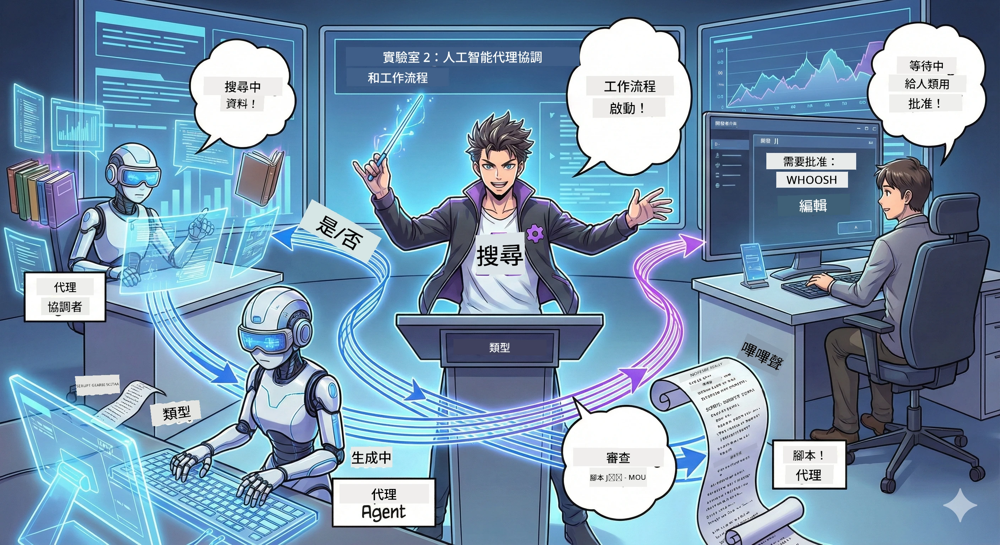

# Act 2: 組建你的播客製作團隊 🎬



## 劇情更加緊湊

Alex（你在 Act 1 認識的 AI 助手）很棒，但一個代理人無法經營整個播客工作室。你需要一個*團隊*：
- 🔍 **研究代理人**：網上搜尋最新資訊
- ✍️ **腳本代理人**：將研究成果轉化成引人入勝的對話
- 👤 **你（編輯者）**：審核腳本或退回重寫

歡迎來到 **AI 代理編排** — 你成為自己的 AI 團隊的導演。想像復仇者聯盟，但這是為播客製作而設。

## 什麼是代理編排？（簡單版）

想像你經營一家餐館。你不會自己做所有事情，是吧？你有：
- 🍳 一位主廚負責烹飪
- 👨‍🍳 一位副廚做前期準備
- 👩‍🍳 服務員負責送餐

代理編排就是同樣的概念，只是對象換成 AI。每個代理人有專長，你負責協調以達成更大的目標。沒有人會被工作壓垮，事情也能更快完成。

### 樂隊比喻 🎸

你的 AI 代理人就像一支樂隊：
- **主唱**：處理面向用戶的主要任務的代理人
- **鼓手**：掌控節奏，負責背景處理  
- **貝斯手**：支援大家，負責資料提取
- **你（樂隊經理）**：統籌全場！

沒有協調？就只是噪音。有了編排？就是美妙的音樂。

### 為什麼這很重要

一個 AI 代理人嘗試做所有事情 = 疲憊不堪。專門代理協同工作 = 高效率釋放！🚀

**真心話**：還記得獨自研究、寫稿又編輯播客有多辛苦嗎？對，真的很累。有了編排，每個代理人負責最擅長的部分。你只需做最終決策。

**真實例子**：客服機器人會知道何時處理帳單、何時解決技術問題，何時呼叫真人客服。那就是編排！

## 代理人 vs. 工作流程：有何區別？

這樣想：

### 🤖 AI 代理人 = 爵士樂手
- **根據即時聽到的訊息作決策**
- **即興發揮**使用工具解決問題
- **用 LLM 腦袋**思考
- **適應**你丟給它的任何任務

### 🎵 工作流程 = 管弦樂隊演奏古典音樂  
- **遵循譜子**（預定步驟）
- **執行可預測**
- **協調多代理人、人類和系統**
- **結構化**像一本食譜

**神奇之處**：工作流程來*編排*代理人！建立流程告訴代理人何時上場。兩者兼得。🎭

## 協調你的 AI 團隊的三種方法

### 1. 🎯 集中式（你是老闆）

一個主代理掌控全局。就像你管理團隊 — 你決定誰做什麼、何時做。

**優點**：
- ✅ 領導明確（不會混亂）
- ✅ 決策一致
- ✅ 容易除錯

**適用於**：
- 客戶服務路由（「這是帳單問題還是技術支持？」）
- 內容審核流程（「這腳本通過了嗎？」）
- 播客製作（正是我們要建的！）

### 2. 🤝 去中心化（代理人自我組織）

代理人直接互通消息，集體協調。像群組聊天，大家自然配合。

**優點**：
- ✅ 易於擴展（隨時增加代理人）
- ✅ 沒有單點故障
- ✅ 代理人自發合作

**適用於**：
- 研究團隊（每個代理探索不同資訊源）
- 腦力激盪會議
- 分散式問題解決

### 3. 🔀 混合式（兼得兩者）

你設定總體方向，但代理人在任務內自由自組織。像信任團隊的 CEO。

**適合**：複雜項目需要控制與彈性兼具。

## 微軟代理框架：你的編排工具箱 🧰

開始打造！你會用到：

### 組件基礎

#### 1. 🧱 執行者（你的工作者）
- **是什麼**：獨立處理單元 — 可以是代理人或自定義邏輯
- **做什麼**：接收輸入，完成工作，產生輸出
- **想像成**：裝配線上的工位

#### 2. ➡️ 邊（連接）
- **是什麼**：執行者之間的路徑
- **做什麼**：控制訊息流程（「先完成 A，再到 B」）
- **想像成**：流程圖上的箭頭

#### 3. 🗺️ 工作流程（總體藍圖）
- **是什麼**：完整的執行者＋邊集合圖
- **做什麼**：定義從開始到結尾的整個流程
- **想像成**：你的製作管線藍圖

### 你會喜歡的酷功能

**🛡️ 型別安全**：代理人間的訊息會做型別檢查。不怕「哎呀，資料型別錯了」的驚嚇。

**🔀 彈性路由**：
- 路徑條件分支（「如果通過，就發佈；否則重寫」）
- 並行處理（多代理同時工作）
- 動態路徑（流程根據結果調整）

**🔌 外部整合**：
- 連接 API
- 加入人工審核點（發布前由你審核）
- 建立請求/回應流程

**💾 檢查點**：保存進度！出錯崩潰時可以從斷點繼續。

**🤝 多代理協調**：
- 依序運行代理（A → B → C）
- 同步並行執行（A + B + C 同時工作）
- 代理之間交接
- 協作處理

## 最佳實踐（專家秘訣） 🎯

### 1. 保持模組化
每個代理專注做好一件事。不要做一個什麼都包的「超級代理」 — 除錯時會後悔。

### 2. 預備錯誤
代理會犯錯，網路會斷。建立錯誤處理和備用方案，未來的你會感謝現在的決定。

### 3. 監控一切
追蹤代理的活動。用 DevUI（我們會講解）看看工作流程運行。

### 4. 優化訊息大小
別在代理人間傳送超大檔案。訊息保持精簡提高速度。

### 5. 選擇合適模式
要控制？用集中式。要擴展？用去中心化。難抉擇？用混合式！

## DevUI：你的工作流程除錯器 🔍

### 什麼是 DevUI？

DevUI 就像你測試代理和工作流程的遊樂場。它是個網頁介面，你可以：
- 👀 觀看工作流程實時運作
- 💬 直接跟代理聊天
- 🔍 出錯時除錯
- 📊 查看追蹤和效能指標

> **重要**：DevUI 只用於開發！不要在正式環境用。想像成你的本地測試環境。

### 為什麼它很棒？

- **🖥️ 互動式網頁 UI**：點擊、輸入、測試 — 不用命令列
- **📁 拖放支援**：上傳檔案，用不同輸入測試
- **📂 自動發現**：給它一個資料夾，自動找到所有代理
- **📋 無需設置模式**：在程式碼中註冊代理，不必照資料夾結構
- **🔌 支援 OpenAI SDK**（相容性加分！）
- **👁️ 內建追蹤**：清楚看到代理在做什麼

### 輸入如何運作

DevUI 對輸入很聰明：

- **測試代理人？** 會有文字盒和檔案上傳按鈕
- **測試工作流程？** 根據工作流程預期，自動生成輸入欄位

這就像魔法，但只是優秀的程式碼。✨

## 你的任務：建造播客工作室 🎬

### 任務 1：用 DevUI 建立單一代理人

📂 [01.AgentDevUI](../../../../WorkshopForAgentic/code/02.Workflow/01.AgentDevUI)

**挑戰**：在打造完整團隊前，先用一個代理測試 DevUI — 網路搜尋專家。

**你要建立的**：
一個研究代理，可以搜尋播客主題的網路資訊。你會用 DevUI 網頁介面（`http://localhost:8090`）來測試它。

**你將學到**：
- 🚀 啟動 DevUI 中的代理人
- 🔍 即時測試代理回應
- 🛠️ 建立自訂工具（網路搜尋）
- 📊 啟用追蹤以便除錯
- 🖥️ 使用互動式網頁 UI

**程式碼**：
- `agent.py`：具備網路搜尋超能力的 SearchAgent
- 使用 OllamaChatClient 連接 Qwen
- 實作 `web_search()` 工具函式
- 用 `serve()` 啟動 — 自動開啟 DevUI

**成功條件**：問你的代理「AI 最新趨勢是什麼？」並看它搜尋網路！🎉

### 任務 2：建造多代理工作流程

📂 [02.WorkflowDevUI](../../../../WorkshopForAgentic/code/02.Workflow/02.WorkflowDevUI)

**挑戰**：現在進入真正的樂趣！打造完整播客製作流程：
1. 🔍 **搜尋代理** → 研究主題
2. ✍️ **腳本代理** → 撰寫兩位主持人的對話（中文！）
3. 👤 **審核執行者** → 請你審核通過或退回
4. 🔄 **迴圈返回** → 如果被拒，根據反饋重寫

**你將學到**：
- 🧱 為不同任務創建專業代理
- 🔗 用 WorkflowBuilder 連接代理
- 🔀 實作審核迴圈（人工介入）
- 🚦 條件路由（通過 vs. 拒絕）
- 🔧 建置業務邏輯自定義執行者

**流程示意**：
```
SearchAgent → ScriptAgent → ReviewExecutor
                             ↑          ↓ (if rejected)
                             ←─────────
```

**程式碼**：
- `search_agent/agent.py`：研究專家
- `generate_script_agent/agent.py`：你的腳本寫手（用中文！）
- `workflow/workflow.py`：編排魔法都在這裡
- `main.py`：在 DevUI 中啟動所有元件

**成功條件**：給定主題，審核腳本，先退回一次測試迴圈，再批准！🎉

### 任務 3：打造命令列應用程式

📂 [03.Application](../../../../WorkshopForAgentic/code/02.Workflow/03.Application)

**挑戰**：將你的工作流程從 DevUI 帶出，做成帶顏色輸出、載入特效和檔案存檔的帥氣終端機程式。這就是生產級的東西！

**你將學到**：
- ⚡ 以程式方式執行工作流程（不用 DevUI）
- 📡 事件驅動架構及串流處理
- 🎨 製作漂亮終端 UI（顏色、轉圈、進度條）
- 💾 最終腳本存檔
- 🔄 使用 Python asyncio 處理非同步工作流程

**功能流程**：
1. 問你播客主題
2. 顯示即時進度（「搜尋代理正在工作…」）
3. 以彩色顯示產生的腳本
4. 請你批准
5. 儲存已批准腳本至 `podcast.txt`

**程式碼**：
- `podcast_app.py`：主程式含事件處理
- `workflow.py`：重用任務 2 的工作流程
- 支援事件：`AgentRunUpdateEvent`、`RequestInfoEvent`、`WorkflowOutputEvent`
- 用 ANSI 顏色美化終端機

**成功條件**：執行程式，生成播客腳本，看它被保存！你做出真正的工具了。🚀

## 你已掌握的技能 🏆

Act 2 結束後，你能夠：

- ✅ 像老闆一樣編排多個 AI 代理
- ✅ 建立含有順序和條件邏輯的工作流程
- ✅ 加入人工審核檢查點
- ✅ 使用 DevUI 測試和除錯流程
- ✅ 創建生產就緒的終端應用程式
- ✅ 在複雜系統中優雅處理錯誤
- ✅ 為任何專案選擇合適的編排模式

## 出現問題時 🔧

### 「我的工作流程太複雜了！」
**解決方法**：拆分成更小的子流程。每個流程專注做好一件事。有需要就串接起來。

### 「我看不清發生了什麼！」
**解決方法**：使用工作流程檢查點保存狀態。啟用 DevUI 的追蹤來查看每一步。

### 「某個代理錯誤導致全崩潰！」
**解決方法**：加錯誤防護。每個代理應自行處理失敗並有後備行為。

### 「這速度也太慢了」
**解決方法**：有沒有代理能平行執行？順序工作流程簡易但慢。尋找並行化機會！

## 有用資源 🔗

- [Workflow Docs](https://learn.microsoft.com/en-us/agent-framework/user-guide/workflows/overview) — 微軟官方指南
- [Orchestration Patterns](https://www.ibm.com/think/topics/ai-agent-orchestration) — IBM 的解析
- [Agent Framework GitHub](https://github.com/microsoft/agent-framework) — 閱讀原始碼
- [代碼範例](https://github.com/microsoft/agent-framework/tree/main/python/samples) — 從這裡偷取範例模式

---

**準備好進入最終章了嗎？** 你已經有了你的腳本。現在讓我們把它變成真正的音頻！→ [第三幕：讓你的播客栩栩如生](03.Multi-SpeakerPodcastGenerationWithVibeVoice.md) 🎤

---

**卡住了？困惑？興奮？** 在工作坊聊天中分享！我們一起學習。🚀

---

<!-- CO-OP TRANSLATOR DISCLAIMER START -->
**免責聲明**：  
本文件已使用人工智能翻譯服務 [Co-op Translator](https://github.com/Azure/co-op-translator) 進行翻譯。儘管我們致力於確保準確性，但請注意，自動翻譯可能包含錯誤或不準確之處。原文文件應被視為權威來源。對於重要資訊，建議採用專業人工翻譯。我們不對因使用本翻譯而引起的任何誤解或誤譯承擔責任。
<!-- CO-OP TRANSLATOR DISCLAIMER END -->