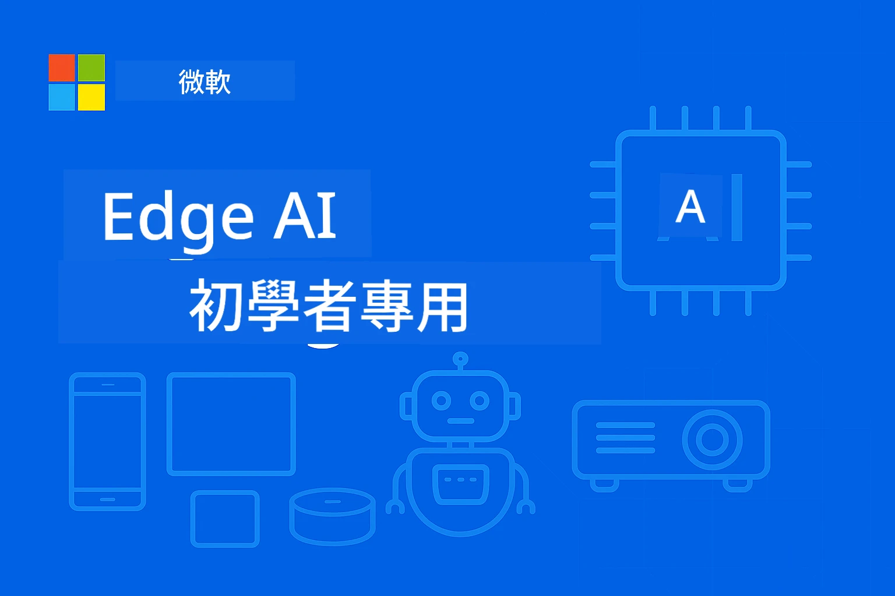

# EdgeAI 新手入門




[](https://GitHub.com/microsoft/edgeai-for-beginners/graphs/contributors)
[](https://GitHub.com/microsoft/edgeai-for-beginners/issues)
[](https://GitHub.com/microsoft/edgeai-for-beginners/pulls)
[](http://makeapullrequest.com)

[](https://GitHub.com/microsoft/edgeai-for-beginners/watchers)
[](https://GitHub.com/microsoft/edgeai-for-beginners/fork)
[](https://GitHub.com/microsoft/edgeai-for-beginners/stargazers)


[](https://discord.gg/nTYy5BXMWG)

請依照以下步驟開始使用這些資源：

1. **Fork 儲存庫**：點擊 [](https://GitHub.com/microsoft/edgeai-for-beginners/fork)
2. **Clone 儲存庫**：   `git clone https://github.com/microsoft/edgeai-for-beginners.git`
3. [**加入 Azure AI Foundry Discord，與專家及開發者交流**](https://discord.com/invite/ByRwuEEgH4)


### 🌐 多語言支援

#### 透過 GitHub Action 支援（自動且持續更新）

<!-- CO-OP TRANSLATOR LANGUAGES TABLE START -->
[阿拉伯語](../ar/README.md) | [孟加拉語](../bn/README.md) | [保加利亞語](../bg/README.md) | [緬甸語](../my/README.md) | [中文（簡體）](../zh-CN/README.md) | [中文（繁體，香港）](../zh-HK/README.md) | [中文（繁體，澳門）](../zh-MO/README.md) | [中文（繁體，臺灣）](./README.md) | [克羅埃西亞語](../hr/README.md) | [捷克語](../cs/README.md) | [丹麥語](../da/README.md) | [荷蘭語](../nl/README.md) | [愛沙尼亞語](../et/README.md) | [芬蘭語](../fi/README.md) | [法語](../fr/README.md) | [德語](../de/README.md) | [希臘語](../el/README.md) | [希伯來語](../he/README.md) | [印地語](../hi/README.md) | [匈牙利語](../hu/README.md) | [印尼語](../id/README.md) | [義大利語](../it/README.md) | [日語](../ja/README.md) | [坎納達語](../kn/README.md) | [高棉語](../km/README.md) | [韓語](../ko/README.md) | [立陶宛語](../lt/README.md) | [馬來語](../ms/README.md) | [馬拉雅拉姆語](../ml/README.md) | [馬拉地語](../mr/README.md) | [尼泊爾語](../ne/README.md) | [奈及利亞洋泾浜語](../pcm/README.md) | [挪威語](../no/README.md) | [波斯語（法爾西語）](../fa/README.md) | [波蘭語](../pl/README.md) | [葡萄牙語（巴西）](../pt-BR/README.md) | [葡萄牙語（葡萄牙）](../pt-PT/README.md) | [旁遮普語（古魯穆奇文）](../pa/README.md) | [羅馬尼亞語](../ro/README.md) | [俄語](../ru/README.md) | [塞爾維亞語（西里爾字母）](../sr/README.md) | [斯洛伐克語](../sk/README.md) | [斯洛維尼亞語](../sl/README.md) | [西班牙語](../es/README.md) | [斯瓦希里語](../sw/README.md) | [瑞典語](../sv/README.md) | [他加祿語（菲律賓語）](../tl/README.md) | [泰米爾語](../ta/README.md) | [泰盧固語](../te/README.md) | [泰語](../th/README.md) | [土耳其語](../tr/README.md) | [烏克蘭語](../uk/README.md) | [烏爾都語](../ur/README.md) | [越南語](../vi/README.md)

> **想要本機 Clone？**
>
> 此儲存庫包含 50 多種語言翻譯，因此下載量大幅增加。若想下載不含翻譯內容，請使用 sparse checkout：
>
> **Bash / macOS / Linux:**
> ```bash
> git clone --filter=blob:none --sparse https://github.com/microsoft/edgeai-for-beginners.git
> cd edgeai-for-beginners
> git sparse-checkout set --no-cone '/*' '!translations' '!translated_images'
> ```
>
> **CMD (Windows):**
> ```cmd
> git clone --filter=blob:none --sparse https://github.com/microsoft/edgeai-for-beginners.git
> cd edgeai-for-beginners
> git sparse-checkout set --no-cone "/*" "!translations" "!translated_images"
> ```
>
> 這樣你就能以更快的速度下載，包含完成課程所需的所有內容。
<!-- CO-OP TRANSLATOR LANGUAGES TABLE END -->

**若您希望新增其他支援語言，請參考 [這裡](https://github.com/Azure/co-op-translator/blob/main/getting_started/supported-languages.md)**
## 介紹

歡迎來到 **EdgeAI 新手入門** —— 您通往邊緣人工智慧變革世界的完整旅程。此課程銜接強大 AI 能力與邊緣裝置上的實務部署，讓您能直接在資料產生與決策的現場發揮 AI 潛能。

### 您將掌握的技能

本課程帶您從基礎概念到生產就緒實作，內容涵蓋：
- **適合邊緣部署的小型語言模型（SLMs）**
- <strong>跨多平台的硬體感知優化</strong>
- <strong>具有隱私保護能力的即時推論</strong>
- <strong>企業應用的生產部署策略</strong>

### 為何 EdgeAI 如此重要

邊緣 AI 是一種範式轉移，解決當代重要挑戰：
- <strong>隱私與安全</strong>：在本地處理敏感資料而非傳送至雲端
- <strong>即時效能</strong>：消除網路延遲以支援關鍵時效應用
- <strong>成本效益</strong>：降低頻寬與雲端運算費用
- <strong>韌性運作</strong>：網路中斷期間仍能維持功能
- <strong>法規遵循</strong>：符合資料主權和合規要求

### 邊緣 AI

邊緣 AI 指在資料產生附近的硬體上本地運行 AI 演算法與語言模型，無需依賴雲端資源進行推論。它降低延遲、提升隱私，並實現即時決策。

### 核心原則：
- <strong>裝置端推論</strong>：AI 模型在邊緣裝置（手機、路由器、微控制器、工業電腦）上運行
- <strong>離線能力</strong>：無需持續網際網路連線即可運行
- <strong>低延遲</strong>：適合即時系統的快速回應
- <strong>資料主權</strong>：將敏感資料保留於本地，提高安全與合規性

### 小型語言模型（SLMs）

SLM 如 Phi-4、Mistral-7B 與 Gemma 是大型 LLM 的優化版本，經過訓練或蒸餾，以達成：
- <strong>減少記憶體佔用</strong>：有效運用有限的邊緣裝置記憶體
- <strong>降低運算需求</strong>：針對 CPU 與邊緣 GPU 表現優化
- <strong>更快啟動時間</strong>：快速初始化以提升應用回應速度

它們在保有強大 NLP 能力同時符合以下限制條件：
- <strong>嵌入式系統</strong>：物聯網裝置與工業控制器
- <strong>行動裝置</strong>：智慧型手機與具離線能力的平板
- <strong>物聯網裝置</strong>：具有限資源的感測器與智慧裝置
- <strong>邊緣伺服器</strong>：具有限 GPU 資源的本地處理單元
- <strong>個人電腦</strong>：桌面及筆電部署場景

## 課程模組與導覽

| 模組 | 主題 | 專注領域 | 主要內容 | 等級 | 預估時長 |
|--------|-------|------------|-------------|--------|----------|
| [📖 00 ](./introduction.md) | [EdgeAI 介紹](./introduction.md) | 基礎與背景 | EdgeAI 概述 • 產業應用 • SLM 介紹 • 學習目標 | 新手 | 1-2 小時 |
| [📚 01](../../Module01) | [EdgeAI 基礎](./Module01/README.md) | 雲端與邊緣 AI 比較 | EdgeAI 基礎 • 實際案例 • 實作指南 • 邊緣部署 | 新手 | 3-4 小時 |
| [🧠 02](../../Module02) | [SLM 模型基礎](./Module02/README.md) | 模型系列與架構 | Phi 系列 • Qwen 系列 • Gemma 系列 • BitNET • μModel • Phi-Silica | 新手 | 4-5 小時 |
| [🚀 03](../../Module03) | [SLM 部署實務](./Module03/README.md) | 本地與雲端部署 | 進階學習 • 本地環境 • 雲端部署 | 中階 | 4-5 小時 |
| [⚙️ 04](../../Module04) | [模型優化工具組](./Module04/README.md) | 跨平台優化 | 介紹 • Llama.cpp • Microsoft Olive • OpenVINO • Apple MLX • 工作流程整合 | 中階 | 5-6 小時 |
| [🔧 05](../../Module05) | [SLMOps 生產運維](./Module05/README.md) | 生產運行管理 | SLMOps 介紹 • 模型蒸餾 • 微調 • 生產部署 | 進階 | 5-6 小時 |
| [🤖 06](../../Module06) | [AI 代理人與函式呼叫](./Module06/README.md) | 代理人框架與 MCP | 代理人介紹 • 函式呼叫 • 模型上下文協定 | 進階 | 4-5 小時 |
| [💻 07](../../Module07) | [平台實作範例](./Module07/README.md) | 跨平台示例 | AI 工具包 • Foundry Local • Windows 開發 | 進階 | 3-4 小時 |
| [🏭 08](../../Module08) | [Foundry Local 工具組](./Module08/README.md) | 生產就緒範例 | 範例應用（詳情見下方） | 專家 | 8-10 小時 |

### 🏭 **模組 08：範例應用**

- [01：REST 聊天快速入門](./Module08/samples/01/README.md)
- [02：OpenAI SDK 整合](./Module08/samples/02/README.md)
- [03：模型探索與基準測試](./Module08/samples/03/README.md)
- [04：Chainlit RAG 應用](./Module08/samples/04/README.md)
- [05：多代理協同編排](./Module08/samples/05/README.md)
- [06：模型即工具路由器](./Module08/samples/06/README.md)
- [07：直接 API 客戶端](./Module08/samples/07/README.md)
- [08：Windows 11 聊天應用](./Module08/samples/08/README.md)
- [09：進階多代理系統](./Module08/samples/09/README.md)
- [10：Foundry 工具框架](./Module08/samples/10/README.md)

### 🎓 **工作坊：實戰學習路徑**

完整的手把手工作坊教材與生產就緒實作：

- **[工作坊指南](./Workshop/Readme.md)** - 學習目標、成果與資源導覽完整說明
- **Python 範例**（6 堂課）- 符合最佳實踐，包含錯誤處理與完整文件
- **Jupyter 筆記本**（8 個互動教學）- 逐步教學附帶基準測試與效能監控
- <strong>課程指引</strong> - 每堂課的詳細 Markdown 指南
- <strong>驗證工具</strong> - 驗證程式碼品質和執行基本測試的腳本

**您將打造：**
- 支援串流的本地 AI 聊天應用
- 含品質評估的 RAG 管道（RAGAS）
- 多模型基準測試與比較工具
- 多代理協同編排系統
- 具任務導向選擇的智慧模型路由器

### 🎙️ **Agentic 工作坊：實戰體驗 - AI Podcast Studio**
從零開始建立由 AI 驅動的 Podcast 製作流程！這個沉浸式工作坊教你如何創建一個完整的多代理系統，將想法轉化為專業的廣播節目。

**[🎬 開始 AI Podcast Studio 工作坊](./WorkshopForAgentic/README.md)**

<strong>你的任務</strong>：啟動「Future Bytes」— 一個完全由你自行構建的 AI 代理驅動的科技 Podcast。不依賴雲端，無 API 費用 — 所有運行皆在本機完成。

**獨特之處：**
- **🤖 真正的多代理協調** - 建構專門 AI 代理，負責研究、撰寫與音頻製作
- **🎯 完整的製作流程** - 從主題選擇到最終 Podcast 音頻輸出
- **💻 100% 本地部署** - 使用 Ollama 及本地模型（Qwen-3-8B）確保全隱私與控制權
- **🎤 文字轉語音整合** - 將腳本轉換為自然多講者對話
- **✋ 人機互動流程** - 審核關卡確保品質同時維持自動化

**三幕式學習旅程：**

| 幕別 | 聚焦 | 主要技能 | 時長 |
|-----|-------|------------|----------|
| **[第一幕：認識你的 AI 助理](./WorkshopForAgentic/md/01.BuildAIAgentWithSLM.md)** | 建立你的首個 AI 代理 | 工具整合 • 網路搜尋 • 問題解決 • 智能推理 | 2-3 小時 |
| **[第二幕：組建你的製作團隊](./WorkshopForAgentic/md/02.AIAgentOrchestrationAndWorkflows.md)** | 協調多個代理 | 團隊協作 • 審核流程 • DevUI 介面 • 人工監督 | 3-4 小時 |
| **[第三幕：讓你的 Podcast 有聲](./WorkshopForAgentic/md/03.Multi-SpeakerPodcastGenerationWithVibeVoice.md)** | 產生 Podcast 音頻 | 語音合成 • 多講者合成 • 長音頻 • 完整自動化 | 2-3 小時 |

**所用技術：**
- **Microsoft Agent Framework** - 多代理協調與協作架構
- **Ollama** - 本地 AI 模型執行環境（無需雲端）
- **Qwen-3-8B** - 優化代理任務的開源語言模型
- **文字轉語音 API** - 自然語音合成製作 Podcast

**硬體支援：**
- ✅ **CPU 模式** - 適合任何現代電腦（建議 8GB+ 記憶體）
- 🚀 **GPU 加速** - 使用 NVIDIA/AMD GPU 提升推論速度
- ⚡ **NPU 支援** - 次世代神經處理器加速

**適合對象：**
- 學習多代理 AI 系統的開發者
- 對 AI 自動化及流程感興趣者
- 探索 AI 輔助內容製作的創作者
- 學習實用 AI 協調模式的學生

<strong>開始構建</strong>: [🎙️ AI Podcast Studio 工作坊 →](./WorkshopForAgentic/README.md)

### 📊 <strong>學習路徑摘要</strong>
- <strong>總時長</strong>：36-45 小時
- <strong>初學者路徑</strong>：模組 01-02（7-9 小時）  
- <strong>中階路徑</strong>：模組 03-04（9-11 小時）
- <strong>進階路徑</strong>：模組 05-07（12-15 小時）
- <strong>專家路徑</strong>：模組 08（8-10 小時）

## 你將構建的項目

### 🎯 核心能力
- **邊緣 AI 架構**：設計本地優先並整合雲端的 AI 系統
- <strong>模型優化</strong>：對模型量化與壓縮以適合邊緣部署（提速 85%，縮小 75%）
- <strong>多平台部署</strong>：Windows、手機、嵌入式、及雲端邊緣混合系統
- <strong>生產運維</strong>：邊緣 AI 的監控、擴展與維護

### 🏗️ 實戰專案
- **Foundry 本地聊天應用**：Windows 11 原生應用含模型切換
- <strong>多代理系統</strong>：協調複雜流程的專家代理  
- **RAG 應用**：本地文檔處理和向量搜尋
- <strong>模型路由器</strong>：根據任務分析智能選擇模型
- **API 框架**：具流式傳輸和運維健康監控的生產客戶端
- <strong>跨平台工具</strong>：LangChain/Semantic Kernel 集成範例

### 🏢 行業應用
<strong>製造業</strong> • <strong>醫療保健</strong> • <strong>自動駕駛</strong> • <strong>智慧城市</strong> • <strong>移動應用</strong>

## 快速入門

<strong>推薦學習路徑</strong>（共 20-30 小時）：

0. **📖 介紹** ([Introduction.md](./introduction.md))：EdgeAI 基礎 + 產業背景 + 學習框架
1. **📚 基礎**（模組 01-02）：EdgeAI 概念 + SLM 模型家族
2. **⚙️ 優化**（模組 03-04）：部署與量化框架  
3. **🚀 生產**（模組 05-06）：SLMOps + AI 代理 + 函數調用
4. **💻 實作**（模組 07-08）：平台範例 + Foundry Local 工具包

每個模組包含理論、動手練習及生產級代碼範例。

## 職涯影響

<strong>技術職位</strong>：EdgeAI 解決方案架構師 • 機器學習工程師（Edge）• 物聯網 AI 開發者 • 移動 AI 開發者

<strong>產業領域</strong>：製造 4.0 • 醫療科技 • 自主系統 • 金融科技 • 消費電子

<strong>作品集專案</strong>：多代理系統 • 產業級 RAG 應用 • 跨平台部署 • 性能優化

## 版本庫結構

```
edgeai-for-beginners/
├── 📖 introduction.md  # Foundation: EdgeAI Overview & Learning Framework
├── 📚 Module01-04/     # Fundamentals → SLMs → Deployment → Optimization  
├── 🔧 Module05-06/     # SLMOps → AI Agents → Function Calling
├── 💻 Module07/        # Platform Samples (VS Code, Windows, Jetson, Mobile)
├── 🏭 Module08/        # Foundry Local Toolkit + 10 Comprehensive Samples
│   ├── samples/01-06/  # Foundation: REST, SDK, RAG, Agents, Routing
│   └── samples/07-10/  # Advanced: API Client, Windows App, Enterprise Agents, Tools
├── 🌐 translations/    # Multi-language support (8+ languages)
└── 📋 STUDY_GUIDE.md   # Structured learning paths & time allocation
```

## 課程亮點

✅ <strong>漸進式學習</strong>：理論 → 實作 → 生產部署  
✅ <strong>真實案例</strong>：微軟、日本航空、企業級實作  
✅ <strong>實戰範例</strong>：超過 50 範例，10 個完整 Foundry Local 示範  
✅ <strong>性能焦點</strong>：提升 85% 速度，縮小 75% 體積  
✅ <strong>多平台支持</strong>：Windows、手機、嵌入式、雲端邊緣混合  
✅ <strong>生產就緒</strong>：監控、擴展、安全性、合規框架

📖 **[學習指南](STUDY_GUIDE.md)**：結構化 20 小時學習路徑，含時間分配與自我評估工具。

---

**EdgeAI 是 AI 部署的未來**：本地優先、隱私保護與高效能。掌握這些技能，打造下一代智能應用。

## 其他課程

我們團隊提供其他課程！請參考：

<!-- CO-OP TRANSLATOR OTHER COURSES START -->
### LangChain
[](https://aka.ms/langchain4j-for-beginners)
[](https://aka.ms/langchainjs-for-beginners?WT.mc_id=m365-94501-dwahlin)
[](https://github.com/microsoft/langchain-for-beginners?WT.mc_id=m365-94501-dwahlin)
---

### Azure / Edge / MCP / Agents
[](https://github.com/microsoft/AZD-for-beginners?WT.mc_id=academic-105485-koreyst)
[](https://github.com/microsoft/edgeai-for-beginners?WT.mc_id=academic-105485-koreyst)
[](https://github.com/microsoft/mcp-for-beginners?WT.mc_id=academic-105485-koreyst)
[](https://github.com/microsoft/ai-agents-for-beginners?WT.mc_id=academic-105485-koreyst)

---
 
### 生成式 AI 系列
[](https://github.com/microsoft/generative-ai-for-beginners?WT.mc_id=academic-105485-koreyst)
[-9333EA?style=for-the-badge&labelColor=E5E7EB&color=9333EA)](https://github.com/microsoft/Generative-AI-for-beginners-dotnet?WT.mc_id=academic-105485-koreyst)
[-C084FC?style=for-the-badge&labelColor=E5E7EB&color=C084FC)](https://github.com/microsoft/generative-ai-for-beginners-java?WT.mc_id=academic-105485-koreyst)
[-E879F9?style=for-the-badge&labelColor=E5E7EB&color=E879F9)](https://github.com/microsoft/generative-ai-with-javascript?WT.mc_id=academic-105485-koreyst)

---
 
### 核心學習
[](https://aka.ms/ml-beginners?WT.mc_id=academic-105485-koreyst)
[](https://aka.ms/datascience-beginners?WT.mc_id=academic-105485-koreyst)
[](https://aka.ms/ai-beginners?WT.mc_id=academic-105485-koreyst)
[](https://github.com/microsoft/Security-101?WT.mc_id=academic-96948-sayoung)
[](https://aka.ms/webdev-beginners?WT.mc_id=academic-105485-koreyst)
[](https://aka.ms/iot-beginners?WT.mc_id=academic-105485-koreyst)
[](https://github.com/microsoft/xr-development-for-beginners?WT.mc_id=academic-105485-koreyst)

---
 
### Copilot 系列
[](https://aka.ms/GitHubCopilotAI?WT.mc_id=academic-105485-koreyst)
[](https://github.com/microsoft/mastering-github-copilot-for-dotnet-csharp-developers?WT.mc_id=academic-105485-koreyst)
[](https://github.com/microsoft/CopilotAdventures?WT.mc_id=academic-105485-koreyst)
<!-- CO-OP TRANSLATOR OTHER COURSES END -->

## 獲取協助

如果您遇到困難或對於建立 AI 應用程式有任何疑問，請加入：

[](https://discord.gg/nTYy5BXMWG)

如果您在開發過程中有產品回饋或遇到錯誤，請造訪：

[](https://aka.ms/foundry/forum)

---

<!-- CO-OP TRANSLATOR DISCLAIMER START -->
**免責聲明**：
本文件係使用 AI 翻譯服務 [Co-op Translator](https://github.com/Azure/co-op-translator) 進行翻譯。雖我們致力於確保準確性，但請留意自動翻譯可能包含錯誤或不準確之處。原始文件之母語版本應視為權威來源。對於關鍵資訊，建議採用專業人工翻譯。我們不對因使用本翻譯而產生的任何誤解或誤譯負責。
<!-- CO-OP TRANSLATOR DISCLAIMER END -->