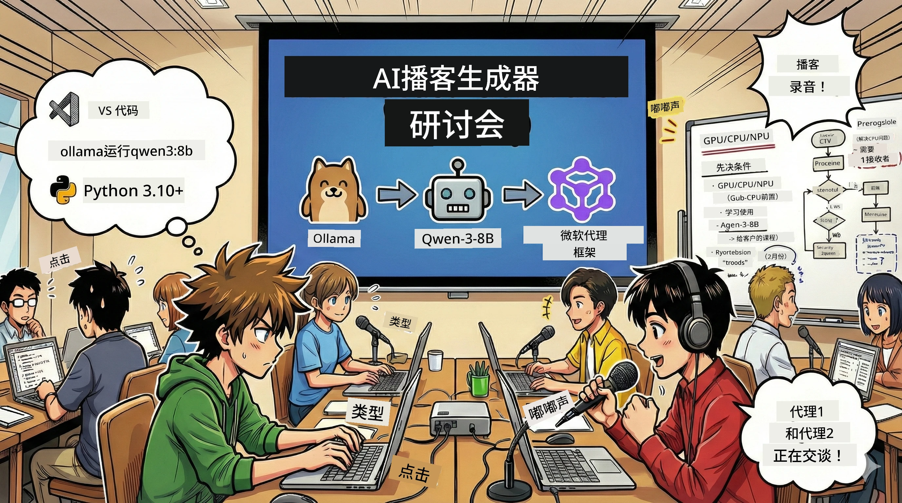

<!--
CO_OP_TRANSLATOR_METADATA:
{
  "original_hash": "f94e745264597bc5d8df967ead2eff97",
  "translation_date": "2026-01-05T10:24:20+00:00",
  "source_file": "WorkshopForAgentic/README.md",
  "language_code": "zh"
}
-->
# 🎙️ AI 播客工作室研讨会

> 🌏 [中文版 (Chinese Version)](translation/zh-cn/README.md)



## 你的任务

欢迎来到 **AI 播客工作室**！你即将启动自己的科技播客节目《未来字节》(Future Bytes) — 但是有个特别之处：你将构建一个由 AI 驱动的制作团队来帮助你制作播客。不需要再花费大量时间做研究、撰写脚本和音频编辑。相反，你将通过编程成为拥有 AI 超能力的播客制作人。

## 故事背景

想象一下：你和朋友们想做一个关于最酷科技趋势的播客，但每个人都忙于学校、工作或生活琐事。如果你能组建一支 AI 代理团队来干重活怎么样？一个代理负责研究选题，另一个撰写吸引人的脚本，还有一个把文本变成自然对话。听起来像科幻？让我们把它变成现实。

## 你将学到什么

研讨会结束时，你将会：
- 🤖 部署自己的本地 AI 模型（无 API 费用，无云依赖！）
- 🔧 构建真正协作的专属 AI 代理
- 🎬 从创意到音频，打造完整播客制作流程

## 你的旅程：三幕剧


就像任何一部好故事，我们有三幕。每幕逐步搭建你的 AI 播客工作室：

| 集数 | 你的任务 | 事件内容 | 解锁技能 |
|---------|-----------|--------------|----------------|
| **第一幕** | [认识你的 AI 助手](md/01.BuildAIAgentWithSLM.md) | 你学会如何创建能聊天、搜索互联网，甚至解决问题的 AI 代理。把它们看作永不休息的研究实习生。 | 🎯 构建你的第一个代理<br>🛠️ 赋予它超能力（工具！）<br>🧠 教它思考<br>🌐 连接网络 |
| **第二幕** | [组建你的制作团队](md/02.AIAgentOrchestrationAndWorkflows.md) | 事情开始变得有趣！你将协调多个 AI 代理协同工作，像真实播客团队一样。有的做研究，有的写稿，你来审核——团队协作造梦。 | 🎭 协调多代理<br>🔄 构建审批工作流<br>🖥️ 使用 DevUI 界面测试<br>✋ 保持人类控制 |
| **第三幕** | [让你的播客活起来](md/03.Multi-SpeakerPodcastGenerationWithVibeVoice.md) | 大结局！把文本脚本转成真实播客音频，呈现逼真语音和自然对话。《未来字节》播客准备上线！ | 🎤 文字转语音魔法<br>👥 多角色声音<br>⏱️ 长时间音频<br>🚀 完全自动化 |

每幕都解锁新技能。勇敢的可以跳过，但我们建议顺序体验故事！

## 环境需求

本研讨会支持多种硬件环境：
- **CPU**：适合测试和小规模使用
- **GPU**：推荐用于生产环境，大幅提升推理速度
- **NPU**：支持下一代神经处理单元加速

## 你需要准备

### 软件清单 ✅
- **Python 3.10+**（你的编程语言）
- **Ollama**（在本地运行 AI 模型）
- **VS Code**（你的代码编辑器）
- **Python 扩展**（让 VS Code 更智能）
- **Git**（用于获取代码）

### 硬件检查 💻
- **能运行吗？**：8GB 内存，10GB 剩余空间（可用但较慢）
- **理想配置**：16GB+ 内存、一块性能不错的 GPU（运行流畅！）
- **有 NPU 吗？**：更佳！开启下一代性能加速🚀

## 搭建你的工作室 🎬

### 第1步：安装 Python

确保你已安装 Python 3.10 或更高版本：

```bash
python --version
# 应显示 Python 3.10.x 或更高版本
```
  
没装 Python？到 [python.org](https://python.org) 下载 — 完全免费！

### 第2步：获取 Ollama（你的 AI 模型引擎）

访问 [ollama.ai](https://ollama.ai)，下载适合你操作系统的 Ollama。它相当于运行本地 AI 模型的引擎。

检查就绪状态：

```bash
ollama --version
```
  
### 第3步：下载你的 AI 大脑 🧠

现在下载 Qwen-3-8B 模型（就像雇佣你的第一个 AI 助手）：

```bash
ollama pull qwen3:8b
```
  
*这可能需要几分钟。正好喝杯咖啡休息下！☕*

### 第4步：安装 VS Code

如果还没装，快去拿 [Visual Studio Code](https://code.visualstudio.com/)，这是目前最好的代码编辑器（谁敢反驳我😄）。

### 第5步：安装 Python 扩展

在 VS Code 中：  
1. 按 `Ctrl+Shift+X` (Mac 用 `Cmd+Shift+X`)  
2. 搜索“Python”  
3. 安装微软官方 Python 扩展

### 第6步：准备就绪！🎉

真的，你已经准备好了。让我们开始打造 AI 魔法吧！

### 第7步：安装 Microsoft Agent Framework 及相关依赖 📦

安装研讨会所需的所有依赖包：

```bash
pip install -r ./Installations/requirements.txt -U
```
  
*这会安装 Microsoft Agent Framework 和所有必备库。拿杯咖啡，首次安装可能要等几分钟！☕*

## 研讨会说明

项目结构、配置步骤和执行方法将在研讨会中逐步讲解。

## 故障排除（出现问题时）🔧

### “唉，模型下载太慢了！”
**解决方法**：使用 VPN 或配置 Ollama 镜像源。有时候网络不给力。

### “我电脑快撑不住了，内存不够用了！”
**解决方法**：换更小的模型，或调节 `num_ctx` 参数减少内存占用。可以把 AI “节食”一下。

### “用 GPU 能不能快点？”
**解决方法**：Ollama 会自动识别 GPU！确保你的显卡驱动是最新的。免费加速🏎️

## 额外资源（好奇者必看）📚

- [Ollama 文档](https://github.com/ollama/ollama) — 深入了解本地 AI 模型
- [Microsoft Agent Framework](https://microsoft.github.io/autogen/) — 了解更多关于构建代理团队
- [Qwen 模型信息](https://qwenlm.github.io/) — 认识你的 AI 助手大脑

## 许可证

MIT 许可证 — 创造酷炫东西，分享它，让世界更美好！🌍

## 想要贡献？

发现 BUG？有好点子？提 Issue 或 PR！我们喜欢社区的力量。✨

---

<!-- CO-OP TRANSLATOR DISCLAIMER START -->
**免责声明**：
本文件使用人工智能翻译服务 [Co-op Translator](https://github.com/Azure/co-op-translator) 进行翻译。虽然我们力求准确，但请注意自动翻译可能存在错误或不准确之处。请将原始语言版本视为权威来源。对于重要信息，建议采用专业人工翻译。因使用本翻译而产生的任何误解或误释，我们概不负责。
<!-- CO-OP TRANSLATOR DISCLAIMER END -->