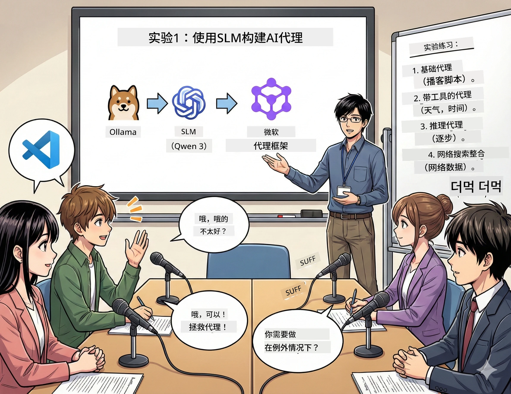

<!--
CO_OP_TRANSLATOR_METADATA:
{
  "original_hash": "7868fa418386aa7167bea3ff5ba8390b",
  "translation_date": "2026-01-05T12:44:34+00:00",
  "source_file": "WorkshopForAgentic/md/01.BuildAIAgentWithSLM.md",
  "language_code": "zh"
}
-->
# 第一幕：认识你的 AI 研究助理 🤖

## 挑战

你正在启动“未来字节”，你的新科技播客。第1集是关于最新的 AI 突破，但你只有24小时来完成：
1. 研究主题
2. 找到可信的来源
3. 撰写引人入胜的脚本
4. 让内容听起来自然

**剧情反转**：你不必独自完成。你即将打造你的第一个 AI 助理，帮你完成所有这些。我们叫他 Alex —— 你不知疲倦、永远不需要睡觉的研究伙伴。

## 为什么选择小语言模型？（剧透：它们超棒）

把小语言模型（SLMs）想象成生活在*你*电脑上的私人 AI。无云端，无月费，无可疑数据共享。

**SLMs 的🔥优势：**
- **🏠 在你的设备上运行**：笔记本、台式机，甚至是强悍的树莓派
- **💸 零持续成本**：没有API费用吃你的零花钱
- **🔒 隐私优先**：你的数据绝不离开你的设备
- **⚡ 极速响应**：无网络延迟，瞬间反馈
- **🪦 体积轻巧**：参数量介于1B-10B，而大型模型有100B+参数

**热门 SLMs**：Qwen 3、Phi-4、Gemma 3（本工作坊使用 Qwen）

## 你的工具箱

### Ollama：你的 AI 模型管理器

[Ollama](https://ollama.com/) 就像 AI 模型的 Steam。用简单命令下载、运行和管理模型。

**它的酷点：**
- 一个命令即可下载并运行任何模型
- 支持 Mac、Windows、Linux
- 如果有 GPU 自动使用
- 超级节省内存

### Microsoft Agent Framework：魔法发生地

[Microsoft Agent Framework](https://github.com/microsoft/agent-framework) 是你打造 AI 代理的游乐场，它能：

- 💬 聊天并记住你们的对话
- 🛠️ 使用自定义工具（比如网页搜索或查看天气）
- 🧠 逐步思考复杂问题
- 🤝 与其他代理协作成队
- 🔌 连接不同的 AI 提供者（OpenAI、Ollama、Azure）

**组成模块：**
- **Agents**：你带有特定任务的 AI 助手
- **Tools**：赋予他们的特殊能力
- **Memory**：不让他们忘记对话内容
- **Reasoning**：教他们思考，而不仅仅是回复

## 你的训练集锦：4 个任务

### 任务1：创建你的第一个代理

📓 [打开笔记本](../code/01.BasicAgent/00.BasicAgent-agent.ipynb)

**试炼**：打造 Alex，你的播客剧本撰写 AI。Alex 需要生成两位主播讨论科技话题的对话。

**你将学到**：
- 如何唤醒 AI 代理（比周一早晨起床简单多了）
- 赋予它个性和指令
- 让它生成真实的播客剧本
- 理解它的回复内容

**胜利条件**：Alex 为你的《未来字节》试播集打造剧本！🎯

### 任务2：赋予 Alex 超能力（工具！）

📓 [打开笔记本](../code/01.BasicAgent/01.BasicAgent-tools.ipynb)

**试炼**：Alex 很聪明，但它不知道今天的天气和时间。让我们通过赋予工具来解决！

**你将学到**：
- 创建自定义的 Python 函数作为“工具”
- 让 Alex 决定*何时*使用哪种工具
- 观察它自主解决问题
- 多工具组合应对复杂任务

**胜利条件**：问“东京天气如何？”，Alex 自动找到答案！☁️

### 任务3：教 Alex 思考

📓 [打开笔记本](../code/01.BasicAgent/02.BasicAgent-reasoning.ipynb)

**试炼**：让 Alex 展示其思路。在解决问题时，你想看到它*怎么想*，而不仅是答案。

**你将学到**：
- 激活“推理模式”（就像数学课上展示解题过程）
- 看到 Alex 的逐步思考过程
- 理解链式思考提示
- 当 Alex 困惑时进行调试

**胜利条件**：问一个复杂的数学问题，观看 Alex 逐步推理！🧠

### 任务4：连接 Alex 上网

📓 [打开笔记本](../code/01.BasicAgent/03.BasicAgent-websearch.ipynb)

**试炼**：Alex 的知识截止日期有限。让它连上网获取实时信息！

**你将学到**：
- 构建自定义网页搜索工具
- 集成外部 API
- 优雅处理网络错误
- 获取超越训练数据的信息

**胜利条件**：询问今天的科技新闻，获取最新结果！📰

## 开始前准备 🚀

**必备工具**：
- 安装 Python 3.10+
- 运行 Ollama（用 `ollama --version` 检查）
- 安装带 Python 扩展的 VS Code
- 至少 8GB 内存（想要流畅体验建议16GB）

## 任务顺序

依序完成笔记本，体验完整流程：

1. [00.BasicAgent-agent.ipynb](../code/01.BasicAgent/00.BasicAgent-agent.ipynb) — 认识 Alex（你的第一个代理）
2. [01.BasicAgent-tools.ipynb](../code/01.BasicAgent/01.BasicAgent-tools.ipynb) — 超能力觉醒！
3. [02.BasicAgent-reasoning.ipynb](../code/01.BasicAgent/02.BasicAgent-reasoning.ipynb) — 教 Alex 思考
4. [03.BasicAgent-websearch.ipynb](../code/01.BasicAgent/03.BasicAgent-websearch.ipynb) — 开启联网！

## 你将掌握

完成第一幕后，你将能够：

- ✅ 在本地硬件运行 AI 模型（无需云端！）
- ✅ 创建带自定义个性与技能的代理
- ✅ 赋能代理解决现实问题
- ✅ 让代理展示推理过程
- ✅ 连接代理至外部数据源
- ✅ 出错时进行调试

## 故障排查（及解决方案）🔧

### “Alex 加载失败！内存不足！”
**解决方法**：你的设备吃力了。尝试关闭其他应用，或换用更小型号。内存8GB是最低门槛。

### “Alex 速度好慢”
**解决方法**：开启 Ollama 设置里的 GPU 加速。或者减少上下文窗口大小。速度飞起来！🏎️

### “工具不工作！”
**解决方法**：仔细检查函数签名。Alex 需要正确的类型提示才能理解工具功能。就像给出清晰指令。

## 有用链接 🔗

- [Agent Framework 文档](https://github.com/microsoft/agent-framework) — 官方指南和示例
- [Ollama 模型库](https://ollama.com/library) — 浏览所有可用模型
- [Qwen 模型](https://ollama.com/library/qwen3) — 你的 AI 大脑
- [代码示例](https://github.com/microsoft/agent-framework/tree/main/python/samples) — 这里偷点灵感

## 下一幕：第二幕 🎬

你有了一个代理。但如果你拥有*一队*代理协作呢？第二幕，你将打造完整的播客制作团队：
- **研究员代理**：寻找最佳资源
- **撰稿人代理**：打造完美脚本  
- **编辑（你！）**：审核或提出修改

让我们制造点 AI 魔法吧！→ [第二幕：组建制作团队](02.AIAgentOrchestrationAndWorkflows.md)

---

**遇到问题？** 在工作坊中提问。我们一起学习！🙌

---

<!-- CO-OP TRANSLATOR DISCLAIMER START -->
**免责声明**：  
本文件通过 AI 翻译服务 [Co-op Translator](https://github.com/Azure/co-op-translator) 翻译完成。虽然我们努力确保准确性，但请注意自动翻译可能存在错误或不准确之处。原文应被视为权威版本。对于重要信息，建议使用专业人工翻译。对于因使用本翻译而产生的任何误解或误释，我们不承担任何责任。
<!-- CO-OP TRANSLATOR DISCLAIMER END -->